# Sprawozdanie 4 27.03.2026

## Używanie woluminów do budowania projektu


Na start tworzymy woluminy

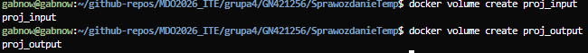

Klonowanie repo i przenoszenie do woluminu

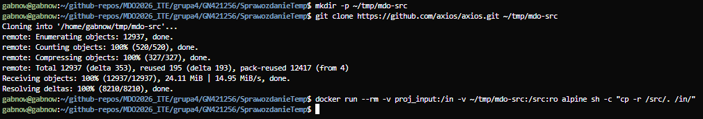


Uruchomienie kontenera bazowego z woluminem wejściowym i wskazując wolumin wyjściowy

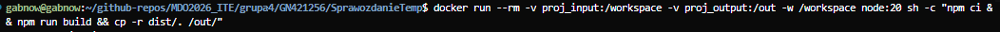

Sprawdzenie czy artefakty builda są tam gdzie mają być

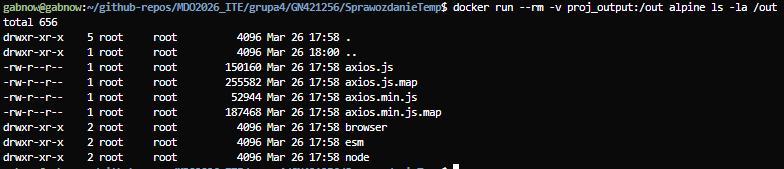

Klonowanie repo bezpośrednio na woluminie

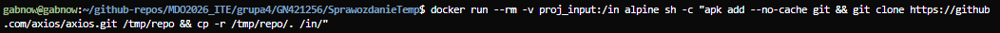

## Iperf

Tworzymy kontener iperf3

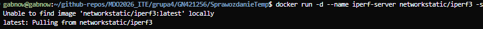

Sprawdzamy ip serwera iperf

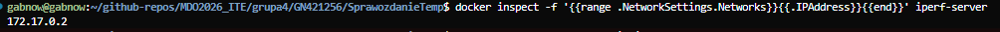

Uruchamiamy kontener

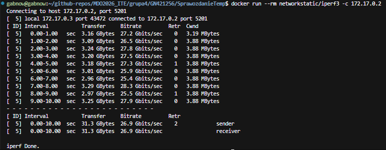

Powtarzamy te same kroki na sieci (teraz można się połączyć bez używania ip)

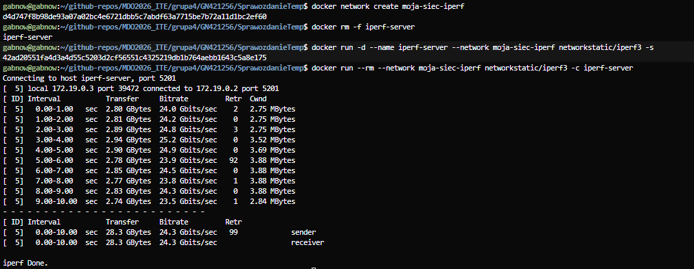

Uruchamiamy serwer na porcie 5201 aby móc połączyć się z innej maszyny w sieci

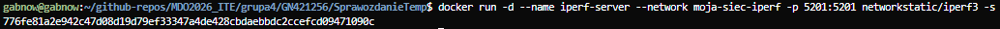

Połączenie z VM do serwera iperf

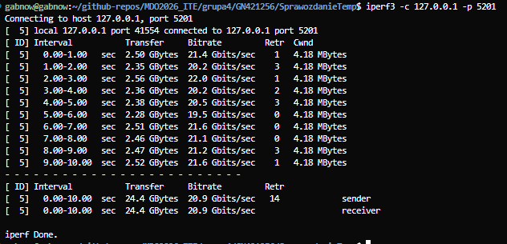

Połączenie z Hosta (w moim przypadku windowsa na którym jest vm)

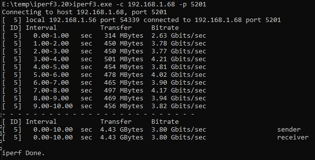

Logi serwera iperf

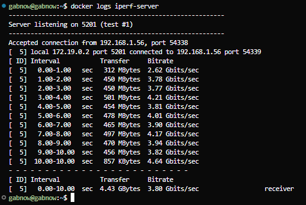

## Ubuntu
Stawiamy ubuntu na kontenerze dockera, tworzymy użytkownika i logujemy się


```
#Dockerfile.ssh
FROM ubuntu:22.04

RUN apt-get update && \
    DEBIAN_FRONTEND=noninteractive apt-get install -y openssh-server sudo && \
    mkdir /var/run/sshd && \
    useradd -m -s /bin/bash student && \
    echo 'student:student123' | chpasswd && \
    usermod -aG sudo student && \
    sed -i 's/^#PasswordAuthentication yes/PasswordAuthentication yes/' /etc/ssh/sshd_config && \
    sed -i 's/^PasswordAuthentication no/PasswordAuthentication yes/' /etc/ssh/sshd_config && \
    echo 'PermitRootLogin no' >> /etc/ssh/sshd_config

EXPOSE 22
CMD ["/usr/sbin/sshd", "-D"]
```


`docker ps` (zapomniałem ująć polecenie)
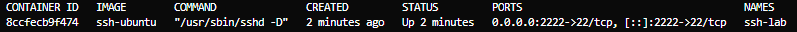

## Jenkins
Tworzymy sieć i woluminy jenkinsa, uruchamiamy kontener

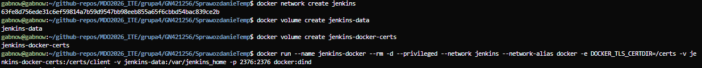


```
FROM jenkins/jenkins:lts-jdk17
USER root
RUN apt-get update && apt-get install -y lsb-release ca-certificates curl && \
    curl -fsSLo /usr/share/keyrings/docker-archive-keyring.asc https://download.docker.com/linux/debian/gpg && \
    echo "deb [arch=$(dpkg --print-architecture) signed-by=/usr/share/keyrings/docker-archive-keyring.asc] https://download.docker.com/linux/debian $(lsb_release -cs) stable" \
    > /etc/apt/sources.list.d/docker.list && \
    apt-get update && apt-get install -y docker-ce-cli
USER jenkins
```

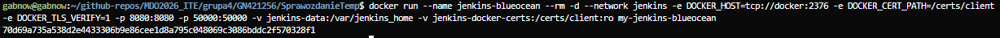

Po zyskaniu hasła do Jenkinsa tworzymy pierwszego użytkownika

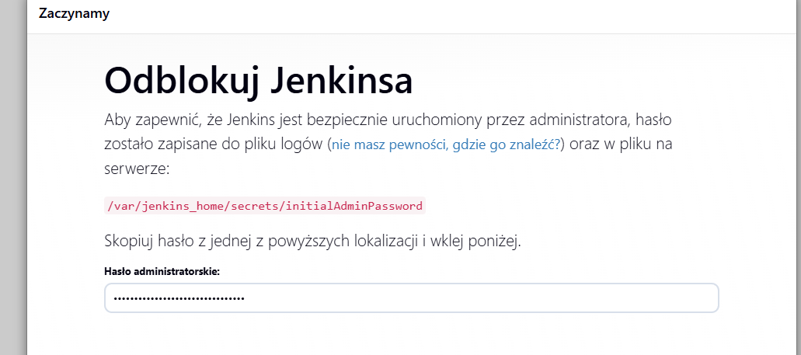

Sprawdzamy czy wszystko działa na vm

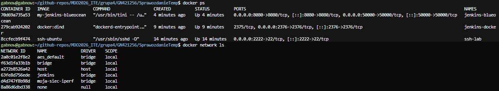

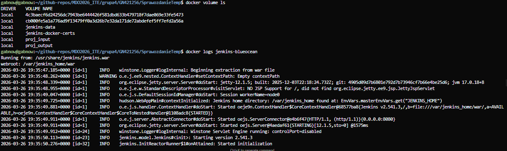

Finalny widok w przeglądarce

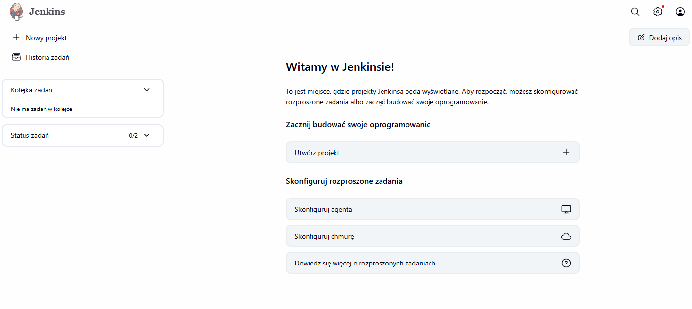

## Polecenia basha

```{bash}
docker volume create proj_input
docker volume create proj_output
mkdir -p ~/tmp/mdo-src
git clone https://github.com/axios/axios.git ~/tmp/mdo-src
docker run --rm -v proj_input:/in -v ~/tmp/mdo-src:/src:ro alpine sh -c "cp -r /src/. /in/"
docker run --rm -v proj_input:/workspace -v proj_output:/out -w /workspace node:20 sh -c "npm ci && npm run build && cp -r dist/. /out/"
docker run --rm -v proj_output:/out alpine ls -la /out
docker run --rm -v proj_input:/in alpine sh -c "apk add --no-cache git && git clone https://github.com/axios/axios.git /tmp/repo && cp -r /tmp/repo/. /in/"

docker run -d --name iperf-server networkstatic/iperf3 -s
docker inspect -f '{{range .NetworkSettings.Networks}}{{.IPAddress}}{{end}}' iperf-server
docker run --rm networkstatic/iperf3 -c 172.17.0.2
docker network create moja-siec-iperf
docker rm -f iperf-server
docker run -d --name iperf-server --network moja-siec-iperf networkstatic/iperf3 -s
docker run --rm --network moja-siec-iperf networkstatic/iperf3 -c iperf-server
docker run -d --name iperf-server --network moja-siec-iperf -p 5201:5201 networkstatic/iperf3 -s
iperf3 -c 127.0.0.1 -p 5201
iperf3.exe -c 192.168.1.68 -p 5201 (na Windows)
docker logs iperf-server

docker run -d --name ssh-lab -p 2222:22 ubuntu:22.04 sleep infinity
docker exec -it ssh-lab bash
apt update
docker build -t ssh-ubuntu -f Dockerfile.ssh .
ssh student@localhost -p 2222

docker network create jenkins
docker volume create jenkins-data
docker volume create jenkins-docker-certs
docker run --name jenkins-docker --rm -d --privileged --network jenkins --network-alias docker -e DOCKER_TLS_CERTDIR=/certs -v jenkins-docker-certs:/certs/client -v jenkins-data:/var/jenkins_home -p 2376:2376 docker:dind
docker build -t my-jenkins-blueocean -f Dockerfile.jenkins .
docker run --name jenkins-blueocean --rm -d --network jenkins -e DOCKER_HOST=tcp://docker:2376 -e DOCKER_CERT_PATH=/certs/client -e DOCKER_TLS_VERIFY=1 -p 8080:8080 -p 50000:50000 -v jenkins-data:/var/jenkins_home -v jenkins-docker-certs:/certs/client:ro my-jenkins-blueocean
docker ps
docker network ls
docker volume ls
docker logs jenkins-blueocean
```
