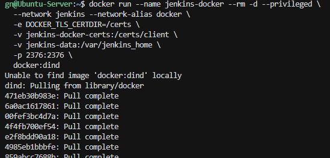
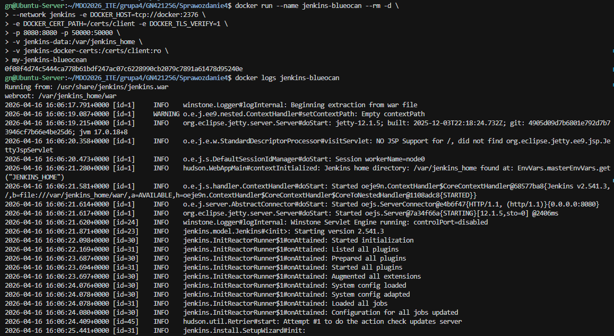
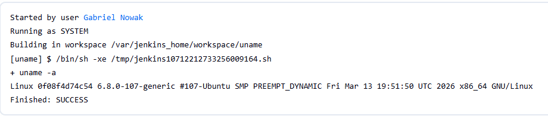
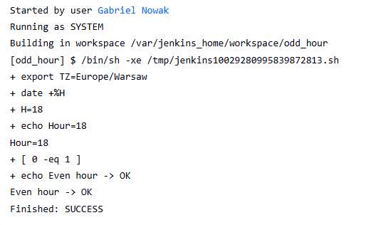
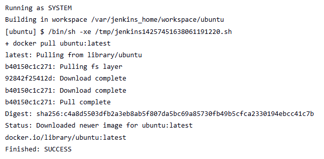
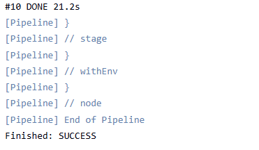
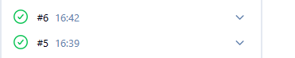

# Sprawozdanie 5 10.04.2026 - Nadrabianie
### 1.Po upewnieniu się że obrazy jenkinsa z poprzednich zajęć działają uruchamiamy jenkinsa i trzy przykładowe zadania które mamy na nim wykonać





### 2.Zadania Jenkinsa

Wyświetlenie uname



Sprawdzanie czy godzina jest parzysta



Docker na jenkinsie



### 3. Pipeline

Treść pipeline-u

```
pipeline {
  agent any

  environment {
    REPO_URL = 'https://github.com/InzynieriaOprogramowaniaAGH/MDO2026_ITE.git'
    BRANCH   = 'GN421256'
    DOCKERFILE_PATH = 'grupa4/GN421256/Sprawozdanie3/Dockerfile.build'
    IMAGE_TAG = "builder:${BUILD_NUMBER}"
  }

  stages {
    stage('Checkout') {
      steps {
        checkout([$class: 'GitSCM',
          branches: [[name: "*/${env.BRANCH}"]],
          userRemoteConfigs: [[url: env.REPO_URL]]
        ])
      }
    }

    stage('Build Dockerfile') {
      steps {
        sh '''
          set -eux
          docker version
          docker build -f "$DOCKERFILE_PATH" -t "$IMAGE_TAG" .
        '''
      }
    }
  }
}
```

Końcówka log-u konsoli (całość wklejona poniżej)



Uruchomienie 2 razy




## Informacja ode mnie
Dotychczas pracowałem na projekcie znalezionym na szybko na githubie, projekt nie do końca się budował ale na starcie myślałem że jest to nieważne, więc teraz mam problem z wykonaniem wszystkich poleceń w tym temacie.


### Log konsoli (Długie)

```
Started by user Gabriel Nowak

[Pipeline] Start of Pipeline
[Pipeline] node
Running on Jenkins
 in /var/jenkins_home/workspace/my_pipeline
[Pipeline] {
[Pipeline] withEnv
[Pipeline] {
[Pipeline] stage
[Pipeline] { (Checkout)
[Pipeline] checkout
The recommended git tool is: NONE
No credentials specified
 > git rev-parse --resolve-git-dir /var/jenkins_home/workspace/my_pipeline/.git # timeout=10
Fetching changes from the remote Git repository
 > git config remote.origin.url https://github.com/InzynieriaOprogramowaniaAGH/MDO2026_ITE.git # timeout=10
Fetching upstream changes from https://github.com/InzynieriaOprogramowaniaAGH/MDO2026_ITE.git
 > git --version # timeout=10
 > git --version # 'git version 2.47.3'
 > git fetch --tags --force --progress -- https://github.com/InzynieriaOprogramowaniaAGH/MDO2026_ITE.git +refs/heads/*:refs/remotes/origin/* # timeout=10
 > git rev-parse refs/remotes/origin/GN421256^{commit} # timeout=10
Checking out Revision 747a0a76a9e2a871d716608fa2b3531b23ed0abf (refs/remotes/origin/GN421256)
 > git config core.sparsecheckout # timeout=10
 > git checkout -f 747a0a76a9e2a871d716608fa2b3531b23ed0abf # timeout=10
Commit message: "GN421256: Sprawozdanie laczane 1-4"
 > git rev-list --no-walk 747a0a76a9e2a871d716608fa2b3531b23ed0abf # timeout=10
[Pipeline] }
[Pipeline] // stage
[Pipeline] stage
[Pipeline] { (Build Dockerfile)
[Pipeline] sh
+ set -eux
+ docker version
Client: Docker Engine - Community
 Version:           29.4.0
 API version:       1.54
 Go version:        go1.26.1
 Git commit:        9d7ad9f
 Built:             Tue Apr  7 08:35:38 2026
 OS/Arch:           linux/amd64
 Context:           default

Server: Docker Engine - Community
 Engine:
  Version:          29.4.0
  API version:      1.54 (minimum version 1.40)
  Go version:       go1.26.1
  Git commit:       daa0cb7f
  Built:            Tue Apr  7 08:36:58 2026
  OS/Arch:          linux/amd64
  Experimental:     false
 containerd:
  Version:          v2.2.2
  GitCommit:        301b2dac98f15c27117da5c8af12118a041a31d9
 runc:
  Version:          1.3.5
  GitCommit:        v1.3.5-0-g488fc13
 docker-init:
  Version:          0.19.0
  GitCommit:        de40ad0
+ docker build -f grupa4/GN421256/Sprawozdanie3/Dockerfile.build -t builder:5 .
#0 building with "default" instance using docker driver

#1 [internal] load build definition from Dockerfile.build
#1 transferring dockerfile: 264B done
#1 DONE 0.0s

#2 [internal] load metadata for docker.io/library/node:20-bullseye
#2 DONE 2.1s

#3 [internal] load .dockerignore
#3 transferring context: 2B done
#3 DONE 0.0s

#4 [1/6] FROM docker.io/library/node:20-bullseye@sha256:a72dd3c9af25b67d2a5ae2a1cc07fcf4c7f8310ef6fe7ef70c11206a3f31eaf0
#4 resolve docker.io/library/node:20-bullseye@sha256:a72dd3c9af25b67d2a5ae2a1cc07fcf4c7f8310ef6fe7ef70c11206a3f31eaf0 0.0s done
#4 DONE 0.2s

#4 [1/6] FROM docker.io/library/node:20-bullseye@sha256:a72dd3c9af25b67d2a5ae2a1cc07fcf4c7f8310ef6fe7ef70c11206a3f31eaf0
#4 sha256:1324b8c36827e29e5181202dc9b11617b03cfabb56814a5f2a104ec8950931b4 0B / 449B 0.2s
#4 sha256:884ec4f0f0edf780e50e181e18d543a7ad88766dfad4b29da666d86c5e555a3f 0B / 1.25MB 0.2s
#4 sha256:f72a8bf897aef78016bd221891212b083a0425167763f84a599728589a95a04f 0B / 48.62MB 0.2s
#4 sha256:4ce52285571014ff2e98341b79db122d8d91a886bc42c2cf1faffddf2e36a904 0B / 4.10kB 0.2s
#4 sha256:1324b8c36827e29e5181202dc9b11617b03cfabb56814a5f2a104ec8950931b4 449B / 449B 0.4s done
#4 sha256:067d6a857ea26ea67633cd59e0209cb6a54e70a1e95d19e8ae6c6b0a15b3d8d6 0B / 197.25MB 0.2s
#4 sha256:884ec4f0f0edf780e50e181e18d543a7ad88766dfad4b29da666d86c5e555a3f 1.25MB / 1.25MB 0.7s done
#4 sha256:4ce52285571014ff2e98341b79db122d8d91a886bc42c2cf1faffddf2e36a904 4.10kB / 4.10kB 0.8s done
#4 sha256:14034e66ee3f8bcfd399019612c7f333cc777166161c3dee1a945ac1f0659fd6 0B / 54.76MB 0.2s
#4 sha256:f72a8bf897aef78016bd221891212b083a0425167763f84a599728589a95a04f 4.19MB / 48.62MB 1.1s
#4 sha256:847d9f854f908f28a433fd2d5b08b5e68ee58c9ec953dac233ca6864ced59f24 0B / 15.79MB 0.2s
#4 sha256:f72a8bf897aef78016bd221891212b083a0425167763f84a599728589a95a04f 7.34MB / 48.62MB 1.2s
#4 sha256:847d9f854f908f28a433fd2d5b08b5e68ee58c9ec953dac233ca6864ced59f24 1.05MB / 15.79MB 0.5s
#4 sha256:f72a8bf897aef78016bd221891212b083a0425167763f84a599728589a95a04f 12.58MB / 48.62MB 1.5s
#4 sha256:847d9f854f908f28a433fd2d5b08b5e68ee58c9ec953dac233ca6864ced59f24 2.10MB / 15.79MB 0.6s
#4 sha256:f72a8bf897aef78016bd221891212b083a0425167763f84a599728589a95a04f 15.73MB / 48.62MB 1.7s
#4 sha256:847d9f854f908f28a433fd2d5b08b5e68ee58c9ec953dac233ca6864ced59f24 4.19MB / 15.79MB 0.8s
#4 sha256:067d6a857ea26ea67633cd59e0209cb6a54e70a1e95d19e8ae6c6b0a15b3d8d6 11.53MB / 197.25MB 1.4s
#4 sha256:847d9f854f908f28a433fd2d5b08b5e68ee58c9ec953dac233ca6864ced59f24 5.24MB / 15.79MB 0.9s
#4 sha256:f72a8bf897aef78016bd221891212b083a0425167763f84a599728589a95a04f 18.87MB / 48.62MB 2.0s
#4 sha256:847d9f854f908f28a433fd2d5b08b5e68ee58c9ec953dac233ca6864ced59f24 6.29MB / 15.79MB 1.2s
#4 sha256:f72a8bf897aef78016bd221891212b083a0425167763f84a599728589a95a04f 26.21MB / 48.62MB 2.3s
#4 sha256:847d9f854f908f28a433fd2d5b08b5e68ee58c9ec953dac233ca6864ced59f24 7.34MB / 15.79MB 1.4s
#4 sha256:847d9f854f908f28a433fd2d5b08b5e68ee58c9ec953dac233ca6864ced59f24 8.39MB / 15.79MB 1.5s
#4 sha256:f72a8bf897aef78016bd221891212b083a0425167763f84a599728589a95a04f 30.41MB / 48.62MB 2.6s
#4 sha256:067d6a857ea26ea67633cd59e0209cb6a54e70a1e95d19e8ae6c6b0a15b3d8d6 23.07MB / 197.25MB 2.1s
#4 sha256:847d9f854f908f28a433fd2d5b08b5e68ee58c9ec953dac233ca6864ced59f24 9.44MB / 15.79MB 1.7s
#4 sha256:f72a8bf897aef78016bd221891212b083a0425167763f84a599728589a95a04f 34.60MB / 48.62MB 2.7s
#4 sha256:847d9f854f908f28a433fd2d5b08b5e68ee58c9ec953dac233ca6864ced59f24 10.49MB / 15.79MB 1.8s
#4 sha256:f72a8bf897aef78016bd221891212b083a0425167763f84a599728589a95a04f 37.75MB / 48.62MB 2.9s
#4 sha256:14034e66ee3f8bcfd399019612c7f333cc777166161c3dee1a945ac1f0659fd6 3.15MB / 54.76MB 2.1s
#4 sha256:847d9f854f908f28a433fd2d5b08b5e68ee58c9ec953dac233ca6864ced59f24 11.53MB / 15.79MB 2.0s
#4 sha256:f72a8bf897aef78016bd221891212b083a0425167763f84a599728589a95a04f 40.89MB / 48.62MB 3.0s
#4 sha256:847d9f854f908f28a433fd2d5b08b5e68ee58c9ec953dac233ca6864ced59f24 12.58MB / 15.79MB 2.1s
#4 sha256:847d9f854f908f28a433fd2d5b08b5e68ee58c9ec953dac233ca6864ced59f24 13.63MB / 15.79MB 2.3s
#4 sha256:f72a8bf897aef78016bd221891212b083a0425167763f84a599728589a95a04f 45.09MB / 48.62MB 3.3s
#4 sha256:067d6a857ea26ea67633cd59e0209cb6a54e70a1e95d19e8ae6c6b0a15b3d8d6 34.60MB / 197.25MB 2.9s
#4 sha256:f72a8bf897aef78016bd221891212b083a0425167763f84a599728589a95a04f 48.62MB / 48.62MB 3.5s
#4 sha256:847d9f854f908f28a433fd2d5b08b5e68ee58c9ec953dac233ca6864ced59f24 15.79MB / 15.79MB 2.6s done
#4 sha256:ced3088fc7691915325d6187786ba346149f7c9dcdbfb3772ca71be74bf87622 0B / 53.76MB 0.2s
#4 sha256:f72a8bf897aef78016bd221891212b083a0425167763f84a599728589a95a04f 48.62MB / 48.62MB 3.6s done
#4 sha256:067d6a857ea26ea67633cd59e0209cb6a54e70a1e95d19e8ae6c6b0a15b3d8d6 45.09MB / 197.25MB 3.3s
#4 sha256:067d6a857ea26ea67633cd59e0209cb6a54e70a1e95d19e8ae6c6b0a15b3d8d6 56.62MB / 197.25MB 3.8s
#4 sha256:ced3088fc7691915325d6187786ba346149f7c9dcdbfb3772ca71be74bf87622 4.19MB / 53.76MB 0.6s
#4 sha256:ced3088fc7691915325d6187786ba346149f7c9dcdbfb3772ca71be74bf87622 9.44MB / 53.76MB 0.9s
#4 sha256:14034e66ee3f8bcfd399019612c7f333cc777166161c3dee1a945ac1f0659fd6 6.29MB / 54.76MB 3.9s
#4 sha256:ced3088fc7691915325d6187786ba346149f7c9dcdbfb3772ca71be74bf87622 12.58MB / 53.76MB 1.1s
#4 sha256:067d6a857ea26ea67633cd59e0209cb6a54e70a1e95d19e8ae6c6b0a15b3d8d6 70.25MB / 197.25MB 4.4s
#4 sha256:ced3088fc7691915325d6187786ba346149f7c9dcdbfb3772ca71be74bf87622 16.78MB / 53.76MB 1.4s
#4 sha256:ced3088fc7691915325d6187786ba346149f7c9dcdbfb3772ca71be74bf87622 22.02MB / 53.76MB 1.7s
#4 sha256:067d6a857ea26ea67633cd59e0209cb6a54e70a1e95d19e8ae6c6b0a15b3d8d6 84.93MB / 197.25MB 5.0s
#4 sha256:ced3088fc7691915325d6187786ba346149f7c9dcdbfb3772ca71be74bf87622 27.26MB / 53.76MB 2.0s
#4 sha256:ced3088fc7691915325d6187786ba346149f7c9dcdbfb3772ca71be74bf87622 32.51MB / 53.76MB 2.3s
#4 sha256:067d6a857ea26ea67633cd59e0209cb6a54e70a1e95d19e8ae6c6b0a15b3d8d6 98.57MB / 197.25MB 5.6s
#4 sha256:ced3088fc7691915325d6187786ba346149f7c9dcdbfb3772ca71be74bf87622 35.65MB / 53.76MB 2.6s
#4 sha256:ced3088fc7691915325d6187786ba346149f7c9dcdbfb3772ca71be74bf87622 38.80MB / 53.76MB 2.7s
#4 sha256:14034e66ee3f8bcfd399019612c7f333cc777166161c3dee1a945ac1f0659fd6 9.44MB / 54.76MB 5.7s
#4 sha256:067d6a857ea26ea67633cd59e0209cb6a54e70a1e95d19e8ae6c6b0a15b3d8d6 112.20MB / 197.25MB 6.2s
#4 sha256:ced3088fc7691915325d6187786ba346149f7c9dcdbfb3772ca71be74bf87622 44.04MB / 53.76MB 3.0s
#4 sha256:ced3088fc7691915325d6187786ba346149f7c9dcdbfb3772ca71be74bf87622 47.19MB / 53.76MB 3.3s
#4 sha256:ced3088fc7691915325d6187786ba346149f7c9dcdbfb3772ca71be74bf87622 50.33MB / 53.76MB 3.5s
#4 sha256:067d6a857ea26ea67633cd59e0209cb6a54e70a1e95d19e8ae6c6b0a15b3d8d6 127.93MB / 197.25MB 6.8s
#4 sha256:ced3088fc7691915325d6187786ba346149f7c9dcdbfb3772ca71be74bf87622 53.76MB / 53.76MB 3.7s done
#4 extracting sha256:ced3088fc7691915325d6187786ba346149f7c9dcdbfb3772ca71be74bf87622
#4 sha256:067d6a857ea26ea67633cd59e0209cb6a54e70a1e95d19e8ae6c6b0a15b3d8d6 148.90MB / 197.25MB 7.4s
#4 sha256:14034e66ee3f8bcfd399019612c7f333cc777166161c3dee1a945ac1f0659fd6 12.58MB / 54.76MB 7.2s
#4 sha256:067d6a857ea26ea67633cd59e0209cb6a54e70a1e95d19e8ae6c6b0a15b3d8d6 160.43MB / 197.25MB 7.7s
#4 sha256:067d6a857ea26ea67633cd59e0209cb6a54e70a1e95d19e8ae6c6b0a15b3d8d6 171.97MB / 197.25MB 8.0s
#4 sha256:067d6a857ea26ea67633cd59e0209cb6a54e70a1e95d19e8ae6c6b0a15b3d8d6 182.45MB / 197.25MB 8.3s
#4 sha256:14034e66ee3f8bcfd399019612c7f333cc777166161c3dee1a945ac1f0659fd6 15.73MB / 54.76MB 8.3s
#4 sha256:067d6a857ea26ea67633cd59e0209cb6a54e70a1e95d19e8ae6c6b0a15b3d8d6 195.04MB / 197.25MB 8.7s
#4 sha256:067d6a857ea26ea67633cd59e0209cb6a54e70a1e95d19e8ae6c6b0a15b3d8d6 197.25MB / 197.25MB 8.8s done
#4 sha256:14034e66ee3f8bcfd399019612c7f333cc777166161c3dee1a945ac1f0659fd6 19.92MB / 54.76MB 8.9s
#4 sha256:14034e66ee3f8bcfd399019612c7f333cc777166161c3dee1a945ac1f0659fd6 24.12MB / 54.76MB 9.2s
#4 sha256:14034e66ee3f8bcfd399019612c7f333cc777166161c3dee1a945ac1f0659fd6 28.31MB / 54.76MB 9.3s
#4 sha256:14034e66ee3f8bcfd399019612c7f333cc777166161c3dee1a945ac1f0659fd6 33.29MB / 54.76MB 9.5s
#4 sha256:14034e66ee3f8bcfd399019612c7f333cc777166161c3dee1a945ac1f0659fd6 37.75MB / 54.76MB 9.6s
#4 sha256:14034e66ee3f8bcfd399019612c7f333cc777166161c3dee1a945ac1f0659fd6 41.94MB / 54.76MB 9.8s
#4 sha256:14034e66ee3f8bcfd399019612c7f333cc777166161c3dee1a945ac1f0659fd6 46.14MB / 54.76MB 9.9s
#4 sha256:14034e66ee3f8bcfd399019612c7f333cc777166161c3dee1a945ac1f0659fd6 50.33MB / 54.76MB 10.1s
#4 sha256:14034e66ee3f8bcfd399019612c7f333cc777166161c3dee1a945ac1f0659fd6 54.76MB / 54.76MB 10.2s
#4 extracting sha256:ced3088fc7691915325d6187786ba346149f7c9dcdbfb3772ca71be74bf87622 3.7s done
#4 extracting sha256:847d9f854f908f28a433fd2d5b08b5e68ee58c9ec953dac233ca6864ced59f24
#4 sha256:14034e66ee3f8bcfd399019612c7f333cc777166161c3dee1a945ac1f0659fd6 54.76MB / 54.76MB 10.2s done
#4 extracting sha256:847d9f854f908f28a433fd2d5b08b5e68ee58c9ec953dac233ca6864ced59f24 0.5s done
#4 DONE 11.5s

#4 [1/6] FROM docker.io/library/node:20-bullseye@sha256:a72dd3c9af25b67d2a5ae2a1cc07fcf4c7f8310ef6fe7ef70c11206a3f31eaf0
#4 extracting sha256:14034e66ee3f8bcfd399019612c7f333cc777166161c3dee1a945ac1f0659fd6
#4 extracting sha256:14034e66ee3f8bcfd399019612c7f333cc777166161c3dee1a945ac1f0659fd6 2.2s done
#4 DONE 13.8s

#4 [1/6] FROM docker.io/library/node:20-bullseye@sha256:a72dd3c9af25b67d2a5ae2a1cc07fcf4c7f8310ef6fe7ef70c11206a3f31eaf0
#4 extracting sha256:067d6a857ea26ea67633cd59e0209cb6a54e70a1e95d19e8ae6c6b0a15b3d8d6
#4 extracting sha256:067d6a857ea26ea67633cd59e0209cb6a54e70a1e95d19e8ae6c6b0a15b3d8d6 6.3s done
#4 DONE 20.0s

#4 [1/6] FROM docker.io/library/node:20-bullseye@sha256:a72dd3c9af25b67d2a5ae2a1cc07fcf4c7f8310ef6fe7ef70c11206a3f31eaf0
#4 extracting sha256:4ce52285571014ff2e98341b79db122d8d91a886bc42c2cf1faffddf2e36a904 0.0s done
#4 extracting sha256:f72a8bf897aef78016bd221891212b083a0425167763f84a599728589a95a04f
#4 extracting sha256:f72a8bf897aef78016bd221891212b083a0425167763f84a599728589a95a04f 2.4s done
#4 DONE 22.4s

#4 [1/6] FROM docker.io/library/node:20-bullseye@sha256:a72dd3c9af25b67d2a5ae2a1cc07fcf4c7f8310ef6fe7ef70c11206a3f31eaf0
#4 extracting sha256:884ec4f0f0edf780e50e181e18d543a7ad88766dfad4b29da666d86c5e555a3f 0.1s done
#4 DONE 22.5s

#4 [1/6] FROM docker.io/library/node:20-bullseye@sha256:a72dd3c9af25b67d2a5ae2a1cc07fcf4c7f8310ef6fe7ef70c11206a3f31eaf0
#4 extracting sha256:1324b8c36827e29e5181202dc9b11617b03cfabb56814a5f2a104ec8950931b4 0.0s done
#4 DONE 22.6s

#5 [2/6] WORKDIR /app
#5 DONE 0.2s

#6 [3/6] RUN apt-get update && apt-get install -y git && rm -rf /var/lib/apt/lists/*
#6 0.550 Get:1 http://deb.debian.org/debian bullseye InRelease [75.1 kB]
#6 0.601 Get:2 http://deb.debian.org/debian-security bullseye-security InRelease [27.2 kB]
#6 0.633 Get:3 http://deb.debian.org/debian bullseye-updates InRelease [44.0 kB]
#6 0.746 Get:4 http://deb.debian.org/debian bullseye/main amd64 Packages [8066 kB]
#6 1.141 Get:5 http://deb.debian.org/debian-security bullseye-security/main amd64 Packages [446 kB]
#6 1.152 Get:6 http://deb.debian.org/debian bullseye-updates/main amd64 Packages [18.8 kB]
#6 2.005 Fetched 8677 kB in 2s (5661 kB/s)
#6 2.005 Reading package lists...
#6 2.669 Reading package lists...
#6 3.221 Building dependency tree...
#6 3.494 Reading state information...
#6 3.841 git is already the newest version (1:2.30.2-1+deb11u5).
#6 3.841 0 upgraded, 0 newly installed, 0 to remove and 13 not upgraded.
#6 DONE 3.9s

#7 [4/6] RUN git clone https://github.com/axios/axios.git .
#7 0.165 Cloning into '.'...
#7 DONE 3.8s

#8 [5/6] RUN npm install
#8 40.59 
#8 40.59 > axios@1.15.0 prepare
#8 40.59 > husky
#8 40.59 
#8 40.70 
#8 40.70 added 793 packages, and audited 794 packages in 40s
#8 40.70 
#8 40.70 125 packages are looking for funding
#8 40.70   run `npm fund` for details
#8 40.71 
#8 40.71 2 vulnerabilities (1 moderate, 1 high)
#8 40.71 
#8 40.71 To address all issues, run:
#8 40.71   npm audit fix
#8 40.71 
#8 40.71 Run `npm audit` for details.
#8 40.71 npm notice
#8 40.71 npm notice New major version of npm available! 10.8.2 -> 11.12.1
#8 40.71 npm notice Changelog: https://github.com/npm/cli/releases/tag/v11.12.1
#8 40.71 npm notice To update run: npm install -g npm@11.12.1
#8 40.71 npm notice
#8 DONE 40.8s

#9 [6/6] RUN npm run build
#9 1.001 
#9 1.001 > axios@1.15.0 build
#9 1.001 > gulp clear && cross-env NODE_ENV=production rollup -c -m
#9 1.001 
#9 1.723 [GITHUB_TOKEN is not defined]
#9 1.737 [16:40:22] Using gulpfile /app/gulpfile.js
#9 1.739 [16:40:22] Starting 'clear'...
#9 1.754 [16:40:22] Finished 'clear' after 13 ms
#9 2.312 
#9 2.312 ./index.js → dist/esm/axios.js...
#9 2.889 created dist/esm/axios.js in 578ms
#9 2.890 
#9 2.890 ./index.js → dist/esm/axios.min.js...
#9 4.663 Created bundle axios.min.js: 38 kB → 14.73 kB (gzip)
#9 4.672 created dist/esm/axios.min.js in 1.7s
#9 4.672 
#9 4.672 ./lib/axios.js → dist/axios.js...
#9 7.970 created dist/axios.js in 3.2s
#9 7.971 
#9 7.971 ./lib/axios.js → dist/axios.min.js...
#9 11.47 Created bundle axios.min.js: 53.79 kB → 19.02 kB (gzip)
#9 11.47 created dist/axios.min.js in 3.4s
#9 11.47 
#9 11.47 ./lib/axios.js → dist/browser/axios.cjs...
#9 11.84 created dist/browser/axios.cjs in 373ms
#9 11.84 
#9 11.84 ./lib/axios.js → dist/node/axios.cjs...
#9 13.16 created dist/node/axios.cjs in 1.3s
#9 DONE 13.3s

#10 exporting to image
#10 exporting layers
#10 exporting layers 15.5s done
#10 exporting manifest sha256:695115491eaa1f29266fca839f0c645d9cbd93673f60174b54b04a0a6ceef79d
#10 exporting manifest sha256:695115491eaa1f29266fca839f0c645d9cbd93673f60174b54b04a0a6ceef79d 0.0s done
#10 exporting config sha256:e301c18f12529a2abce080a8fcee718ec3a3ef10644529896a429bde303667f3 0.0s done
#10 exporting attestation manifest sha256:0ca69aa0ff5d63cd973f0c454ed34f201e283698cb5bb388824d225a9889defe 0.0s done
#10 exporting manifest list sha256:1c77e20e973a95d4f315891f80993b6b3e75b7ab2208bb109e9a66fcbf538c62 0.0s done
#10 naming to docker.io/library/builder:5 done
#10 unpacking to docker.io/library/builder:5
#10 unpacking to docker.io/library/builder:5 5.5s done
#10 DONE 21.2s
[Pipeline] }
[Pipeline] // stage
[Pipeline] }
[Pipeline] // withEnv
[Pipeline] }
[Pipeline] // node
[Pipeline] End of Pipeline
Finished: SUCCESS

```

