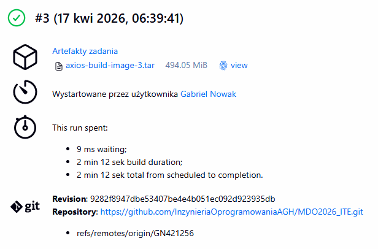

# Sprawozdanie 6 17.04.2026 
## Pipeline w Jenkins, ścieżka krytyczna.

(Zamiast zrzutów ekranu będą konkretne urywki skryptu)

1. Manual Trigger - Pipeline będzie uruchamiany ręcznie w Jenkinsie
2. Clone - Klonowanie Repo

```
stage('Checkout') {
      steps {
        checkout([$class: 'GitSCM',
          branches: [[name: "*/${env.BRANCH}"]],
          userRemoteConfigs: [[url: env.REPO_URL]]
        ])
      }
    }
```
3. Build - po sklonowaniu repo w którym znajduje się naż Dockerfile (w moim przypadku jest to repo przedmiotu i mój branch)

```
stage('Build') {
      steps {
        sh '''
          set -euxo pipefail
          docker version
          docker build -f "$DOCKERFILE_BUILD" -t "$BUILD_IMAGE" .
        '''
      }
    }
```

4. Test - Testy jednostkowe, część z nich została wyłączona ponieważ w środowisku na którym pracuje nie dostanę pozytywnego wyniku testu - pipeline nie przeszedłby dalej

```
stage('Test (unit)') {
      steps {
        sh '''
          set -euxo pipefail
          docker run --rm "$BUILD_IMAGE" sh -lc \
            'npx vitest run --project unit --exclude tests/unit/adapters/fetch.test.js'
        '''
      }
    }
```

5. Deploy(smoke) 

```
stage('Deploy (smoke)') {
      steps {
        sh '''
          set -euxo pipefail
          docker run --rm "$BUILD_IMAGE" sh -lc 'test -d dist && ls -la dist | head -n 50'
        '''
      }
    }
```

6. Publish - udostępnienie paczki innym użytkownikom

```
stage('Publish') {
      steps {
        sh '''
          set -euxo pipefail
          docker save "$BUILD_IMAGE" -o "$ARTIFACT_TAR"
          ls -lah "$ARTIFACT_TAR"
        '''
        archiveArtifacts artifacts: "${ARTIFACT_TAR}", fingerprint: true
      }
    }
```

### Pipeline zakończył się sukcesem

