# Sprawozdanie 8 20.05.2026

## Automatyzacja i zdalne wykonywanie poleceń za pomocą Ansible

Środowisko: dwie maszyny wirtualne (VirtualBox) z Ubuntu Server 24.04.

- **`Ubuntu-Server`** – maszyna główna (dyrygent, `Orchestrators`),
- **`ansible-target`** – maszyna z minimalną instalacją (`Endpoints`), użytkownik `ansible`, zainstalowane `tar` i `sshd`.

Łączność między maszynami jest realizowana przez port forwarding VirtualBox:

- `ssh -p 2222 gn@10.0.2.2` → `Ubuntu-Server`,
- `ssh -p 2223 ansible@10.0.2.2` → `ansible-target`.

Z poziomu maszyny głównej `10.0.2.2` to host (Windows), więc oba przekierowania są dostępne lokalnie.

## Instalacja Ansible

Ansible zainstalowany z repozytorium dystrybucji (`apt install ansible`).

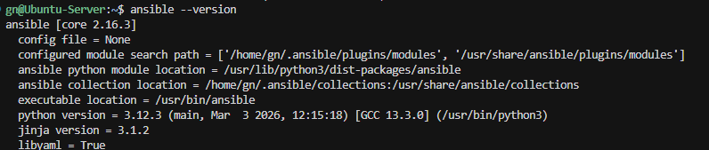

## Wymiana kluczy SSH i konfiguracja klienta

Klucz publiczny dyrygenta został wgrany na `ansible-target` (`ssh-copy-id` / ręcznie do `~/.ssh/authorized_keys` użytkownika `ansible`). Dodatkowo w `~/.ssh/config` dodany alias, który ukrywa niestandardowy port:

```
Host ansible-target
    HostName 10.0.2.2
    Port 2223
    User ansible
    IdentityFile ~/.ssh/id_ed25519
```

W `/etc/hosts` (na dyrygencie) wpisana nazwa DNS dla obu maszyn — dzięki temu da się odwoływać po nazwie, nie po adresie IP.

## Inwentaryzacja

Plik `inventory.yml` z sekcjami `Orchestrators` i `Endpoints`:

```yaml
all:
  children:
    Orchestrators:
      hosts:
        Ubuntu-Server:
          ansible_connection: local
    Endpoints:
      hosts:
        ansible-target:
          ansible_host: 10.0.2.2
          ansible_port: 2223
          ansible_user: ansible
```

`ansible-inventory --graph` pokazuje strukturę grup:

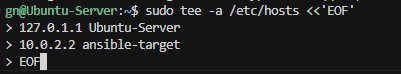

### Ad-hoc ping do wszystkich maszyn

```
ansible all -m ping
```

Oba hosty zwracają `SUCCESS / pong` (dyrygent przez połączenie `local`, endpoint przez SSH).

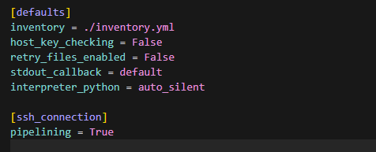

## Zdalne wywoływanie procedur – playbooki

Playbooki znajdują się w katalogu `playbooks/`:

| Plik                       | Cel                                                        |
|----------------------------|------------------------------------------------------------|
| `01-ping.yml`              | ping wszystkich maszyn                                     |
| `02-copy-inventory.yml`    | skopiowanie `inventory.yml` na `Endpoints`                 |
| `03-update-restart.yml`    | apt upgrade + restart `sshd` i `rngd`                      |
| `04-unreachable.yml`       | próba kontaktu z niedostępnym hostem                       |
| `05-deploy-container.yml`  | wdrożenie kontenera z artefaktu `.tar` (Sprawozdanie 7)    |
| `06-role-deploy.yml`       | to samo wdrożenie, ale przez rolę `axios_deploy`           |

### 1) Ping playbookiem

```
ansible-playbook playbooks/01-ping.yml
```

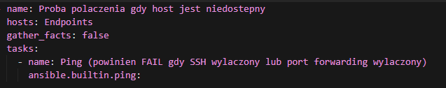

### 2) Kopiowanie inventory na Endpoints

```
ansible-playbook playbooks/02-copy-inventory.yml
```

Po wykonaniu, plik jest na `ansible-target`. Ponowne uruchomienie pokazuje różnicę – Ansible jest idempotentny: kolejny run nie wykonuje już akcji `copy` (`changed=0`), bo plik na docelowej maszynie jest identyczny z lokalnym.

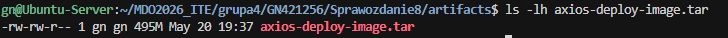
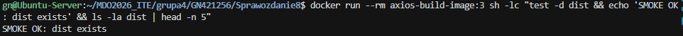

### 3) Aktualizacja pakietów i restart usług

```
ansible-playbook playbooks/03-update-restart.yml
```

`apt upgrade`, restart `ssh`. Usługa `rngd` (`rng-tools`) nie jest zainstalowana na minimalnej maszynie – w playbooku zadanie ma `ignore_errors: true`, więc całość kończy się sukcesem (`failed=0`, `ignored=1`).

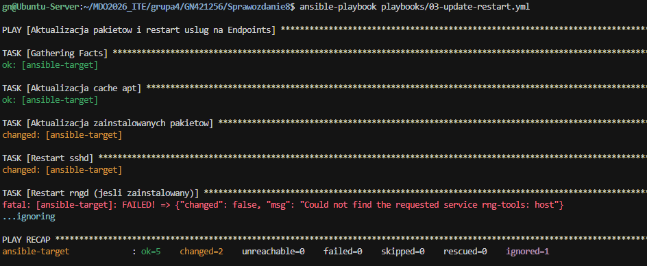

### 4) Wymiana z maszyną niedostępną

Najpierw playbook z działającym hostem – wszystko OK:

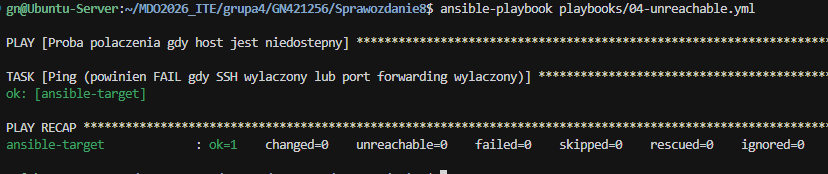

Następnie w VirtualBoxie wyłączono port forwarding `2223 → 22`. Ze względu na to, że Ansible domyślnie utrzymuje sesję SSH (`ControlPersist`), świeże połączenie wymaga wyczyszczenia socketów (`rm -f ~/.ansible/cp/*`).

Po tym ten sam playbook zwraca błąd `UNREACHABLE` / `Connection refused`, ale Ansible **nie wywraca** całego procesu – pozostałe hosty (gdyby były) byłyby przetwarzane dalej:

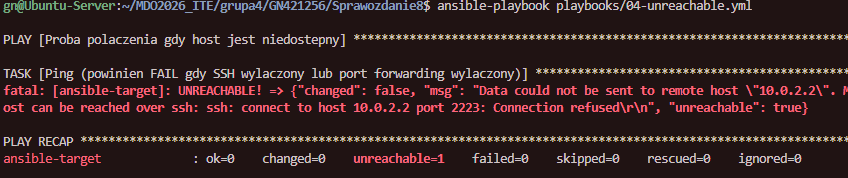

Po włączeniu port forwarding z powrotem łączność wraca natychmiast.

## Wdrożenie artefaktu kontenerowego

Artefaktem z pipeline’u zajęć 07 jest plik `.tar` z obrazem Docker (`docker save`). Plik zostaje umieszczony w `Sprawozdanie8/artifacts/axios-deploy-image.tar`.

Playbook `05-deploy-container.yml`:

1. *sanity check* – ping hosta + sprawdzenie obecności pliku `.tar` na dyrygencie (zadanie z `delegate_to: localhost` i `become: false`, żeby nie próbować `sudo` lokalnie),
2. instalacja Dockera **Ansiblem** (`apt: name=docker.io`) i uruchomienie demona,
3. dodanie użytkownika `ansible` do grupy `docker`,
4. wysłanie pliku `.tar`, `docker load`,
5. uruchomienie kontenera ze smoke testem (`test -d dist && echo 'SMOKE OK'`),
6. weryfikacja (`assert: 'SMOKE OK' in container_run.stdout`),
7. sprzątanie pliku `.tar` z maszyny docelowej.

```
ansible-playbook playbooks/05-deploy-container.yml
```

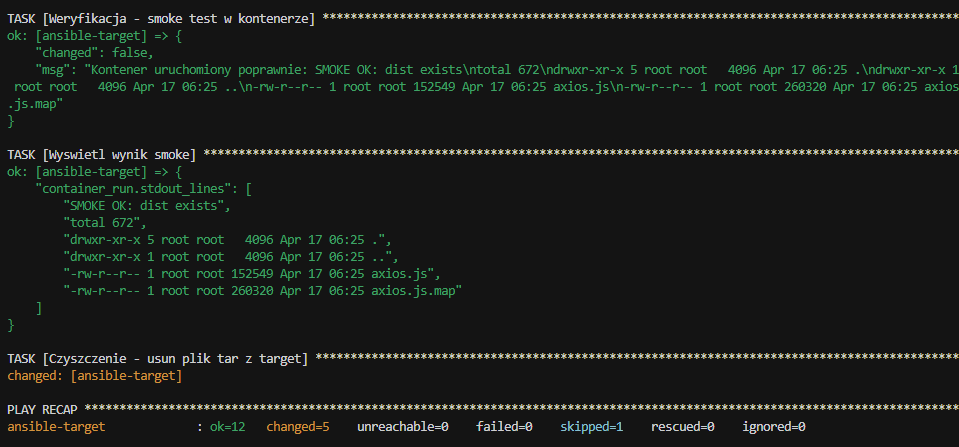

W logu widać kolejno: instalację `docker.io`, kopię pliku, `docker load`, uruchomienie kontenera ze smoke testem (`SMOKE OK: dist exists` + zawartość `dist/`).

## Rola Ansible

Logikę z `05-deploy-container.yml` zapakowano w rolę za pomocą `ansible-galaxy`.

```
cd roles
ansible-galaxy role init axios_deploy
```


Struktura roli (`roles/axios_deploy/`):

```
defaults/main.yml   # domyślne zmienne (deploy_tar, deploy_image, container_name)
tasks/main.yml      # właściwe kroki wdrożenia
meta/main.yml       # autor, platforma, min_ansible_version
```

`meta/main.yml`:

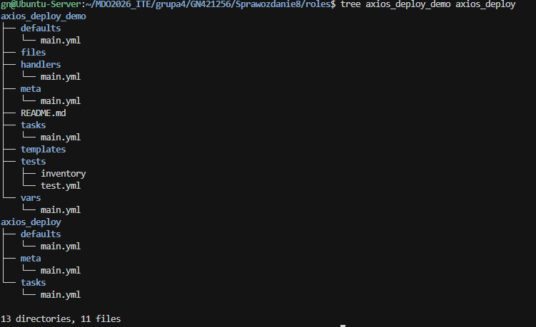

Playbook `06-role-deploy.yml` używa już tylko roli:

```yaml
- name: Wdrozenie przez role axios_deploy
  hosts: Endpoints
  become: true
  roles:
    - axios_deploy
```

Uruchomienie:

```
ansible-playbook playbooks/06-role-deploy.yml
```

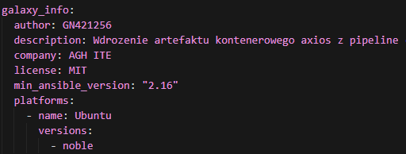
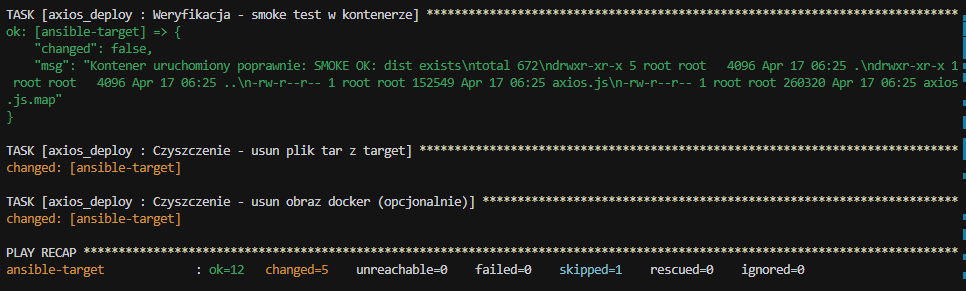

Po wykonaniu roli na maszynie docelowej kontener jest uruchomiony, smoke przechodzi, a plik `.tar` jest sprzątany. Rola jest idempotentna – kolejny run nie instaluje Dockera ponownie i nie kopiuje już raz przesłanego artefaktu.

## Podsumowanie

Zrealizowane elementy z `READMEs/08-Class.md`:

- druga VM (`ansible-target`) z minimalnym zestawem oprogramowania, hostname i userem `ansible`,
- Ansible na dyrygencie z repozytorium,
- bezhasłowe SSH `ansible@ansible-target` + alias w `~/.ssh/config`,
- inventory z sekcjami `Orchestrators` / `Endpoints`,
- ad-hoc `ping` + playbook `ping`,
- kopiowanie inventory, porównanie wyjścia kolejnych uruchomień,
- aktualizacja pakietów, restart `sshd` (oraz próba restartu `rngd`),
- zachowanie playbooka przy niedostępnej maszynie (`UNREACHABLE`, brak wywrócenia całości),
- instalacja Dockera Ansiblem, deploy artefaktu `.tar`, smoke test i sprzątanie,
- zapakowanie wszystkiego w rolę (`ansible-galaxy role init`) z poprawnym `meta/main.yml`, struktura wrzucona do repozytorium GitHub.
