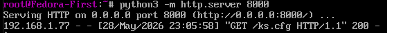
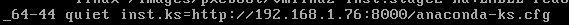
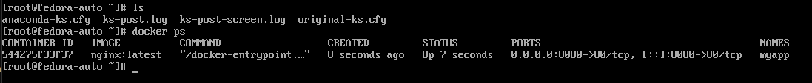

# Sprawozdanie 9
W ramach Laboratorium utworzono dwie maszyny wirtualne z systemem Linux z dystrybucji Fedora. Pierwsza maszyna została postawiona aby automatycznie wygenerować plik odpowiedzi Kickstart do którego chcemy dopisać to czego potrzebujemy.

Po zakończeniu instalacji i edycji pliku którego treść znajduje się poniżej, uruchomiony został tymczasowy serwer http aby udostępnić plik odpowiedzi drugiej maszynie.

Serwer




```
keyboard --vckeymap=us --xlayouts='us'
lang en_US.UTF-8

# Network information
network --bootproto=dhcp --hostname=fedora-auto

%packages
@core
ca-certificates
%end

%post --log=/root/ks-post.log --erroronfail --interpreter=/bin/bash

exec > >(tee -a /root/ks-post-screen.log) 2>&1

set -eux

systemctl enable sshd

curl -fsSL https://download.docker.com/linux/fedora/docker-ce.repo \
-o /etc/yum.repos.d/docker-ce.repo

dnf -y install docker-ce docker-ce-cli containerd.io docker-buildx-plugin docker-compose-plugin

systemctl enable docker.service
systemctl enable containerd.service

cat > /etc/systemd/system/myapp.service <<'EOF'
[Unit]
Description=Example container started after first boot
After=docker.service network-online.target
Wants=network-online.target
Requires=docker.service

[Service]
Restart=always
ExecStartPre=-/usr/bin/docker rm -f myapp
ExecStart=/usr/bin/docker run --name myapp -p 8080:80 nginx:latest
ExecStop=/usr/bin/docker stop myapp

[Install]
WantedBy=multi-user.target
EOF

systemctl enable myapp.service

%end

#Reboot
reboot

# System authorization information
authselect enable-feature with-fingerprint

# Run the Setup Agent on first boot
firstboot --enable

# Generated using Blivet version 3.13.2
ignoredisk --only-use=sda
autopart
# Partition clearing information
clearpart --all --initlabel
autopart

# System timezone
timezone Europe/Warsaw --utc

# Root password
rootpw root
```

Przy tworzeniu drugiej maszyny edytujemy jedną z opcji Bootowania i dopisujemy 
`inst.ks=http://IP:8000/ks.cfg`



Czekamy na automatyczną instalacje systemu i sprawdzamy czy są logi, oraz obraz dockera



Działa.

Skończenie tych laboratoriów zajęło dużo czasu, dużo trial and error z plikiem ks problemu z instalacją dockera, z samą instalacją fedory, ale udało się.