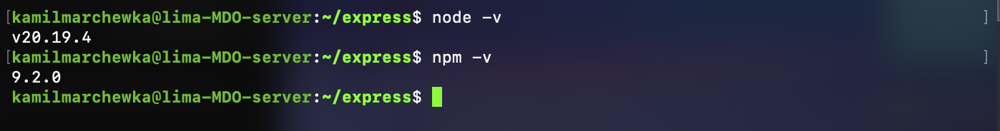

# Wybór oprogramowania: [express](https://github.com/expressjs/express)

# Build lokalnie

### Klonowanie repozytorium

```bash
git clone --depth 1 https://github.com/expressjs/express.git
```

- `--depth 1` pozwala na pobranie tylko najnowszej wersji kodu, co przyspiesza proces klonowania (pobiera tylko ostatni commit)

### Instalacja zależności

```bash
sudo apt update
sudo apt install -y nodejs npm
```



### Instalacja zależności projektu i uruchomienie testów

```bash
npm install
npm run test
```


# Build w kontenerze

### Tworzenie i uruchamianie kontenera

```bash
docker run -it --rm node:current bash
```

- `-i` umożliwia interaktywną pracę z kontenerem,
- `-t` przydziela terminal,
- `--rm` automatycznie usuwa kontener po zakończeniu pracy,
- `node:current` obraz Dockera z najnowszą wersją Node.js,
- `bash` mówi jaki program uruchmić po starcie kontenera


### Weryfikacja wersji Node.js i npm w kontenerze


### Klonowanie repozytorium

```bash
git clone --depth 1 https://github.com/expressjs/express.git
```


### Instalacja zależności projektu i uruchomienie testów

```bash
cd express
npm install
npm run test
```


# Tworzenie plików Dockerfile

## Dockerfile.build

```Dockerfile
FROM node:current
WORKDIR /app
RUN apt update && apt install -y git
RUN git clone --depth 1 https://github.com/expressjs/express.git .
RUN npm install
```

- `FROM node:current` obraz bazowy z najnowszą wersją Node.js,
- `WORKDIR /app` ustawia katalog roboczy w kontenerze,
- `RUN apt update && apt install -y git` aktualizuje listę pakietów i instaluje Git,
- `RUN git clone --depth 1 https://github.com/expressjs/express.git .` klonuje repozytorium,
- `RUN npm install` instaluje zależności projektu

### Budowanie obrazu

```bash
docker build -t express-build -f Dockerfile.build .
```

- `-t` nadaje nazwę obrazowi,
- `-f` wskazuje, którego Dockerfile użyć do budowania,
- `.` oznacza, że kontekst budowania to bieżący katalog


### Uruchomienie kontenera z zbudowanym obrazem i wykonanie testów

```bash
docker run -it --rm express-build bash
npm run test
```


## Dockerfile.test

```Dockerfile
FROM express-base
CMD ["npm", "test"]
```

Nie trzeba definiować `WORKDIR` i ponownie klonować repozytorium, ponieważ `express-base` już to robi. Wystarczy ustawić polecenie startowe, które uruchomi testy.

- `FROM express-base` używa wcześniej zbudowanego obrazu jako bazy,
- `CMD ["npm", "test"]` definiuje domyślne polecenie, które zostanie uruchomione po starcie kontenera (uruchomi testy), a nie w trakcie jego budowania

### Budowanie obrazu

```bash
docker build -t express-test -f Dockerfile.test .
```


### Uruchomienie kontenera z zbudowanym obrazem

```bash
docker run --name my-express-test-run express-test
```

- `--name` pozwala nadać nazwę kontenerowi, co ułatwia jego identyfikację i zarządzanie (np. zatrzymywanie, usuwanie, sprawdzenei logów)


### Późniejsze sprawdzenie logów z testów

```bash
docker logs my-express-test-run
```


# Docker compose

### Instalacja Docker Compose

```bash
sudo apt update
sudo apt install -y docker-compose-v2
```


## docker-compose.yml

```yaml
services:
  builder:
    build:
      context: .
      dockerfile: Dockerfile.build
    image: express-build

  tester:
    build:
      context: .
      dockerfile: Dockerfile.test
    image: express-test
    depends_on:
      - builder
```

- `services` definiuje usługi (kontenery). Każdy serwis (`builder` i `tester`) to osobny byt, który zostanie uruchomiony przez dockera,
- `build` określa jak zbudować obraz,
  - `context` to katalog, z którego Docker będzie budował obraz,
  - `dockerfile` wskazuje, którego Dockerfile użyć do budowania
- `image` nadaje nazwę zbudowanemu obrazowi,
- `depends_on` definiuje zależności między serwisami, w tym przypadku tester zależy od builder, więc Docker Compose najpierw zbuduje i uruchomi builder, a dopiero potem tester

### Uruchomienie usług

```bash
docker compose up
```

Uruchamia wszystkie serwisy z pliku

```bash
docker compose up --build
```

Nakazuje zignorować stare obrazy i zbudować je ponownie przed uruchomieniem kontenerów

```bash
docker compose up tester
```

Uruchamia tylko serwis tester.

```bash
docker compose down
```

Zatrzymuje i usuwa kontenery, czyści środowisko ale **nie usuwa obrazów**.

```bash
docker compose ps
```

Pokazuje liste i status uruchomionych serwisów zarządanych przez Docker Compose.

#### Uruchomienie serwisu tester

```bash
docker compose up tester
```


#### Obrazy i kontenery po uruchomieniu serwisu tester


# Wnioski

Dla projektów typu Express finalnym artefaktem powinien być lekki obraz Dockerowy zbudowany metodą Multi-stage.

Oddzielna ścieżka deploy-and-publish - tak, zazwyczaj robimy oddzielne joby do budowania i publikowania, z których ten drugi jest wykonywany dopiero gdy pierwszy zakończy się sukcesem (testy przejdą pomyślnie). To pozwala na lepszą kontrolę nad procesem i łatwiejsze debugowanie w przypadku problemów.

W przypadku Express.js obraz Dockerowy jest jak najbardziej dobrym rozwiązaniem, ponieważ jest to natywne środkowisko dla tej technologii. Pakiety .deb w świecie Node.js to dziś rzadkość i zazwyczaj niepotrzebna komplikacja.
