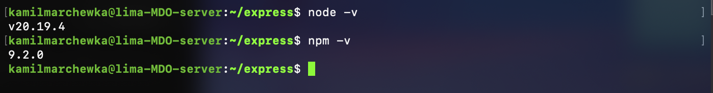

# Sprawozdanie zbiorcze z zajęć laboratoryjnych nr 1-4

<br/>
<br/>

## Laboratorium 1

### Instalacja git

```bash
sudo apt update
sudo apt install git -y
```

### Tworzenie kluczy ssh

#### Bez hasła

```bash
ssh-keygen -t ed25519 -f ~/.ssh/id_github_open -N ""
```


Polecenie to generuje parę kluczy za pomocą algorytmu `ed25519`, definiujemy ścieżkę i niestandardową nazwę pliku oraz ustawiamy pustą passphrase. Wygenerowane klucze znajdują się w katalogu `~/.ssh/` i mają nazwy `id_github_open` oraz `id_github_open.pub`. Klucz publiczny należy dodać do ustawień konta GitHub, aby umożliwić uwierzytelnianie za pomocą SSH.

#### Z hasłem

```bash
ssh-keygen -t ed25519 -f ~/.ssh/id_github_secure
```


Sprawdzamy czy klucze zostały wygenerowane.


### Dodanie klucza publicznego do GitHub

Wchodzimy na stronę GitHub, logujemy się na swoje konto, przechodzimy do ustawień konta, a następnie do sekcji "SSH and GPG keys". Klikamy przycisk "New SSH key", wprowadzamy nazwę dla klucza i wklejamy zawartość pliku `id_github_open.pub` lub `id_github_secure.pub` do pola "Key". Klikamy "Add SSH key" i potwierdzamy operację.


### Klonowanie repozytorium z GitHub

#### Za pomocą HTTPS


#### Za pomocą SSH

Edytujemy plik `~/.ssh/config`, aby dodać konfigurację dla GitHub i wskazać, który klucz ma być używany do uwierzytelniania.

```bash
Host github.com
  HostName github.com
  User git
  IdentityFile ~/.ssh/id_github_secure
  IdentitiesOnly yes
```


Następnie zmieniamy uprawnienia pliku konfiguracyjnego, aby były odpowiednie dla SSH.

```bash
chmod 600 ~/.ssh/config
```


Te uprawnienia dają tylko właścicielowi pliku możliwość odczytu i zapisu.

Teraz możemy sklonować repozytorium za pomocą SSH.


### Podłączenie vs-code za pomocą SSH do maszyny wirtualnej

Sprawdzamy dane maszyny wirtualnej a następnie konfigurujemy połączenie SSH w Visual Studio Code.


Sprawdzenie czy wszystko działa poprawnie.


### Konfiguracja klienta SFTP (Cyberduck)


Gdy połączeniu zostało zestawione, możemy teraz przeglądać i dodawać pliki na maszynie wirtualnej za pomocą interfejsu graficznego.


### Praca z gitem

#### Przełączanie się pomiędzy gałęziami

Przełączenie na gałąź grupy i ustawienie jej jako śledzonej gałęzi zdalnej.

```bash
git checkout -b grupa4 --track origin/grupa4
```


Stworzenie nowej gałęzi i przełączenie się na nią.

```bash
git checkout -b KM419688
```


#### Stworzenie hooka

Tworzymy plik `.sh`

```sh
#!/bin/bash

COMMIT_MSG_FILE=$1
COMMIT_MSG=$(head -n 1 "$COMMIT_MSG_FILE")
MY_ID="KM419688"

if [[ ! $COMMIT_MSG =~ $MY_ID ]]; then
    echo "==========================================="
    echo BŁĄD: Commit zablokowany przez Git Hooka!"
    echo Wiadomość musi zaczynać się od: $MY_ID"
    echo "==========================================="
    exit 1
fi

exit 0
```

Następnie kopiujemy go do katalogu `.git/hooks` i nadajemy mu prawa do wykonywania.


Sprawdzamy działanie hooka, próbując wykonać commit z niepoprawną wiadomością.


<br/>
<br/>

## Laboratorium 2

### Instalacja dockera

Instalujemy dockera na maszynie wirtualnej i dodajemy użytkownika do grupy `docker`, aby móc korzystać z dockera bez uprawnień administratora.

```bash
sudo apt update
sudo apt install dockere.io -y
sudo systemctl start docker
sudo systemctl enable docker
sudo usermod -aG docker $USER
newgrp docker
```

Sprawdzenie działania


### Zapoznanie się z dostępnymi obrazami dockera

```bash
docker run hello-world
docker run busybox echo "Hello world!"
docker run ubuntu /bin/echo "Hello world!"
docker run fedora /bin/echo "hello"
docker run mariadb -version
docker run mcr.microsoft.com/dotnet/sdk:latest --version
docker run mcr.microsoft.com/dotnet/runtime:latest -help
docker run mcr.microsoft.com/dotnet/aspnet:latest -help
```

Sprawdzenie rozmiarów poszczególnych obrazów


Najmniejszy rozmiar ma hello-world, natomiast najwięcej waży sdk.

#### Sprawdzenie kodów wyjścia


### Uruchomienie kontenera z obrazu busybox

```bash
docker run busybox echo "Hellow Busybox"
```


Podłączenie się do kontenera interaktywnie

```bash
docker run -it busybox sh
```


Numer wersji: v1.37.0

### Uruchomienie systemu w kontenerze

uruchamiamy kontener i sprawdzamy id procesu, który jest uruchomiony w kontenerze

```bash
docker run -it ubuntu bash
```


Jak widzimy, że ten sam proces jest zarówno głównym procesem w kontenerze, jak i zwykłym procesem na hoście.

### Aktualizacja pakietów

```bash
apt update
apt upgrade -y
```


### Dockerfile

Tworzymy plik `Dockerfile` z następującą zawartością

```Dockerfile
FROM ubuntu:22.04

RUN apt update && apt-get install -y \
    git \
    && rm -rf /var/lib/apt/lists/*

WORKDIR /app

RUN git clone https://github.com/InżynieriaOprogramowaniaAGH/MDO2026_ITE.git .

CMD ["/bin/bash"]
```

Uruchamiamy obraz zbudowany na podstawie tego Dockerfile

```bash
docker build -t obraz-z-git .
docker run -it obraz-z-git
```


### Czyszczenie kontenerów i obrazów

```bash
docker ps -a
docker container prune -f

docker image prune -a
```


<br/>
<br/>

## Laboratorium 3

### Wybór oprogramowania: [express](https://github.com/expressjs/express)

### Build lokalnie

##### Klonowanie repozytorium

```bash
git clone --depth 1 https://github.com/expressjs/express.git
```

- `--depth 1` pozwala na pobranie tylko najnowszej wersji kodu, co przyspiesza proces klonowania (pobiera tylko ostatni commit)

##### Instalacja zależności

```bash
sudo apt update
sudo apt install -y nodejs npm
```



##### Instalacja zależności projektu i uruchomienie testów

```bash
npm install
npm run test
```


### Build w kontenerze

##### Tworzenie i uruchamianie kontenera

```bash
docker run -it --rm node:current bash
```

- `-i` umożliwia interaktywną pracę z kontenerem,
- `-t` przydziela terminal,
- `--rm` automatycznie usuwa kontener po zakończeniu pracy,
- `node:current` obraz Dockera z najnowszą wersją Node.js,
- `bash` mówi jaki program uruchmić po starcie kontenera


##### Weryfikacja wersji Node.js i npm w kontenerze


##### Klonowanie repozytorium

```bash
git clone --depth 1 https://github.com/expressjs/express.git
```


##### Instalacja zależności projektu i uruchomienie testów

```bash
cd express
npm install
npm run test
```


### Tworzenie plików Dockerfile

#### Dockerfile.build

```Dockerfile
FROM node:current
WORKDIR /app
RUN apt update && apt install -y git
RUN git clone --depth 1 https://github.com/expressjs/express.git .
RUN npm install
```

- `FROM node:current` obraz bazowy z najnowszą wersją Node.js,
- `WORKDIR /app` ustawia katalog roboczy w kontenerze,
- `RUN apt update && apt install -y git` aktualizuje listę pakietów i instaluje Git,
- `RUN git clone --depth 1 https://github.com/expressjs/express.git .` klonuje repozytorium,
- `RUN npm install` instaluje zależności projektu

##### Budowanie obrazu

```bash
docker build -t express-build -f Dockerfile.build .
```

- `-t` nadaje nazwę obrazowi,
- `-f` wskazuje, którego Dockerfile użyć do budowania,
- `.` oznacza, że kontekst budowania to bieżący katalog


##### Uruchomienie kontenera z zbudowanym obrazem i wykonanie testów

```bash
docker run -it --rm express-build bash
npm run test
```


#### Dockerfile.test

```Dockerfile
FROM express-base
CMD ["npm", "test"]
```

Nie trzeba definiować `WORKDIR` i ponownie klonować repozytorium, ponieważ `express-base` już to robi. Wystarczy ustawić polecenie startowe, które uruchomi testy.

- `FROM express-base` używa wcześniej zbudowanego obrazu jako bazy,
- `CMD ["npm", "test"]` definiuje domyślne polecenie, które zostanie uruchomione po starcie kontenera (uruchomi testy), a nie w trakcie jego budowania

##### Budowanie obrazu

```bash
docker build -t express-test -f Dockerfile.test .
```


##### Uruchomienie kontenera z zbudowanym obrazem

```bash
docker run --name my-express-test-run express-test
```

- `--name` pozwala nadać nazwę kontenerowi, co ułatwia jego identyfikację i zarządzanie (np. zatrzymywanie, usuwanie, sprawdzenei logów)


##### Późniejsze sprawdzenie logów z testów

```bash
docker logs my-express-test-run
```


### Docker compose

##### Instalacja Docker Compose

```bash
sudo apt update
sudo apt install -y docker-compose-v2
```


#### docker-compose.yml

```yaml
services:
  builder:
    build:
      context: .
      dockerfile: Dockerfile.build
    image: express-build

  tester:
    build:
      context: .
      dockerfile: Dockerfile.test
    image: express-test
    depends_on:
      - builder
```

- `services` definiuje usługi (kontenery). Każdy serwis (`builder` i `tester`) to osobny byt, który zostanie uruchomiony przez dockera,
- `build` określa jak zbudować obraz,
  - `context` to katalog, z którego Docker będzie budował obraz,
  - `dockerfile` wskazuje, którego Dockerfile użyć do budowania
- `image` nadaje nazwę zbudowanemu obrazowi,
- `depends_on` definiuje zależności między serwisami, w tym przypadku tester zależy od builder, więc Docker Compose najpierw zbuduje i uruchomi builder, a dopiero potem tester

##### Uruchomienie usług

```bash
docker compose up
```

Uruchamia wszystkie serwisy z pliku

```bash
docker compose up --build
```

Nakazuje zignorować stare obrazy i zbudować je ponownie przed uruchomieniem kontenerów

```bash
docker compose up tester
```

Uruchamia tylko serwis tester.

```bash
docker compose down
```

Zatrzymuje i usuwa kontenery, czyści środowisko ale **nie usuwa obrazów**.

```bash
docker compose ps
```

Pokazuje liste i status uruchomionych serwisów zarządanych przez Docker Compose.

###### Uruchomienie serwisu tester

```bash
docker compose up tester
```


###### Obrazy i kontenery po uruchomieniu serwisu tester


### Wnioski

Dla projektów typu Express finalnym artefaktem powinien być lekki obraz Dockerowy zbudowany metodą Multi-stage.

Oddzielna ścieżka deploy-and-publish - tak, zazwyczaj robimy oddzielne joby do budowania i publikowania, z których ten drugi jest wykonywany dopiero gdy pierwszy zakończy się sukcesem (testy przejdą pomyślnie). To pozwala na lepszą kontrolę nad procesem i łatwiejsze debugowanie w przypadku problemów.

W przypadku Express.js obraz Dockerowy jest jak najbardziej dobrym rozwiązaniem, ponieważ jest to natywne środkowisko dla tej technologii. Pakiety .deb w świecie Node.js to dziś rzadkość i zazwyczaj niepotrzebna komplikacja.

<br/>
<br/>

## Laboratorium 4

### Przygotowanie woluminów do pracy

##### Utworzenie woluminów

```bash
docker volume create volume-wejscie
docker volume create volume-wyjscie
```

Otrzymaliśmy dedykowane i odseparowane obszary pamięci, które mogą być używane przez kontenery do przechowywania danych. Woluminy te są trwałe i dane w nich przechowywane nie znikną po usunięciu kontenera.

##### Sprawdzenie utworzonych woluminów

```bash
docker volume ls
```


##### Sklonowanie ropozytorium z kodem do woluminu wejściowego

Użecie metody kontenera pomocniczego. Użycie tymczasowego kontenera z gitem do sklonowania repozytorium bezpośrednio do woluminu. Dzięki temu w kontenerze docelowym będzie już pobrane repozytorium, bez konieczności instalowania gita w kontenerze docelowym.

```bash
docker run --rm \
    -v volume-wejscie:/app \
    alpine/git \
    clone https://github.com/expressjs/express.git /app
```

- `-v volume-wejscie:/app` montuje wolumin `volume-wejscie` do katalogu `/app` w kontenerze,
- `alpine/git` to lekki obraz z gitem,
- `clone https://github.com/expressjs/express.git /app` klonuje repozytorium do katalogu `/app` w kontenerze.


##### Sprawdzenie zawartości woluminu wejściowego

Teraz można podpiąć wolumin do tymczasowego kontenera i wyświetlić zawartość za pomocą `ls`.

```bash
docker run --rm -it -v volume-wejscie:/data alpine ls -l /data
```


### Uruchomienie kontenera builder

W tym kontenerze zainstalujemy wszystkie zależności za pomocą `npm install` i otrzymane pliki przeniesiemy do woluminu wyjściowego.

```bash
docker run -it --rm \
    -v volume-wejscie:/wejscie \
    -v volume-wyjscie:/wyjscie \
    node:20-slim \
    bash
```


Jak widać `git` nie jest zainstalowany.

##### Instalacja zależności

```bash
cd /wejscie
npm install
```


##### Skobiowanie plików do woluminu wyjściowego

```bash
cp -r ./* /wyjscie
```


### Uruchomienie kontenera docelowego i sprawdzenie działania aplikacji

```bash
docker run -it --rm -v volume-wyjscie:/app node:current bash
```


### Eksponowanie portu i łączność miedzy kontenerami

#### Uruchomienie serwera iperf3 w tle (odbiorca)

```bash
docker run -d --name iperf-server networkstatic/iperf3 -s
```

- `-d` uruchamia kontener w tle,
- `s` oznacza tryb serwera.


Domyślnie kontenery będą w sieci `bridge`, więc serwer iperf3 będzie dostępny pod adresem IP kontenera. Ale nie działa DNS.

##### Sprawdzenie adresu IP serwera iperf3

```bash
docker inspect -f '{{range .NetworkSettings.Networks}}{{.IPAddress}}{{end}}' iperf-server
```

lub

```bash
docker inspect iperf-server | grep IPAddress
```


#### Uruchomienie klienta iperf3, połączenie z serwerem i pomiar przepustowości

##### Uruchomienie klienta iperf3 i sprawdzenie przepustowości

```bash
docker run -it --rm networkstatic/iperf3 -c 172.17.0.2
```


##### Uruchomienie interaktywnego klienta iperf3 i sprawdzenie przepustowości (ubuntu)

```bash
docker run -it --rm --name klient ubuntu bash
apt update
apt install iperf3 -y
iperf3 -c 172.17.0.2
```


#### Stworzenie sieci typu bridge i podłączenie do niej kontenerów z wykorzystaniem DNS

##### Stworzenie sieci typu bridge

```bash
docker network create siec-laby
docker network ls
```


##### Podłączenie kontenerów do sieci

```bash
docker run -d --name iperf-server-dns --network siec-laby  networkstatic/iperf3 -s
docker run -it --rm --network siec-laby networkstatic/iperf3 -c iperf-server-dns
```

- `--network siec-laby` podłącza kontener do sieci `siec-laby`,

W sieci user-defined bridge DNS działa, więc można użyć nazwy kontenera `iperf-server-dns` zamiast adresu IP.


Do wyświetlenia informacji o sieci: `docker network inspect siec-laby`

#### Łączenie się z serverem spoza kontenera

##### Wystartowanie serwera iperf3 z mapowaniem portu

```bash
docker run -d --rm --name server-exposed -p 5201:5201 networkstatic/iperf3 -s
```

##### Test z hosta

```bash
iperf3 -c localhost
```


### Usługi w rozumieniu systemu, kontenera i klastra

#### Uruchomienie kontenera z mapowaniem portu i instalacja serwera ssh

```bash
docker run -it -p 2222:22 --name ubuntu-ssh ubuntu:latest
apt update
apt-get install openssh-server -y
```


#### Umożliwienie logowania się do na konto root hasłem

```bash
mkdir /var/run/sshd
passwd root # Qwerty123!@#
sed -i 's/#PermitRootLogin prohibit-password/PermitRootLogin yes/' /etc/ssh/sshd_config
```


#### Uruchomienie serwera ssh i zalogowanie się do niego z hosta

```bash
/usr/sbin/sshd -D &
```

```bash
ssh root@localhost -p 2222
```


### Przygotowanie do uruchomienia serwera Jenkins

#### Stworzenie sieci

```bash
docker network create jenkins
```

#### Uruchomienie pomocnika DIND

```bash
docker run --name jenkins-docker --rm --detach \
    --privileged --network jenkins \
    --env DOCKER_TLS_CERTDIR=/certs \
    --volume jenkins-docker-certs:/certs \
    --volume jenkins-data:/var/jenkins_home \
    docker:dind
```

- `--privileged` nadaje kontenerowi uprawnienia administratora na hoście (wymagane, by Docker mógł działać wewnątrz Dockera).

- `--env DOCKER_TLS_CERTDIR=/certs` włącza szyfrowanie TLS i wskazuje, gdzie mają być generowane certyfikaty bezpieczeństwa.


#### Uruchomienie właściwego serwera Jenkins

```bash
docker run --name jenkins-blueocean --rm --detach \
    --network jenkins --env DOCKER_HOST=tcp://jenkins-docker:2376 \
    --env DOCKER_CERT_PATH=/certs/client --env DOCKER_TLS_VERIFY=1 \
    --publish 8080:8080 --publish 50000:50000 \
    --volume jenkins-data:/var/jenkins_home \
    --volume jenkins-docker-certs:/certs/client:ro \
    jenkins/jenkins:lts-jdk17
```


#### Sprawdzenie działania i logów serwera

W celu uzyskania hasła do pierwszego logowania:

```bash
docker logs jenkins-blueocean
```


