# Sprawozdanie zbiorcze – DevOps
## Krzysztof Mazur KM419774

---

# Ćwiczenie 1 – Git, SSH, gałęzie

## Środowisko

- System hosta: Windows 11  
- Maszyna wirtualna: Ubuntu Server 24.04  
- Hypervisor: VirtualBox  
- Dostęp: SSH  
- Edytor: Windows PowerShell  
- Git: 2.43.0  

---

## Git i konfiguracja

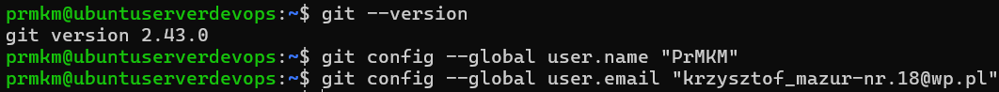

    git --version
    git config --global user.name "PrMKM"
    git config --global user.email "krzysztof_mazur-nr.18@wp.pl"

Klonowanie repozytorium HTTPS:

    git clone https://github.com/InzynieriaOprogramowaniaAGH/MDO2026_ITE.git
    cd MDO2026_ITE

---

## SSH

    ssh-keygen -t ed25519 -f ~/.ssh/id_ed25519_pass -C "krzysztof_mazur-nr.18@wp.pl"
    ssh-keygen -t ed25519 -f ~/.ssh/id_ed25519_no_pass -C "krzysztof_mazur-nr.18@wp.pl"
    cat ~/.ssh/id_ed25519_pass.pub
    ssh -T git@github.com

Klonowanie przez SSH:

    git clone git@github.com:InzynieriaOprogramowaniaAGH/MDO2026_ITE.git

---

## Narzędzia

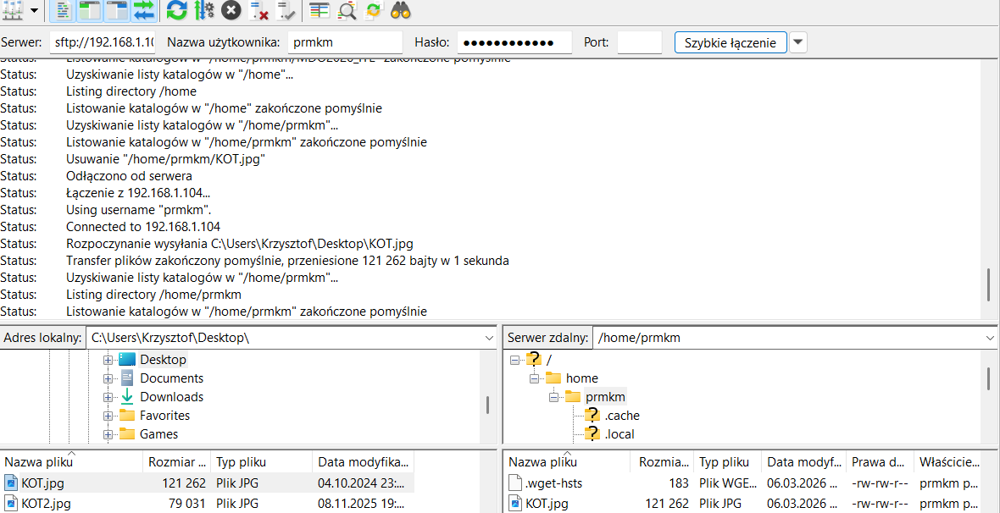

---

## Gałęzie

    git checkout main
    git pull origin main
    git checkout <branch_grupowy>
    git pull origin <branch_grupowy>
    git checkout -b KM419774
    mkdir -p grupa4/KM419774
    cd grupa4/KM419774
    touch Sprawozdanie_1.md
    mkdir img

---

## Git Hook

    nano commit-msg
    cp commit-msg ../../.git/hooks/commit-msg
    chmod +x ../../.git/hooks/commit-msg

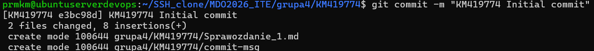

---

# Ćwiczenie 2 – Docker

## Instalacja

    sudo apt update
    sudo apt install docker.io -y
    sudo systemctl enable --now docker
    docker --version

    sudo systemctl status docker

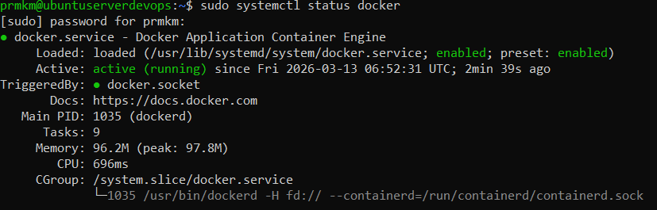

---

## Kontenery testowe

    sudo docker run hello-world
    sudo docker run busybox echo "Hello BusyBox"
    sudo docker run ubuntu uname -a

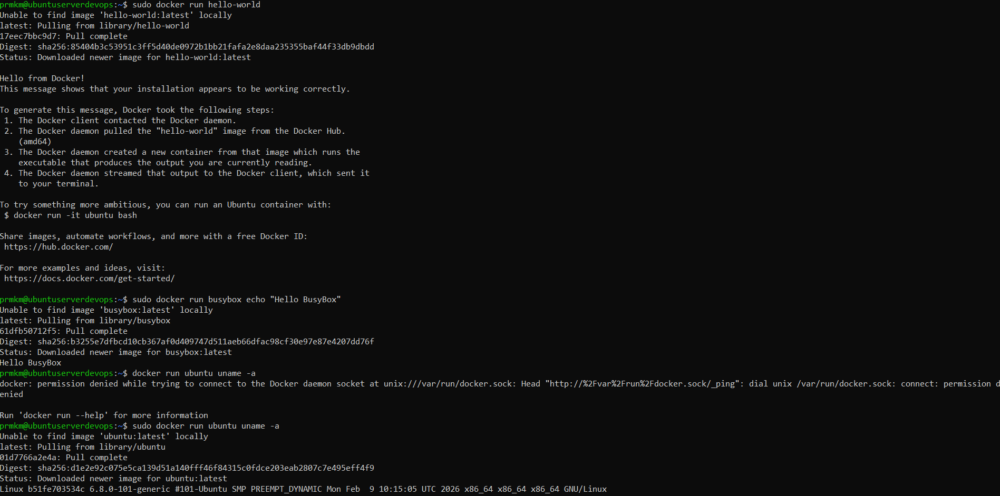

---

## Tryb interaktywny

    sudo docker run -it busybox
    ps
    ls
    exit

    sudo docker run -it ubuntu
    ps
    ls
    exit

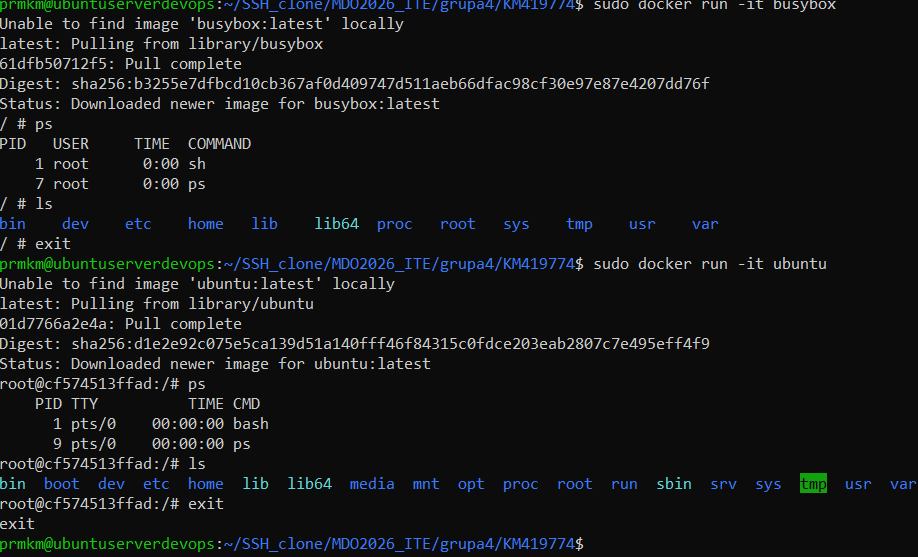

---

## Obrazy i kontenery

    sudo docker images
    sudo docker ps -a
    echo $?

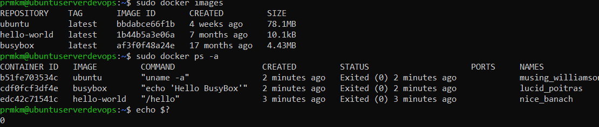

---

## PID

    sudo docker run -it busybox
    echo $BASHPID
    echo $$
    exit

---

## Ubuntu container

    sudo docker run -it ubuntu
    ps -ef
    apt update && apt upgrade -y
    exit

    ps aux | grep docker

---

## Dockerfile

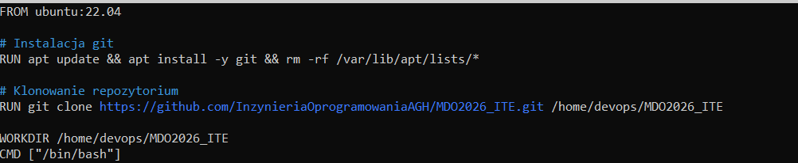

---

## Build i run

    sudo docker build -t km419774_image Lab2/
    sudo docker run -it km419774_image
    ls /home/devops/MDO2026_ITE

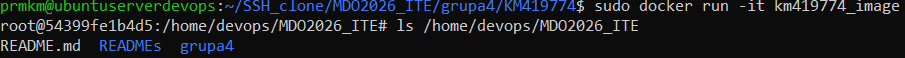

---

## Czyszczenie

    sudo docker ps
    sudo docker ps -a
    sudo docker rm $(docker ps -a -q)
    sudo docker rmi km419774_image
    sudo docker image prune -a

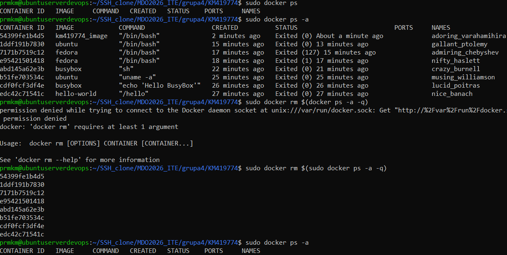
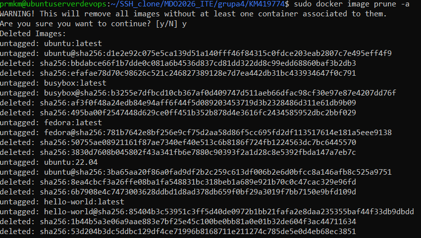

---

# Ćwiczenie 3 – Docker CI

Repozytorium: https://github.com/expressjs/express.git

---

## Lokalny build

    git clone https://github.com/expressjs/express.git
    cd express

    sudo apt install -y nodejs npm

    node -v
    npm -v

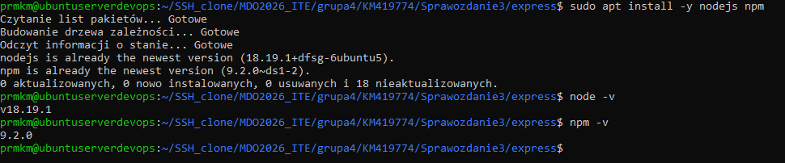

    npm install
    npm test

---

## Kontener

    docker run -it node:20 bash

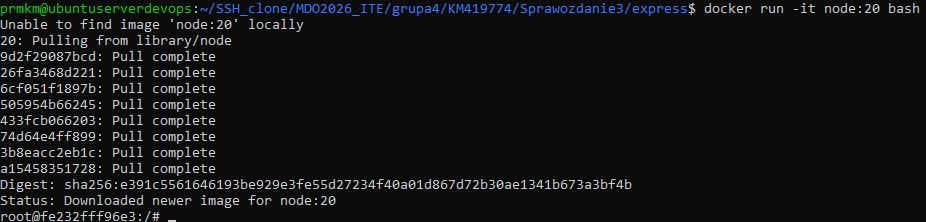

    apt install -y git
    git clone https://github.com/expressjs/express.git
    cd express
    npm install
    npm test

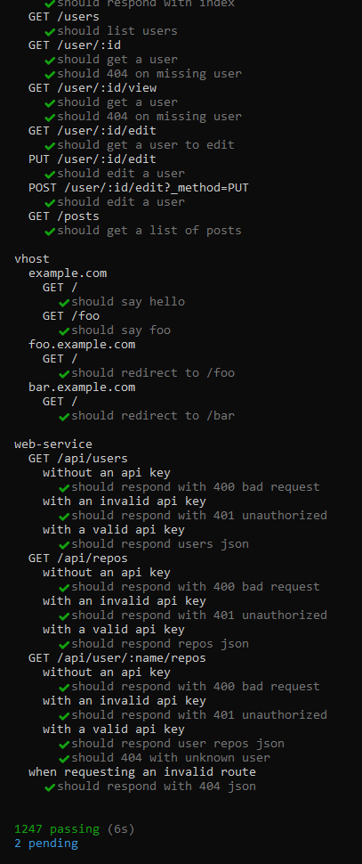

---

## Dockerfile

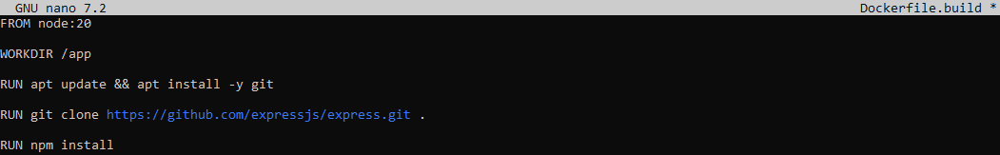

    docker build -f Dockerfile.build -t express-build .

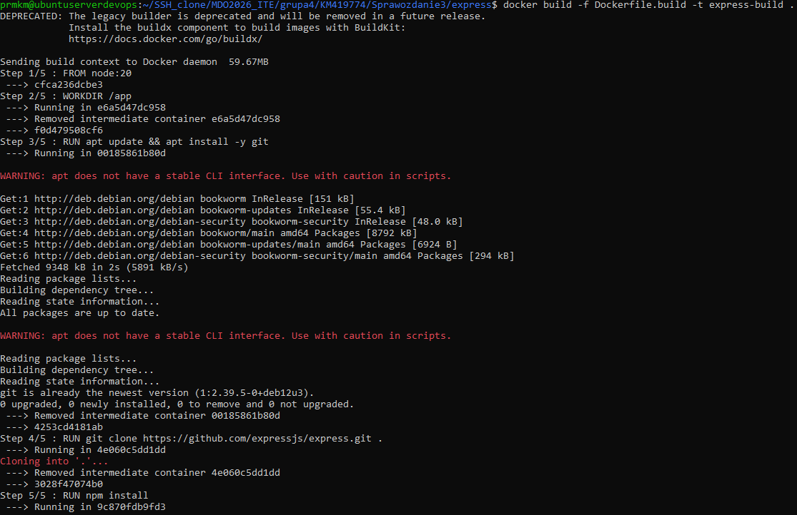
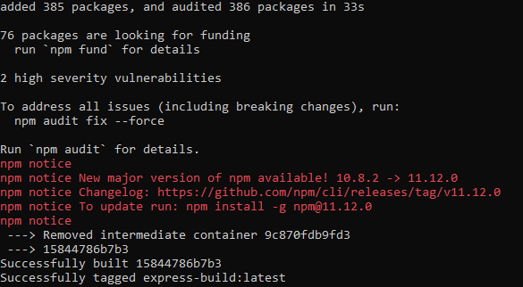

---

## Test

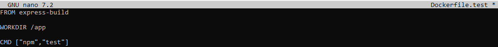

    docker build -f Dockerfile.test -t express-test .
    docker run --rm express-test

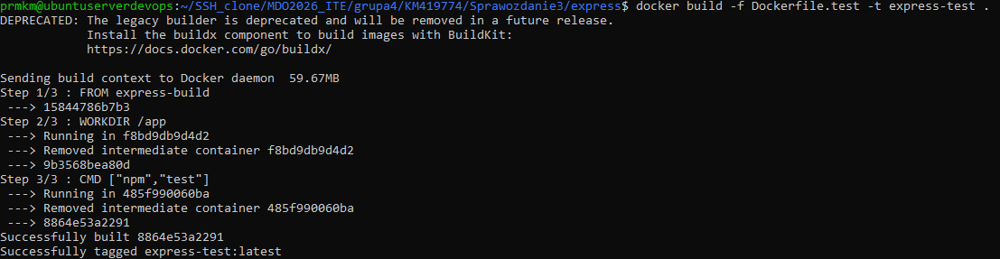

---

## Compose

    docker compose build
    docker compose run test

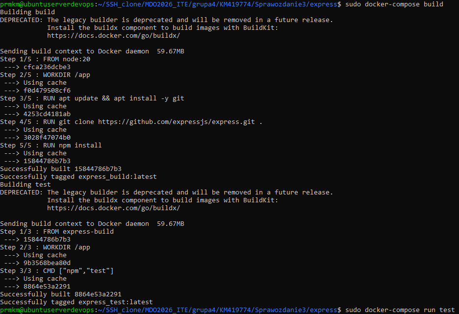

---

# Ćwiczenie 4 – Woluminy i Jenkins

## Woluminy

    docker volume create express_input
    docker volume create express_output

    docker run --rm -v express_input:/data alpine sh -c "apk add git && git clone https://github.com/expressjs/express.git /data/express"

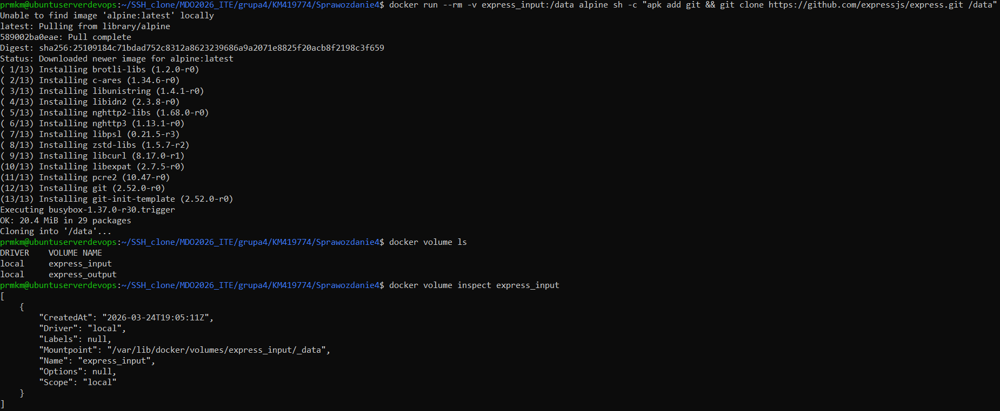

---

## Builder

    docker run -it -v express_input:/input -v express_output:/output node:20 bash

    apt install -y git
    cd /input
    git clone https://github.com/expressjs/express.git
    cd express
    npm install
    cp -r node_modules /output/

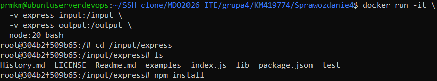
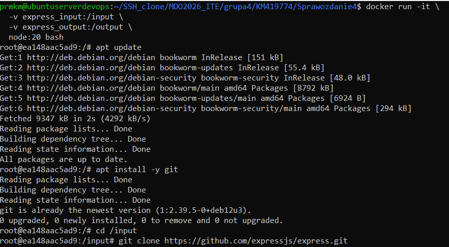
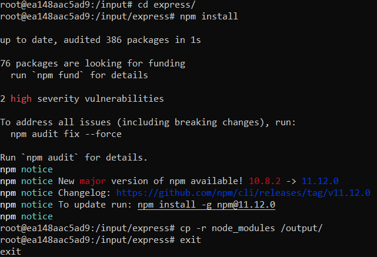

---

## Sieci

    docker network create labnet

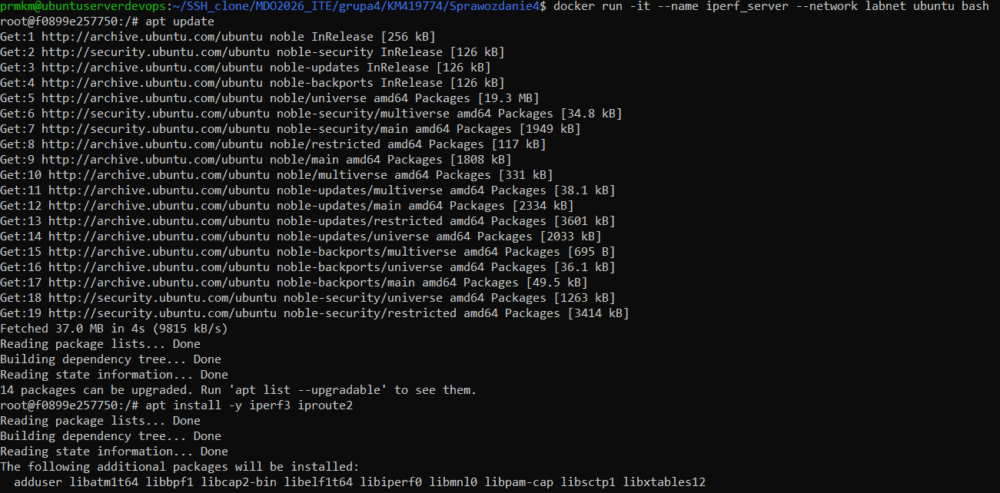

    docker run -it --name iperf_server --network labnet ubuntu

    docker run -it --name iperf_client --network labnet ubuntu

---

## SSH

    docker run -it --name ssh_lab -p 2222:22 ubuntu

    apt install -y openssh-server
    service ssh start

    ssh root@localhost -p 2222

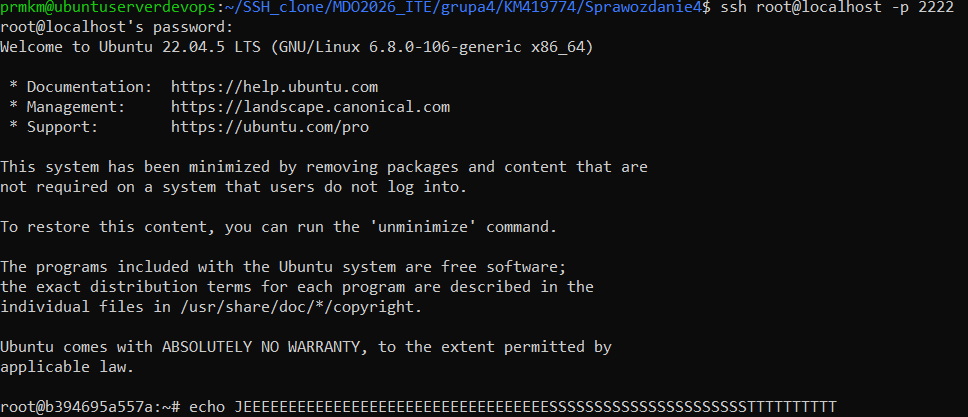

---

## Jenkins

    docker volume create jenkins_home
    docker network create jenkins

    docker run -d --name jenkins-dind --network jenkins --privileged docker:24-dind

    docker run -d --name jenkins --network jenkins -p 8080:8080 -p 50000:50000 -v jenkins_home:/var/jenkins_home -e DOCKER_HOST=tcp://jenkins-dind:2375 jenkins/jenkins:lts

http://192.168.1.104:8080

