# Sprawozdanie zbiorcze – DevOps (Lab 5–7)
## Krzysztof Mazur KM419774

---

# Ćwiczenie 5 – Jenkins Pipeline

## Cel ćwiczenia

Celem było stworzenie pipeline w Jenkinsie realizującego:
- clone
- build
- test

z wykorzystaniem kontenerów Docker.

---

## Środowisko

- Ubuntu Server 22.04
- Jenkins: jenkins/jenkins:lts
- Docker + Docker-in-Docker
- Node.js 20

---

## Konfiguracja Dockera i Jenkins

    docker network create jenkins
    docker volume create jenkins_home

    docker run -d --name jenkins-dind \
      --network jenkins \
      --privileged \
      docker:24-dind

    docker run -d --name jenkins \
      --network jenkins \
      -p 8080:8080 \
      -v jenkins_home:/var/jenkins_home \
      jenkins/jenkins:lts

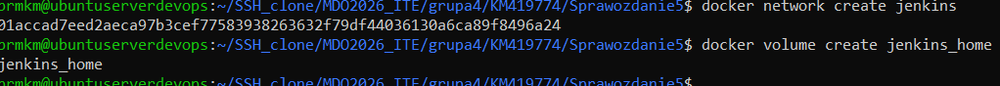
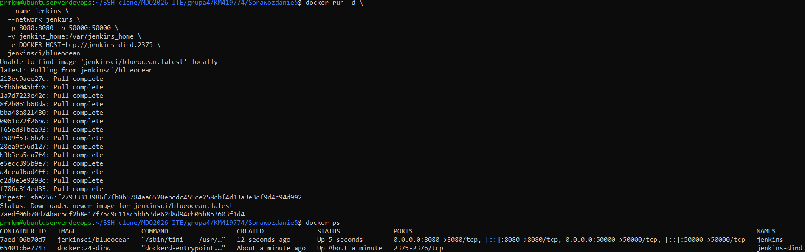

---

## Konfiguracja Jenkins

    docker exec -it jenkins bash

Instalacja Node.js:

    apt update && apt install -y curl
    curl -fsSL https://deb.nodesource.com/setup_20.x | bash -
    apt install -y nodejs

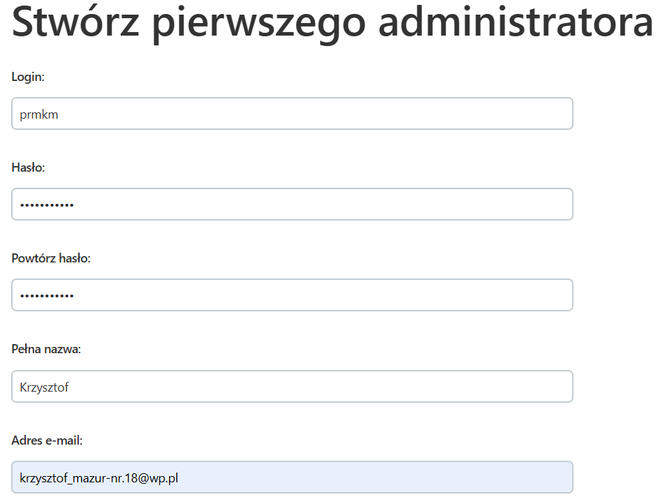

---

## Pipeline (Jenkinsfile)

    pipeline {
        agent any
        stages {
            stage('Clone') {
                steps {
                    sh 'rm -rf express'
                    sh 'git clone https://github.com/expressjs/express.git'
                }
            }
            stage('Install & Test') {
                steps {
                    sh 'docker run --rm -v $PWD/express:/app -w /app node:20 bash -c "npm install && npm test"'
                }
            }
        }
    }

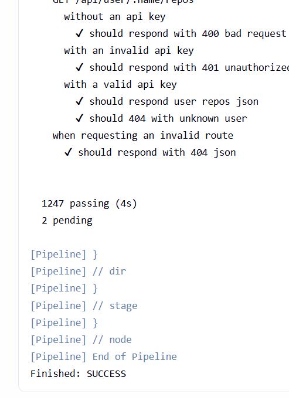

---

# Ćwiczenie 6 – Pipeline CI/CD

## Cel

Zbudowanie pełnego pipeline:
- clone
- build
- test
- deploy
- publish

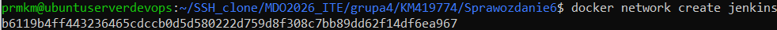

---

## Jenkins + Docker socket

    docker run -d \
      --name jenkins \
      -p 8080:8080 \
      -p 50000:50000 \
      -v jenkins_home:/var/jenkins_home \
      -v /var/run/docker.sock:/var/run/docker.sock \
      jenkins/jenkins:lts

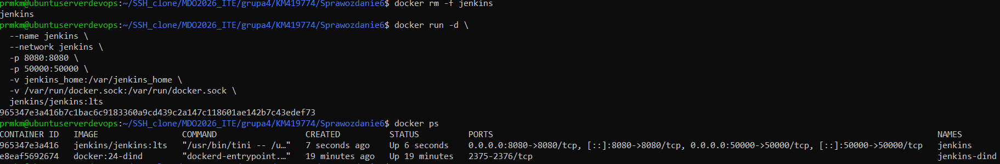

    docker exec -u 0 -it jenkins bash

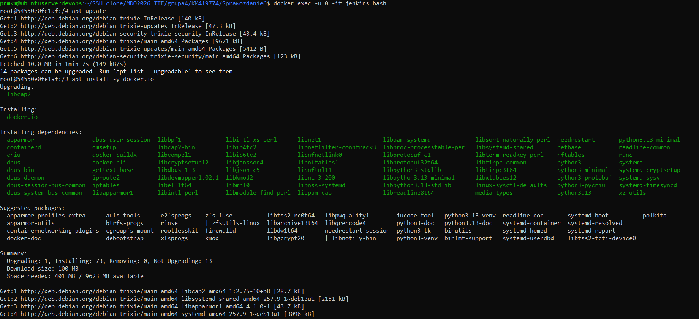

    chmod 666 /var/run/docker.sock

---

## Jenkinsfile

    pipeline {
        agent any

        stages {

            stage('Clean') {
                steps {
                    sh 'rm -rf express || true'
                }
            }

            stage('Clone') {
                steps {
                    sh 'git clone https://github.com/expressjs/express.git'
                }
            }

            stage('Install') {
                steps {
                    sh 'docker run --rm -v $PWD/express:/app -w /app node:20 bash -c "npm install"'
                }
            }

            stage('Test') {
                steps {
                    sh 'docker run --rm -v $PWD/express:/app -w /app node:20 bash -c "npm test || true"'
                }
            }

            stage('Build artifact') {
                steps {
                    sh 'mkdir -p artifact && tar -czf artifact/express.tar.gz express'
                }
            }

            stage('Deploy') {
                steps {
                    sh '''
                    cat > express/Dockerfile <<EOF
FROM node:20
WORKDIR /app
COPY . .
RUN npm install
CMD ["node", "index.js"]
EOF
                    docker build -t express-app ./express
                    docker run -d -p 3000:3000 express-app || true
                    '''
                }
            }

            stage('Smoke test') {
                steps {
                    sh 'sleep 5 && curl -s http://localhost:3000 || true'
                }
            }

            stage('Publish') {
                steps {
                    archiveArtifacts artifacts: 'artifact/**', fingerprint: true
                }
            }
        }
    }

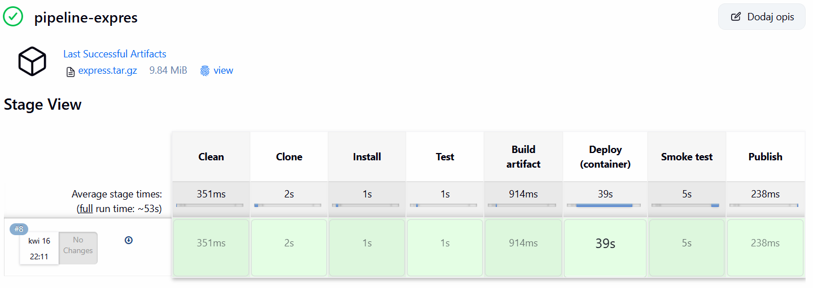

---

## Artefakty

- archiwum: express.tar.gz
- przechowywanie: Jenkins (archiveArtifacts)
- identyfikacja: fingerprint

---

# Ćwiczenie 7 – CI/CD + Docker Registry + Ansible

## Cel

- wdrożenie aplikacji Express
- publikacja obrazu Docker
- przygotowanie środowiska pod Ansible

---

## Docker – build i run

    docker build -t express-km419774 ./grupa4/KM419774
    docker run -d --name express -p 3000:3000 express-km419774

    docker stop express || true
    docker rm express || true

---

## Jenkins – konfiguracja

Pipeline:
- repozytorium GitHub
- branch: KM419774
- Jenkinsfile w repo

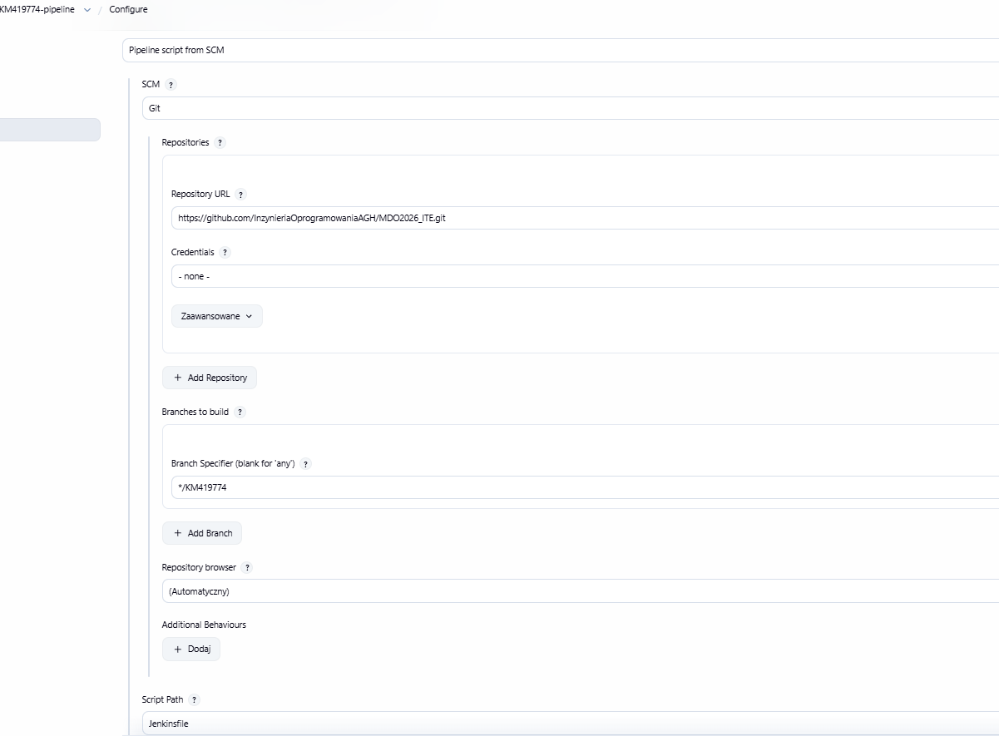
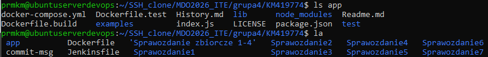

---

## Docker Registry

    docker run -d -p 5000:5000 --name registry registry:2

Publikacja:

    docker tag express-km419774 localhost:5000/express-km419774
    docker push localhost:5000/express-km419774

---

## Jenkins + Docker

    docker run -d \
      --name jenkins \
      -p 8080:8080 -p 50000:50000 \
      -v /var/run/docker.sock:/var/run/docker.sock \
      -v /usr/bin/docker:/usr/bin/docker \
      -v jenkins_home:/var/jenkins_home \
      jenkins/jenkins:lts

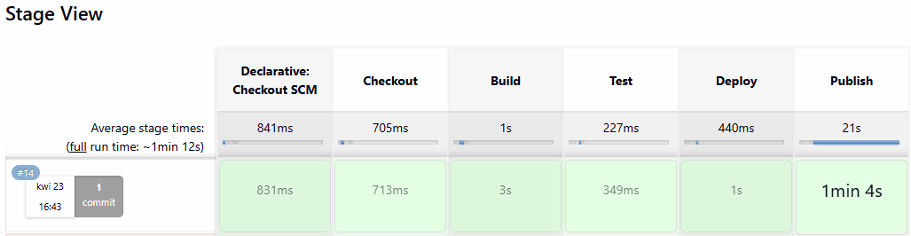

---

## Ansible – przygotowanie środowiska

Instalacja:

    sudo apt update
    sudo apt install -y ansible

Na drugiej maszynie:

    sudo apt install -y openssh-server tar

Hostname:

    sudo hostnamectl set-hostname ansible-target

Użytkownik:

    sudo adduser ansible
    sudo usermod -aG sudo ansible

---

## SSH

    ssh-keygen
    ssh-copy-id ansible@192.168.1.102
    ssh ansible@192.168.1.102

---

## Snapshot

- VirtualBox -> migawka

---

## Definition of Done

Pipeline:
- buduje artefakt (Docker image)
- publikuje do registry
- umożliwia uruchomienie na innej maszynie

Uruchomienie:

    docker pull localhost:5000/express-km419774
    docker run -d -p 3000:3000 localhost:5000/express-km419774

---

## Wniosek końcowy

Pipeline CI/CD:
- jest w pełni automatyczny
- tworzy przenośny artefakt
- umożliwia deployment poza środowiskiem lokalnym
- spełnia założenia build -> test -> deploy -> publish