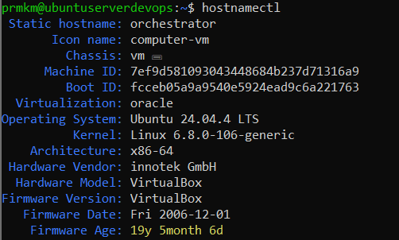
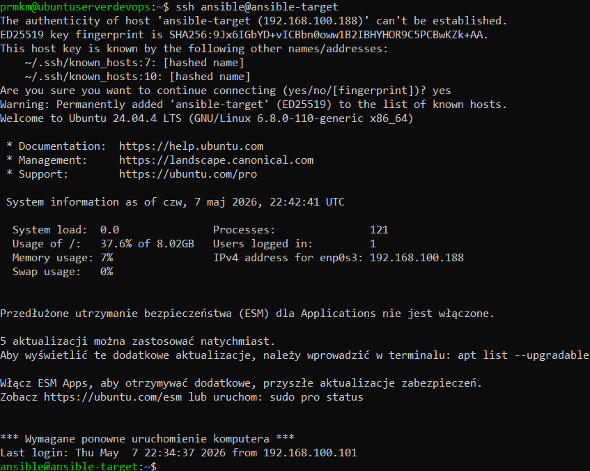
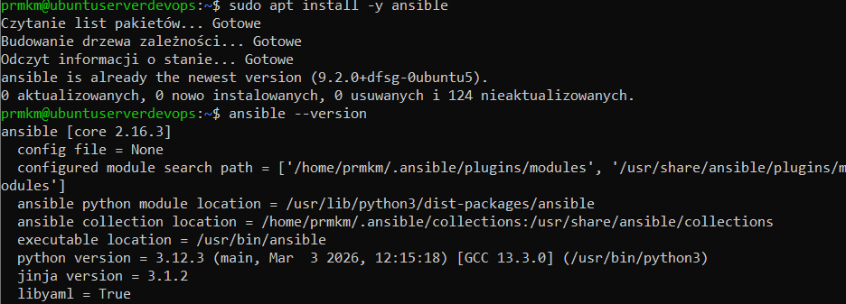
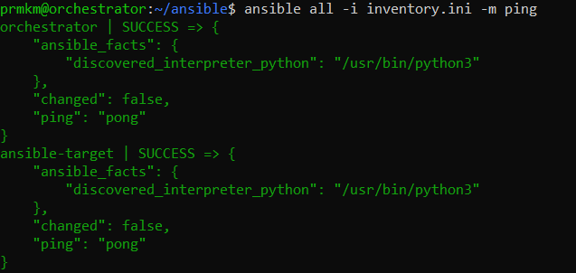
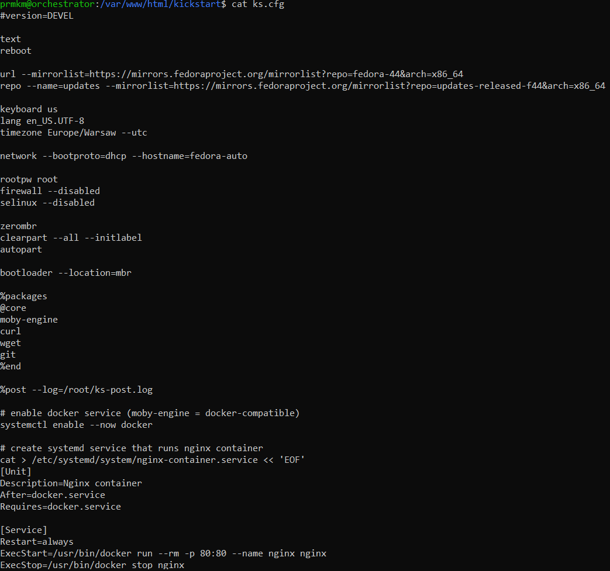
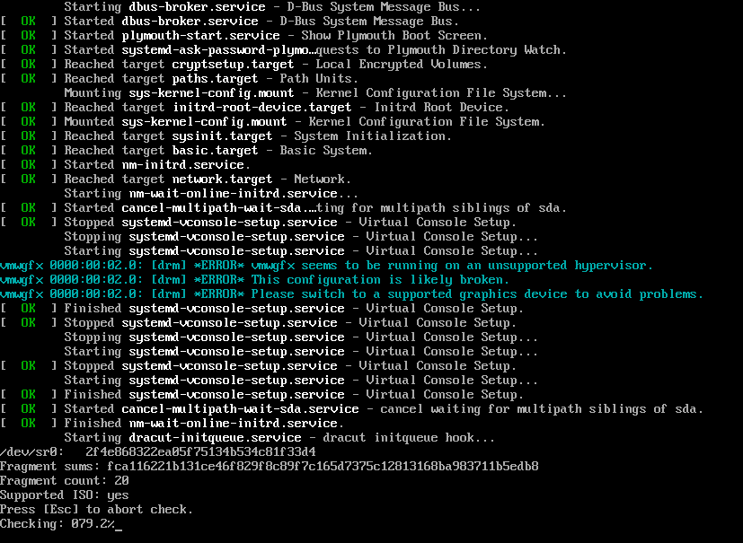
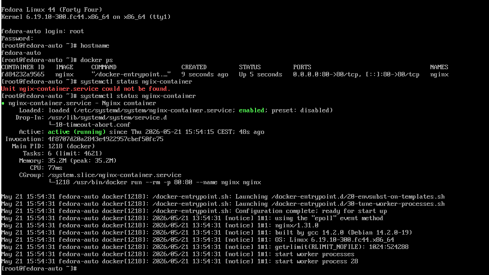
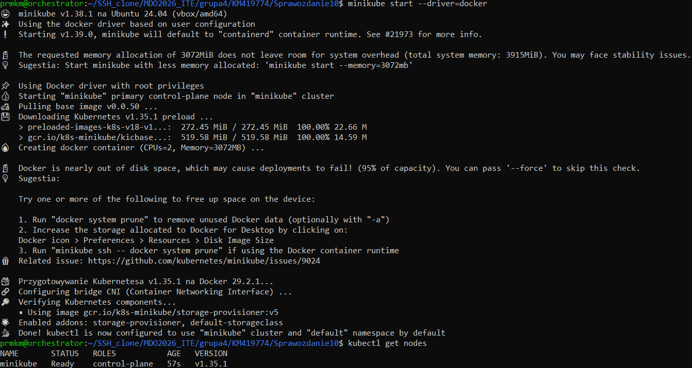
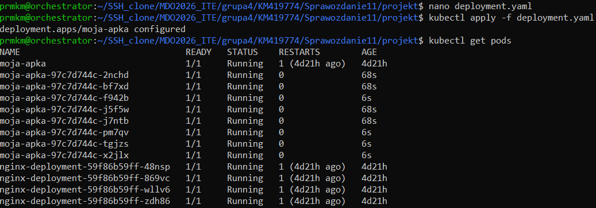
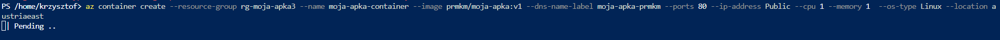

# Sprawozdanie zbiorcze – Automatyzacja, Konteneryzacja i Wdrożenia DevOps

## Autor

- Imię i nazwisko: Krzysztof Mazur
- Grupa: 4

---

# Cel sprawozdania

Celem wykonanych laboratoriów było poznanie i praktyczne wykorzystanie narzędzi oraz technologii stosowanych w podejściu DevOps.

Zakres obejmował:

- automatyzację konfiguracji serwerów przy pomocy Ansible,
- automatyczną instalację systemu Linux przez Kickstart,
- budowę oraz uruchamianie aplikacji kontenerowych Docker,
- zarządzanie kontenerami w Kubernetes,
- wykonywanie aktualizacji i rollbacków wdrożeń,
- wdrożenie aplikacji w chmurze Microsoft Azure.

---

# 1. Automatyzacja infrastruktury przy użyciu Ansible

## Przygotowanie środowiska

Sprawdzono nazwę hosta:

```bash
hostnamectl
```

Zmieniono nazwę maszyny głównej:

```bash
sudo hostnamectl set-hostname orchestrator
```

Maszyna docelowa:

```bash
sudo hostnamectl set-hostname ansible-target
```



---

# Konfiguracja SSH

Edytowano plik:

```bash
sudo nano /etc/hosts
```

Dodano:

```text
192.168.100.188 ansible-target
192.168.100.X orchestrator
```

Skonfigurowano logowanie bez hasła:

```bash
ssh-copy-id ansible@ansible-target
```



---

# Instalacja Ansible

Instalacja pakietu:

```bash
sudo apt update
sudo apt install -y ansible
```

Sprawdzenie:

```bash
ansible --version
```



---

# Inventory oraz test połączenia

Utworzono plik:

```bash
nano inventory.ini
```

Test:

```bash
ansible all -i inventory.ini -m ping
```



---

# Playbooki Ansible

Przygotowano playbooki automatyzujące:

- konfigurację systemu,
- instalację Dockera,
- wdrażanie aplikacji,
- usuwanie kontenerów.

Przykład uruchomienia:

```bash
ansible-playbook -i inventory.ini docker.yml --ask-become-pass
```

Ansible wykazał idempotencję — ponowne uruchomienie playbooków nie wykonywało ponownie tych samych zmian.

---

# Wdrożenie aplikacji

Uruchomienie:

```bash
ansible-playbook -i inventory.ini deploy.yml --ask-become-pass
```

Sprawdzenie kontenerów:

```bash
docker ps
```

Test:

```bash
curl http://localhost:5000/v2/_catalog
```

---

# Wnioski Ansible

Ansible umożliwił:

- automatyczne zarządzanie konfiguracją,
- wykonywanie operacji na maszynach zdalnych,
- ograniczenie ręcznej konfiguracji,
- realizację podejścia Infrastructure as Code.

---

# 2. Automatyczna instalacja Fedora przez Kickstart

## Cel

Celem było przygotowanie instalacji nienadzorowanej systemu Fedora wraz z automatycznym wdrożeniem kontenera.

---

# Przygotowanie Apache

Instalacja serwera HTTP:

```bash
sudo apt update
sudo apt install apache2 -y
```

Utworzono katalog:

```bash
sudo mkdir -p /var/www/html/kickstart
```

---

# Plik Kickstart

Utworzono:

```bash
nano ks.cfg
```

Najważniejsza konfiguracja:

```cfg
%packages
@core
moby-engine
curl
wget
git
%end
```

Automatyczne uruchomienie Dockera:

```bash
systemctl enable --now docker
```



---

# Udostępnienie pliku

Skopiowano:

```bash
sudo cp ks.cfg /var/www/html/kickstart/
```

Test:

```bash
curl http://localhost/kickstart/ks.cfg
```

---

# Instalacja Fedora

Podczas uruchamiania instalatora dodano:

```text
inst.ks=http://192.168.1.104/kickstart/ks.cfg
```



---

# Weryfikacja

Hostname:

```bash
hostname
```

Wynik:

```text
fedora-auto
```

Docker:

```bash
docker ps
```

Usługa:

```bash
systemctl status nginx-container
```



---

# Wnioski Kickstart

Kickstart pozwala:

- automatyzować instalację systemów,
- instalować wymagane pakiety,
- wykonywać konfigurację po instalacji,
- uruchamiać usługi automatycznie.

---

# 3. Kubernetes – Minikube

## Uruchomienie klastra

Sprawdzenie Dockera:

```bash
docker --version
```

Start klastra:

```bash
minikube start --driver=docker
```

Kontrola:

```bash
kubectl get nodes
```



---

# Budowa obrazu Docker

Dockerfile:

```dockerfile
FROM nginx:latest

COPY index.html /usr/share/nginx/html/index.html
```

Budowa:

```bash
docker build -t moja-apka:v1 .
```

---

# Test kontenera

Uruchomienie:

```bash
docker run -d -p 8080:80 moja-apka:v1
```

Sprawdzenie:

```bash
curl localhost:8080
```

---

# Wdrożenie w Kubernetes

Uruchomienie poda:

```bash
kubectl run moja-apka \
--image=moja-apka:v1 \
--port=80
```

Sprawdzenie:

```bash
kubectl get pods
```

---

# Deployment oraz Service

Wdrożenie:

```bash
kubectl apply -f deployment.yaml
```

Service:

```bash
kubectl expose deployment nginx-deployment \
--type=ClusterIP \
--port=80
```

---

# Wnioski Kubernetes

Poznano:

- Pod,
- Deployment,
- ReplicaSet,
- Service,
- komunikację sieciową,
- zarządzanie aplikacją kontenerową.

---

# 4. Kubernetes – aktualizacja wdrożeń

Przygotowano obrazy:

```text
moja-apka:v1
moja-apka:v2
moja-apka:broken
```

---

# Skalowanie

Zmiana liczby replik:

```yaml
replicas: 8
```

Sprawdzenie:

```bash
kubectl get pods
```



---

# Aktualizacja aplikacji

Zmiana obrazu:

```yaml
image: moja-apka:v2
```

Wdrożenie:

```bash
kubectl apply -f deployment.yaml
```

Status:

```bash
kubectl rollout status deployment moja-apka
```

---

# Historia i rollback

Historia:

```bash
kubectl rollout history deployment moja-apka
```

Powrót:

```bash
kubectl rollout undo deployment moja-apka
```

---

# Test błędnego wdrożenia

Wdrożono:

```yaml
image: moja-apka:broken
```

Analiza:

```bash
kubectl describe pods
```

Efekt:

```text
CrashLoopBackOff
```

Następnie wykonano poprawny rollback.

---

# Strategie wdrożeń

## Recreate

Usunięcie starej wersji i uruchomienie nowej.

## RollingUpdate

Stopniowa wymiana podów bez zatrzymania aplikacji.

## Canary

Testowanie nowej wersji przed pełnym wdrożeniem.

---

# 5. Microsoft Azure – wdrożenie kontenera

## Publikacja obrazu

Tagowanie:

```bash
docker tag moja-apka:v1 prmkm/moja-apka:v1
```

Publikacja:

```bash
docker push prmkm/moja-apka:v1
```

---

# Resource Group

Utworzono grupę zasobów:

```bash
az group create \
--name rg-moja-apka3 \
--location austriaeast
```

---

# Azure Container Instance

Wdrożenie:

```bash
az container create \
--resource-group rg-moja-apka3 \
--name moja-apka-container \
--image prmkm/moja-apka:v1 \
--ports 80 \
--ip-address Public
```



---

# Sprawdzenie działania

```bash
az container show \
--resource-group rg-moja-apka3 \
--name moja-apka-container
```

Status:

```text
Running
```

---

# Logi

```bash
az container logs \
--resource-group rg-moja-apka3 \
--name moja-apka-container
```

---

# Usunięcie zasobów

Kontener:

```bash
az container delete \
--resource-group rg-moja-apka3 \
--name moja-apka-container
```

Resource Group:

```bash
az group delete \
--name rg-moja-apka3 \
--yes
```

---

# Podsumowanie końcowe

W ramach laboratoriów wykonano pełny proces DevOps:

1. Automatyzacja infrastruktury przez Ansible.
2. Automatyczna instalacja Fedora przez Kickstart.
3. Budowa i uruchamianie kontenerów Docker.
4. Zarządzanie aplikacją w Kubernetes.
5. Skalowanie, aktualizacje oraz rollbacki.
6. Wdrożenie aplikacji w Microsoft Azure.

Ćwiczenia pokazały praktyczne wykorzystanie:

- Infrastructure as Code,
- automatyzacji wdrożeń,
- konteneryzacji,
- orkiestracji,
- chmury obliczeniowej.
