# Sprawozdanie – Kubernetes (Minikube)

## Autor
- Imię i nazwisko: Krzysztof Mazur
- Grupa: 4
- Data wykonania ćwiczenia: 29.05.2026

---

# Cel ćwiczenia

Celem ćwiczenia było:
- uruchomienie klastra Kubernetes z użyciem Minikube,
- zapoznanie się z podstawowymi komponentami Kubernetes,
- przygotowanie obrazu Docker,
- wdrożenie aplikacji do klastra Kubernetes,
- wykonanie deploymentu oraz replikacji aplikacji,
- wystawienie aplikacji przy użyciu Service i port-forward.

---

# Instalacja Minikube i kubectl

## Sprawdzenie środowiska Docker

W pierwszej kolejności sprawdzono dostępność środowiska Docker.

```bash
docker --version
```

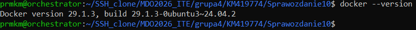

---

## Instalacja Minikube

Pobrano oraz zainstalowano Minikube.

```bash
curl -LO https://storage.googleapis.com/minikube/releases/latest/minikube-linux-amd64

sudo install minikube-linux-amd64 /usr/local/bin/minikube
```

Sprawdzenie wersji:

```bash
minikube version
```

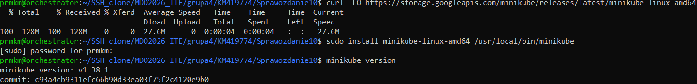

---

## Instalacja kubectl

Zainstalowano narzędzie `kubectl`.

```bash
curl -LO "https://dl.k8s.io/release/$(curl -L -s https://dl.k8s.io/release/stable.txt)/bin/linux/amd64/kubectl"

chmod +x kubectl

sudo mv kubectl /usr/local/bin/
```

Sprawdzenie wersji:

```bash
kubectl version --client
```

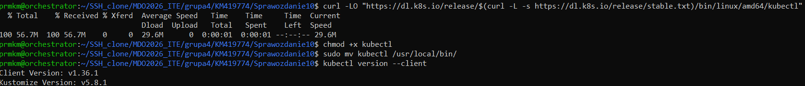

---

# Uruchomienie klastra Kubernetes

Uruchomiono lokalny klaster Kubernetes przy użyciu Minikube.

```bash
minikube start --driver=docker
```

Sprawdzenie stanu node’ów:

```bash
kubectl get nodes
```

Sprawdzenie statusu Minikube:

```bash
minikube status
```

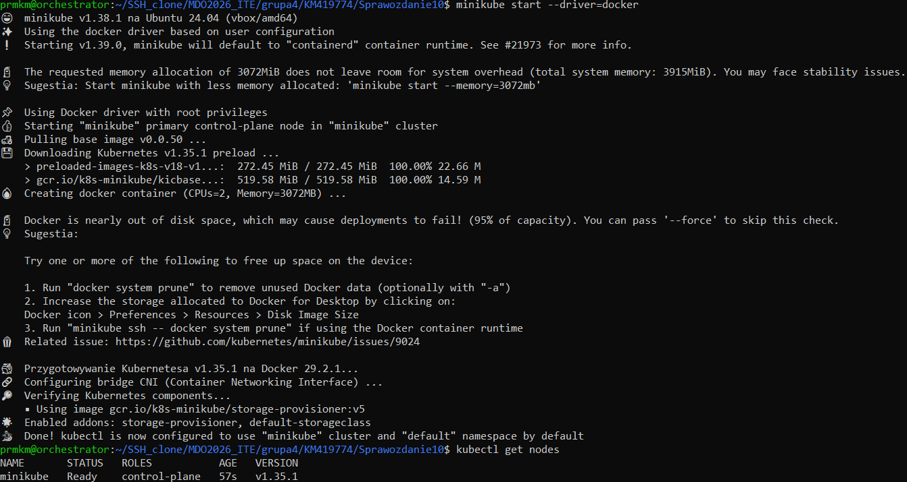

---

# Kubernetes Dashboard

Dashboard Kubernetes został uruchomiony przy użyciu proxy Kubernetes.

Sprawdzenie działających podów:

```bash
kubectl get pods -A
```

Uruchomienie proxy:

```bash
kubectl proxy --address='0.0.0.0' --disable-filter=true
```

Dashboard został otwarty w przeglądarce pod adresem:

```text
http://192.168.1.104:8001/api/v1/namespaces/kubernetes-dashboard/services/http:kubernetes-dashboard:/proxy/
```

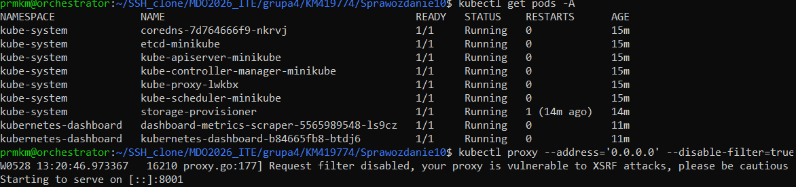


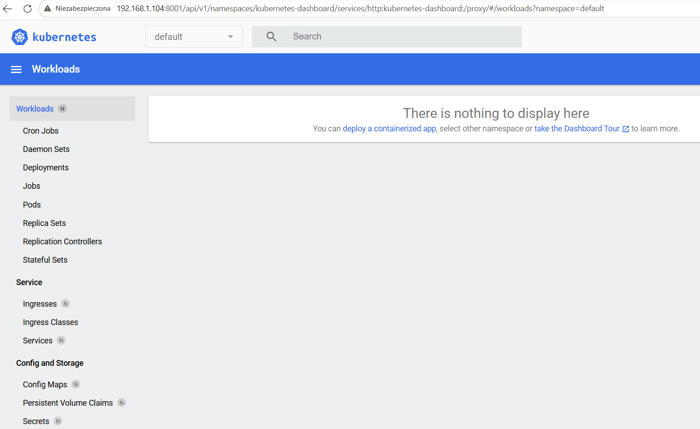
---

# Podstawowe pojęcia Kubernetes

## Pod

Pod jest najmniejszą jednostką uruchomieniową w Kubernetes.  
Może zawierać jeden lub wiele kontenerów.

## Deployment

Deployment odpowiada za zarządzanie wdrożeniem aplikacji oraz utrzymanie zadanej liczby replik.

## Service

Service umożliwia komunikację sieciową z podami.

## ReplicaSet

ReplicaSet odpowiada za utrzymanie odpowiedniej liczby uruchomionych podów.

## Node

Node jest maszyną roboczą klastra Kubernetes.

---

# Przygotowanie obrazu Docker

Przygotowano prostą aplikację opartą o serwer nginx.

## Struktura projektu

```text
projekt/
├── Dockerfile
└── index.html
```

---

## Plik index.html

```html
<h1>DevOps Kubernetes działa 🚀</h1>
```

---

## Dockerfile

```dockerfile
FROM nginx:latest

COPY index.html /usr/share/nginx/html/index.html
```

---

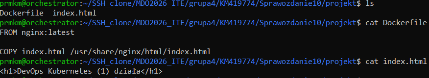

## Budowa obrazu Docker

```bash
docker build -t moja-apka:v1 .
```

Sprawdzenie dostępnych obrazów:

```bash
docker images
```

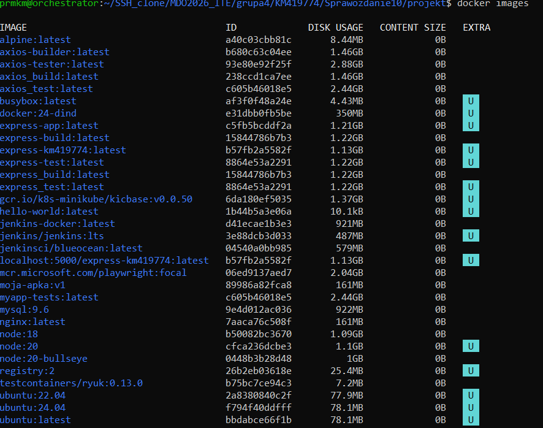

---

# Test działania kontenera Docker

Uruchomienie kontenera lokalnie:

```bash
docker run -d -p 8080:80 moja-apka:v1
```

Sprawdzenie działających kontenerów:

```bash
docker ps
```

Test działania aplikacji:

```bash
curl localhost:8080
```

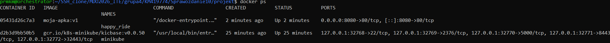

---

# Przygotowanie obrazu dla Minikube

Przełączono środowisko Docker na środowisko Minikube:

```bash
eval $(minikube docker-env)
```

Ponownie zbudowano obraz:

```bash
docker build -t moja-apka:v1 .
```

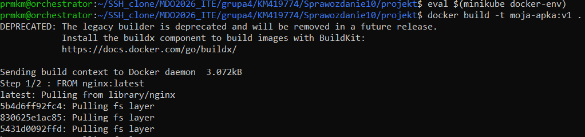

---

# Uruchomienie aplikacji w Kubernetes

Uruchomienie aplikacji jako Pod w Kubernetes:

```bash
kubectl run moja-apka \
--image=moja-apka:v1 \
--port=80 \
--labels app=moja-apka
```

Sprawdzenie podów:

```bash
kubectl get pods
```

Opis poda:

```bash
kubectl describe pod moja-apka
```

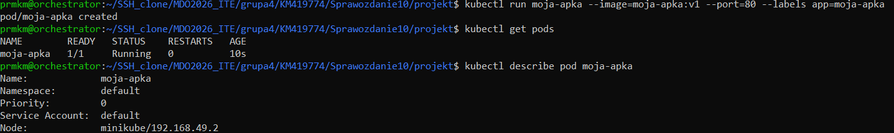

---

# Port-forward dla aplikacji

Wykonano przekierowanie portów:

```bash
kubectl port-forward pod/moja-apka 8080:80
```

Port-forward pozwala na dostęp do aplikacji działającej wewnątrz klastra Kubernetes.

---

# Eksport konfiguracji do YAML

Wyeksportowano konfigurację poda do pliku YAML:

```bash
kubectl get pod moja-apka -o yaml > moja-apka.yaml
```

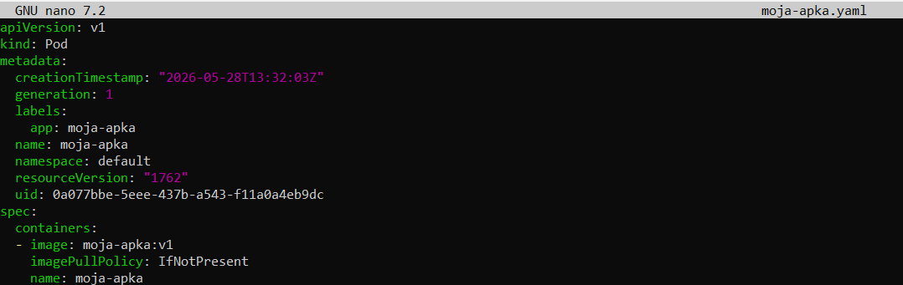

---

# Deployment Kubernetes

Utworzono plik `deployment.yaml`.

## deployment.yaml

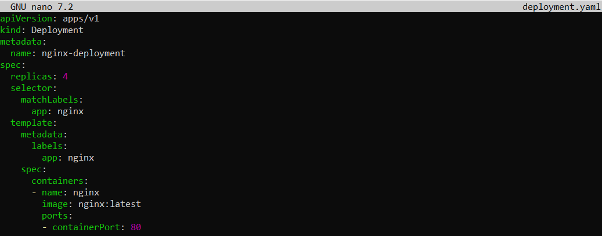

---

# Wdrożenie Deploymentu

Wdrożenie aplikacji:

```bash
kubectl apply -f deployment.yaml
```

Sprawdzenie deploymentów:

```bash
kubectl get deployments
```

Sprawdzenie podów:

```bash
kubectl get pods
```

Sprawdzenie rollout status:

```bash
kubectl rollout status deployment/nginx-deployment
```

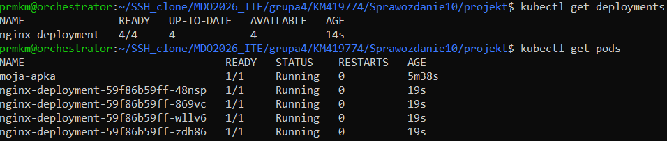

---

# Utworzenie Service

Wystawienie deploymentu jako usługi:

```bash
kubectl expose deployment nginx-deployment \
--type=ClusterIP \
--port=80
```

Sprawdzenie usług:

```bash
kubectl get services
```

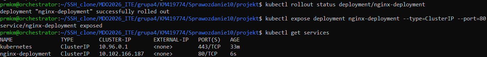

---

# Port-forward dla Service

Przekierowanie portu usługi:

```bash
kubectl port-forward service/nginx-deployment 8081:80
```

Mechanizm port-forward umożliwił dostęp do usługi działającej wewnątrz klastra Kubernetes.

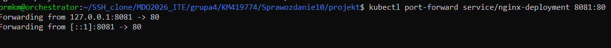

---
