# Laboratorium 11
# Wdrażanie na zarządzalne kontenery: Kubernetes (2)

## Autor

- Imię i nazwisko: Krzysztof Mazur
- Grupa: 4
- Data wykonania ćwiczenia: 3.06.2026

---

# Cel ćwiczenia

Celem ćwiczenia było zapoznanie się z mechanizmami aktualizacji wdrożeń w Kubernetes, zarządzaniem wersjami obrazów kontenerowych, skalowaniem wdrożeń, analizą historii wdrożeń oraz testowaniem różnych strategii deploymentu.

---

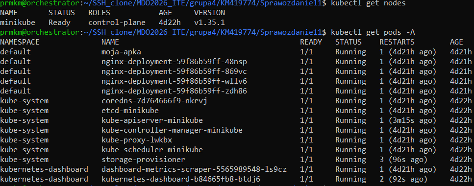

# 1. Przygotowanie nowych wersji obrazu

W poprzednim laboratorium przygotowano obraz aplikacji oparty o serwer Nginx wyświetlający własną stronę HTML.

W celu realizacji ćwiczenia przygotowano trzy wersje obrazu:

- `moja-apka:v1`
- `moja-apka:v2`
- `moja-apka:broken`

Wykorzystano lokalny rejestr obrazów Minikube.

## Przełączenie Dockera na środowisko Minikube

```bash
eval $(minikube docker-env)
```
---

## Budowa wersji v1

Plik `Dockerfile`:

```dockerfile
FROM nginx:latest

COPY index.html /usr/share/nginx/html/index.html
```

Budowa obrazu:

```bash
docker build -t moja-apka:v1 .
```

---

## Budowa wersji v2

Zmodyfikowano zawartość pliku `index.html`:

```html
<h1>Wersja 2</h1>
<h2>Lab 11 Kubernetes</h2>
```

Budowa nowej wersji obrazu:

```bash
docker build -t moja-apka:v2 .
```

---

## Budowa wersji błędnej (broken)

Utworzono osobny katalog zawierający plik:

```dockerfile
FROM alpine

CMD ["false"]
```

Polecenie:

```bash
docker build -t moja-apka:broken .
```

Obraz ten kończy działanie natychmiast po uruchomieniu, zwracając kod błędu 1.

---

# Publikacja obrazu w Docker Hub

W celu umożliwienia wykorzystania obrazów poza lokalnym środowiskiem Minikube możliwe jest opublikowanie ich w publicznym rejestrze Docker Hub.

Najpierw należy zalogować się do Docker Hub:

```bash
docker login
```

Następnie należy oznaczyć lokalny obraz nazwą repozytorium użytkownika:

```bash
docker tag moja-apka:v1 LOGIN_DOCKERHUB/moja-apka:v1
docker tag moja-apka:v2 LOGIN_DOCKERHUB/moja-apka:v2
docker tag moja-apka:broken LOGIN_DOCKERHUB/moja-apka:broken
```

Publikacja obrazów:

```bash
docker push LOGIN_DOCKERHUB/moja-apka:v1
docker push LOGIN_DOCKERHUB/moja-apka:v2
docker push LOGIN_DOCKERHUB/moja-apka:broken
```

Po opublikowaniu obrazu deployment może korzystać z obrazu znajdującego się w Docker Hub:

```yaml
containers:
- name: moja-apka
  image: LOGIN_DOCKERHUB/moja-apka:v2
```

W takim przypadku parametr:

```yaml
imagePullPolicy: Never
```

nie jest wymagany, ponieważ Kubernetes pobierze obraz z rejestru Docker Hub.

W ramach niniejszego laboratorium wykorzystano lokalny rejestr obrazów Minikube, jednak przedstawiono również sposób publikacji obrazów w Docker Hub.

---

## Weryfikacja dostępnych obrazów

```bash
docker images | grep moja-apka
```

Przykładowy wynik:

```text
moja-apka:broken
moja-apka:v1
moja-apka:v2
```

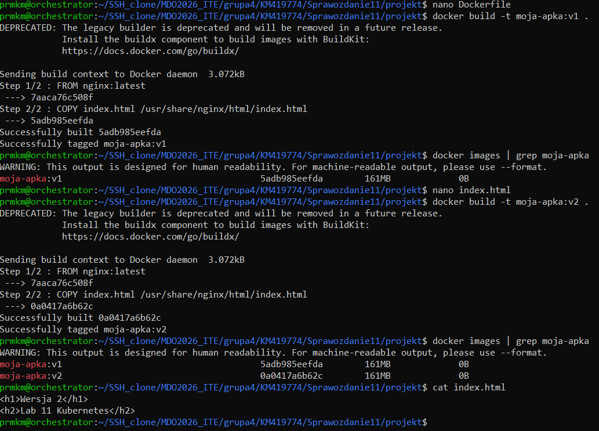

---

# 2. Aktualizacja deploymentu

Przygotowano plik wdrożeniowy Kubernetes.

Przykładowy deployment:

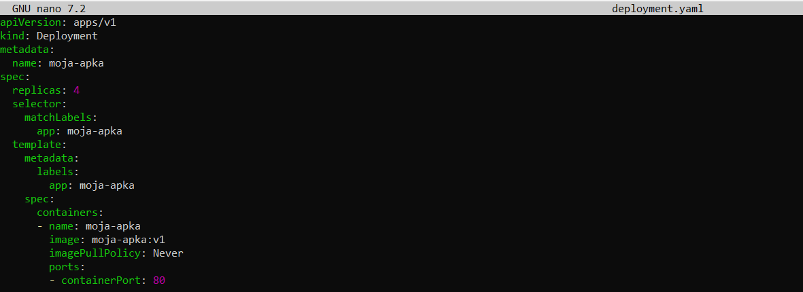


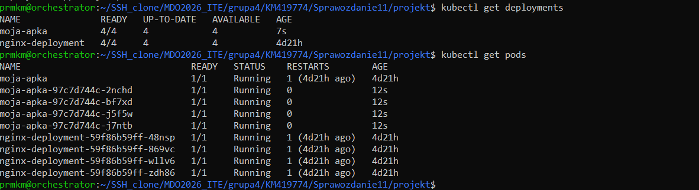

Deployment został zapisany w pliku YAML. W kolejnych etapach ćwiczenia modyfikowano liczbę replik oraz wersję wykorzystywanego obrazu kontenera, a następnie ponownie stosowano konfigurację za pomocą polecenia kubectl apply.

---

# 3. Skalowanie wdrożenia

## Zwiększenie liczby replik do 8

Zmodyfikowano:

```yaml
replicas: 8
```

Wdrożenie:

```bash
kubectl apply -f deployment.yaml
```

Kontrola:

```bash
kubectl get pods
```

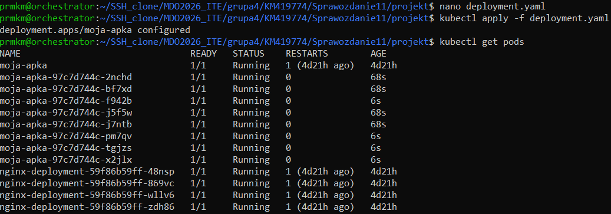

---

## Zmniejszenie liczby replik do 1

Zmodyfikowano:

```yaml
replicas: 1
```

Ponowne wdrożenie:

```bash
kubectl apply -f deployment.yaml
```

Kontrola:

```bash
kubectl get pods
```

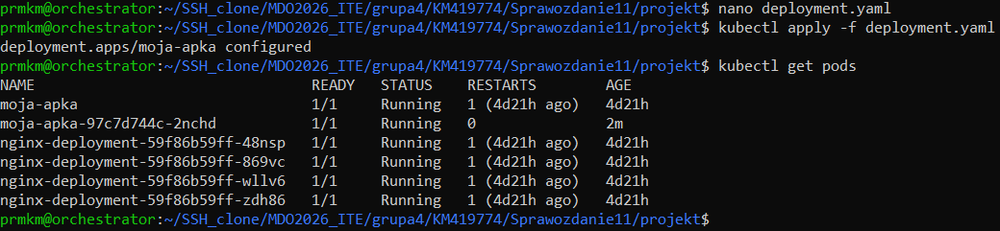

---

## Zmniejszenie liczby replik do 0

Zmodyfikowano:

```yaml
replicas: 0
```

Ponowne wdrożenie:

```bash
kubectl apply -f deployment.yaml
```

Kontrola:

```bash
kubectl get pods
```

---

## Ponowne skalowanie do 4 replik

Zmodyfikowano:

```yaml
replicas: 4
```

Ponowne wdrożenie:

```bash
kubectl apply -f deployment.yaml
```

Kontrola:

```bash
kubectl get pods
```

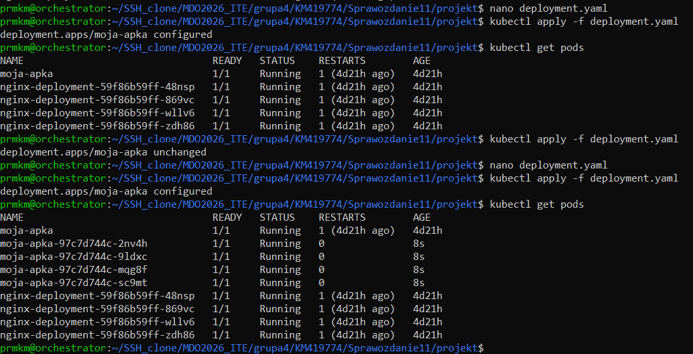

---

# 4. Aktualizacja wersji obrazu

## Przejście z v1 na v2

Zmodyfikowano deployment:

```yaml
image: moja-apka:v2
```

Wdrożenie:

```bash
kubectl apply -f deployment.yaml
```

Kontrola procesu:

```bash
kubectl rollout status deployment moja-apka
```

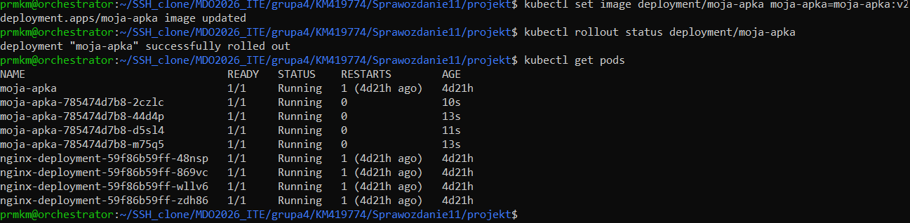

---

# 5. Historia wdrożeń

Wyświetlenie historii:

```bash
kubectl rollout history deployment moja-apka
```

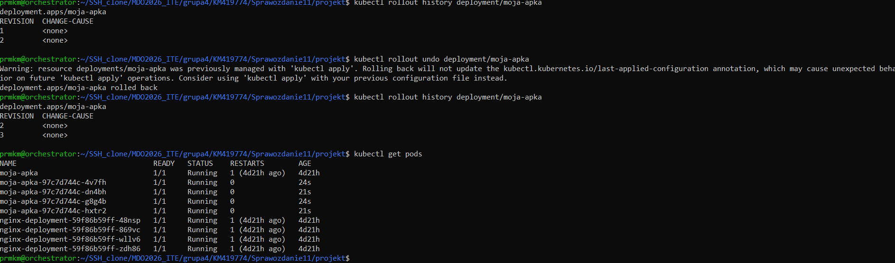

Historia deploymentu umożliwia prześledzenie zmian oraz szybki powrót do ostatniej poprawnie działającej wersji aplikacji.

---

# 6. Powrót do poprzedniej wersji

Przywrócenie poprzedniego deploymentu:

```bash
kubectl rollout undo deployment moja-apka
```

Kontrola:

```bash
kubectl get pods
```

oraz

```bash
kubectl rollout history deployment moja-apka
```


---

# 7. Wdrożenie wadliwego obrazu

Zmodyfikowano deployment:

```yaml
image: moja-apka:broken
```

Ponowne wdrożenie:

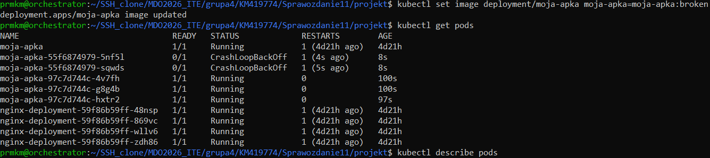

---

## Analiza błędnego poda

Szczegóły:

```bash
kubectl describe pods
```

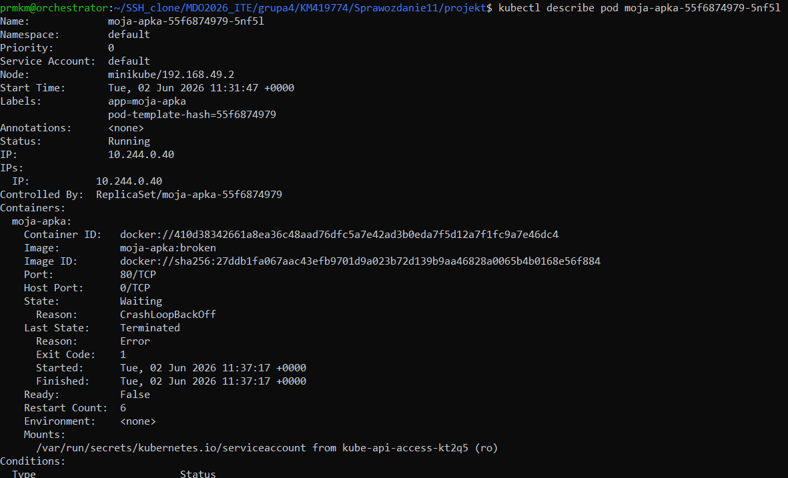

Oznacza to, że proces uruchamiany przez kontener zakończył się błędem.


---

# 8. Wycofanie błędnego wdrożenia

Przywrócenie poprzedniej wersji:

```bash
kubectl rollout undo deployment moja-apka
```

Kontrola:

```bash
kubectl get pods
```

Po rollbacku wszystkie pody powróciły do stanu:

```text
Running
```

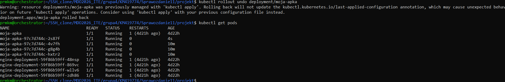

---

# 9. Skrypt kontrolujący wdrożenie

Przygotowano prosty skrypt Bash sprawdzający powodzenie wdrożenia przez maksymalnie 60 sekund.

Plik:

```bash
#!/bin/bash

timeout 60 kubectl rollout status deployment moja-apka
```

Nadanie uprawnień:

```bash
chmod +x check_deploy.sh
```

Uruchomienie:

```bash
./check_deploy.sh
```

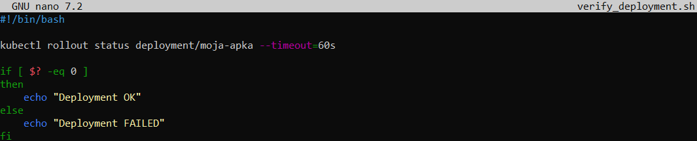

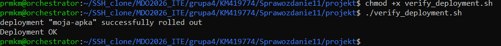

---

# 10. Strategie wdrożeń

## Recreate

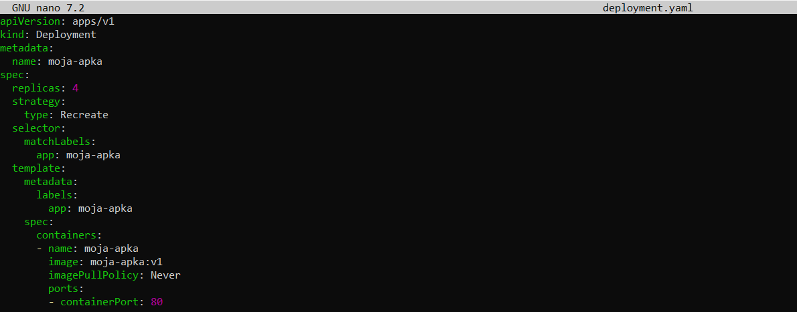

Charakterystyka:

- wszystkie stare pody są usuwane,
- następnie uruchamiane są nowe,
- występuje chwilowa niedostępność aplikacji.

---

## RollingUpdate

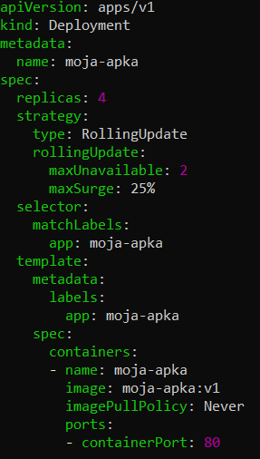

Charakterystyka:

- stopniowa wymiana podów,
- aplikacja pozostaje dostępna,
- wdrożenie przebiega bez pełnego zatrzymania usługi.

---

## Canary Deployment

Przygotowano osobny deployment wykorzystujący etykiety:

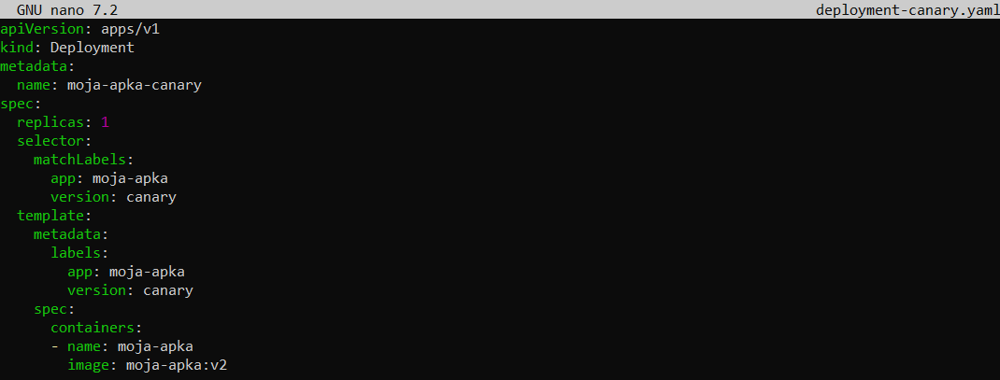

Charakterystyka:

- równoczesne działanie wersji stabilnej i testowej,
- możliwość sprawdzenia nowej wersji przed pełnym wdrożeniem.

---

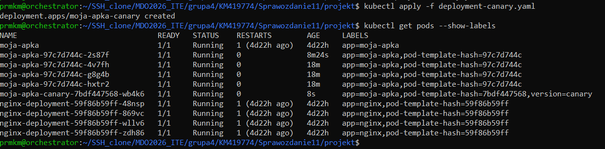

# 11. Wykorzystanie serwisów

Wyeksponowanie deploymentu:

```bash
kubectl expose deployment moja-apka \
--type=ClusterIP \
--port=80
```

Kontrola:

```bash
kubectl get svc
```

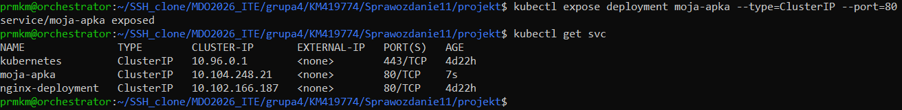

---

# Wnioski

Podczas laboratorium zapoznano się z mechanizmami zarządzania wdrożeniami w Kubernetes.

Przygotowano kilka wersji obrazu aplikacji, przeprowadzono aktualizacje deploymentów, skalowanie liczby replik, analizę błędnych wdrożeń oraz rollback do wcześniejszych wersji.

Przetestowano strategie wdrożeń Recreate oraz RollingUpdate, a także przeanalizowano zachowanie klastra podczas uruchamiania wadliwego obrazu prowadzącego do stanu CrashLoopBackOff.

Uzyskano praktyczne doświadczenie związane z zarządzaniem aplikacjami kontenerowymi w środowisku Kubernetes.