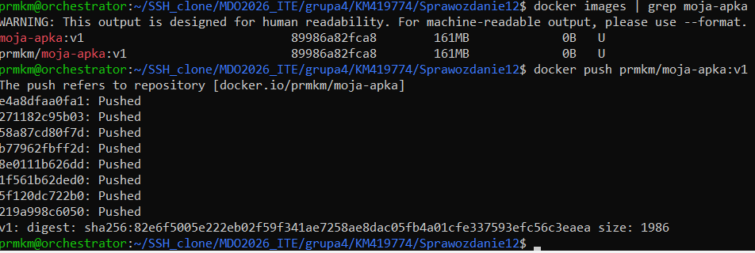
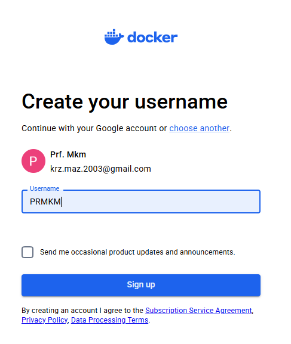
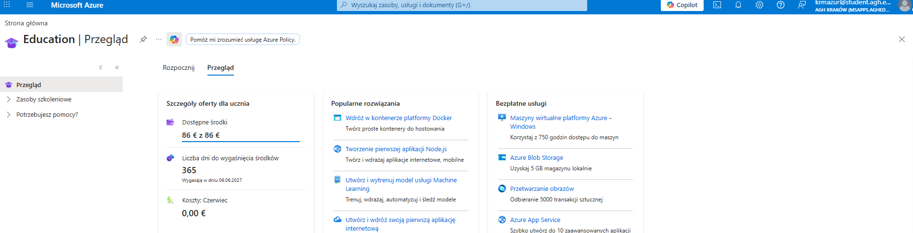
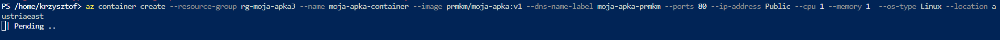
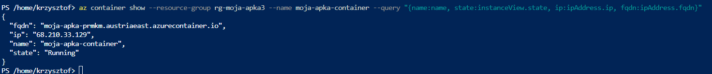
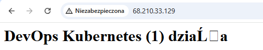
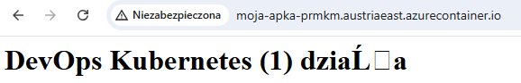
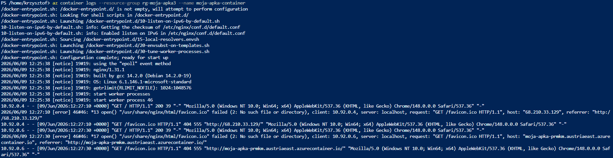
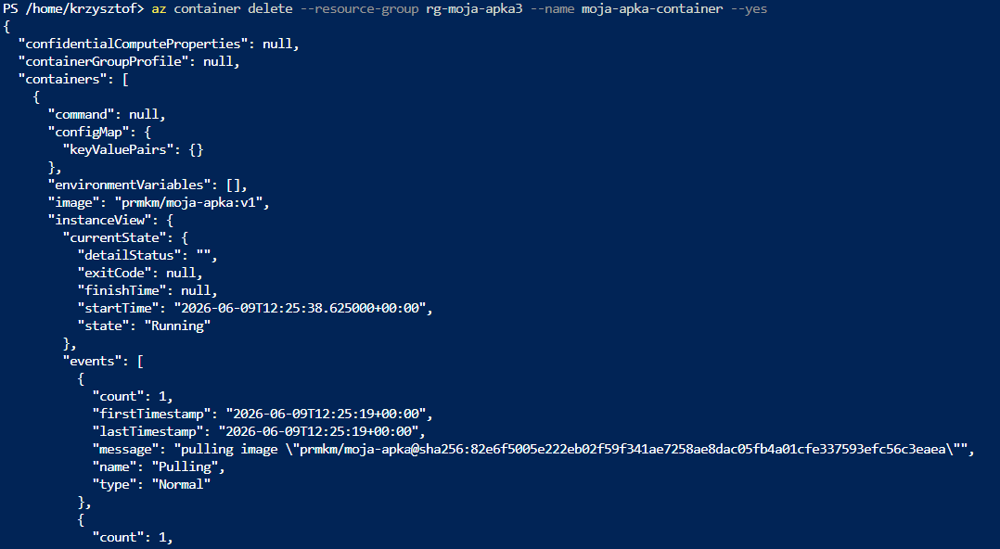
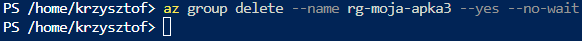

# Laboratorium 12
# Wdrażanie na zarządzalne kontenery w chmurze (Azure)

## Autor

- Imię i nazwisko: Krzysztof Mazur
- Grupa: 4
- Data wykonania ćwiczenia: 12.06.2026

---

# Cel ćwiczenia

Celem ćwiczenia było zapoznanie się z procesem wdrażania kontenerów w chmurze Microsoft Azure z wykorzystaniem usługi Azure Container Instances (ACI). W ramach laboratorium wykorzystano wcześniej przygotowany obraz aplikacji znajdujący się w serwisie Docker Hub, utworzono grupę zasobów (Resource Group), wdrożono kontener, zweryfikowano jego działanie oraz usunięto wszystkie utworzone zasoby.

---

# 1. Przygotowanie kontenera

W poprzednich laboratoriach przygotowano własny obraz kontenera oparty o serwer Nginx wyświetlający własną stronę HTML.

Przed rozpoczęciem wdrażania w chmurze zweryfikowano dostępność obrazu lokalnie.

Sprawdzenie obrazów:

```bash
docker images | grep moja-apka
```

Przykładowy wynik:

```text
moja-apka:v1
```



---

# 2. Publikacja obrazu w Docker Hub

Sprawdzono aktualnie zalogowanego użytkownika Docker Hub:

```bash
docker info | grep Username
```

Wynik:

```text
Username: prmkm
```

Następnie utworzono tag zgodny z nazwą repozytorium Docker Hub:

```bash
docker tag moja-apka:v1 prmkm/moja-apka:v1
```

Weryfikacja:

```bash
docker images | grep moja-apka
```


Publikacja obrazu:

```bash
docker push prmkm/moja-apka:v1
```

Po poprawnym przesłaniu obraz został zapisany w repozytorium Docker Hub.



---

# 3. Konfiguracja środowiska Azure

Do realizacji ćwiczenia wykorzystano konto Azure for Students uzyskane za pośrednictwem konta studenckiego AGH.

Po zalogowaniu uruchomiono usługę Azure Cloud Shell w trybie PowerShell.



---

# 4. Utworzenie Resource Group

Przed wdrożeniem kontenera utworzono własną grupę zasobów.

Polecenie:

```bash
az group create \
  --name rg-moja-apka3 \
  --location austriaeast
```

Po wykonaniu polecenia Azure utworzył nową grupę zasobów.

---

# 5. Rejestracja dostawcy usług Container Instances

Podczas pierwszych prób wdrożenia wystąpił błąd:

```text
MissingSubscriptionRegistration
```

Oznaczało to brak rejestracji dostawcy usług Azure Container Instances.

Wykonano polecenie:

```bash
az provider register \
  --namespace Microsoft.ContainerInstance
```

Następnie zweryfikowano status rejestracji:

```bash
az provider show \
  --namespace Microsoft.ContainerInstance \
  --query registrationState
```

Po zakończeniu rejestracji możliwe było wdrażanie kontenerów.

---

# 6. Wdrożenie kontenera w Azure

Do wdrożenia wykorzystano obraz znajdujący się w Docker Hub.

Polecenie:

```bash
az container create \
  --resource-group rg-moja-apka3 \
  --name moja-apka-container \
  --image prmkm/moja-apka:v1 \
  --dns-name-label moja-apka-prmkm \
  --ports 80 \
  --ip-address Public \
  --cpu 1 \
  --memory 1 \
  --os-type Linux \
  --location austriaeast
```

Po zakończeniu operacji kontener został uruchomiony poprawnie.

W statusie wdrożenia widoczne były informacje:

```text
provisioningState: Succeeded
state: Running
```



---

# 7. Weryfikacja działania kontenera

Pobrano informacje o wdrożonym kontenerze:

```bash
az container show \
  --resource-group rg-moja-apka3 \
  --name moja-apka-container \
  --query "{name:name, state:instanceView.state, ip:ipAddress.ip, fqdn:ipAddress.fqdn}"
```


---

# 8. Dostęp do usługi HTTP

Aplikacja była dostępna poprzez publiczny adres IP:

```text
http://68.210.33.129
```



oraz poprzez nazwę DNS:

```text
http://moja-apka-prmkm.austriaeast.azurecontainer.io
```

Po otwarciu adresu w przeglądarce wyświetlona została przygotowana wcześniej strona WWW.




---

# 9. Analiza logów kontenera

W celu pobrania logów wykonano polecenie:

```bash
az container logs \
  --resource-group rg-moja-apka3 \
  --name moja-apka-container
```

Wyświetlone zostały logi generowane przez uruchomiony kontener.



---

# 10. Usunięcie wdrożenia

Po zakończeniu testów usunięto uruchomiony kontener:

```bash
az container delete \
  --resource-group rg-moja-apka3 \
  --name moja-apka-container \
  --yes
```



Następnie usunięto całą grupę zasobów:

```bash
az group delete \
  --name rg-moja-apka3 \
  --yes \
  --no-wait
```



Usunięcie Resource Group powoduje automatyczne usunięcie wszystkich zasobów utworzonych w jej obrębie, co zapobiega niepotrzebnemu zużywaniu środków przyznanych w programie Azure for Students.

---

# Wnioski

Podczas laboratorium zapoznano się z procesem wdrażania kontenerów w środowisku Microsoft Azure.

Przygotowano oraz opublikowano własny obraz aplikacji w serwisie Docker Hub, utworzono grupę zasobów Azure, wdrożono kontener przy użyciu usługi Azure Container Instances oraz zweryfikowano jego działanie poprzez publiczny adres IP i nazwę DNS.

Dodatkowo przeanalizowano logi kontenera oraz poznano sposób zarządzania zasobami w chmurze. Na zakończenie wszystkie utworzone zasoby zostały usunięte w celu uniknięcia niepotrzebnego wykorzystania dostępnych środków w ramach programu Azure for Students.