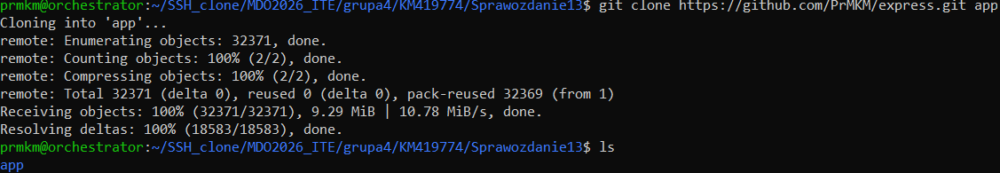
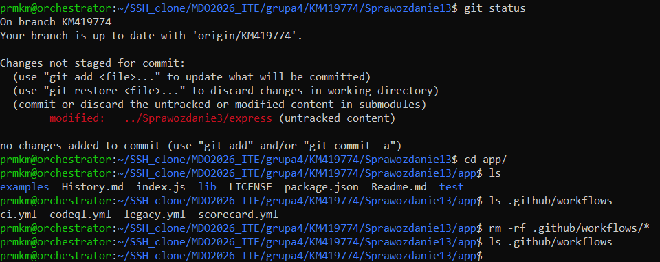
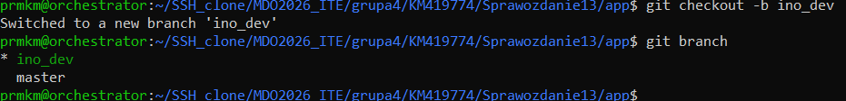
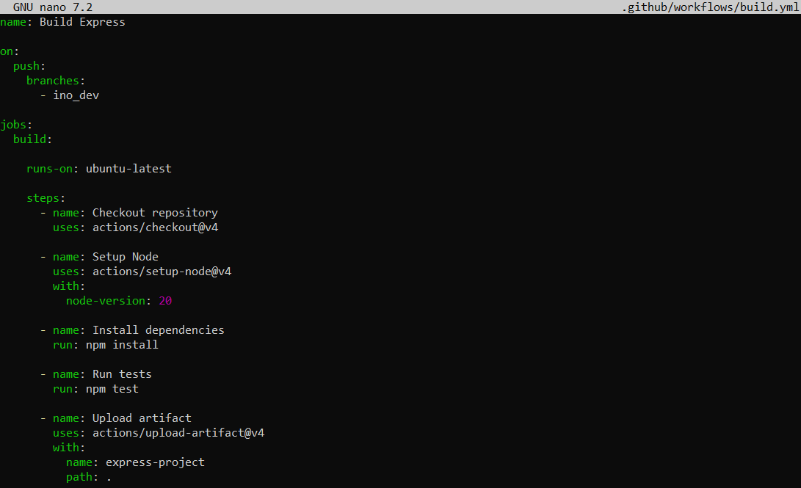
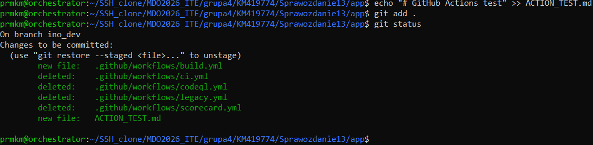
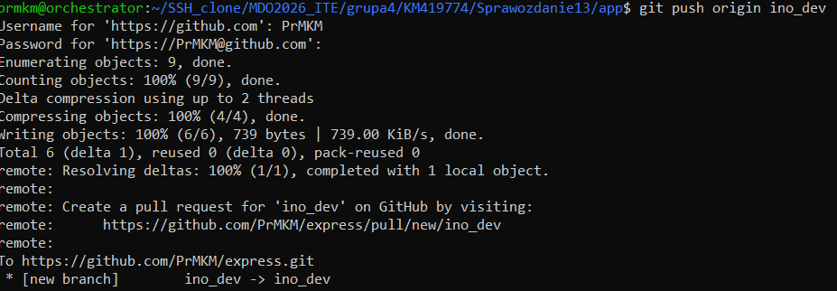
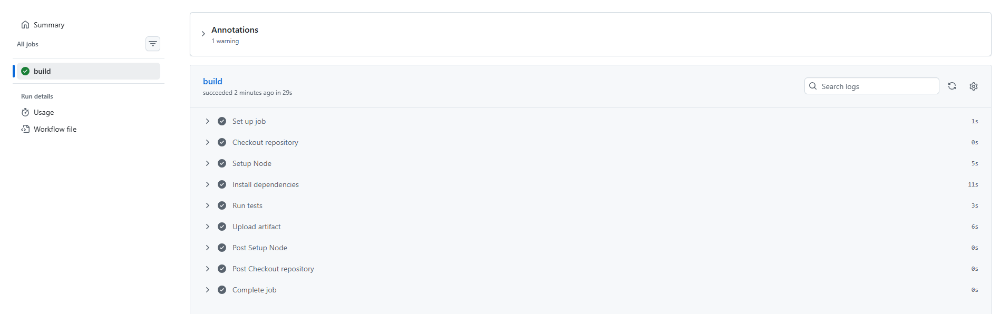
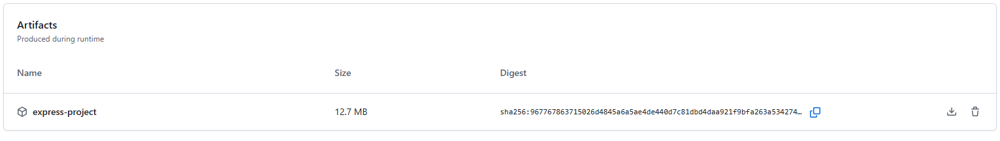

# Sprawozdanie 13 — Shift-left: GitHub Actions

## Autor

- Imię i nazwisko: Krzysztof Mazur
- Grupa: 4
- Data wykonania ćwiczenia: 19.06.2026

---

## Cel ćwiczenia

Celem ćwiczenia było zapoznanie się z koncepcją Shift-left oraz wykorzystanie GitHub Actions do automatyzacji procesu CI (Continuous Integration).

W ramach zadania przygotowano workflow, który automatycznie wykonuje proces budowania i testowania aplikacji po zmianach w dedykowanej gałęzi `ino_dev`.

---

## Przygotowanie środowiska

Ćwiczenie zostało wykonane w repozytorium przedmiotowym. Repozytorium z aplikacją Express zostało pobrane jako osobny fork projektu.

Utworzono folder ćwiczenia:

```bash
mkdir shift-left-github-actions
cd shift-left-github-actions
```

Następnie pobrano fork aplikacji Express:

```bash
git clone https://github.com/PrMKM/express.git app
```

Folder `app/` został wykluczony z repozytorium przedmiotowego poprzez wpis w `.gitignore`.



---

## Konfiguracja projektu

Przejście do katalogu aplikacji:

```bash
cd app
```

Sprawdzenie zawartości:

```bash
ls
```



---

## Utworzenie gałęzi ino_dev

Utworzono dedykowaną gałąź:

```bash
git checkout -b ino_dev
```

Sprawdzenie aktywnej gałęzi:

```bash
git branch
```



---

## Usunięcie istniejących workflow

Sprawdzono obecność istniejących akcji:

```bash
ls .github/workflows
```

Jeżeli znajdowały się tam wcześniejsze workflow, zostały usunięte:

```bash
rm -rf .github/workflows/*
```

---

## Utworzenie GitHub Actions

Utworzono plik:

```text
.github/workflows/build.yml
```


---

## Opis działania workflow

Workflow uruchamia się automatycznie po wykonaniu `push` do gałęzi:

```text
ino_dev
```

Po uruchomieniu wykonywane są kroki:

1. Pobranie kodu repozytorium.
2. Przygotowanie środowiska Node.js.
3. Instalacja zależności.
4. Uruchomienie testów.
5. Zapisanie artefaktu.

---

## Uruchomienie pipeline

Dodano testową zmianę:

```bash
echo "# GitHub Actions test" >> ACTION_TEST.md
```

Następnie wykonano commit:

```bash
git add .
git commit -m "Add GitHub Actions build pipeline"
```



Wysłanie zmian:

```bash
git push origin ino_dev
```



---

## Weryfikacja GitHub Actions

Po wykonaniu push sprawdzono zakładkę:

```text
GitHub repository → Actions
```

Workflow został automatycznie uruchomiony.

---

## Wynik działania

Pipeline zakończył się poprawnie.

Sprawdzono:

- uruchomienie workflow,
- instalację zależności,
- wykonanie testów,
- utworzenie artefaktu.



---

## Artefakt

Po zakończeniu działania akcji został utworzony artefakt:

```text
express-project
```



---

## Wnioski

GitHub Actions umożliwia automatyzację procesu CI/CD poprzez wykonywanie zdefiniowanych workflow po określonych zdarzeniach.

Wykorzystanie podejścia Shift-left pozwala wykrywać problemy wcześniej, jeszcze przed wdrożeniem aplikacji.

W ramach ćwiczenia przygotowano pipeline uruchamiany po zmianach w gałęzi `ino_dev`, który wykonuje testy oraz zapisuje artefakt.