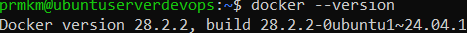
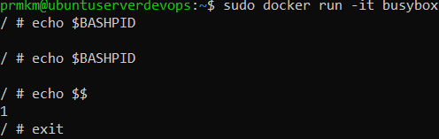
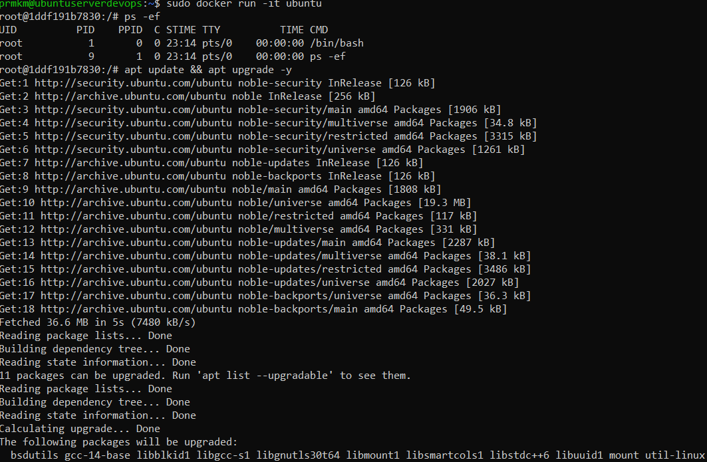
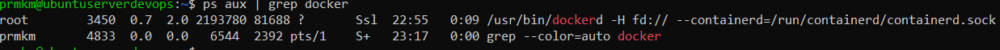
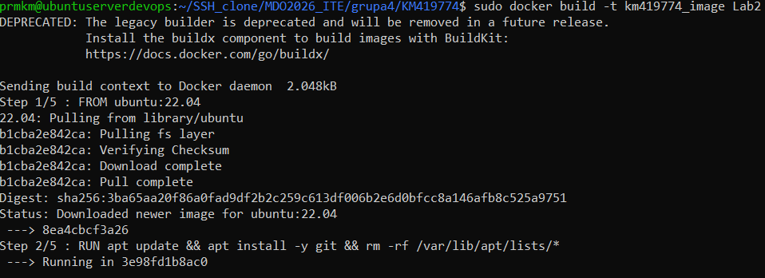
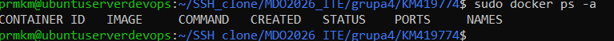
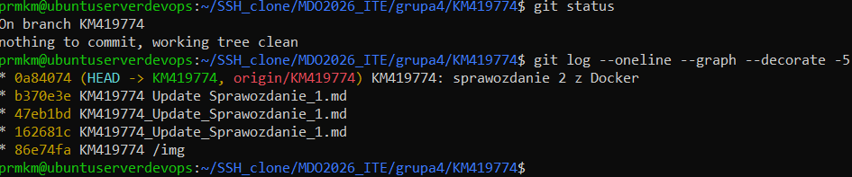

# Sprawozdanie 2
## Krzysztof Mazur KM419774
### Docker – instalacja i podstawowa praca z kontenerami

---

## Środowisko

Ćwiczenie wykonano w następującym środowisku:

- System hosta: Windows
- Maszyna wirtualna: Ubuntu Server
- Hypervisor: VirtualBox
- Dostęp do maszyny: SSH
- Repozytorium: GitHub

---

## Instalacja Dockera

Zainstalowano Dockera z repozytorium systemowego dystrybucji.

```bash
sudo apt update
sudo apt install docker.io -y
sudo systemctl enable --now docker
docker --version
```


```bash
sudo systemctl status docker
```


Uruchomiono testowe kontenery z obrazów hello-world, busybox oraz ubuntu.

```bash
sudo docker run hello-world
sudo docker run busybox echo "Hello BusyBox"
sudo docker run ubuntu uname -a
```


## Praca interaktywna w kontenerach

Uruchomiono kontenery w trybie interaktywnym oraz wykonano podstawowe polecenia systemowe.

BusyBox
```bash
sudo docker run -it busybox
ps
ls
exit
```
Ubuntu
```bash
sudo docker run -it ubuntu
ps
ls
exit
```


## Sprawdzenie obrazów i kontenerów

Zweryfikowano rozmiary obrazów oraz listę uruchomionych i zakończonych kontenerów.

```bash
sudo docker images
sudo docker ps -a
echo $?
```


## PID w kontenerze BusyBox

Uruchomiono kontener BusyBox i sprawdzono identyfikator procesu.

```bash
sudo docker run -it busybox
echo $BASHPID
echo $$
exit
```



## System w kontenerze Ubuntu
Uruchomiono system w kontenerze oraz sprawdzono PID1 i procesy.

```bash
sudo docker run -it ubuntu
ps -ef
apt update && apt upgrade -y
exit
```



Na hoście zweryfikowano procesy Dockera

```bash
ps aux | grep docker
```



## Własny obraz Docker
Utworzono plik Dockerfile bazujący na obrazie Ubuntu, instalujący Git oraz klonujący repozytorium przedmiotowe.
```
nano Doskerfile
```


## Budowa i uruchomienie własnego obrazu
Zbudowano obraz oraz uruchomiono kontener w trybie interaktywnym.

```bash
sudo docker build -t km419774_image Lab2/
sudo docker run -it km419774_image
ls /home/devops/MDO2026_ITE
```




Zmieniono nazwę folderu Lab2 na Sprawozdanie2
```bash
mv Lab2 Sprawozdanie2
```

## Zarządzanie kontenerami i obrazami
Wyświetlono listę kontenerów, a następnie usunięto zakończone kontenery oraz obrazy.
```bash
sudo docker ps
sudo docker ps -a
sudo docker rm $(docker ps -a -q)
sudo docker rmi km419774_image
sudo docker image prune -a
```




Po wykonianiu commita sprawdzono status.


