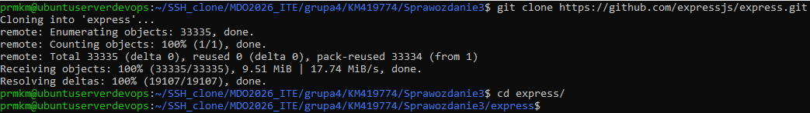
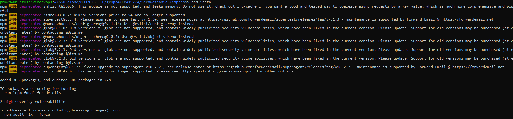
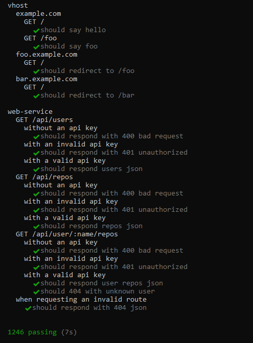
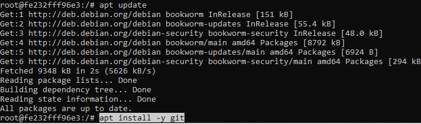
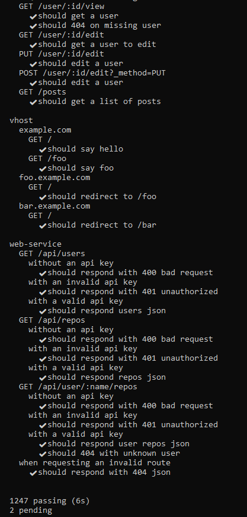
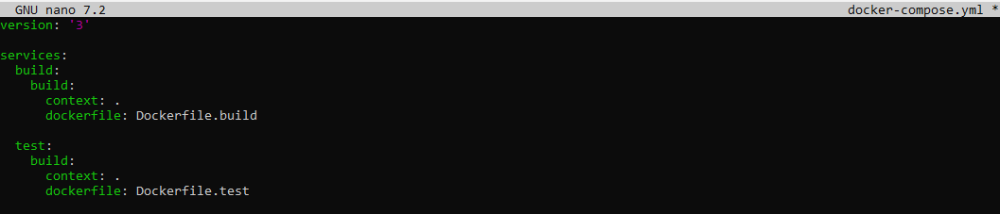
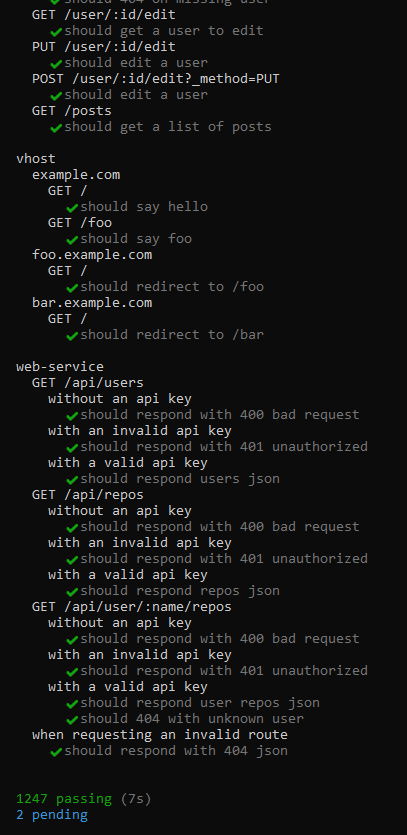

# Sprawozdanie 3
## Cel ćwiczenia
### Krzysztof Mazur ITE
Celem ćwiczenia było zbudowanie oprogramowania w powtarzalnym środowisku CI z wykorzystaniem kontenerów Docker, tak aby proces build oraz test był przenośny pomiędzy różnymi systemami operacyjnymi.

Do realizacji zadania wykorzystano repozytorium frameworka backendowego: https://github.com/expressjs/express.git.

---

## Budowanie aplikacji lokalnie

### Klonowanie repozytorium

```bash
git clone https://github.com/expressjs/express.git
cd express
```

### Instalacja środowiska npm
```bash
sudo apt update
sudo apt install -y nodejs npm
```

### Weryfikacja wersji
```bash
node -v
npm -v
```

### Instalacja zależności projektu oraz uruchomienie testów
```bash
npm install
npm test
```
Instalacja:

Testy:

## Build i test w kontenerze
### Uruchomienie kontenera Node
```bash
docker run -it node:20 bash
```

### Instalacja git w kontenerze
```bash
apt update
apt install -y git
```
Wewnątrz kontenera:

### Klonowanie repozytorium w kontenerze
```bash
git clone https://github.com/expressjs/express.git
cd express
```


### Instalacja zależności oraz testy
```bash
npm install
npm test
exit
```
Testy w kontenerze:

Testy zakończyły się powodzeniem, co potwierdza powtarzalność procesu build w izolowanym środowisku

## Automatyzacja build
### Utworzenie pliku
```bash
nano Dockerfile.build
```

### Budowa obrazu
```bash
docker build -f Dockerfile.build -t express-build .
```

Wyniki testów (sukces):

### Automatyzacja testów
```bash
nano Dockerfile.test
```

### Budowa obrazu oraz uruchamianie kontenera

```bash
docker build -f Dockerfile.test -t express-test .
docker run --rm express-test
```

Wyniki testów:

## Docker Compose

### Utworzenie pliku
```bash
nano docker-compose.yml
```

### Uruchomienie
```bash
docker compose build
docker compose run test
```

Wyniki testów przy pełnej automatyzacji procesu:

## Dyskusja

Czy Express nadaje się do wdrażania jako kontener?

Tak. Express jest frameworkiem backendowym Node.js, dlatego może zostać uruchomiony jako aplikacja serwerowa w kontenerze Docker.

Finalny obraz mógłby uruchamiać aplikację poleceniem:
```bash
node app.js
```
Czy należy usuwać artefakty builda?
Tak. W praktyce stosuje się podejście:
```bash
builder image -> runtime image
```
czyli multi-stage Docker build, w którym finalny obraz zawiera jedynie niezbędne pliki runtime.

Czy Express można dystrybuować jako pakiet?

Tak. Express jest dystrybuowany jako pakiet npm:
```bash
npm install express
```
Czy można stworzyć trzeci kontener (deploy)?

Tak. Możliwe jest utworzenie np.:
```bash
Dockerfile.release
```
który realizowałby: build projektu, testy, publikację pakietu