# DevOps Lab 4  
## Woluminy, sieci kontenerowe oraz uruchomienie Jenkins

### Krzysztof Mazur ITE

### Cel ćwiczenia

Celem ćwiczenia było zapoznanie się z dodatkowymi mechanizmami konteneryzacji:

- woluminami Docker
- sieciami kontenerowymi
- komunikacją między kontenerami
- uruchomieniem usługi SSH w kontenerze
- instalacją instancji Jenkins z wykorzystaniem Docker-in-Docker

---

## Zachowywanie stanu między kontenerami

### Utworzenie woluminów


```bash
docker volume create express_input
docker volume create express_output
docker volume ls
```
- Użyto kontenera pomocniczego alpine
- Zamontowano wolumin express_input
- Repozytorium zostało sklonowane bezpośrednio do woluminu

Kod nie znajdował się w kontenerze - znajdował się w woluminie, dzięki czemu był dostępny dla innych kontenerów.

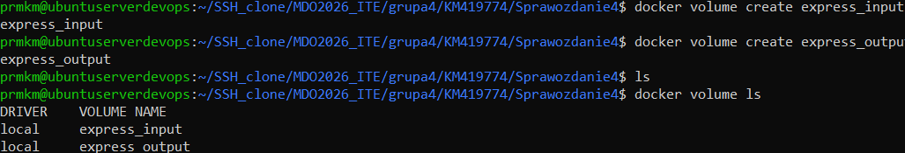

Klonowanie repozytorium na wolumin wejściowy
```bash
docker run --rm \
  -v express_input:/data \
  alpine \
  sh -c "apk add git && git clone https://github.com/expressjs/express.git /data/express"
  ```


Uruchomienie kontenera builder
```bash
docker run -it \
  -v express_input:/input \
  -v express_output:/output \
  node:20 bash
```

```bash
apt update
apt install -y git

cd /input
git clone https://github.com/expressjs/express.git

cd express
npm install

cp -r node_modules /output/
```


Artefakty builda zostały zapisane na woluminie wyjściowym.

## Sieci kontenerowe i pomiar przepustowości
Utworzenie sieci
```bash
docker network create labnet
```


Serwer iperf

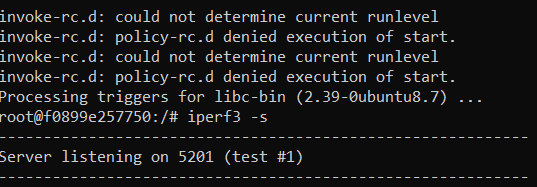

```bash
docker run -it --name iperf_server --network labnet ubuntu bash
```

W kontenerze:
```bash
apt update
apt install -y iperf3 iproute2
ip a
iperf3 -s
```

Klient iperf
```bash
docker run -it --name iperf_client --network labnet ubuntu bash
```

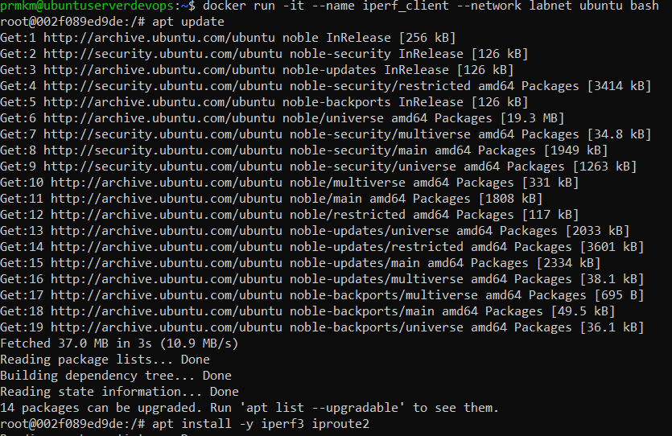

W kontenerze:
```bash
apt update
apt install -y iperf3 iproute2
ip a
iperf3 -c 172.20.0.2
iperf3 -c iperf_server
```
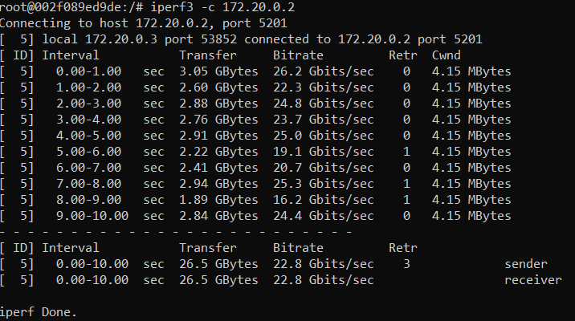

Zbadano przepustowość komunikacji między kontenerami.

Połączenie z hosta
```bash
docker rm iperf_server

docker run -it \
  --name iperf_server \
  --network labnet \
  -p 5201:5201 \
  ubuntu bash
```

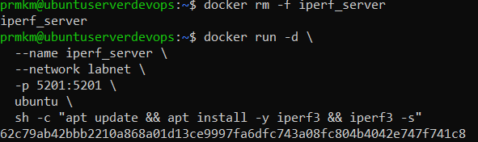

W kontenerze:
```bash
apt update
apt install -y iperf3
iperf3 -s
```
Na hoście:
```bash
iperf3 -c localhost
iperf3 -c 172.20.0.2
```

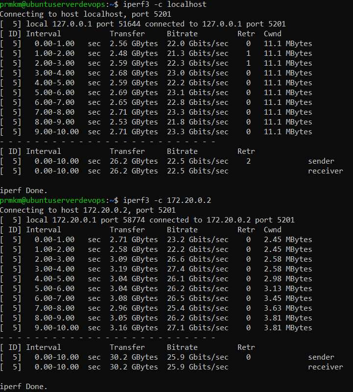

## Usługa SSH w kontenerze
```bash
docker run -it --name ssh_lab -p 2222:22 ubuntu bash
```
W kontenerze:
```bash
apt update
apt install -y openssh-server
passwd
service ssh start
```

Na hoście:
```bash
ssh root@localhost -p 2222
```


Zalety:

- możliwość debugowania kontenera
- dostęp administracyjny
- integracja z legacy systemami

Wady:

- zwiększona powierzchnia ataku
- odejście od idei immutable container
- konieczność zarządzania użytkownikami i hasłami

## Instalacja Jenkins

Wolumin i sieć
```bash
docker volume create jenkins_home
docker network create jenkins
```
Uruchomienie Docker-in-Docker
```bash
docker run -d --name jenkins-dind \
  --network jenkins \
  --privileged \
  docker:24-dind
```

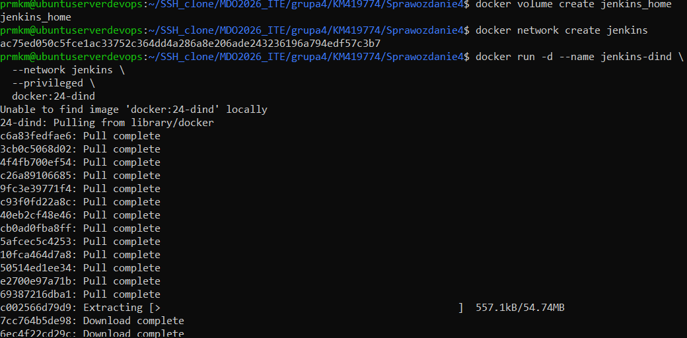

Sprawdzenie:
```bash
docker ps
```
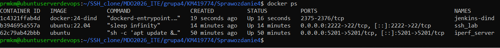

Uruchomienie Jenkins
```bash
docker run -d --name jenkins \
  --network jenkins \
  -p 8080:8080 -p 50000:50000 \
  -v jenkins_home:/var/jenkins_home \
  -e DOCKER_HOST=tcp://jenkins-dind:2375 \
  jenkins/jenkins:lts
```
Sprawdzenie:
```bash
docker ps
docker logs -f jenkins
docker exec -it jenkins bash
```
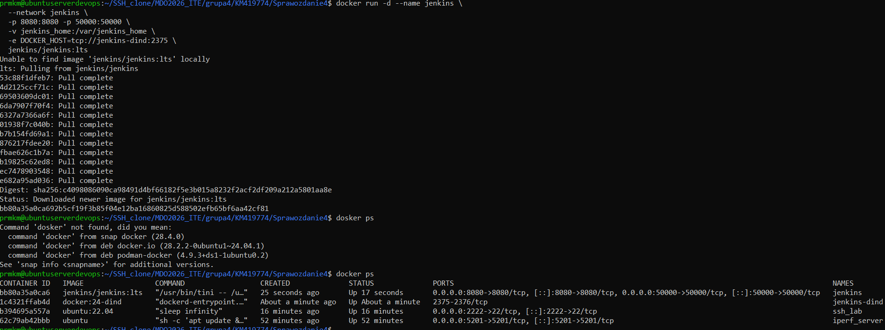
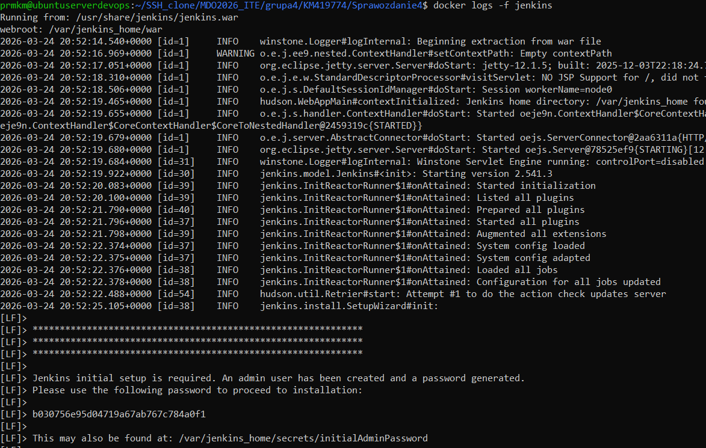

Po uruchomieniu dostęp do panelu Jenkins uzyskano przez przeglądarkę:

http://192.168.1.104:8080

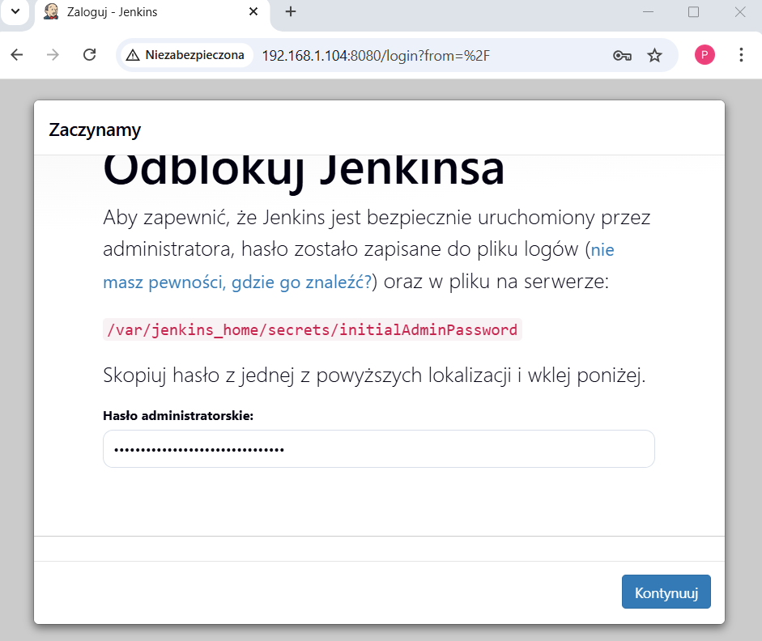
