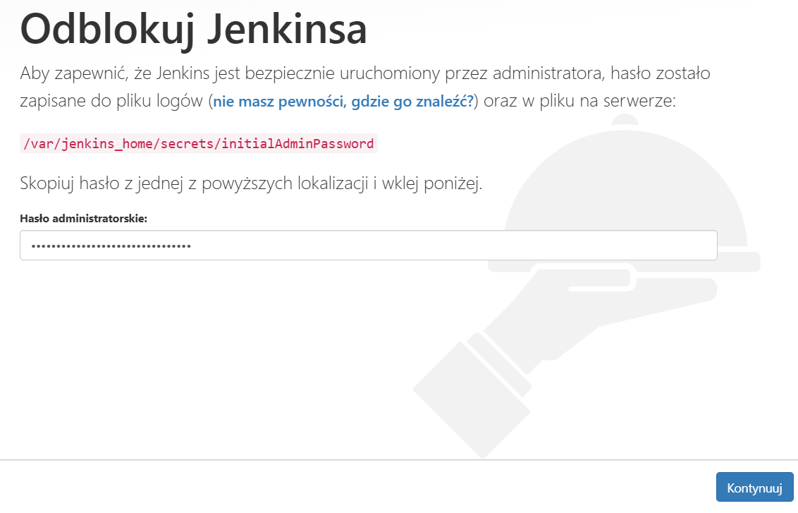
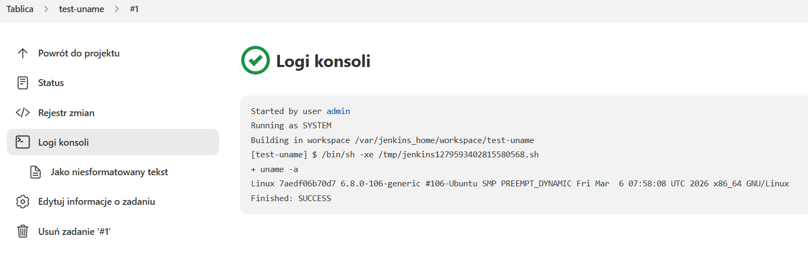
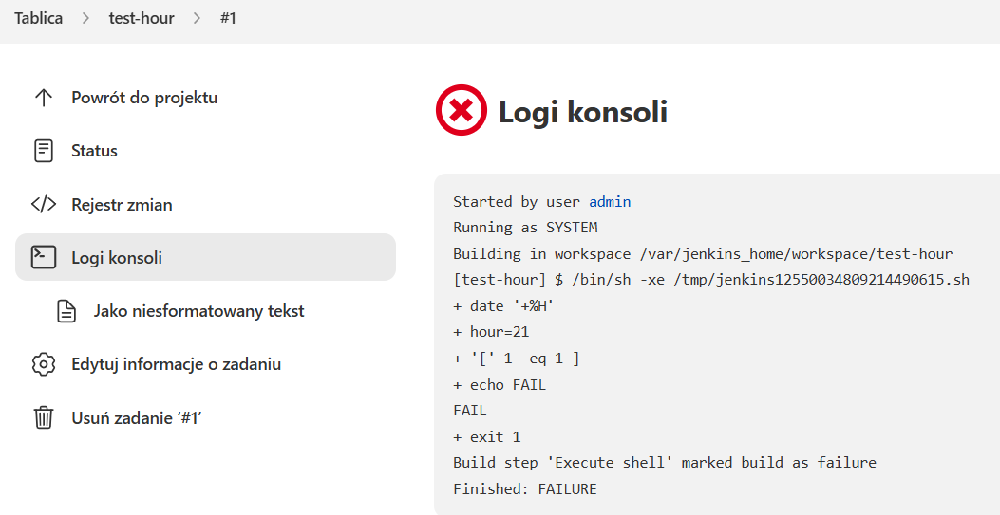
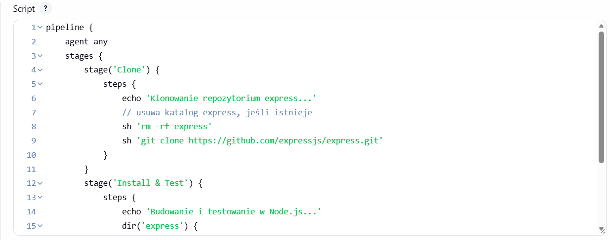

# Sprawozdanie 5 – Jenkins Pipeline z Node.js i Express

## Cel ćwiczenia
Celem było skonfigurowanie **Jenkins Pipeline**, który:  
- Klonuje repozytorium (użyłem repozytorium Express)  
- Instaluje zależności Node.js (`npm install`)  
- Uruchamia testy (`npm test`) w kontenerze Node.js  

---

## Środowisko
- System: Ubuntu Server 22.04 (host)  
- Kontener Jenkins: `jenkins/jenkins:lts`  
- Docker w kontenerze hosta: Node.js 20  

---

## Kroki wykonania

### 1. Przygotowanie Dockera
```bash
# Tworzenie sieci dla Jenkins DIND
docker network create jenkins
docker volume create jenkins-home

# Uruchomienie kontenera Docker-in-Docker
docker run -d --name jenkins-dind \
  --network jenkins \
  --privileged \
  docker:24-dind

# Uruchomienie kontenera Jenkins w tej samej sieci
docker run -d --name jenkins \
  --network jenkins \
  -p 8080:8080 \
  -v jenkins_home:/var/jenkins_home \
  jenkins/jenkins:lts
  ```


### 2.Logowanie do kontenera Jenkins
```bash
docker exec -it jenkins bash
```

### 3.Instalacja Node.js w kontenerze Jenkins
```bash
# Aktualizacja pakietów i instalacja curl
apt update && apt install -y curl

# Pobranie i przygotowanie Node.js 20
curl -fsSL https://deb.nodesource.com/setup_20.x | bash -

# Instalacja Node.js
apt install -y nodejs
```

### 4.Stworzenie użytkownika w Jenkins
Stworzenie użytkownika z uprawnieniami admina




### 5.Stowrzenie prostego zadania, oraz pipelinu
Proste zadanie zakończone sukcesem

Proste zadanie zakończone niepowodzeniem

Pipeline (Jenkinsfile)
```bash
pipeline {
    agent any
    stages {
        stage('Clone') {
            steps {
                sh 'rm -rf express'        // czyścimy katalog przed klonowaniem
                sh 'git clone https://github.com/expressjs/express.git'
            }
        }
        stage('Install & Test') {
            steps {
                echo 'Budowanie i testowanie w kontenerze'
                sh 'docker run --rm -v $PWD/express:/app -w /app node:20 bash -c "npm install && npm test"'
            }
        }
    }
}
```

## Wynik końcowy
