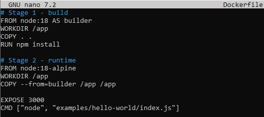
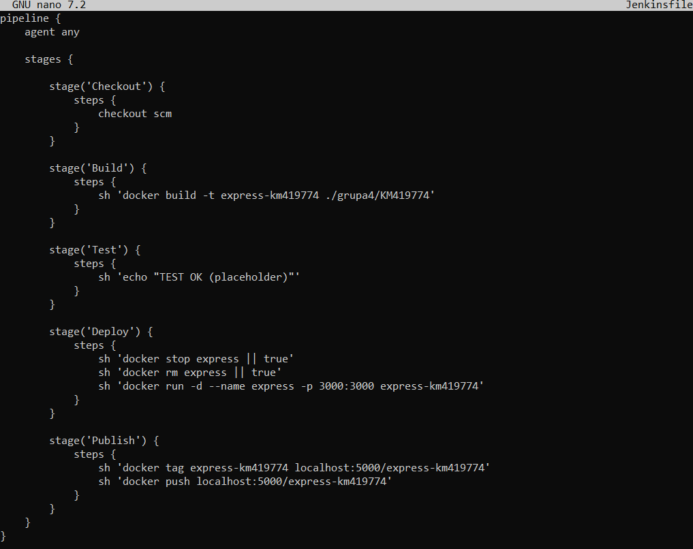
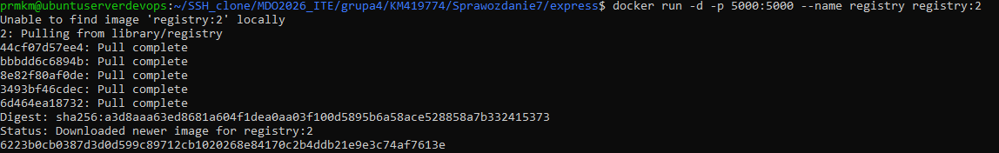
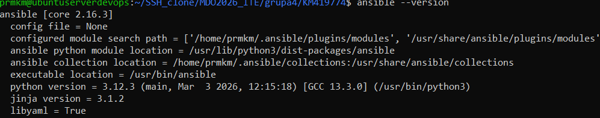
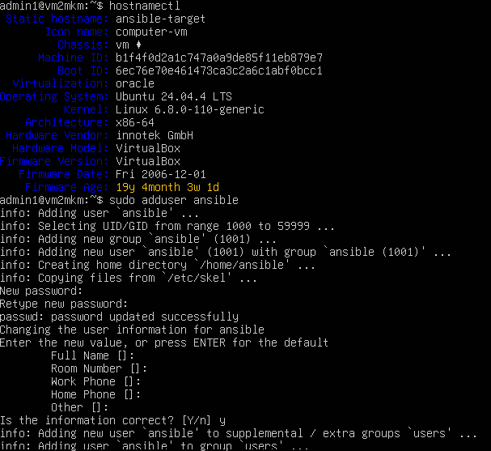
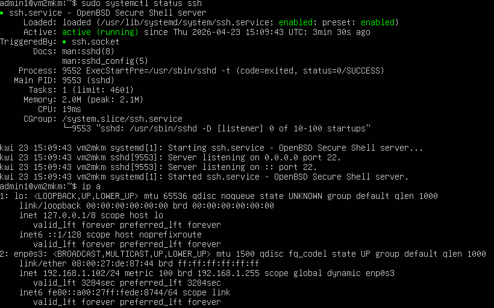
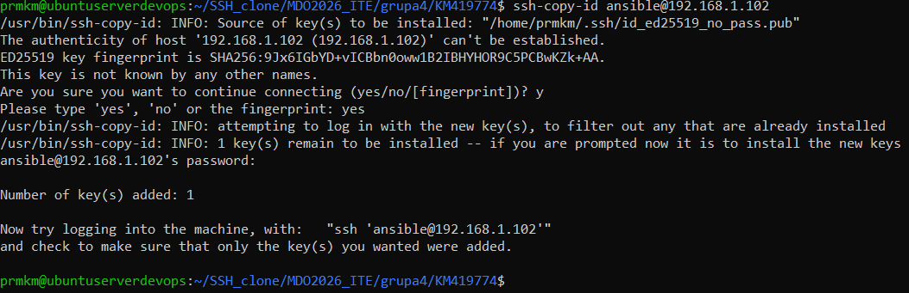
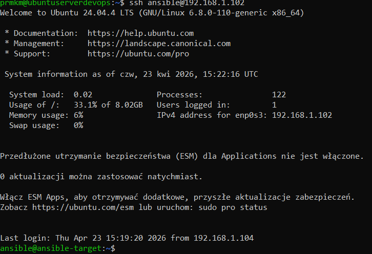
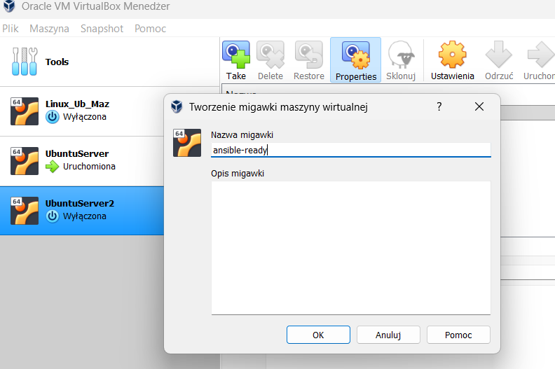

# Sprawozdanie – CI/CD (Docker + Jenkins) oraz przygotowanie środowiska pod Ansible

## 1. Cel ćwiczenia

Celem ćwiczenia było:
- przygotowanie aplikacji Express do uruchomienia w Dockerze,
- stworzenie pipeline CI/CD w Jenkinsie,
- automatyzacja procesu build - test - deploy - publish,
- przygotowanie środowiska pod Ansible.

---

## 2. Przygotowanie aplikacji

Skopiowanie aplikacji Express:

cp -r Sprawozdanie3/express/* app/

## 3. Docker – budowa i uruchomienie

Budowa obrazu:

docker build -t express-km419774 ./grupa4/KM419774

Uruchomienie kontenera:

docker run -d --name express -p 3000:3000 express-km419774

Zatrzymanie i usunięcie kontenera:

docker stop express || true
docker rm express || true

---
## 4. Jenkins – konfiguracja

Pipeline:
- repozytorium GitHub
- branch: KM419774
- Script Path: grupa4/KM419774/Jenkinsfile

Konfiguracja w UI Jenkinsa

---

## 5. Jenkinsfile (pipeline)

---
## 6. Rejestr Docker

Uruchomienie rejestru:

docker run -d -p 5000:5000 --name registry registry:2

Publikacja obrazu:

docker tag express-km419774 localhost:5000/express-km419774
docker push localhost:5000/express-km419774

---

## 7. Jenkins + Docker (konfiguracja)

Uruchomienie kontenera Jenkins z dostępem do Dockera:

docker run -d \
  --name jenkins \
  -p 8080:8080 -p 50000:50000 \
  -v /var/run/docker.sock:/var/run/docker.sock \
  -v /usr/bin/docker:/usr/bin/docker \
  -v jenkins_home:/var/jenkins_home \
  jenkins/jenkins:lts

Wynik działania pipelinu

---
---
## 8. Przygotowanie środowiska pod Ansible

### Instalacja Ansible

sudo apt update
sudo apt install -y ansible

---

### Instalacja SSH i narzędzi (na drugiej maszynie)

sudo apt update
sudo apt install -y openssh-server tar

---

### Ustawienie hostname

sudo hostnamectl set-hostname ansible-target
hostnamectl
---

### Utworzenie użytkownika

sudo adduser ansible
sudo usermod -aG sudo ansible

---

### Generowanie klucza SSH (na głównej maszynie)

ssh-keygen

(alternatywnie bez hasła)

ssh-keygen -t ed25519 -f ~/.ssh/id_ed25519_no_pass -N ""

---

### Kopiowanie klucza

ssh-copy-id ansible@192.168.1.102

---

### Test połączenia

ssh ansible@192.168.1.102

---

## 9. Migawka maszyny

Snapshot wykonuje się w narzędziu do VM:

- VirtualBox - Migawka - Utwórz migawkę

---

---

## 10. Definition of Done – weryfikacja procesu CI/CD

Proces CI/CD uznaje się za poprawny, jeśli na jego końcu powstaje artefakt możliwy do wdrożenia (deployable).

### Czy obraz może być pobrany i uruchomiony niezależnie?

Tak.  
Obraz został opublikowany w lokalnym rejestrze Docker:

docker pull localhost:5000/express-km419774

Może zostać uruchomiony na dowolnej maszynie z Dockerem:

docker run -d -p 3000:3000 localhost:5000/express-km419774

Nie wymaga modyfikacji – jedynie standardowego środowiska Docker.

---

### Czy artefakt z pipeline działa na innej maszynie?

Tak.  
Pipeline buduje kompletny obraz Docker zawierający:
- aplikację Express,
- zależności (`npm install`),
- konfigurację uruchomienia.

Dzięki temu artefakt jest samowystarczalny i może zostać uruchomiony na dowolnej maszynie spełniającej wymagania (Docker).

---

### Wniosek

Proces CI/CD spełnia założenia:
- tworzy artefakt wdrożeniowy,
- artefakt jest przenośny,
- może zostać uruchomiony poza środowiskiem developerskim,
- pipeline automatyzuje cały proces od pobrania kodu do publikacji obrazu.