# Sprawozdanie – Automatyzacja i zdalne wykonywanie poleceń za pomocą Ansible

## 1. Cel ćwiczenia

Celem ćwiczenia było:
- przygotowanie środowiska pod Ansible (część ostatniego sprawozdania),
- konfiguracja komunikacji SSH między maszynami,
- wykonanie zdalnych operacji administracyjnych za pomocą playbooków,
- automatyzacja wdrożenia aplikacji kontenerowej,
- przygotowanie struktury roli Ansible.

---

# 2. Przygotowanie środowiska

## Konfiguracja hostname

Sprawdzenie aktualnej nazwy hosta:

```bash
hostnamectl
```

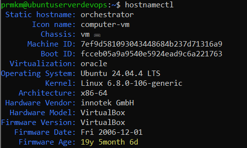

Zmiana hostname głównej maszyny:

```bash
sudo hostnamectl set-hostname orchestrator
```

Zmiana hostname maszyny docelowej:

```bash
sudo hostnamectl set-hostname ansible-target
```

---

## Konfiguracja `/etc/hosts`

Edycja pliku hosts:

```bash
sudo nano /etc/hosts
```

Dodane wpisy:

```text
192.168.100.188 ansible-target
192.168.100.X orchestrator
```

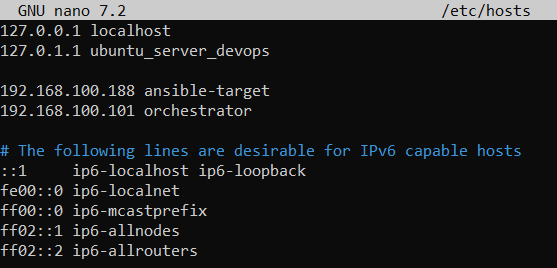

---

## Konfiguracja SSH

Test połączenia SSH:

```bash
ssh ansible@ansible-target
```

Wymiana kluczy SSH:

```bash
ssh-copy-id ansible@ansible-target
```

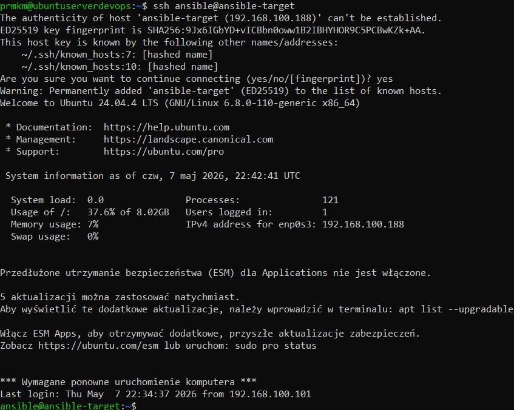

---

# 3. Instalacja Ansible

Instalacja pakietu:

```bash
sudo apt update
sudo apt install -y ansible
```

Sprawdzenie wersji:

```bash
ansible --version
```

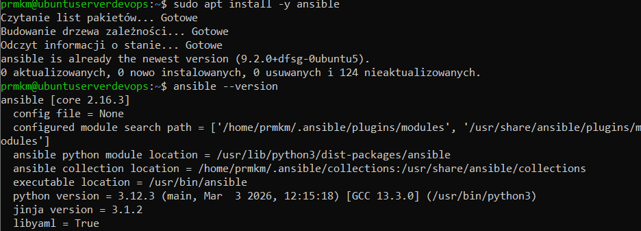

---

# 4. Inwentaryzacja systemów

Utworzenie katalogu roboczego:

```bash
mkdir -p ~/ansible
cd ~/ansible
```

Utworzenie pliku inventory:

```bash
nano inventory.ini
```

Zawartość pliku:

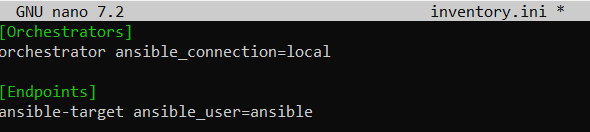

---

# 5. Test połączenia Ansible

Wysłanie żądania ping:

```bash
ansible all -i inventory.ini -m ping
```
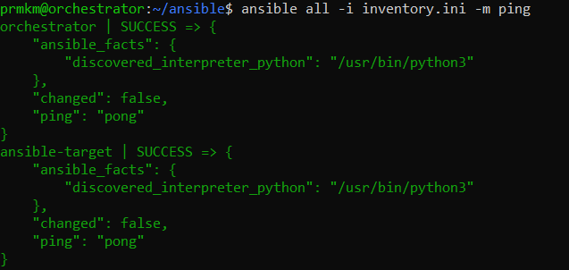
---

# 6. Playbook administracyjny

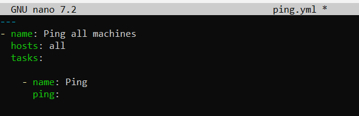

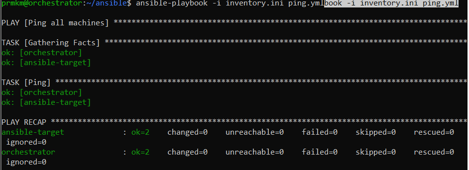

Utworzenie playbooka:

```bash
nano playbook.yml
```

Zawartość:

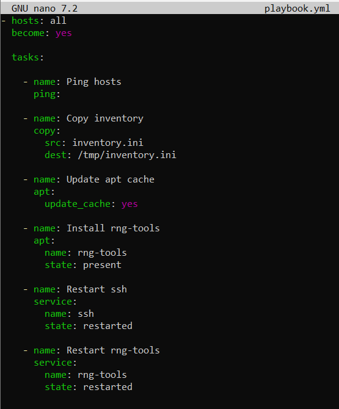

Uruchomienie playbooka:

```bash
ansible-playbook -i inventory.ini playbook.yml --ask-become-pass
```
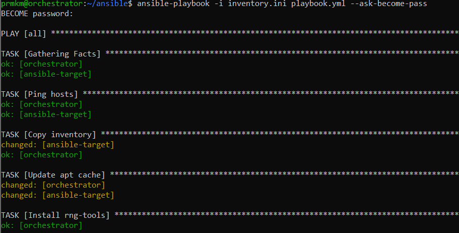

---

# 7. Idempotencja Ansible

Ponowne uruchomienie playbooka:

```bash
ansible-playbook -i inventory.ini playbook.yml --ask-become-pass
```

Przy drugim uruchomieniu część zadań została oznaczona jako:

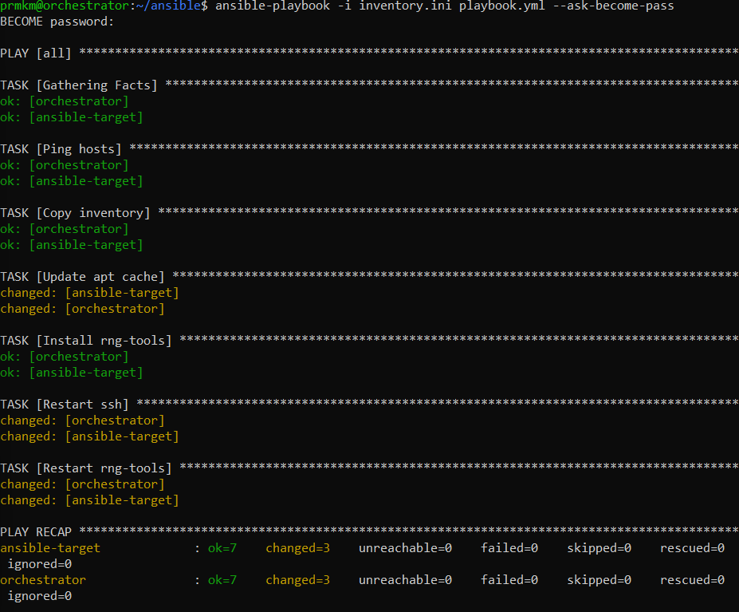

---

# 8. Instalacja Dockera przez Ansible

Utworzenie playbooka:

```bash
nano docker.yml
```

Zawartość:

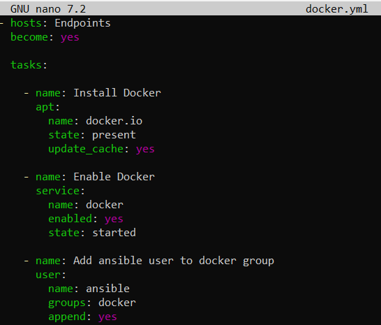

Uruchomienie:

```bash
ansible-playbook -i inventory.ini docker.yml --ask-become-pass
```

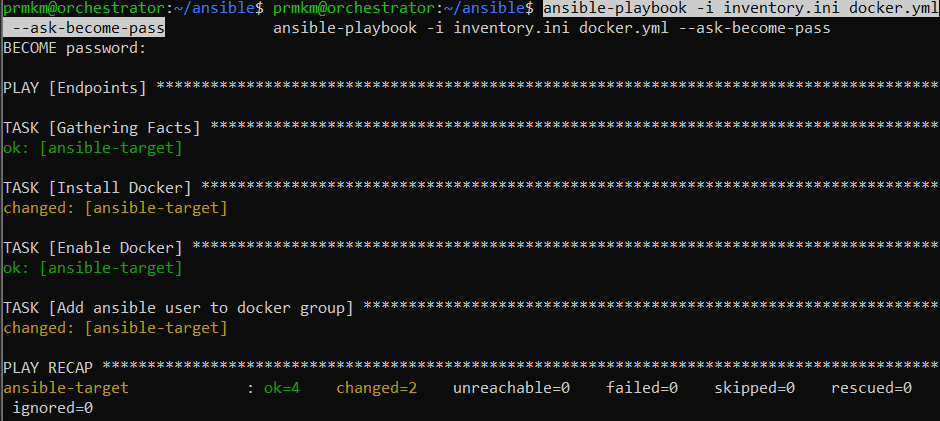
---

# 9. Weryfikacja rejestru Docker

Sprawdzenie działających kontenerów:

```bash
docker ps
```

Sprawdzenie obrazów:

```bash
docker images
```

Dostępny obraz:

```text
localhost:5000/express-km419774
```

---

# 10. Deploy aplikacji przez Ansible

Utworzenie playbooka:

```bash
nano deploy.yml
```

Zawartość:

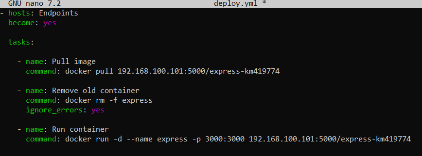

Uruchomienie:

```bash
ansible-playbook -i inventory.ini deploy.yml --ask-become-pass
```

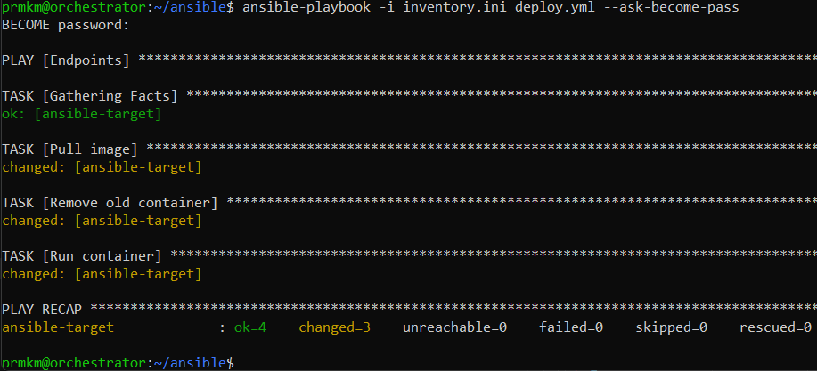

---

# 11. Test działania aplikacji

Test lokalny:

```bash
curl http://localhost:5000/v2/_catalog
```

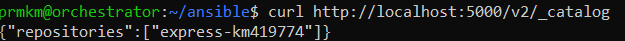

---

# 12. Usunięcie wdrożonego kontenera

Utworzenie playbooka:

```bash
nano cleanup.yml
```

Zawartość:

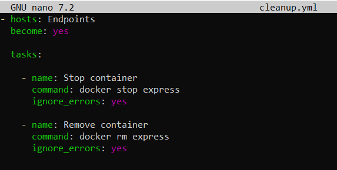

Uruchomienie:

```bash
ansible-playbook -i inventory.ini cleanup.yml --ask-become-pass
```

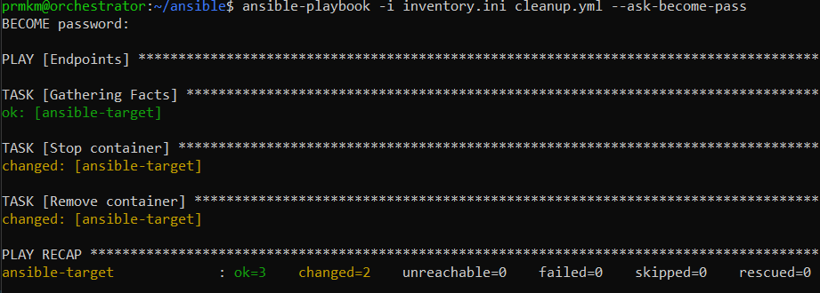

---

# 13. Migawka maszyny wirtualnej

Wykonanie migawki w VirtualBox:

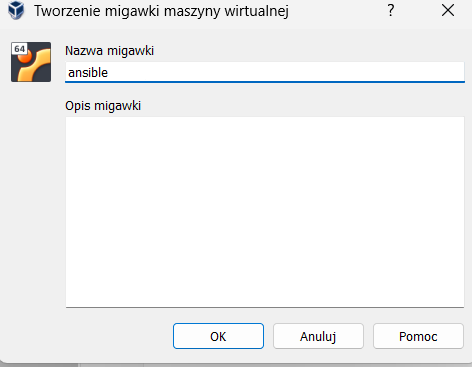

---

# 14. Podsumowanie

W ramach ćwiczenia:
- skonfigurowano środowisko Ansible,
- zestawiono komunikację SSH bez użycia hasła,
- wykonano zdalne operacje administracyjne,
- zautomatyzowano instalację Dockera,
- wdrożono aplikację kontenerową za pomocą playbooków,
- przygotowano strukturę roli Ansible,
- wykonano migawkę gotowego środowiska.