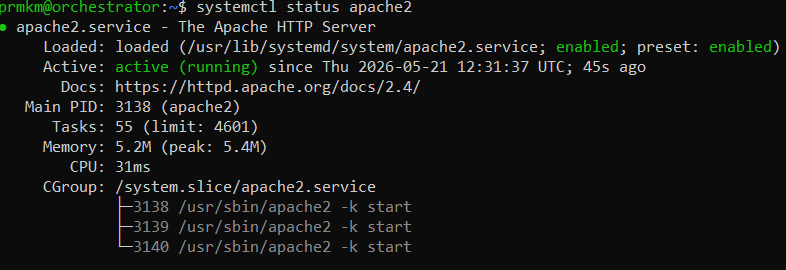
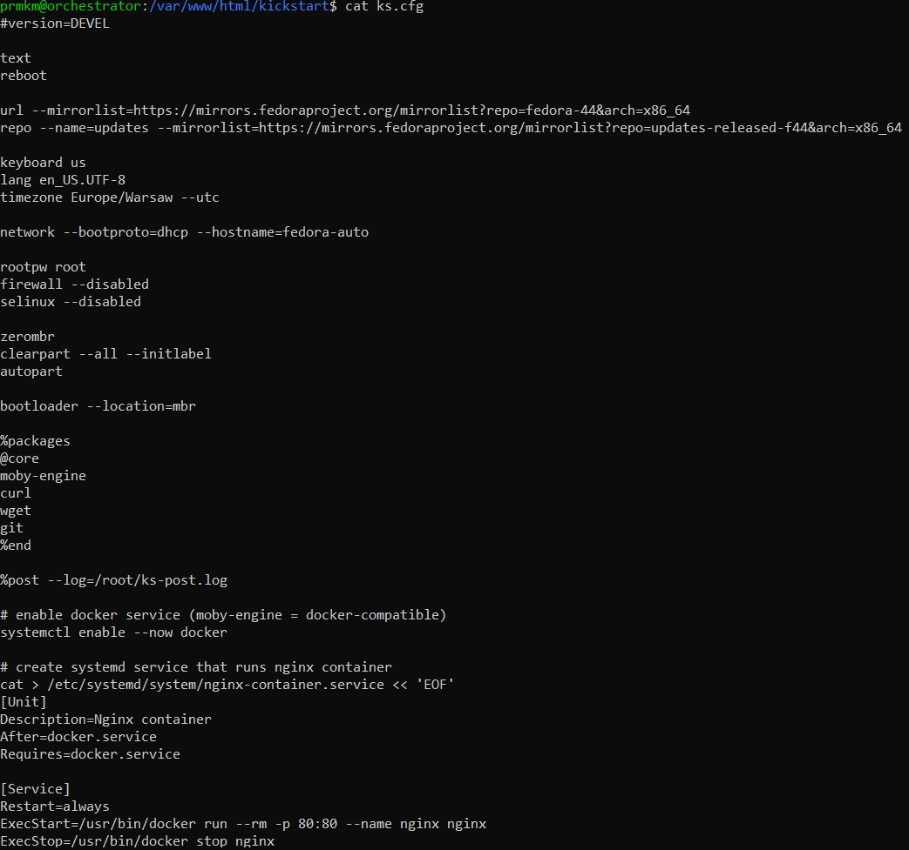
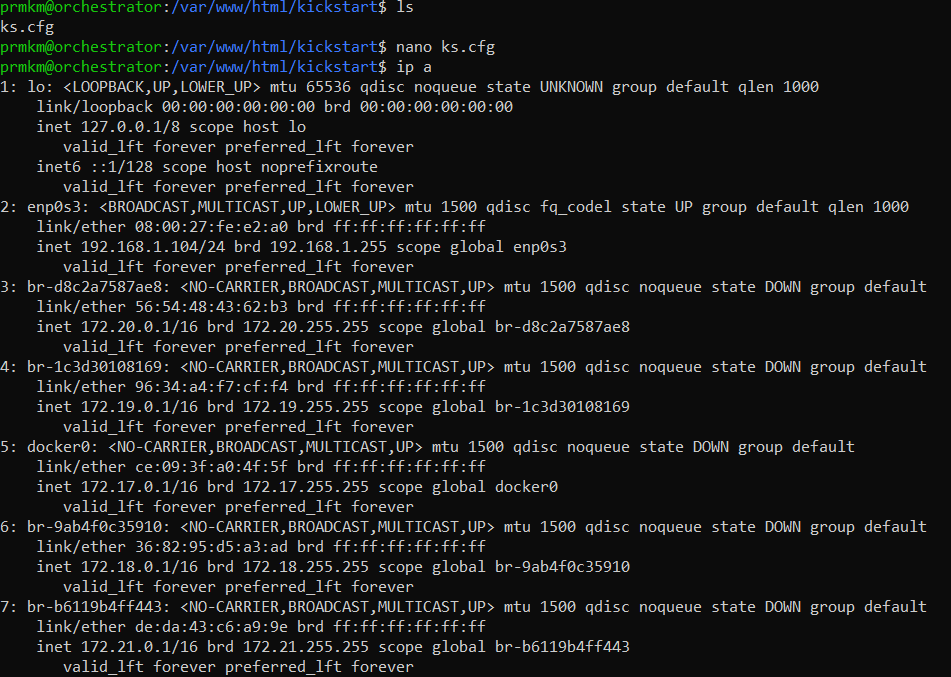
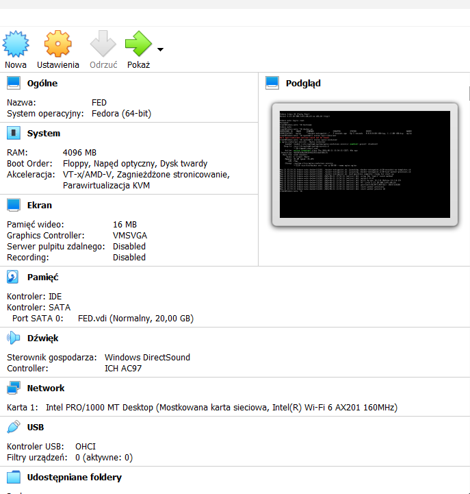
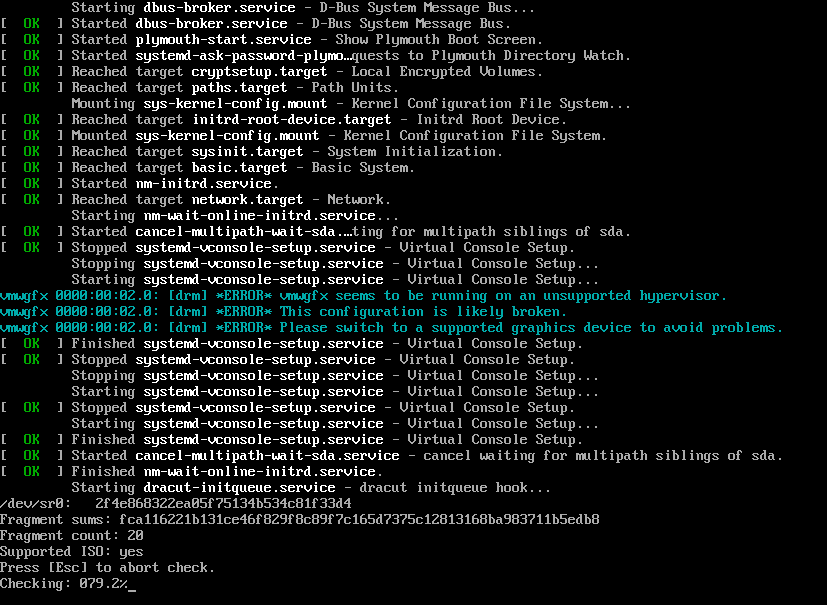
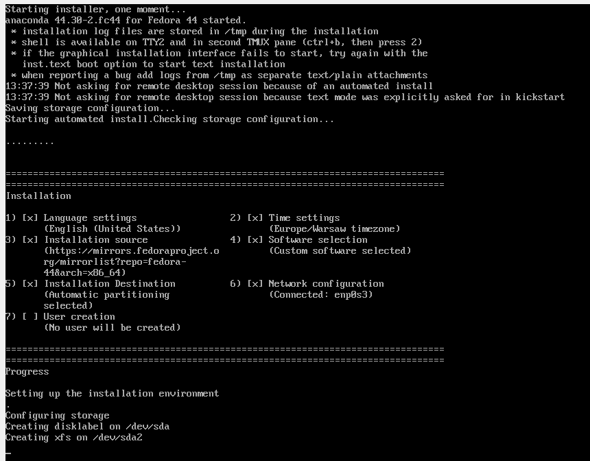
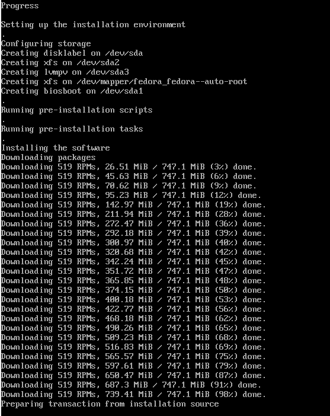
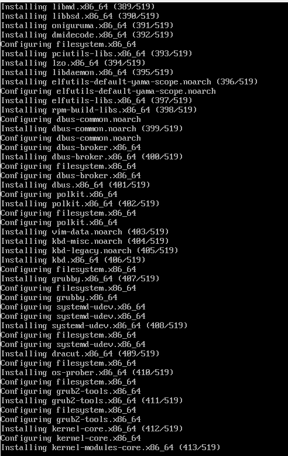
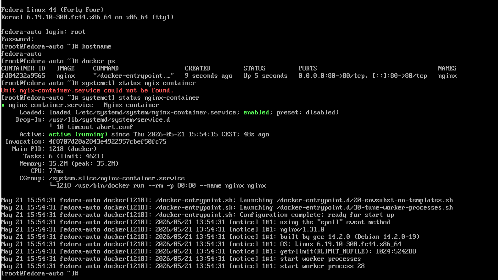

# Zajęcia 09 — Instalacja nienadzorowana Fedora (Kickstart)

## Cel ćwiczenia

Celem ćwiczenia było przygotowanie oraz przeprowadzenie instalacji nienadzorowanej systemu Fedora przy użyciu pliku odpowiedzi Kickstart (`ks.cfg`).  
Dodatkowo system miał po instalacji automatycznie uruchomić aplikację działającą w kontenerze Docker.

---

# Wykorzystane technologie

- Fedora Linux 44
- Kickstart (Anaconda)
- Docker / Moby Engine
- systemd
- Apache HTTP Server
- VirtualBox
- Ubuntu Server

---

# Architektura środowiska

## Maszyna 1 — Ubuntu Server
Maszyna pomocnicza używana do:
- hostowania pliku `ks.cfg`
- uruchomienia serwera HTTP Apache

## Maszyna 2 — Fedora VM
Maszyna instalowana automatycznie przy pomocy Kickstart.
---

# Przygotowanie serwera HTTP

## Instalacja Apache

```bash
sudo apt update
sudo apt install apache2 -y
```



## Utworzenie katalogu dla Kickstart

```bash
sudo mkdir -p /var/www/html/kickstart
```
---

# Utworzenie pliku Kickstart

## Edycja pliku

```bash
nano ks.cfg
```

## Zawartość pliku `ks.cfg`

```cfg
#version=DEVEL

text
reboot

url --mirrorlist=https://mirrors.fedoraproject.org/mirrorlist?repo=fedora-44&arch=x86_64
repo --name=updates --mirrorlist=https://mirrors.fedoraproject.org/mirrorlist?repo=updates-released-f44&arch=x86_64

keyboard us
lang en_US.UTF-8
timezone Europe/Warsaw --utc

network --bootproto=dhcp --hostname=fedora-auto

rootpw root
firewall --disabled
selinux --disabled

zerombr
clearpart --all --initlabel
autopart

bootloader --location=mbr

%packages
@core
moby-engine
curl
wget
git
%end

%post --log=/root/ks-post.log

systemctl enable --now docker

cat > /etc/systemd/system/nginx-container.service << 'EOF'
[Unit]
Description=Nginx container
After=docker.service
Requires=docker.service

[Service]
Restart=always
ExecStart=/usr/bin/docker run --rm -p 80:80 --name nginx nginx
ExecStop=/usr/bin/docker stop nginx

[Install]
WantedBy=multi-user.target
EOF

systemctl daemon-reload
systemctl enable nginx-container.service

echo "POST SCRIPT FINISHED" > /root/post-done.txt

%end
```

---

# Skopiowanie pliku do Apache

```bash
sudo cp ks.cfg /var/www/html/kickstart/
```
---

# Sprawdzenie adresu IP Ubuntu Server

```bash
ip a
```

Adres IP Ubuntu Server:

```text
192.168.1.104
```

---

# Test działania HTTP

```bash
curl http://localhost/kickstart/ks.cfg
```

---

# Konfiguracja VirtualBox

## Parametry maszyny Fedora

- RAM: 4 GB
- CPU: 2
- Dysk: 20 GB
- Sieć: Bridged Adapter
- ISO: Fedora 44 Server



---

# Uruchomienie instalacji unattended

Po uruchomieniu Fedora ISO należało nacisnąć:

```text
e
```

następnie w linii:

```text
linux /images/pxeboot/vmlinuz ...
```

dodać na końcu:

```text
inst.ks=http://192.168.1.104/kickstart/ks.cfg
```
Pełna linia:

```text
linux /images/pxeboot/vmlinuz inst.stage2=hd:LABEL=Fedora-S-dvd-x86_64-44 rd.live.check quiet inst.ks=http://192.168.1.104/kickstart/ks.cfg
```

Następnie uruchomić boot:

```text
Ctrl + X
```




---

# Weryfikacja działania

## Sprawdzenie hostname

```bash
hostname
```

Wynik:

```text
fedora-auto
```

---

## Sprawdzenie działania Docker

```bash
docker ps
```

Wynik:

```text
CONTAINER ID   IMAGE   COMMAND   STATUS
nginx          running
```

---

## Sprawdzenie usługi systemd

```bash
systemctl status nginx-container
```

Wynik:

```text
Active: active (running)
```

---

# Efekt końcowy

Po zakończeniu instalacji system Fedora:
- został zainstalowany automatycznie,
- skonfigurował hostname,
- zainstalował Docker (Moby Engine),
- utworzył usługę systemd,
- automatycznie uruchomił kontener Nginx po starcie systemu.

---

# Wnioski

Kickstart umożliwia pełną automatyzację procesu instalacji systemu Linux.  
Dzięki sekcji `%post` możliwe jest również automatyczne wdrożenie aplikacji oraz konfiguracja usług systemowych.

Ćwiczenie pokazało sposób realizacji podejścia Infrastructure as Code dla systemów operacyjnych i środowisk serwerowych.
