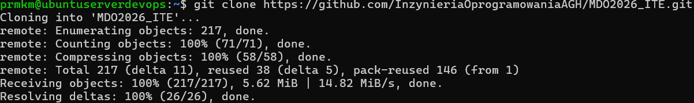
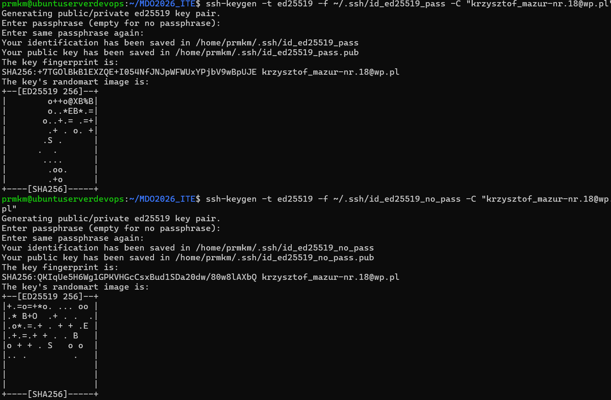
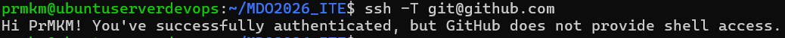
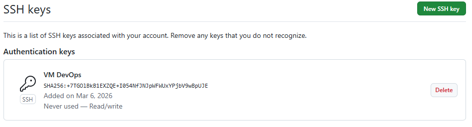
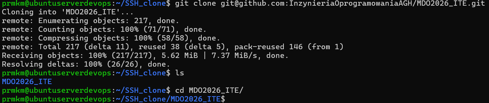
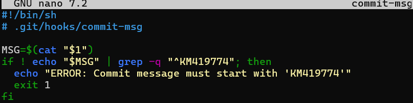

# Sprawozdanie 1
## Krzysztof Mazur ITE
### Git oraz SSH - Instalacja i konfiguracja

Lista poleceń:
- git --version
- git config --global user.name "PrMKM"
- git config --global user.email "krzysztof_mazur-nr.18@wp.pl"
Sklonowano repozytorium przedmiotowe przez HTTPS i personal acces token

Lista poleceń:
- git clone https://github.com/InzynieriaOprogramowaniaAGH/MDO2026_ITE.git
- cd MDO2026_ITE

Utworzono klucze SSH

Potwierdzenie nawiązania połączenia

Lista poleceń:
- ssh-keygen -t ed25519 -f ~/.ssh/id_ed25519_pass -C "krzysztof_mazur-nr.18@wp.pl"
- ssh-keygen -t ed25519 -f ~/.ssh/id_ed25519_no_pass -C "krzysztof_mazur-nr.18@wp.pl"
- cat ~/.ssh/id_ed25519_pass.pub
- ssh -T git@github.com 
Dodano klucz na Githubie

Sklonowano repozytorium przez SSH

Lista poleceń:
- git clone git@github.com:InzynieriaOprogramowaniaAGH/MDO2026_ITE.git

### Narzędzia
Wykonano odpowiednie połączenia narzędi:
Visual Studio code:

FileZilla:

### Gałęzie
Utworzono gałąź KM419774
Lista poleceń:
- git checkout main
- git pull origin main
- git checkout <branch_grupowy>
- git pull origin <branch_grupowy>
- git checkout -b KM419774
- mkdir -p grupa4/KM419774
- cd grupa4/KM419774
- touch Sprawozdanie_1
- rm Sprawozdanie_1
- touch Sprawozdanie_1.md
- mkdir img
### Git Hook
Utowrzono skrypt commit-msg:

Lista poleceń:
nano commit-msg
cp commit-msg ../../.git/hooks/commit-msg
chmod +x ../../.git/hooks/commit-msg

