# Sprawozdanie z zajęć 03

## Opis repozytorium

Wybrano repozytorium **vscode-setup** dostępne publicznie na GitHubie. Projekt jest aplikacją CLI napisaną w Node.js, umożliwiającą interaktywny wybór i instalację rozszerzeń do Visual Studio Code. Repozytorium posiada otwartą licencję MIT, zawiera plik `package.json` oraz zestaw testów jednostkowych uruchamianych poleceniem `npm test`.

---

## Build i test lokalny

Repozytorium zostało sklonowane oraz uruchomiono instalację zależności i testy:

```bash
git clone https://github.com/chahe-dridi/vscode-setup.git
cd vscode-setup
npm install
npm test
```
---

## Uruchomienie w kontenerze - tryb interaktywny

Uruchomiono kontener bazowy Node.js:

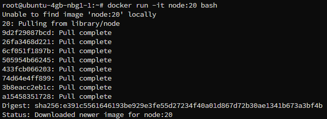

W kontenerze wykonano:

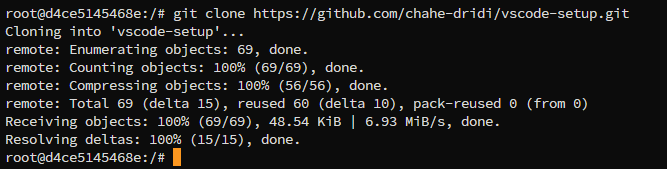


**Testy w kontenerze:** wynik testów uruchomionych wewnątrz kontenera - wszystkie zakończone sukcesem.

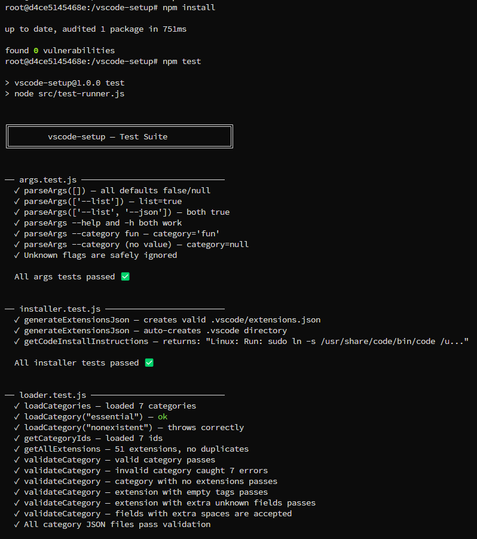

---

**Build w kontenerze**

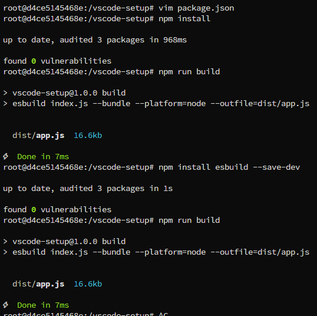

---

## Dockerfile - etap build

Utworzono plik `Dockerfile.build`, który instaluje zależności oraz przygotowuje środowisko:

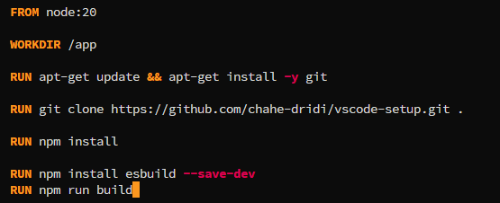

**Build obrazu:** 

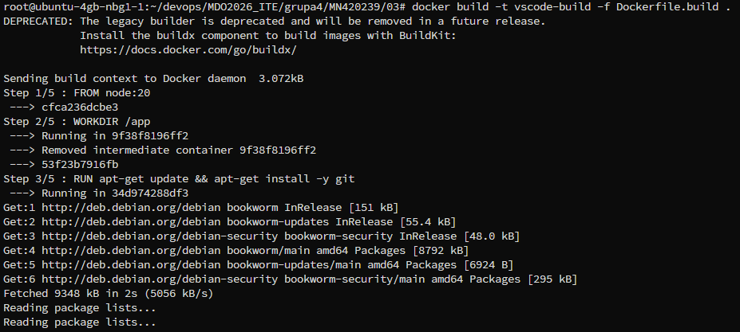

---

## Dockerfile – etap test

Utworzono plik `Dockerfile.test`, bazujący na obrazie build:

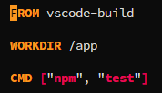

**Build obrazu testowego:** budowanie obrazu testowego na bazie obrazu build.

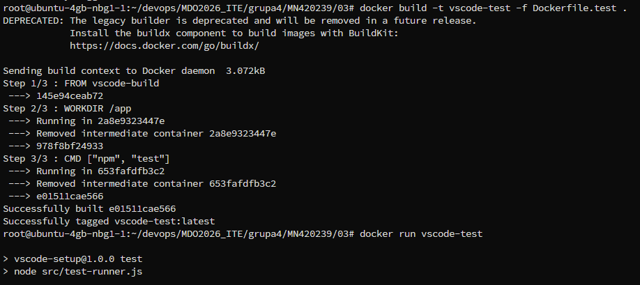

---

## Uruchomienie kontenera testowego

```bash
docker build -t vscode-build -f Dockerfile.build .
docker build -t vscode-test -f Dockerfile.test .
docker run vscode-test
```

Testy zostały uruchomione automatycznie i zakończyły się sukcesem.

**Zrzut ekranu (`docker run`):** uruchomienie kontenera testowego i wynik testów.

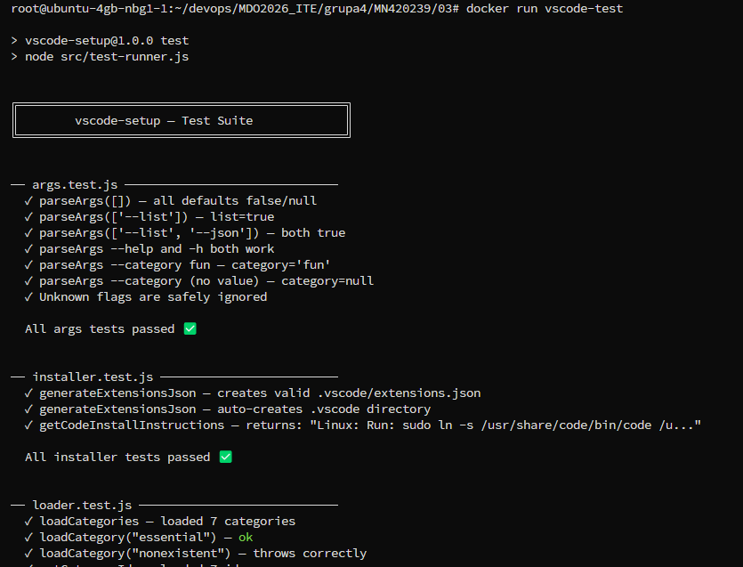

---

## Docker Compose

W celu automatyzacji procesu budowania i testowania wykorzystano narzędzie Docker Compose. Pozwala ono na zdefiniowanie wielu usług w jednym pliku konfiguracyjnym oraz ich uruchomienie za pomocą jednego polecenia.

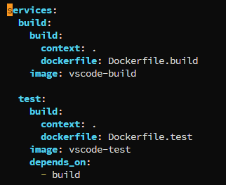

## Uruchomienie Docker Compose

Proces build i test został uruchomiony przy użyciu polecenia:

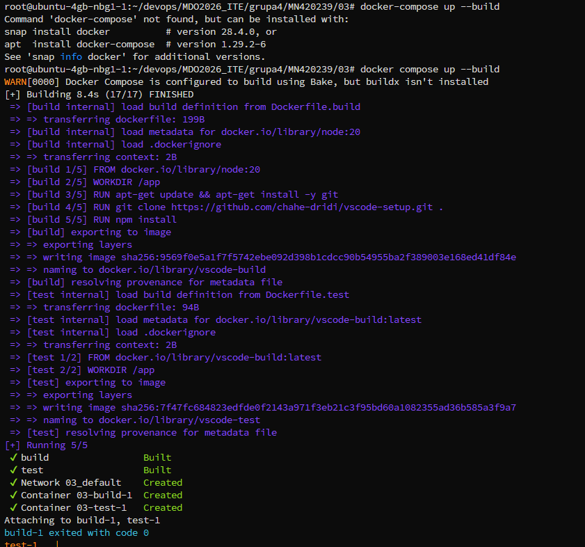

---

## Wnioski

Zastosowanie Docker Compose pozwoliło na dalszą automatyzację procesu budowania i testowania aplikacji. Dzięki temu cały pipeline może zostać uruchomiony jednym poleceniem, co znacząco upraszcza pracę oraz zwiększa powtarzalność środowiska.

Rozdzielenie etapów build i test odzwierciedla podejście stosowane w systemach CI/CD, gdzie każdy etap jest wykonywany w izolowanym środowisku. Kontener build przygotowuje aplikację, natomiast kontener test wykorzystuje gotowy obraz i uruchamia testy.
