# Sprawozdanie z zajęć 04

## Konteneryzacja, sieci, instancja Jenkins

## Cel ćwiczenia

Celem zajęć było zapoznanie się z zaawansowanymi mechanizmami konteneryzacji, w szczególności:

- przechowywaniem danych przy użyciu woluminów,
- komunikacją sieciową między kontenerami,
- uruchamianiem usług systemowych w kontenerach,
- instalacją i konfiguracją serwera Jenkins w środowisku Docker.

---

## Zachowywanie stanu między kontenerami

### Tworzenie woluminów

Utworzono dwa woluminy:

| Rodzaj    | Nazwa     |
| --------- | --------- |
| wejściowy | `input`   |
| wyjściowy | `output`  |

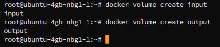

### Build aplikacji w kontenerze

Do zadania wykorzystano projekt frontendowy oparty na technologii Next.js. Repozytorium zostało sklonowane na hoście, a następnie podłączone do kontenera przy użyciu mechanizmu bind mount. Takie podejście pozwala uniknąć instalacji narzędzia Git w kontenerze oraz oddziela zarządzanie kodem od środowiska wykonawczego.

```bash
docker run -it -v $(pwd):/input -v output:/output node:20 bash
```

W kontenerze wykonano:

```bash
cd /input
npm install
npm run build
```

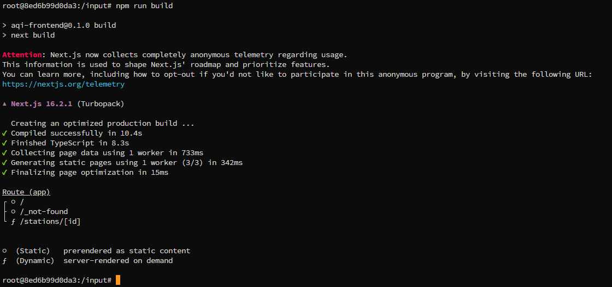

### Zapis wyników buildu do woluminu

Zbudowane pliki zostały zapisane w woluminie wyjściowym:

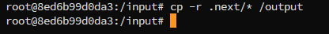


### Weryfikacja trwałości danych

Uruchomiono nowy kontener i sprawdzono zawartość woluminu:

```bash
docker run -it -v output:/data ubuntu ls /data
```

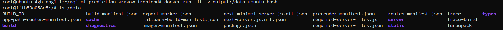

Dane były dostępne pomimo zakończenia działania kontenera, co potwierdza poprawne działanie mechanizmu woluminów w Dockerze.

### Wariant z Git w kontenerze

W drugim podejściu repozytorium zostało sklonowane bezpośrednio w kontenerze:

```bash
apt install -y git
git clone https://github.com/FalconDevX/aqi-ml-prediction-krakow-frontend
```
Podejście to pozwala na stworzenie bardziej niezależnego środowiska, w którym kontener sam pobiera kod źródłowy.

### Porównanie podejść

| Podejście        | Charakterystyka |
| ---------------- | --------------- |
| **Bind mount**   | Kod zarządzany na hoście, brak potrzeby instalacji Git w kontenerze |
| **Volume + Git** | Kontener samodzielnie pobiera kod, większa izolacja |


## Eksponowanie portów i komunikacja między kontenerami

### Tworzenie sieci

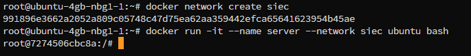

### Test komunikacji (iperf)

Uruchomiono dwa kontenery (serwer i klient) i przeprowadzono test przepustowości:

```bash
iperf3 -s
iperf3 -c server
```

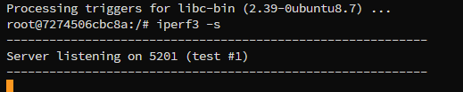
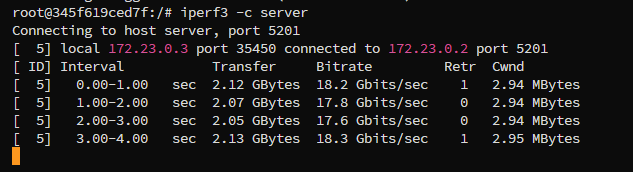

Następnie wykonano test po adresie IP:

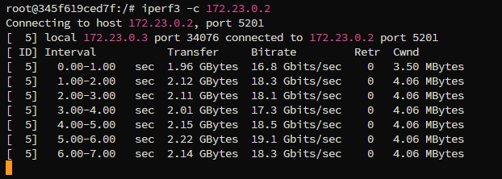

### Połączenie host–kontener

Uruchomiono kontener z mapowaniem portów:

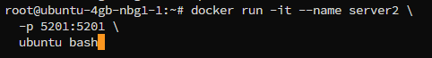

Test wykonano z hosta:

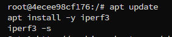

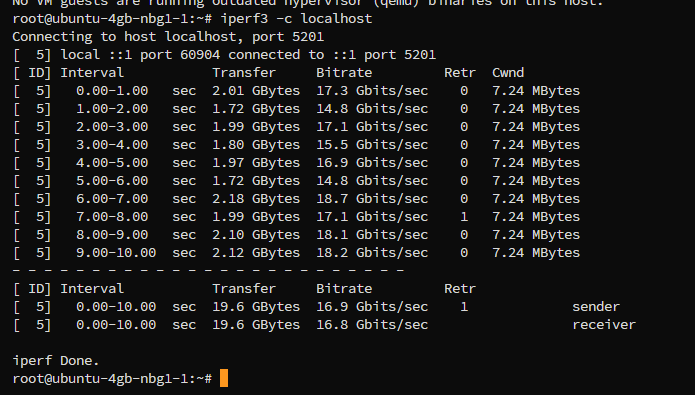

Mapowanie portów umożliwia dostęp do usług działających w kontenerze bezpośrednio z poziomu hosta.

### Wnioski z części z dockerem

- Docker zapewnia wbudowany DNS umożliwiający komunikację po nazwie kontenera.
- Sieć typu bridge izoluje kontenery.
- Komunikacja wewnętrzna jest bardzo wydajna.


## Usługa SSH w kontenerze

Uruchomiono serwer SSH w kontenerze:

```bash
apt install -y openssh-server
passwd root
/usr/sbin/sshd
```

Połączenie:

```bash
ssh root@localhost -p 2222
```

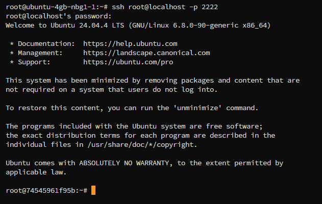

### Zalety i wady SSH w kontenerze

**Zalety:**

- zdalny dostęp do kontenera,
- możliwość debugowania,
- łatwa administracja.

**Wady:**

- naruszenie idei konteneryzacji (kontenery powinny być jednorazowe),
- zwiększone ryzyko bezpieczeństwa,
- rzadko stosowane w środowiskach produkcyjnych.

## Instancja Jenkins

### Uruchomienie Docker-in-Docker

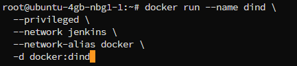

### Uruchomienie Jenkins

```bash
docker run --name jenkins --network jenkins \
  -p 8080:8080 -p 50000:50000 \
  -v jenkins_home:/var/jenkins_home \
  -d jenkins/jenkins:lts
```

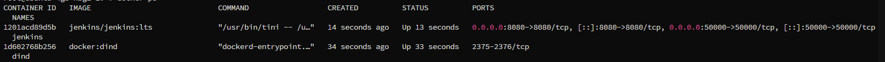

### Dostęp do Jenkins

Aplikacja została uruchomiona pod adresem:

<http://localhost:8080>

Wykorzystano polecenie, które odczytuje hasło do pierwszego logowania z woluminu Jenkins.

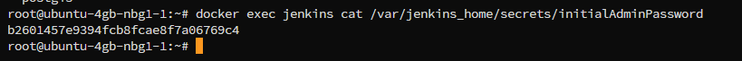

Skopiowane hasło zostało wklejone do panelu

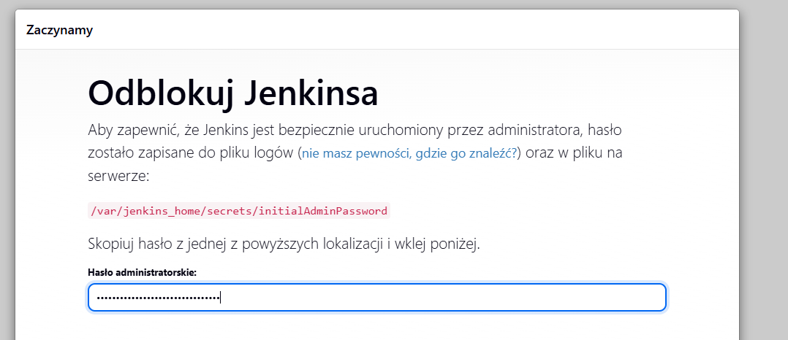

Kreator zainstalował domyślny zestaw wtyczek

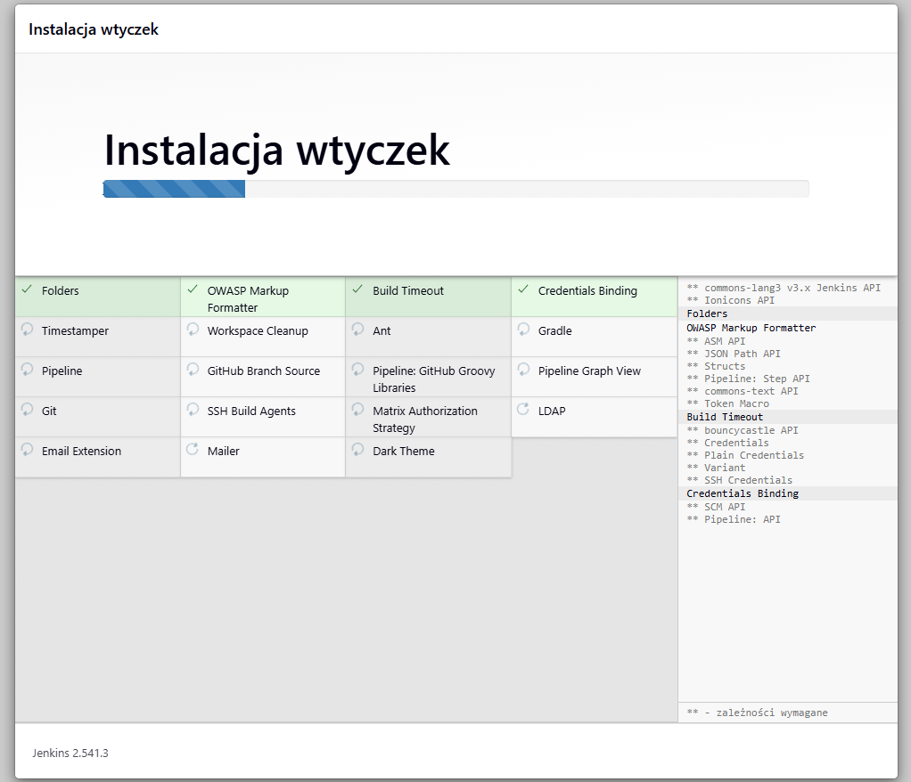

Adres Jenkinsa został ustawionu `http://localhost:8080/`

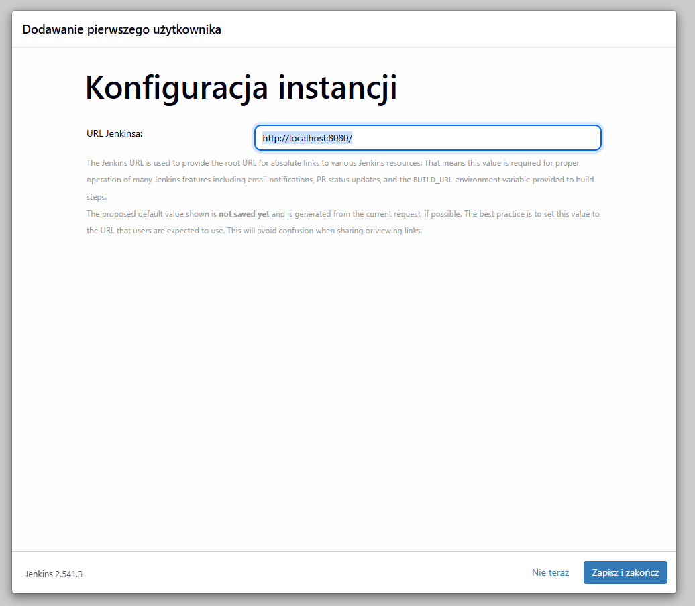


Panel główny Jenkins po zakończeniu konfiguracji
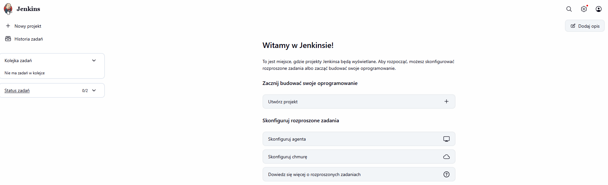

Jenkins został poprawnie zainicjalizowany poprzez instalację wtyczek oraz utworzenie użytkownika administratora.

### Architektura rozwiązania

Jenkins działa w połączeniu z Docker-in-Docker (DIND), co umożliwia:

- budowanie obrazów Docker,
- uruchamianie kontenerów,
- automatyzację procesów CI/CD.

## Wnioski końcowe

W trakcie zajęć poznano kluczowe mechanizmy konteneryzacji:

- woluminy umożliwiają trwałe przechowywanie danych,
- bind mount i volume mają różne zastosowania,
- sieci Docker pozwalają na komunikację między kontenerami,
- mapowanie portów umożliwia dostęp do usług z hosta,
- Jenkins stanowi narzędzie CI/CD działające w środowisku kontenerowym.

Zastosowanie Dockera oraz Jenkinsa umożliwia tworzenie skalowalnych, powtarzalnych i izolowanych środowisk programistycznych.
