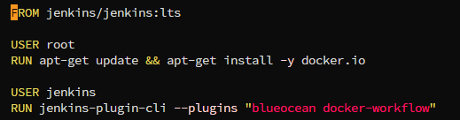
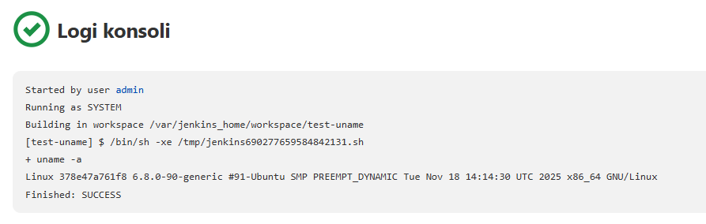
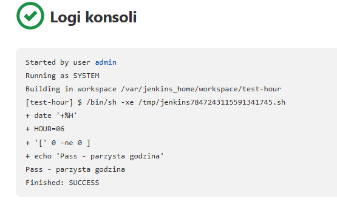
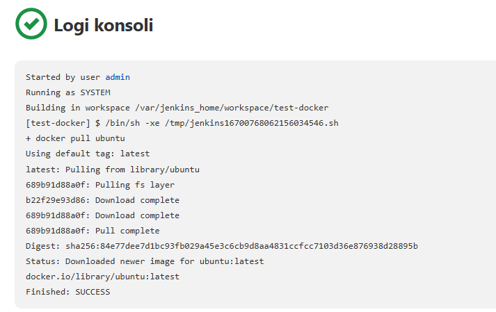
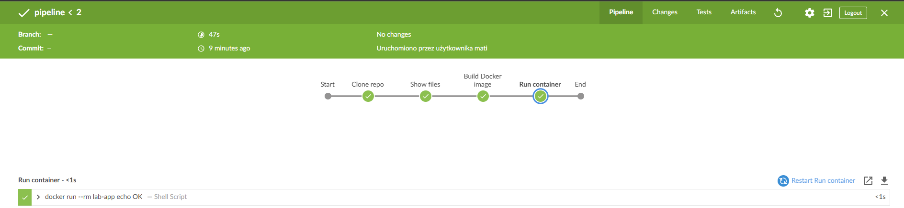

# Sprawozdanie z zajęć 05

## Pipeline, Jenkins, izolacja etapów

## Cel ćwiczenia

Celem zajęć było uruchomienie środowiska CI/CD z wykorzystaniem Jenkins oraz Docker, a następnie przygotowanie pipeline realizującego etapy build -> test (opcjonalnie również deploy/publish).

---

## Przygotowanie środowiska Jenkins

W pierwszym etapie utworzono środowisko Jenkins działające w kontenerach Docker.

### Utworzenie sieci Docker

```bash
docker network create jenkins
```

Sieć została wykorzystana do komunikacji między kontenerami Jenkins oraz Docker-in-Docker (DIND).

### Uruchomienie kontenera DIND

```bash
docker run --name jenkins-docker --detach \
  --privileged --network jenkins --network-alias docker \
  --env DOCKER_TLS_CERTDIR=/certs \
  --volume jenkins-docker-certs:/certs/client \
  --volume jenkins-data:/var/jenkins_home \
  -p 2376:2376 docker:dind
```

Kontener DIND pełni rolę środowiska wykonawczego dla operacji Docker wykonywanych z poziomu Jenkins.

### Przygotowanie obrazu Jenkins z Blue Ocean

Utworzono własny obraz Docker na bazie `jenkins/jenkins:lts`, rozszerzony o pluginy:



Obraz został zbudowany poleceniem:

```bash
docker build -t myjenkins-blueocean .
```

### Uruchomienie kontenera Jenkins

```bash
docker run -d --name jenkins-blueocean \
  --network jenkins \
  -e DOCKER_HOST=tcp://docker:2376 \
  -e DOCKER_CERT_PATH=/certs/client \
  -e DOCKER_TLS_VERIFY=1 \
  -p 8080:8080 -p 50000:50000 \
  -v jenkins-data:/var/jenkins_home \
  -v jenkins-docker-certs:/certs/client:ro \
  myjenkins-blueocean
```

Jenkins został uruchomiony jako kontener i udostępniony na porcie `8080`.

### Logowanie i konfiguracja

Po uruchomieniu Jenkins:

- pobrano hasło administratora z kontenera,
- utworzono użytkownika `admin`,
- zainstalowano sugerowane pluginy.

Dostęp do interfejsu Blue Ocean:

<http://localhost:8080/blue>

---

## Zadanie wstępne: uruchomienie testowych kroków

Wykonano testowe zadania Jenkins:

### Wyświetlenie informacji o systemie

```bash
uname -a
```


### Sprawdzenie godziny (warunek)

```bash
HOUR=$(date +%H)
if [ $((HOUR % 2)) -ne 0 ]; then exit 1; fi
```



### Pobranie obrazu Docker

```bash
docker pull ubuntu
```



Wszystkie zadania zakończyły się powodzeniem.

---

## Zadanie główne: pipeline

Utworzono projekt typu Pipeline w Jenkins. Pipeline został zdefiniowany bezpośrednio w konfiguracji (bez SCM).

### Zakres etapów pipeline

Pipeline realizuje następujące etapy:

- klonowanie repozytorium,
- checkout do gałęzi użytkownika,
- wyszukiwanie pliku `Dockerfile`,
- budowa obrazu Docker,
- uruchomienie kontenera.

### Implementacja pipeline

```groovy
pipeline {
    agent any

    stages {
        stage('Clone repo') {
            steps {
                checkout([
                    $class: 'GitSCM',
                    branches: [[name: '*/MN420239']],
                    userRemoteConfigs: [[
                        url: 'https://github.com/InzynieriaOprogramowaniaAGH/MDO2026_ITE.git'
                    ]]
                ])
            }
        }

        stage('Show files') {
            steps {
                sh 'ls -la'
            }
        }

        stage('Build Docker image') {
            steps {
                sh '''
                DOCKERFILE=$(find . -name Dockerfile | head -n 1)
                docker build -t lab-app -f $DOCKERFILE .
                '''
            }
        }

        stage('Run container') {
            steps {
                sh 'docker run --rm lab-app echo OK'
            }
        }
    }
}
```

### Wynik działania

Pipeline został uruchomiony wielokrotnie, a każdy etap zakończył się poprawnie:

- poprawne pobranie repozytorium,
- poprawne odnalezienie `Dockerfile`,
- poprawna budowa obrazu,
- poprawne uruchomienie kontenera.

Wynik końcowy w BlueOcean:


---

## Izolacja etapów

Pipeline wykorzystuje kontenery Docker jako środowisko wykonawcze, co zapewnia:

- izolację zależności,
- powtarzalność buildów,
- niezależność od systemu hosta.

Jenkins komunikuje się z Docker poprzez DIND, co umożliwia wykonywanie operacji kontenerowych w sposób odseparowany.

## Jenkins vs Blue Ocean

- **Jenkins** - klasyczny interfejs CI,
- **Blue Ocean** - nowoczesny interfejs wizualny dla pipeline.

Blue Ocean został dodany jako plugin w obrazie Docker, co zapewnia jego dostępność od momentu uruchomienia kontenera.

## Wnioski końcowe

Zastosowanie Jenkins oraz Docker umożliwia pełną automatyzację procesu budowania i testowania aplikacji. Pipeline pozwala na powtarzalne wykonywanie operacji CI, a wykorzystanie kontenerów zapewnia izolację środowiska oraz łatwość zarządzania zależnościami.