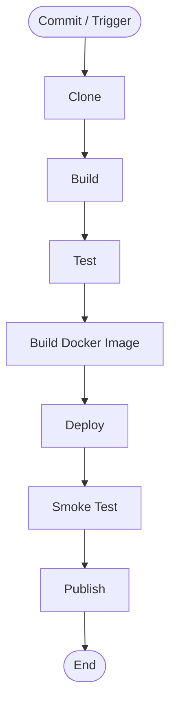
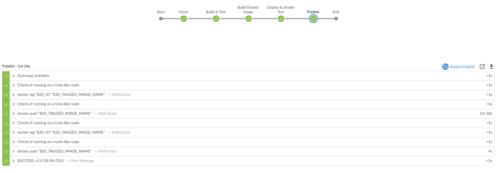

# Sprawozdanie: Projekt i implementacja potoku CI/CD

**Repozytorium:** https://github.com/FalconDevX/aqi-ml-prediction-krakow-frontend    
**Typ projektu:** aplikacja frontendowa (Next.js)  
**Narzędzie CI/CD:** Jenkins   
**Środowisko konteneryzacji:** Docker   

---

## 1. Charakterystyka pipeline i ścieżka krytyczna

Celem projektu było zaprojektowanie i uruchomienie potoku CI/CD dla aplikacji frontendowej napisanej w Next.js. Pipeline został zrealizowany w Jenkinsie jako **Declarative Pipeline** i obejmuje pełny proces od pobrania kodu aż do publikacji artefaktu.

W przeciwieństwie do prostych aplikacji statycznych, Next.js wymaga środowiska Node.js do działania, dlatego pipeline został podzielony na dwa etapy:

* budowanie aplikacji (Node.js – `npm run build`),
* uruchamianie aplikacji (`next start` w kontenerze).

Pipeline realizuje pełną ścieżkę krytyczną:

`Commit → Clone → Build → Test → Build Image → Deploy → Smoke Test → Publish`

### Schemat procesu (UML)



---

## 2. Realizacja listy kontrolnej

### ✔ Wybór aplikacji

Wybrano projekt frontendowy w Next.js: `aqi-ml-prediction-krakow-frontend`.

### ✔ Licencja

Projekt wykorzystuje licencję **MIT**, co umożliwia jego dowolne wykorzystanie i wdrażanie.

### ✔ Build aplikacji

Aplikacja buduje się poprawnie:

```bash
npm install
npm run build
```

### ✔ Testy

Testy są uruchamiane poleceniem:

```bash
npm test
```

W pipeline zastosowano zabezpieczenie, aby brak testów nie przerywał działania:

```bash
npm test || echo "No tests"
```

### ✔ Fork repozytorium

Repozytorium zostało sforkowane w celu pełnej kontroli nad konfiguracją CI/CD oraz webhookami.

### ✔ Kontener bazowy (build)

Do budowania wykorzystano:

```
node:20-alpine
```

Jest to lekki obraz zawierający Node.js oraz npm.

### ✔ Build i test w kontenerze

Budowanie i testy wykonywane są w izolowanym środowisku Docker:

* zapewnia to powtarzalność środowiska,
* eliminuje różnice między lokalnym a produkcyjnym systemem.

### ✔ Logi jako artefakt

Logi z procesu są zapisywane do pliku:

```
frontend_build_logs.txt
```

i archiwizowane w Jenkinsie.

### ✔ Kontener deploy (runtime)

Zamiast Nginx zastosowano kontener Node.js, ponieważ:

* Next.js nie zawsze generuje statyczny build,
* aplikacja wymaga `next start`.

Kontener uruchamia aplikację na porcie:

```
3000
```

### ✔ Deploy

Aplikacja uruchamiana jest jako kontener Docker:

```bash
docker run -d -p 8081:3000 image_name
```

### ✔ Smoke test

Weryfikacja działania odbywa się poprzez zapytanie HTTP:

```bash
curl http://<container_ip>:3000/api/health
```

Pipeline czeka aż aplikacja się uruchomi (retry + sleep), co eliminuje błędy związane z czasem startu.

### ✔ Artefakt

Artefaktem jest obraz Docker zawierający:

* zbudowaną aplikację Next.js,
* środowisko Node.js,
* wszystkie zależności.

### ✔ Uzasadnienie wyboru artefaktu

Obraz Docker:

* zapewnia spójność środowiska,
* umożliwia łatwe wdrożenie,
* eliminuje problemy konfiguracyjne.

### ✔ Wersjonowanie

Zastosowano schemat:

```
v1.0.<BUILD_ID>-<COMMIT_HASH>
```

Pozwala to jednoznacznie powiązać artefakt z konkretną wersją kodu.

### ✔ Publikacja

Obraz publikowany jest do Docker Hub:

```
mrmacarthur/aqi-frontend
```

Z wykorzystaniem Jenkins Credentials (`DOCKER_HUB_CREDS`).

### ✔ Identyfikacja artefaktu

W Dockerfile zastosowano:

```dockerfile
LABEL org.opencontainers.image.revision="${GIT_COMMIT}"
```

### ✔ Zgodność z UML

Pipeline odpowiada zaprojektowanemu diagramowi i realizuje wszystkie etapy.

---

## 3. Konfiguracja CI/CD

### Dockerfile (multi-stage)

```dockerfile
FROM node:20-alpine AS builder
WORKDIR /app
COPY package*.json ./
RUN npm install
COPY . .
RUN npm run build

FROM node:20-alpine
WORKDIR /app

COPY package*.json ./
RUN npm install --omit=dev

COPY --from=builder /app/.next ./.next
COPY --from=builder /app/public ./public
COPY --from=builder /app/node_modules ./node_modules

EXPOSE 3000

CMD ["npm", "start"]
```

---

### Jenkinsfile

```groovy
pipeline {
  agent any

  environment {
    DOCKER_IMAGE = 'mrmacarthur/aqi-frontend'
    DOCKER_TAG = "v1.0.${env.BUILD_ID}-${env.GIT_COMMIT.take(7)}"
  }

  stages {

    stage('Clone') {
      steps {
        checkout scm
        sh 'echo "Start build: $GIT_COMMIT" > frontend_build_logs.txt'
      }
    }

    stage('Build & Test') {
      agent {
        docker { image 'node:20-alpine' }
      }
      steps {
        sh 'npm install >> frontend_build_logs.txt'
        sh 'npm run build >> frontend_build_logs.txt'
        sh 'npm test || echo "No tests"'
      }
    }

    stage('Build Docker Image') {
      steps {
        script {
          docker.build("${DOCKER_IMAGE}:${DOCKER_TAG}", "--build-arg GIT_COMMIT=${env.GIT_COMMIT} .")
        }
      }
    }

    stage('Deploy & Smoke Test') {
      steps {
        sh "docker run -d --name test-${BUILD_ID} -p 8081:3000 ${DOCKER_IMAGE}:${DOCKER_TAG}"

        script {
          def ip = sh(
            script: "docker inspect -f '{{range.NetworkSettings.Networks}}{{.IPAddress}}{{end}}' test-${BUILD_ID}",
            returnStdout: true
          ).trim()

          sh """
          for i in \$(seq 1 10); do
            if curl -fsS http://${ip}:3000/api/health > /dev/null; then break; fi
            sleep 2
          done

          curl -fsS http://${ip}:3000/api/health
          """
        }
      }
      post {
        always {
          sh "docker stop test-${BUILD_ID} || true"
          sh "docker rm test-${BUILD_ID} || true"
        }
      }
    }

    stage('Publish') {
      steps {
        archiveArtifacts artifacts: 'frontend_build_logs.txt'
        script {
          docker.withRegistry('', 'DOCKER_HUB_CREDS') {
            def img = docker.image("${DOCKER_IMAGE}:${DOCKER_TAG}")
            img.push()
            img.push('latest')
          }
        }
      }
    }
  }
}
```

---

## 4. Podsumowanie

Zaimplementowany pipeline CI/CD automatyzuje cały proces:

* pobranie kodu,
* budowanie aplikacji,
* testowanie,
* budowanie obrazu Docker,
* uruchomienie i weryfikacja działania,
* publikacja artefaktu.

Najważniejsze elementy rozwiązania:

* wykorzystanie Dockera do izolacji środowiska,
* użycie multi-stage build,
* dynamiczny smoke test (czekanie na start aplikacji),
* wersjonowanie artefaktów,
* integracja z Docker Hub.

Pipeline jest stabilny i może zostać rozszerzony o:

* testy e2e,
* deployment na serwer produkcyjny lub Kubernetes.

