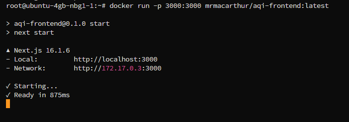
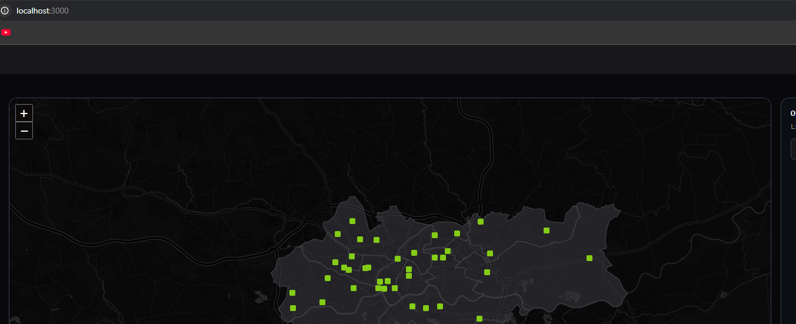
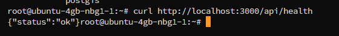
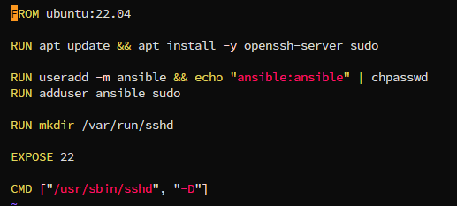
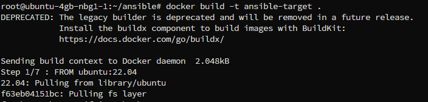
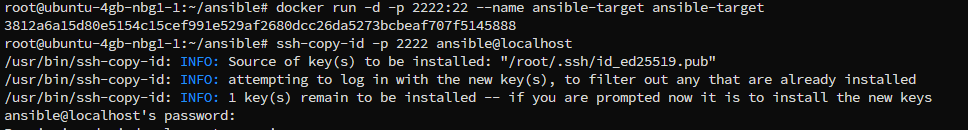
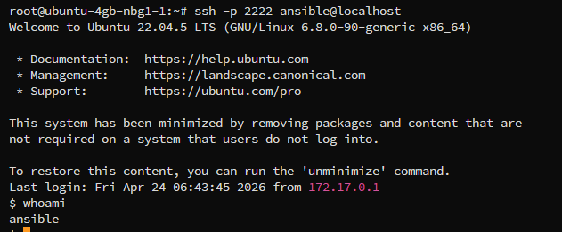

# Sprawozdanie: Weryfikacja artefaktu i przygotowanie środowiska CD

**Repozytorium:** https://github.com/FalconDevX/aqi-ml-prediction-krakow-frontend    
**Typ projektu:** aplikacja frontendowa (Next.js)  
**Narzędzie CI/CD:** Jenkins  
**Środowisko konteneryzacji:** Docker  
**Narzędzie automatyzacji wdrożeń:** Ansible  

---

## Weryfikacja działania artefaktu (Definition of Done)

Kluczowym elementem projektu było sprawdzenie, czy wygenerowany artefakt, czyli obraz Dockera, działa poprawnie poza środowiskiem Jenkins. Taka weryfikacja stanowi praktyczne potwierdzenie **Definition of Done**: pipeline nie tylko buduje aplikację, ale rzeczywiście tworzy produkt gotowy do uruchomienia i wdrożenia.

### Uruchomienie obrazu Docker

Po zakończeniu działania pipeline obraz został pobrany i uruchomiony lokalnie poleceniem:

```bash
docker run -p 3000:3000 mrmacarthur/aqi-frontend:latest
```


Po starcie kontenera aplikacja była dostępna pod adresem:

```text
http://localhost:3000
```



Oznacza to, że zbudowany wcześniej artefakt działa poprawnie również poza Jenkins, a więc może zostać wykorzystany w dalszych etapach wdrożenia. Aplikacja uruchamiana jest przy użyciu wbudowanego serwera Next.js (`next start`), a nie przez zewnętrzny serwer statyczny.

Aplikacja nie jest eksportowana statycznie (np. `next export`), lecz uruchamiana jako serwer Node.js, co umożliwia obsługę dynamicznych tras oraz API.

### Endpoint health jako smoke test

Aby umożliwić prostą i automatyczną weryfikację działania aplikacji, dodano endpoint kontrolny:

```typescript
// app/api/health/route.ts
export async function GET() {
  return Response.json({ status: "ok" })
}
```

Następnie sprawdzono jego działanie po uruchomieniu kontenera:

```bash
curl http://localhost:3000/api/health
```

Wynik działania:



Taki test pełni rolę **smoke testu**, czyli podstawowej kontroli poprawności działania aplikacji po wdrożeniu.

### Znaczenie przeprowadzonej weryfikacji

Uzyskany wynik potwierdza, że:

- aplikacja została poprawnie zbudowana,
- kontener uruchamia się bez błędów,
- serwer Next.js działa prawidłowo,
- endpoint API odpowiada zgodnie z oczekiwaniami.

Dzięki temu możliwe było dodanie prostego testu końcowego do pipeline, który automatycznie sprawdza, czy wdrożony artefakt rzeczywiście działa. W praktyce oznacza to, że proces CI/CD kończy się nie tylko stworzeniem obrazu, ale także potwierdzeniem jego użyteczności.

---

## Przygotowanie środowiska Ansible i zdalne zarządzanie

Kolejnym etapem projektu było przygotowanie środowiska do automatyzacji wdrożeń z wykorzystaniem narzędzia **Ansible**. Celem było utworzenie drugiej maszyny docelowej, do której można logować się zdalnie oraz wykonywać polecenia bez podawania hasła.



### Przygotowanie środowiska docelowego (`ansible-target`)

Zamiast tworzenia pełnej maszyny wirtualnej wykorzystano kontener Docker, który pełni rolę lekkiego środowiska docelowego. Takie rozwiązanie pozwala spełnić wymagania zadania przy niewielkim zużyciu zasobów, a jednocześnie zachowuje najważniejsze cechy hosta zarządzanego przez Ansible.

Przygotowany obraz zawierał:

- system Linux,
- serwer SSH (`sshd`),
- użytkownika `ansible`,
- podstawowe narzędzia systemowe.



Następnie uruchomiono kontener jako host docelowy:

```bash
docker run -d -p 2222:22 --name ansible-target ansible-target:latest
```



Dzięki temu dostęp SSH do środowiska docelowego był możliwy pod adresem:

```text
ansible@localhost:2222
```

### Konfiguracja dostępu SSH

Aby umożliwić logowanie bezhasłowe, wykonano standardową wymianę kluczy SSH pomiędzy maszyną główną a hostem docelowym.

Wygenerowanie klucza SSH:

```bash
ssh-keygen
```

Skopiowanie klucza publicznego do środowiska docelowego:

```bash
ssh-copy-id -p 2222 ansible@localhost
```

Weryfikacja działania połączenia:

```bash
ssh -p 2222 ansible@localhost
```

Po poprawnej konfiguracji możliwe było logowanie do kontenera bez konieczności podawania hasła, co jest kluczowe dla późniejszej automatyzacji z użyciem Ansible.

### Konfiguracja Ansible (`inventory`)

Utworzono plik `hosts`, definiujący maszynę docelową:

```ini
ansible-target ansible_host=127.0.0.1 ansible_port=2222 ansible_user=ansible
```

Taka konfiguracja umożliwia Ansible jednoznaczne wskazanie hosta, portu oraz użytkownika, z którego należy skorzystać przy połączeniu.

### Test działania Ansible

W celu sprawdzenia poprawności konfiguracji wykonano test połączenia:



Oznacza to, że:

- komunikacja SSH działa poprawnie,
- Ansible może wykonywać polecenia na maszynie docelowej,
- środowisko jest gotowe do automatyzacji wdrożeń.

### Podsumowanie

W ramach projektu zaprojektowano i uruchomiono kompletny pipeline CI/CD dla aplikacji frontendowej opartej na Next.js. Proces obejmuje wszystkie kluczowe etapy: pobranie kodu z repozytorium, budowanie aplikacji, uruchamianie testów, tworzenie obrazu Dockera, wdrożenie oraz publikację artefaktu.

Istotnym elementem realizacji było potwierdzenie Definition of Done, czyli weryfikacja, że wygenerowany artefakt działa niezależnie od środowiska Jenkins. Uruchomienie obrazu Docker oraz pozytywny wynik zapytania do endpointu /api/health potwierdziły, że aplikacja jest gotowa do wdrożenia i może być używana w środowisku produkcyjnym.

W dalszej części przygotowano środowisko pod automatyzację wdrożeń z wykorzystaniem narzędzia Ansible. Utworzono uproszczony host docelowy w postaci kontenera Docker, skonfigurowano dostęp SSH bez użycia hasła oraz zweryfikowano możliwość zdalnego wykonywania poleceń. Takie podejście odwzorowuje rzeczywisty scenariusz, w którym serwer aplikacyjny jest zarządzany zdalnie przez system automatyzacji.