# Sprawozdanie: Automatyzacja i zdalne wykonywanie poleceń za pomocą Ansible

**Temat zajęć:** Zajęcia 08 - automatyzacja zadań administracyjnych  
**Narzędzie:** Ansible  
**Środowisko:** Linux + Docker + OpenSSH  
**Zakres:** inventory, playbooki, sanity check, role Ansible

---

## Cel ćwiczenia

Celem zajęć było zapoznanie się z narzędziem **Ansible** służącym do automatyzacji konfiguracji systemów, zdalnego wykonywania poleceń oraz zarządzania środowiskiem serwerowym przy użyciu playbooków i ról.

---

## Przygotowanie środowiska

W ramach ćwiczenia przygotowano dwa systemy:

- maszynę główną pełniącą rolę orchestratora (`ansible-master`),
- maszynę docelową (`ansible-target`).

Do realizacji ćwiczenia wykorzystano lekkie środowisko kontenerowe Docker pełniące rolę hosta docelowego. Kontener zawierał:

- serwer OpenSSH (`sshd`),
- program `tar`,
- użytkownika `ansible` z uprawnieniami sudo.

`Dockerfile` hosta docelowego:

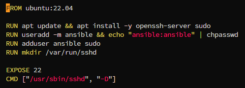

Kontener uruchomiono z mapowaniem portu SSH:

```bash
docker run -d -p 2222:22 --name ansible-target ansible-target:latest
```

Na hoście docelowym ustawiono nazwę:

```bash
hostnamectl set-hostname ansible-target
```

Na maszynie głównej zainstalowano Ansible z repozytorium dystrybucji:

```bash
apt install ansible -y
```

---

## Konfiguracja dostępu SSH

Aby umożliwić bezhasłowe logowanie orchestratora do hosta docelowego, wygenerowano parę kluczy SSH:

```bash
ssh-keygen
```

Następnie wykonano wymianę kluczy:

```bash
ssh-copy-id -p 2222 ansible@127.0.0.1
```

Poprawność konfiguracji zweryfikowano poleceniem:

```bash
ssh -p 2222 ansible@127.0.0.1
```

Połączenie działało poprawnie bez konieczności podawania hasła.

---

## Inwentaryzacja systemów

Utworzono plik `inventory.ini` z wymaganymi sekcjami `Orchestrators` oraz `Endpoints`:

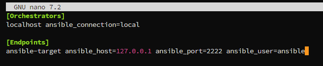

Weryfikację łączności przeprowadzono komendą:

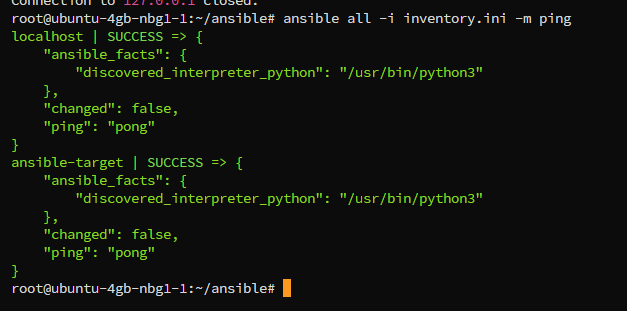

Uzyskany wynik potwierdza to, że hosty były poprawnie widoczne i osiągalne dla Ansible.

---

## Playbook: test łączności

Przygotowano playbook `ping.yml`:

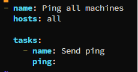

Uruchomienie:

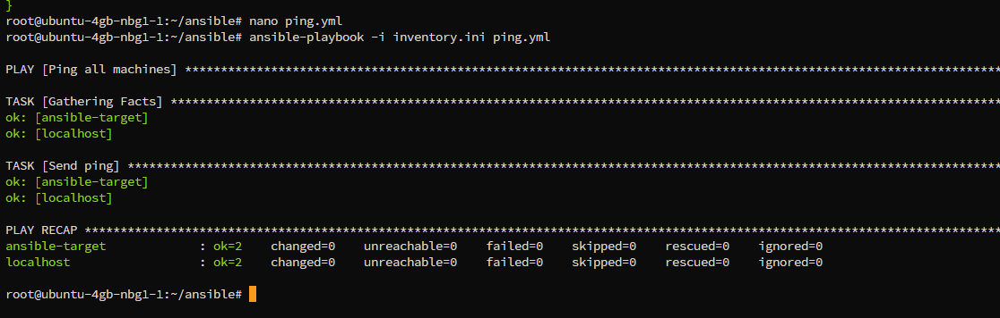

Wszystkie hosty odpowiedziały poprawnie.

---

## Playbook: kopiowanie pliku inventory

Przygotowano playbook `copy_inventory.yml`, kopiujący plik inwentaryzacji na hosty z grupy `Endpoints`:

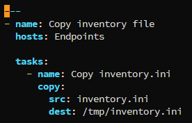

Po pierwszym uruchomieniu:

```text
changed=1
```

Po ponownym wykonaniu:

```text
changed=0
```
---

## Playbook: aktualizacja pakietów

Do aktualizacji pakietów systemowych przygotowano playbook `update.yml`:

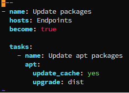

Playbook poprawnie zaktualizował pakiety systemowe na hoście docelowym.

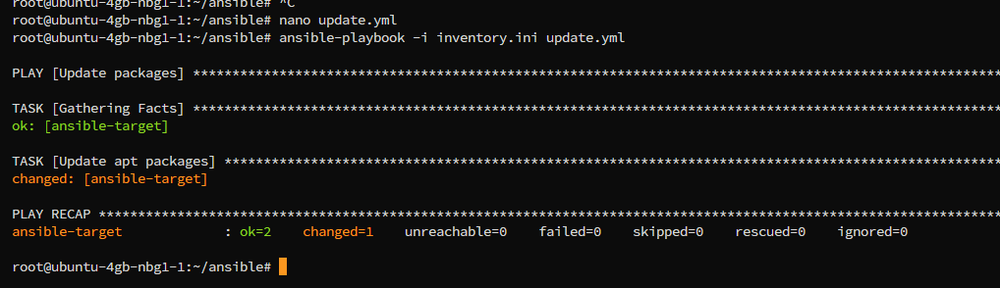
---

## Playbook: restart usług

Przygotowano playbook `restart.yml` restartujący usługę SSH:

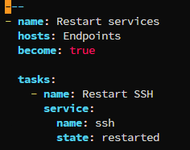

---

## Sanity check hosta docelowego

Przygotowano playbook `sanity.yml` weryfikujący podstawową gotowość hosta przed wdrożeniem:

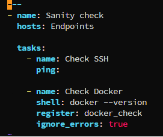

Playbook poprawnie wykrywał brak Dockera:

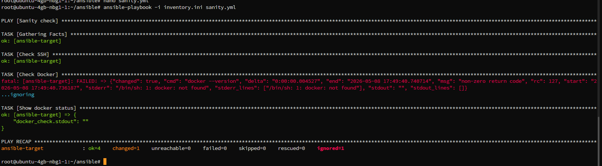

---

## Przygotowanie roli Ansible

Utworzono rolę za pomocą szkieletowania:

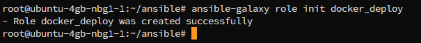

Wygenerowana została standardowa struktura:

```text
docker_deploy/
├── defaults
├── files
├── handlers
├── meta
├── tasks
├── templates
├── tests
└── vars
```

Uzupełniono plik `meta/main.yml`:

```yaml
galaxy_info:
  author: Mateusz
  description: Docker deployment role
  company: University
  license: MIT
  min_ansible_version: "2.9"
  platforms:
    - name: Ubuntu
      versions:
        - all
dependencies: []
```

W `tasks/main.yml` przygotowano zadania instalacji i uruchomienia Dockera:

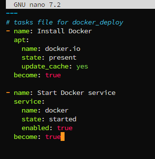

Rolę wykorzystano w playbooku `deploy.yml`:

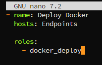

---

## Wnioski

Podczas zajęć skonfigurowano środowisko Ansible umożliwiające automatyzację zadań administracyjnych oraz zdalne zarządzanie systemami Linux. Przygotowano inventory, playbooki oraz role Ansible. Zweryfikowano działanie połączeń SSH, kopiowanie plików, aktualizację systemu oraz obsługę błędów i niedostępnych hostów.

Ćwiczenie pozwoliło zapoznać się z praktycznym wykorzystaniem Ansible w środowiskach DevOps oraz z podstawami automatyzacji wdrożeń i zarządzania konfiguracją systemów.
