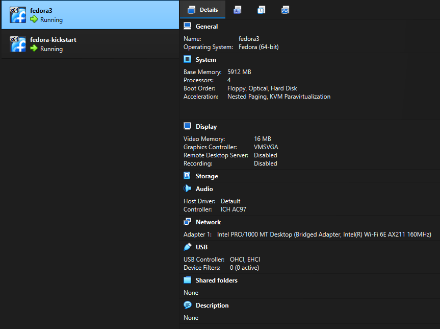
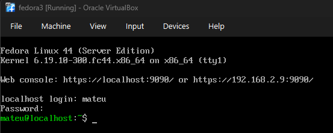
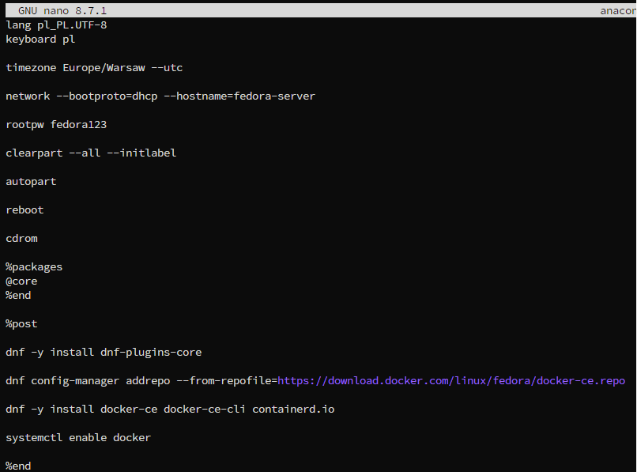
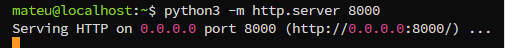
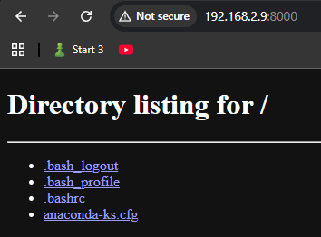
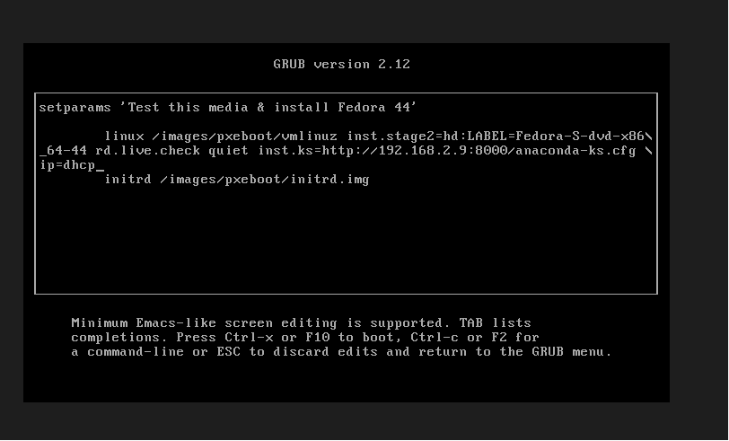
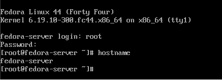
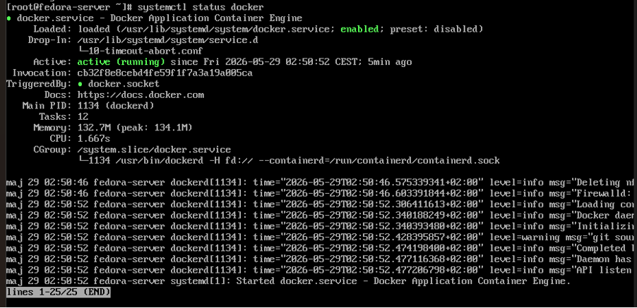

# Sprawozdanie: Instalacja nienadzorowana Fedora Server z wykorzystaniem Kickstart

**Temat zajęć:** Zajęcia 09 – pliki odpowiedzi dla wdrożeń nienadzorowanych  
**Narzędzie:** Fedora Kickstart (Anaconda)  
**Środowisko:** Fedora Server 44, VirtualBox, HTTP Server, Docker  
**Zakres:** Kickstart, instalacja nienadzorowana, automatyczna konfiguracja systemu, automatyczna instalacja Dockera

---

## Cel ćwiczenia

Celem zajęć było przygotowanie pliku odpowiedzi Kickstart umożliwiającego przeprowadzenie automatycznej instalacji systemu Fedora Server bez udziału użytkownika oraz skonfigurowanie środowiska w taki sposób, aby po zakończeniu instalacji automatycznie zainstalowany został Docker.

---

## Przygotowanie środowiska

Do realizacji ćwiczenia wykorzystano dwie maszyny wirtualne:

- **Fedora Server** pełniąca rolę serwera HTTP udostępniającego plik Kickstart,
- **Fedora Server** instalowana automatycznie przy użyciu pliku odpowiedzi.

Maszyny uruchomiono w środowisku VirtualBox z konfiguracją sieci typu **Bridged Adapter**.



---

## Instalacja Fedora Server

Pobrano obraz:

- [Fedora Server 44 DVD ISO](https://download.fedoraproject.org/pub/fedora/linux/releases/)

Następnie utworzono maszynę wirtualną oraz przeprowadzono standardową instalację systemu Fedora Server. Po instalacji skonfigurowano użytkownika administracyjnego i uzyskano dostęp do systemu.



---

## Przygotowanie pliku Kickstart

Z istniejącej instalacji pobrano plik odpowiedzi wygenerowany przez Anacondę:

```bash
sudo cp /root/anaconda-ks.cfg ~/
```

Plik został zmodyfikowany zgodnie z wymaganiami ćwiczenia. Najważniejsze zmiany:

```text
lang pl_PL.UTF-8
keyboard pl

timezone Europe/Warsaw --utc

network --bootproto=dhcp --hostname=fedora-server

rootpw fedora123

clearpart --all --initlabel

autopart

reboot
```

Dodatkowo dodano sekcję `%post` instalującą Docker:

```text
%post

dnf -y install dnf-plugins-core
dnf config-manager addrepo --from-repofile=https://download.docker.com/linux/fedora/docker-ce.repo
dnf -y install docker-ce docker-ce-cli containerd.io
systemctl enable docker

%end
```

Pełna zawartość pliku znajduje się w repozytorium: [`anaconda-ks.cfg`](./anaconda-ks.cfg).



---

## Udostępnienie pliku Kickstart

W celu umożliwienia pobrania pliku odpowiedzi przez instalator uruchomiono prosty serwer HTTP:

```bash
python3 -m http.server 8000
```

Serwer został uruchomiony pod adresem:

```text
http://192.168.2.9:8000
```

Poprawność działania zweryfikowano z poziomu przeglądarki.





---

## Uruchomienie instalacji nienadzorowanej

Dla nowej maszyny wirtualnej uruchomiono instalator Fedora Server. W menu GRUB użyto parametru:

```text
inst.ks=http://192.168.2.9:8000/anaconda-ks.cfg ip=dhcp
```

Parametr `inst.ks` spowodował automatyczne pobranie pliku Kickstart przez instalator Anaconda.



---

## Pobranie pliku odpowiedzi

Podczas uruchamiania instalatora serwer HTTP zarejestrował pobranie pliku:

```text
GET /anaconda-ks.cfg HTTP/1.1" 200
```

Potwierdza to poprawne pobranie pliku odpowiedzi przez instalator.


---

## Automatyczna instalacja systemu

Po pobraniu pliku Kickstart instalacja została przeprowadzona bez udziału użytkownika. Automatycznie wykonano:

- wyczyszczenie dysku (`clearpart --all`),
- utworzenie partycji (`autopart`),
- konfigurację sieci i ustawienie hostname,
- instalację pakietów,
- restart systemu (`reboot`).

---

## Weryfikacja instalacji

Po zakończeniu instalacji zalogowano się jako użytkownik `root` i sprawdzono hostname:

```bash
hostname
```

Wynik:

```text
fedora-server
```

Potwierdza to poprawne wykonanie konfiguracji zawartej w pliku Kickstart.



---

## Weryfikacja instalacji Dockera

Sprawdzono status usługi Docker:

```bash
systemctl status docker
```

Uzyskano wynik:

```text
Active: active (running)
```

Oznacza to, że sekcja `%post` została wykonana poprawnie: Docker został automatycznie zainstalowany, włączony (`systemctl enable docker`) oraz uruchomiony po pierwszym starcie systemu.



---

## Wnioski

Podczas ćwiczenia przygotowano plik odpowiedzi Kickstart umożliwiający przeprowadzenie automatycznej instalacji systemu Fedora Server. Plik został udostępniony za pomocą serwera HTTP i pobrany przez instalator Anaconda przy użyciu parametru `inst.ks`. Instalacja została wykonana bez udziału użytkownika, a system po zakończeniu instalacji automatycznie skonfigurował hostname, przeprowadził restart oraz zainstalował usługę Docker.

Ćwiczenie pozwoliło zapoznać się z mechanizmem wdrożeń nienadzorowanych oraz automatyzacją konfiguracji środowisk serwerowych wykorzystywanych w procesach DevOps - jako uzupełnienie wcześniejszej pracy z Ansible (zajęcia 08), gdzie Docker był wdrażany na już działającym hoście, tutaj cały system wraz z konteneryzacją powstaje w jednym przebiegu instalacji.
