# Sprawozdanie: Wdrażanie aplikacji w Kubernetes z wykorzystaniem Minikube

**Temat zajęć:** Zajęcia 10 – Wdrażanie na zarządzalne kontenery: Kubernetes 

**Technologie:** Kubernetes, Minikube, Docker, kubectl, Kubernetes Dashboard

**Środowisko:** Ubuntu Server 24.04, Docker Engine, Minikube v1.38.1

**Zakres:** konfiguracja klastra Kubernetes, uruchamianie podów, deploymentów i serwisów

---

# Cel ćwiczenia

Celem ćwiczenia było zapoznanie się z podstawowymi mechanizmami działania platformy Kubernetes oraz wdrożenie aplikacji kontenerowej w lokalnym klastrze Kubernetes uruchomionym przy pomocy Minikube. 

Dodatkowym celem było poznanie sposobu zarządzania wdrożeniami, replikami oraz usługami za pomocą narzędzia kubectl oraz Kubernetes Dashboard.

---

# Przygotowanie środowiska

Do realizacji ćwiczenia wykorzystano serwer Ubuntu 24.04, na którym wcześniej zainstalowano środowisko Docker.

Następnie zainstalowano:

- Minikube,
- kubectl,
- Kubernetes Dashboard.

Sprawdzenie poprawności instalacji:

```bash
minikube version
kubectl version --client
```

---

# Uruchomienie klastra Kubernetes

Klaster został uruchomiony przy użyciu sterownika Docker.

```bash
minikube start --driver=docker --memory=2048 --cpus=2
```
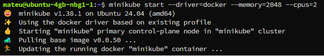

Po uruchomieniu zweryfikowano stan klastra:

```bash
kubectl get nodes
```

Wynik:

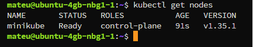

Stan „Ready” potwierdził poprawne uruchomienie węzła klastra.

---

# Analiza komponentów systemowych

Sprawdzono działanie podstawowych komponentów Kubernetes:

```bash
kubectl get pods -A
```

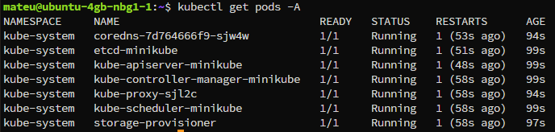

Polecenie wyświetliło uruchomione komponenty systemowe, między innymi:

- CoreDNS,
- kube-apiserver,
- etcd,
- kube-scheduler,
- storage-provisioner.

Potwierdziło to poprawne działanie klastra.

---

# Uruchomienie aplikacji w postaci poda

Jako przykładową aplikację wykorzystano serwer WWW nginx.

Utworzono pojedynczy pod:

```bash
kubectl run nginx-pod \
  --image=nginx \
  --port=80 \
  --labels app=nginx-pod
```
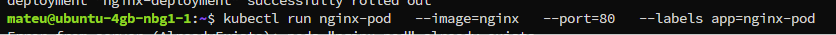
Sprawdzenie działania:

```bash
kubectl get pods
```

Wynik:

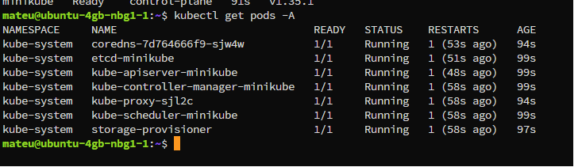
Status „Running” potwierdził poprawne uruchomienie kontenera.

---

# Udostępnienie aplikacji

W celu uzyskania dostępu do aplikacji wykorzystano mechanizm port-forward.

```bash
kubectl port-forward pod/nginx-pod 8080:80
```


Następnie sprawdzono komunikację:

```bash
curl localhost:8080
```
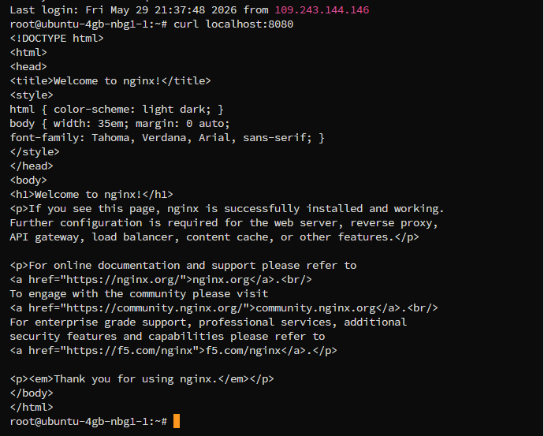

Otrzymano stronę powitalną nginx:

```html
<h1>Welcome to nginx!</h1>
```

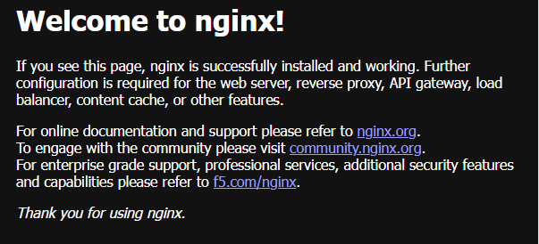

Potwierdziło to poprawne działanie aplikacji oraz komunikację z kontenerem.


---

# Utworzenie deploymentu

W kolejnym etapie przygotowano plik wdrożeniowy YAML.

Plik `deployment.yaml`:

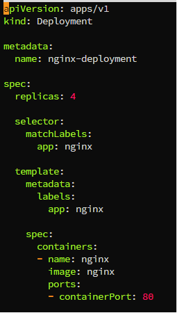

Deployment definiował aplikację nginx uruchamianą w czterech replikach.

---

# Wdrożenie deploymentu

Wdrożenie zostało zaaplikowane do klastra:

```bash
kubectl apply -f deployment.yaml
```

Następnie sprawdzono status:

```bash
kubectl rollout status deployment/nginx-deployment
```

Wynik:

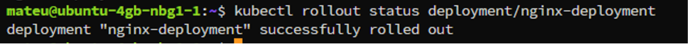
---

# Weryfikacja replik

Sprawdzono stan deploymentu:

```bash
kubectl get deployments
```

Wynik:

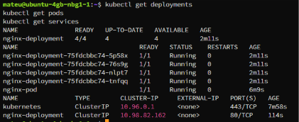

Zweryfikowano również pody:

```bash
kubectl get pods
```

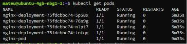

Uruchomione zostały cztery repliki aplikacji nginx.

---

# Utworzenie serwisu

Deployment został wyeksponowany jako serwis typu ClusterIP.

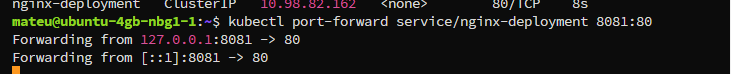
Sprawdzenie:

```bash
kubectl get services
```

Wynik:

```text
NAME               TYPE        CLUSTER-IP
nginx-deployment   ClusterIP   10.98.82.162
```

---

# Kubernetes Dashboard

Uruchomiono dodatki Dashboard oraz Metrics Server:

```bash
minikube addons enable dashboard
minikube addons enable metrics-server
```

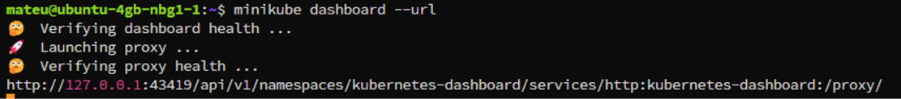

Następnie uruchomiono panel administracyjny:

```bash
minikube dashboard --url
```

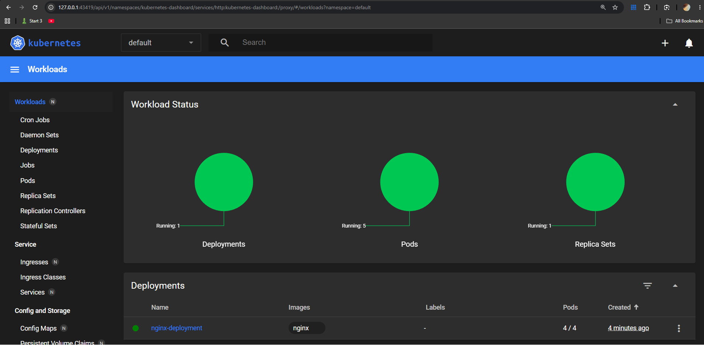

Dashboard umożliwił obserwację:

- deploymentów,
- podów,
- ReplicaSetów,
- serwisów,
- wykorzystania zasobów klastra.

W panelu widoczny był deployment nginx-deployment oraz cztery działające repliki.

---

# Wyniki

W ramach ćwiczenia utworzono i skonfigurowano lokalny klaster Kubernetes oparty o Minikube. Uruchomiono aplikację nginx zarówno jako pojedynczy pod, jak i w postaci deploymentu zarządzanego przez Kubernetes. Utworzono serwis umożliwiający komunikację z aplikacją oraz zweryfikowano działanie wszystkich elementów przy pomocy narzędzia kubectl i Kubernetes Dashboard.

---

# Wnioski

Kubernetes umożliwia automatyczne zarządzanie aplikacjami kontenerowymi, ich skalowanie oraz monitorowanie. Dzięki wykorzystaniu deploymentów możliwe jest utrzymywanie określonej liczby replik aplikacji oraz automatyczne odtwarzanie uszkodzonych instancji. Mechanizm serwisów pozwala na komunikację z aplikacjami niezależnie od zmian zachodzących w klastrze. Minikube stanowi wygodne środowisko testowe umożliwiające naukę oraz eksperymentowanie z funkcjonalnościami Kubernetes bez konieczności korzystania z pełnej infrastruktury produkcyjnej.