# Sprawozdanie: Wdrażanie aplikacji w Kubernetes - aktualizacje, skalowanie i strategie wdrożeń

**Temat zajęć:** Zajęcia 11 – Wdrażanie na zarządzalne kontenery: Kubernetes (2)

**Technologie:** Kubernetes, Minikube, Docker, Docker Hub, kubectl

**Środowisko:** Ubuntu Server 24.04, Docker Engine, Minikube v1.38.1

**Zakres:** zarządzanie wdrożeniami, aktualizacje obrazów, skalowanie aplikacji, rollback, strategie wdrożeń

---

# Cel ćwiczenia

Celem ćwiczenia było zapoznanie się z mechanizmami aktualizacji aplikacji działających w Kubernetes oraz poznanie sposobów zarządzania wdrożeniami przy użyciu Deploymentów. W ramach ćwiczenia przeprowadzono skalowanie aplikacji, aktualizację obrazów kontenerów, analizę historii wdrożeń oraz przywracanie wcześniejszych wersji aplikacji.

Dodatkowym celem było poznanie strategii wdrożeń RollingUpdate, Recreate oraz Canary Deployment.

---

# Przygotowanie obrazów aplikacji

Do realizacji ćwiczenia wykorzystano własny obraz aplikacji opublikowany w Docker Hub.

Przygotowano trzy wersje obrazu:

* `bobpop231/deploy:v1`
* `bobpop231/deploy:v2`
* `bobpop231/deploy:broken`

Wersje v1 oraz v2 zawierały poprawnie działającą aplikację, natomiast wersja `broken` została przygotowana w celu zasymulowania błędnego wdrożenia.

Sprawdzenie dostępnych obrazów:

```bash
docker image ls
```

Wynik:

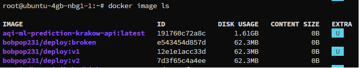

---

# Aktualizacja Deploymentu

Sprawdzono aktualnie działający deployment:

```bash
kubectl get deployments
```

Następnie przeprowadzono aktualizację obrazu aplikacji.

Aktualizacja do wersji v2:

```bash
kubectl set image deployment/deploy-app \
deploy-app=bobpop231/deploy:v2
```

Po wykonaniu aktualizacji sprawdzono stan wdrożenia:

```bash
kubectl rollout status deployment/deploy-app
```

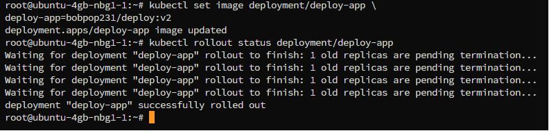

Deployment został poprawnie zaktualizowany.

---

# Skalowanie aplikacji

W kolejnym etapie przetestowano mechanizm skalowania replik.

Zwiększenie liczby replik:

```bash
kubectl scale deployment deploy-app --replicas=8
```

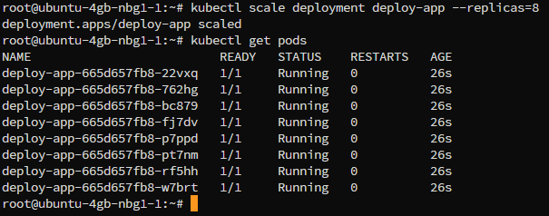

Zmniejszenie liczby replik:

```bash
kubectl scale deployment deploy-app --replicas=1
```

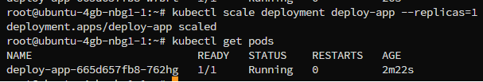


Zmniejszenie liczby replik do zera:

```bash
kubectl scale deployment deploy-app --replicas=0
```

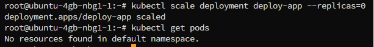

Ponowne uruchomienie aplikacji:

```bash
kubectl scale deployment deploy-app --replicas=4
```

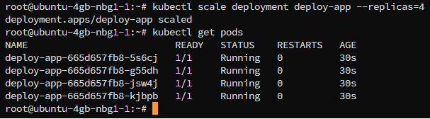

Po każdej operacji weryfikowano stan podów:

```bash
kubectl get pods
```

Kubernetes automatycznie tworzył lub usuwał repliki zgodnie z zadaną konfiguracją.

---

# Historia wdrożeń

Sprawdzono historię wdrożeń Deploymentu.

```bash
kubectl rollout history deployment/deploy-app
```
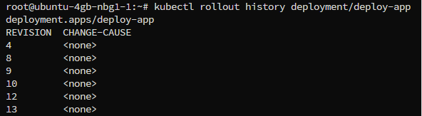

Wynik zawierał kolejne rewizje deploymentu.

Przykładowe rewizje:

* Revision 4
* Revision 8
* Revision 9

Każda rewizja odpowiadała kolejnej aktualizacji obrazu aplikacji.

---

# Test błędnego wdrożenia

W celu sprawdzenia zachowania Kubernetes podczas błędnej aktualizacji wdrożono obraz:

```bash
kubectl set image deployment/deploy-app deploy-app=bobpop231/deploy:broken
```

Następnie sprawdzono stan podów:

```bash
kubectl get pods
```

Wynik:

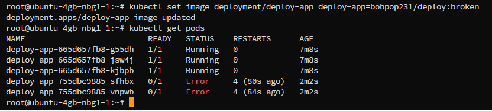

Oznaczało to, że Kubernetes pobrał obraz, jednak aplikacja nie była w stanie poprawnie się uruchomić.

Dodatkowo przeanalizowano logi:

```bash
kubectl logs deploy-app-755dbc9885-sfhbx
```

oraz szczegóły poda:

```bash
kubectl describe pod deploy-app-755dbc9885-sfhbx
```

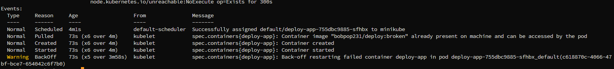

Mechanizm CrashLoopBackOff potwierdził niepoprawne działanie wdrażanej aplikacji.

---

# Przywracanie poprzedniej wersji

Po wykryciu błędu przywrócono poprzednią działającą wersję aplikacji.

```bash
kubectl rollout undo deployment/deploy-app
```

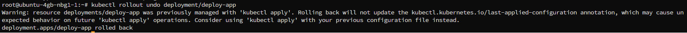

Po wykonaniu rollbacku sprawdzono stan deploymentu:

```bash
kubectl get pods
```

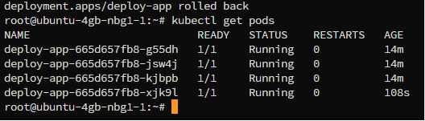

Wszystkie repliki powróciły do stanu Running.

---

# Strategia RollingUpdate

Deployment wykorzystywał domyślną strategię RollingUpdate. Informacja została zweryfikowana za pomocą polecenia:

```bash
kubectl get deployment deploy-app -o yaml
```

W konfiguracji deploymentu znajdował się wpis:

```yaml
strategy:
  rollingUpdate:
    maxSurge: 25%
    maxUnavailable: 25%
  type: RollingUpdate
```

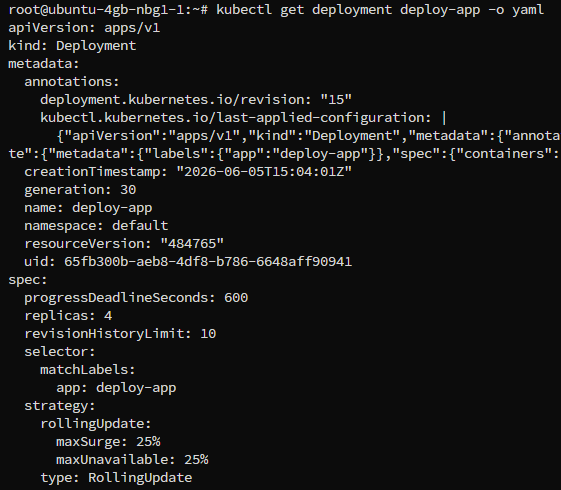

Podczas aktualizacji obrazu aplikacji Kubernetes stopniowo zastępował stare pody nowymi, utrzymując ciągłość działania usługi.

---

# Strategia Recreate

Następnie przetestowano strategię Recreate.

Konfiguracja:

```yaml
strategy:
  type: Recreate
```

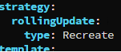

W celu sprawdzenia działania strategii zmodyfikowano konfigurację deploymentu, a następnie przeprowadzono aktualizację obrazu aplikacji.

Podczas obserwacji podów za pomocą polecenia:

```bash
kubectl get pods -w
```

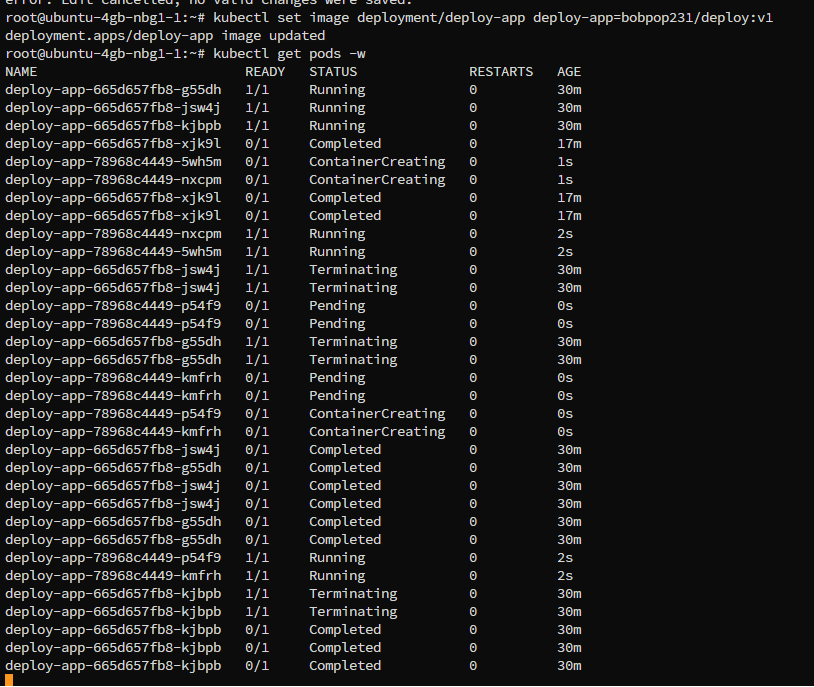

Zaobserwowano usuwanie wszystkich działających podów (status Terminating), a następnie tworzenie nowych instancji aplikacji (Pending → ContainerCreating → Running).

Potwierdziło to działanie strategii Recreate, w której wszystkie istniejące pody są usuwane przed uruchomieniem nowych. W efekcie wystąpiła krótka przerwa w dostępności usługi, jednak po zakończeniu procesu wdrożenia aplikacja została ponownie uruchomiona we wszystkich wymaganych replikach.

---

# Canary Deployment

Przygotowano wdrożenie typu Canary.

Utworzono dwa niezależne deploymenty:

* `deploy-app` – wersja stable (4 repliki),
* `deploy-app-canary` – wersja canary (1 replika).

Oba deploymenty korzystały ze wspólnej etykiety:

```yaml
app: deploy-app
```

natomiast rozróżniano je za pomocą etykiety wersji:

```yaml
version: stable
version: canary
```

Poprawność konfiguracji zweryfikowano za pomocą poleceń:

```bash
kubectl get deployments
kubectl get pods --show-labels
```

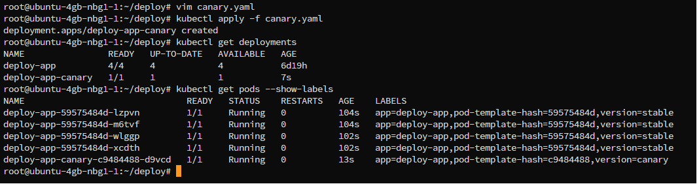

Wyniki potwierdziły działanie czterech replik wersji stabilnej oraz jednej repliki wersji Canary. Dzięki wykorzystaniu wspólnego serwisu ruch mógł być kierowany zarówno do wersji stabilnej, jak i testowej.

Zastosowanie Canary Deployment umożliwia bezpieczne testowanie nowej wersji aplikacji na niewielkiej części ruchu przed jej pełnym wdrożeniem dla wszystkich użytkowników.

---

# Skrypt weryfikacji wdrożenia

Przygotowano skrypt sprawdzający, czy wdrożenie zakończyło się sukcesem w czasie nieprzekraczającym 60 sekund.

Na serwerze Ubuntu utworzono plik `check.sh`:

```bash
nano check.sh
```

Do pliku zapisano następującą zawartość:

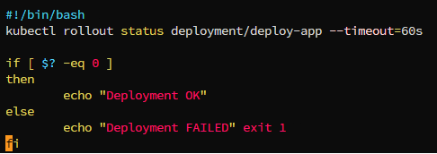

Następnie nadano uprawnienia do uruchamiania:

```bash
chmod +x check.sh
```

Uruchomienie skryptu:

```bash
./check.sh
```

Skrypt wykorzystuje polecenie:

```bash
kubectl rollout status deployment/deploy-app --timeout=60s
```

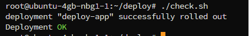

które monitoruje proces wdrażania Deploymentu. Jeżeli wszystkie repliki zostaną poprawnie uruchomione w czasie krótszym niż 60 sekund, skrypt wyświetla komunikat:

```text
Deployment OK
```

W przeciwnym przypadku wyświetlany jest komunikat:

```text
Deployment FAILED
```

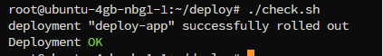

oraz zwracany jest kod błędu, który może zostać wykorzystany przez system CI/CD lub pipeline Jenkins do automatycznego wykrywania nieudanych wdrożeń.

---

# Wyniki

W ramach ćwiczenia przygotowano kilka wersji obrazu aplikacji oraz przeprowadzono ich wdrażanie w klastrze Kubernetes. Zweryfikowano działanie mechanizmów skalowania, aktualizacji obrazów, historii wdrożeń oraz przywracania wcześniejszych wersji aplikacji. Przetestowano również zachowanie klastra podczas wdrożenia błędnej wersji aplikacji oraz zapoznano się z różnymi strategiami wdrożeń.

---

# Wnioski

Kubernetes zapewnia rozbudowane mechanizmy zarządzania aplikacjami kontenerowymi. Dzięki Deploymentom możliwe jest bezpieczne aktualizowanie aplikacji bez przerywania ich działania. Mechanizm Rollout History pozwala śledzić historię zmian, natomiast Rollback umożliwia szybkie przywrócenie poprzedniej stabilnej wersji systemu. Skalowanie aplikacji odbywa się automatycznie i nie wymaga ręcznej ingerencji w uruchamiane kontenery. Strategie RollingUpdate, Recreate oraz Canary Deployment pozwalają dostosować sposób wdrażania nowych wersji aplikacji do wymagań środowiska produkcyjnego oraz poziomu akceptowalnego ryzyka.
