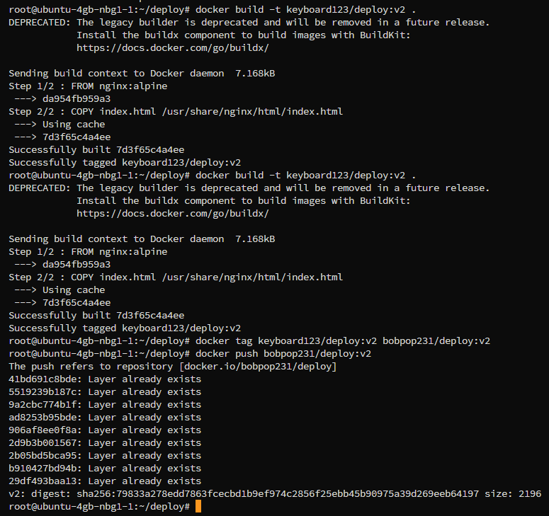
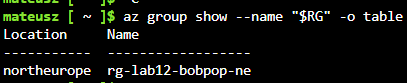
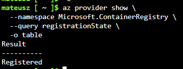
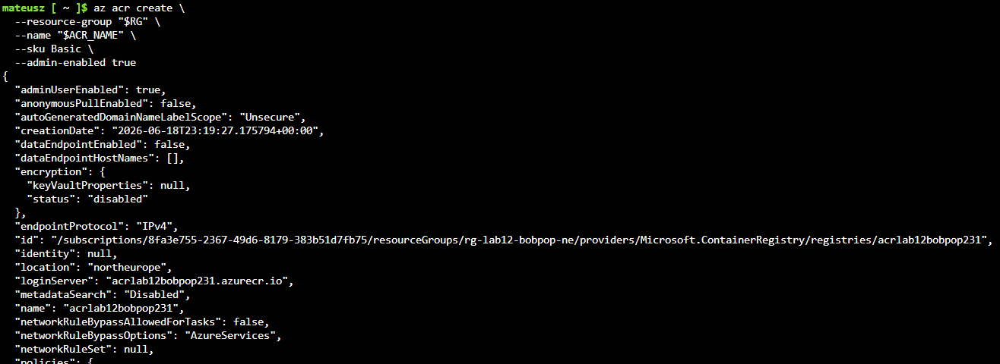
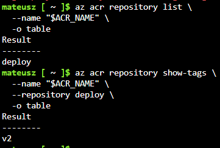
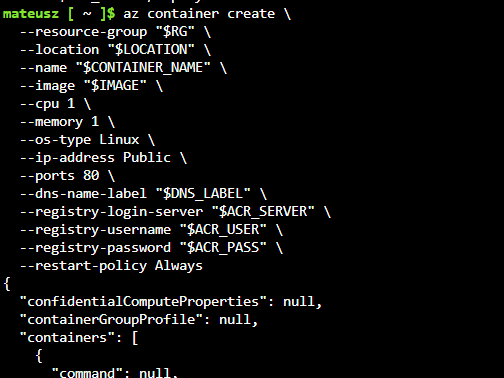
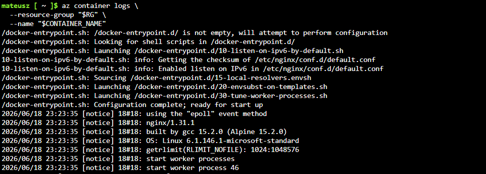
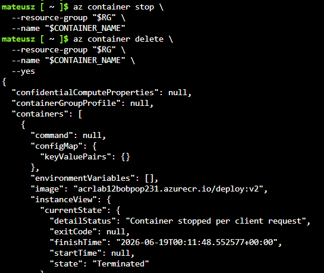
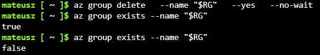

# Sprawozdanie: Wdrażanie kontenera w chmurze Azure

**Temat zajęć:** Zajęcia 12 – Wdrażanie na zarządzalne kontenery w chmurze Azure

**Technologie:** Azure Container Instances, Azure Container Registry, Azure Cloud Shell, Docker, Docker Hub, Azure CLI

**Środowisko:** Azure Portal, Azure Cloud Shell Bash, Docker Hub, Azure Container Registry, obraz kontenera oparty o nginx

**Zakres:** przygotowanie obrazu kontenera, publikacja obrazu, utworzenie grupy zasobów, przygotowanie rejestru ACR, wdrożenie kontenera, sprawdzenie działania HTTP, pobranie logów oraz usunięcie zasobów

---

# Cel ćwiczenia

Celem ćwiczenia było wdrożenie własnej aplikacji kontenerowej w chmurze Microsoft Azure. W ramach zadania przygotowano obraz kontenera, opublikowano go w Docker Hub, utworzono zasoby w Azure, uruchomiono kontener w usłudze Azure Container Instances oraz sprawdzono dostęp do aplikacji przez HTTP.

---

# Przygotowanie obrazu kontenera

Do ćwiczenia wykorzystano prostą aplikację statyczną działającą na serwerze nginx.

Plik `Dockerfile`:

```dockerfile
FROM nginx:alpine
COPY index.html /usr/share/nginx/html/index.html
```

Obraz został zbudowany poleceniem:

```bash
docker build -t keyboard123/deploy:v2 .
```

Następnie obraz oznaczono tagiem zgodnym z kontem Docker Hub:

```bash
docker tag keyboard123/deploy:v2 bobpop231/deploy:v2
```

Obraz został wysłany do Docker Hub:

```bash
docker push bobpop231/deploy:v2
```

Obraz aplikacji był dostępny jako:

```text
bobpop231/deploy:v2
```



---

# Przygotowanie środowiska Azure

Do pracy wykorzystano Azure Cloud Shell w trybie Bash. Ustawiono podstawowe zmienne:

```bash
RG="rg-lab12-bobpop-ne"
LOCATION="northeurope"
ACR_NAME="acrlab12bobpop231"
```

Następnie utworzono grupę zasobów:

```bash
az group create \
  --name "$RG" \
  --location "$LOCATION"
```

Sprawdzenie grupy zasobów:

```bash
az group show --name "$RG" -o table
```



---

# Rejestracja wymaganych usług

Przed utworzeniem zasobów zarejestrowano wymagane providery Azure.

Rejestracja Azure Container Instances:

```bash
az provider register --namespace Microsoft.ContainerInstance
```

Rejestracja Azure Container Registry:

```bash
az provider register --namespace Microsoft.ContainerRegistry
```

Sprawdzenie statusu:

```bash
az provider show \
  --namespace Microsoft.ContainerRegistry \
  --query registrationState \
  -o table
```

Wynik:

```text
Registered
```



---

# Uwaga dotycząca architektury wdrożenia

Obraz aplikacji został przygotowany i opublikowany w Docker Hub. Następnie, w celu stabilnego wdrożenia w Azure Container Instances, obraz został zaimportowany do Azure Container Registry i uruchomiony z tego rejestru. Wdrożona aplikacja nadal była tym samym własnym obrazem kontenera `bobpop231/deploy:v2`.

---

# Utworzenie Azure Container Registry

Utworzono rejestr kontenerów Azure Container Registry:

```bash
az acr create \
  --resource-group "$RG" \
  --name "$ACR_NAME" \
  --sku Basic \
  --admin-enabled true
```

Rejestr został utworzony poprawnie. W wyniku widoczny był stan:

```text
provisioningState: Succeeded
loginServer: acrlab12bobpop231.azurecr.io
```



Następnie pobrano dane rejestru:

```bash
ACR_SERVER=$(az acr show \
  --name "$ACR_NAME" \
  --query loginServer \
  -o tsv)

ACR_USER=$(az acr credential show \
  --name "$ACR_NAME" \
  --query username \
  -o tsv)

ACR_PASS=$(az acr credential show \
  --name "$ACR_NAME" \
  --query passwords[0].value \
  -o tsv)
```

---

# Import obrazu do Azure Container Registry

Obraz z Docker Hub został zaimportowany do Azure Container Registry:

```bash
DOCKER_USER="bobpop231"
read -s -p "Docker PAT: " DOCKER_PAT
```

Import obrazu:

```bash
az acr import \
  --name "$ACR_NAME" \
  --source docker.io/bobpop231/deploy:v2 \
  --image deploy:v2 \
  --username "$DOCKER_USER" \
  --password "$DOCKER_PAT"
```

Sprawdzenie repozytorium w ACR:

```bash
az acr repository list \
  --name "$ACR_NAME" \
  -o table
```

Wynik:

```text
deploy
```

Sprawdzenie tagów:

```bash
az acr repository show-tags \
  --name "$ACR_NAME" \
  --repository deploy \
  -o table
```

Wynik:

```text
v2
```



---

# Wdrożenie kontenera w Azure Container Instances

Ustawiono zmienne dla kontenera:

```bash
CONTAINER_NAME="aci-zajecia12-acr"
DNS_LABEL="zajecia12-bobpop231-acr-123456"
IMAGE="$ACR_SERVER/deploy:v2"
```

Następnie utworzono kontener:

```bash
az container create \
  --resource-group "$RG" \
  --location "$LOCATION" \
  --name "$CONTAINER_NAME" \
  --image "$IMAGE" \
  --cpu 1 \
  --memory 1 \
  --os-type Linux \
  --ip-address Public \
  --ports 80 \
  --dns-name-label "$DNS_LABEL" \
  --registry-login-server "$ACR_SERVER" \
  --registry-username "$ACR_USER" \
  --registry-password "$ACR_PASS" \
  --restart-policy Always
```



---

# Sprawdzenie stanu kontenera

Stan kontenera sprawdzono poleceniem:

```bash
az container show \
  --resource-group "$RG" \
  --name "$CONTAINER_NAME" \
  --query "{name:name, provisioningState:provisioningState, state:containers[0].instanceView.currentState.state, detail:containers[0].instanceView.currentState.detailStatus, image:containers[0].image, ip:ipAddress.ip, fqdn:ipAddress.fqdn}" \
  -o table
```

Wynik:


Stan `Succeeded` oraz `Running` potwierdził poprawne uruchomienie kontenera.

---

# Sprawdzenie dostępu HTTP

Adres FQDN pobrano poleceniem:

```bash
FQDN=$(az container show \
  --resource-group "$RG" \
  --name "$CONTAINER_NAME" \
  --query ipAddress.fqdn \
  -o tsv)

echo $FQDN
```

Wynik:

```text
zajecia12-bobpop231-acr-123456.northeurope.azurecontainer.io
```

Następnie sprawdzono działanie aplikacji:

```bash
curl http://$FQDN
```


Odpowiedź:

```html
<!DOCTYPE html>
<html>
<body>
    <h1>Version 2</h1>
</body>
</html>
```

Odpowiedź HTTP potwierdziła, że aplikacja działa poprawnie i jest dostępna publicznie.

---

# Pobranie logów kontenera

Logi kontenera pobrano poleceniem:

```bash
az container logs \
  --resource-group "$RG" \
  --name "$CONTAINER_NAME"
```

Logi pozwoliły potwierdzić działanie uruchomionej aplikacji.



---

# Zatrzymanie i usunięcie kontenera

Po zakończeniu testów kontener zatrzymano:

```bash
az container stop \
  --resource-group "$RG" \
  --name "$CONTAINER_NAME"
```

Następnie kontener usunięto:

```bash
az container delete \
  --resource-group "$RG" \
  --name "$CONTAINER_NAME" \
  --yes
```

Sprawdzenie listy kontenerów:

```bash
az container list \
  --resource-group "$RG" \
  -o table
```



---

# Usunięcie resource group

Na końcu usunięto całą grupę zasobów:

```bash
az group delete \
  --name "$RG" \
  --yes \
  --no-wait
```

Sprawdzenie usunięcia grupy:

```bash
az group exists --name "$RG"
```

Wynik:

```text
false
```

Usunięcie całej grupy zasobów usuwa kontener, rejestr ACR oraz pozostałe zasoby utworzone podczas ćwiczenia.



---

# Wyniki

W ramach ćwiczenia przygotowano obraz aplikacji oparty o nginx, opublikowano go w Docker Hub, zaimportowano do Azure Container Registry i wdrożono w Azure Container Instances. Kontener został uruchomiony w regionie `northeurope`, otrzymał publiczny adres IP oraz nazwę FQDN:

```text
zajecia12-bobpop231-acr-123456.northeurope.azurecontainer.io
```

Aplikacja była dostępna przez HTTP i zwróciła stronę z napisem:

```text
Version 2
```

---

# Wnioski

Azure Container Instances pozwala szybko uruchomić aplikację kontenerową bez tworzenia maszyny wirtualnej ani klastra Kubernetes. Po przygotowaniu obrazu i umieszczeniu go w rejestrze kontenerów można wdrożyć aplikację poleceniem `az container create`, wystawić ją publicznie przez port 80 i uzyskać dostęp przez adres FQDN.

Ćwiczenie pokazało również znaczenie poprawnego zarządzania zasobami w chmurze. Po zakończeniu pracy należy usunąć całą resource group, aby skasować wszystkie utworzone zasoby i uniknąć dalszego naliczania kosztów.
