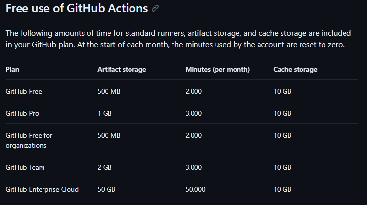
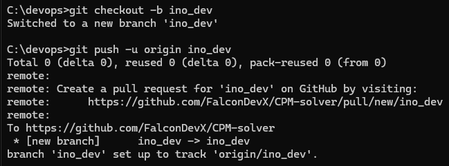
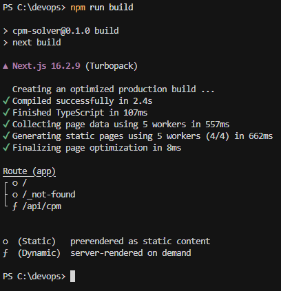
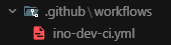
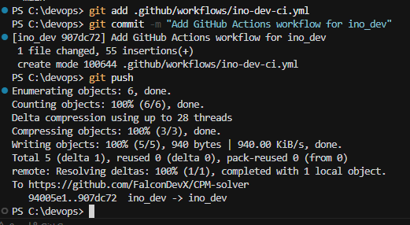
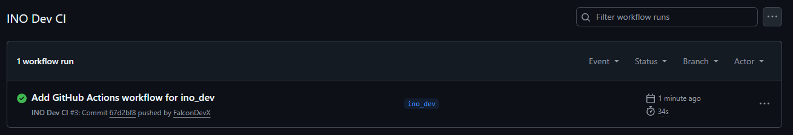
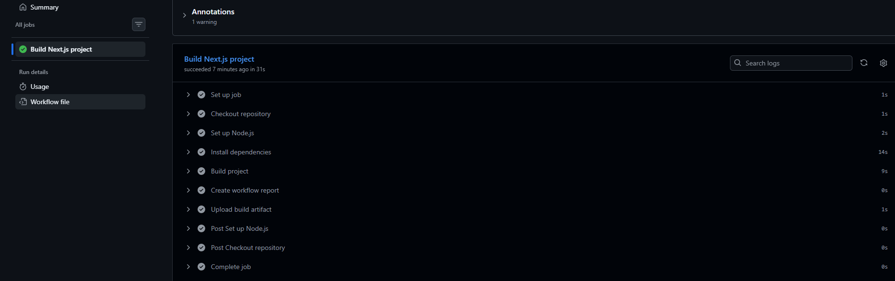
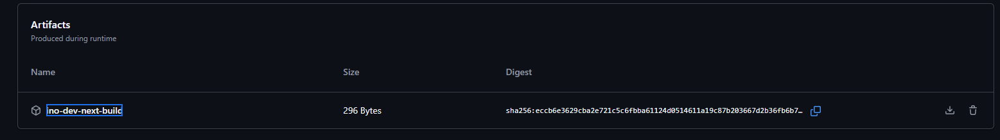
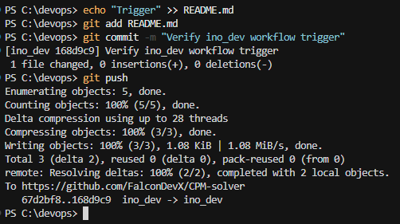
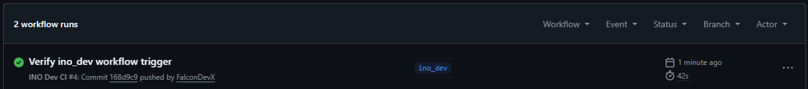

# Sprawozdanie: GitHub Actions - automatyczny build projektu

**Temat zajęć:** GitHub Actions - tworzenie własnego workflow CI

**Technologie:** GitHub Actions, GitHub, Git, YAML, Node.js, npm, Next.js, GitHub-hosted runner, actions/upload-artifact

**Środowisko:** GitHub, lokalne repozytorium Git, PowerShell, runner `ubuntu-latest`, projekt Next.js

**Zakres:** zapoznanie się z koncepcją GitHub Actions, analiza cennika GitHub Actions, przygotowanie dedykowanej gałęzi `ino_dev`, utworzenie własnego workflow, uruchomienie builda projektu po zmianie w gałęzi, weryfikacja logów oraz zapisanie artefaktu

---

# Cel ćwiczenia

Celem ćwiczenia było przygotowanie własnego workflow GitHub Actions uruchamianego po zmianach w dedykowanej gałęzi `ino_dev`. W ramach zadania należało sforkować lub wykorzystać własną kopię repozytorium, nie modyfikować głównej gałęzi projektu, przygotować plik workflow w katalogu `.github/workflows`, uruchomić build projektu w środowisku GitHub Actions oraz, jeśli to możliwe, zapisać wynik działania jako artefakt.

---

# Zapoznanie się z GitHub Actions

GitHub Actions to mechanizm CI/CD dostępny w serwisie GitHub. Pozwala on automatycznie uruchamiać zdefiniowane zadania po wystąpieniu określonych zdarzeń, takich jak `push`, `pull_request`, ręczne uruchomienie workflow albo harmonogram czasowy.

Workflow definiuje się w plikach YAML umieszczonych w katalogu:

```text
.github/workflows
```

W ćwiczeniu szczególną uwagę zwrócono na trigger workflow, czyli warunek uruchomienia akcji. W przygotowanym rozwiązaniu workflow reaguje na zdarzenie `push` do gałęzi `ino_dev`, a ponadto na tworzenie Pull Requestów (`pull_request`) oraz ręczne uruchomienie z interfejsu GitHub (`workflow_dispatch`).

Fragment konfiguracji triggera:

```yaml
on:
  push:
    branches:
      - ino_dev
  pull_request:
    branches:
      - ino_dev
  workflow_dispatch:
```

Taka konfiguracja oznacza, że workflow zostanie uruchomiony po wypchnięciu zmian do gałęzi `ino_dev`, przy otwarciu lub aktualizacji Pull Requesta kierowanego do tej gałęzi, albo po ręcznym wyzwoleniu z zakładki Actions. Nie będzie uruchamiany dla głównej gałęzi projektu.

---

# Zapoznanie się z cennikiem GitHub Actions

Przed wykonaniem zadania zapoznano się z dokumentacją dotyczącą rozliczania GitHub Actions:

```text
https://docs.github.com/en/billing/managing-billing-for-github-actions/about-billing-for-github-actions
```

GitHub Actions może generować zużycie minut obliczeniowych oraz przestrzeni na artefakty i cache. W przypadku prostych workflow uruchamianych na standardowych runnerach GitHub-hosted darmowy plan powinien wystarczyć do wykonania przykładowego zadania laboratoryjnego. W ramach ćwiczenia użyto krótkiego procesu budowania projektu na runnerze Linux `ubuntu-latest`.



---

# Przygotowanie repozytorium

Do ćwiczenia wykorzystano repozytorium z projektem aplikacji Next.js. Zmiany związane z GitHub Actions wykonano w osobnej gałęzi, aby nie commitować pipeline'u do głównej gałęzi projektu.

Utworzono dedykowaną gałąź:

```bash
git checkout -b ino_dev
```

Następnie wypchnięto ją do zdalnego repozytorium:

```bash
git push -u origin ino_dev
```



Utworzenie gałęzi `ino_dev` pozwoliło oddzielić konfigurację CI od głównego kodu projektu.

---

# Lokalna weryfikacja builda

Przed uruchomieniem workflow w GitHub Actions sprawdzono lokalnie, czy projekt buduje się poprawnie. W katalogu projektu wykonano komendę:

```bash
npm run build
```

Wynik potwierdził poprawne zbudowanie aplikacji Next.js. Build zakończył się sukcesem, wygenerowano zoptymalizowaną wersję produkcyjną aplikacji oraz statyczne strony.



Lokalna weryfikacja była istotna, ponieważ pozwoliła upewnić się, że ewentualne błędy w GitHub Actions będą wynikały z konfiguracji workflow, a nie z samego projektu.

---

# Utworzenie katalogu workflow

W repozytorium utworzono katalog przeznaczony na workflow GitHub Actions:

```text
.github/workflows
```

Następnie dodano własny plik workflow:

```text
.github/workflows/ino-dev-ci.yml
```

Jeżeli w projekcie istniały wcześniejsze workflow, należało je usunąć lub zastąpić własnym workflow, aby nie uruchamiać pipeline'ów przygotowanych przez autorów oryginalnego projektu.

---

# Konfiguracja workflow GitHub Actions

Utworzono workflow o nazwie `INO Dev CI` workflow został skonfigurowany tak, aby reagował na zmianę w gałęzi `ino_dev`.

Plik `.github/workflows/ino-dev-ci.yml`:

```yaml
name: INO Dev CI

on:
  push:
    branches:
      - ino_dev
  pull_request:
    branches:
      - ino_dev
  workflow_dispatch:

jobs:
  build:
    name: Build Next.js project
    runs-on: ubuntu-latest

    steps:
      - name: Checkout repository
        uses: actions/checkout@v4

      - name: Set up Node.js
        uses: actions/setup-node@v4
        with:
          node-version: 22
          cache: npm

      - name: Install dependencies
        run: npm ci

      - name: Build project
        run: npm run build

      - name: Create workflow report
        if: always()
        run: |
          mkdir -p reports
          echo "Workflow executed for branch ino_dev" > reports/summary.txt
          echo "Repository: $GITHUB_REPOSITORY" >> reports/summary.txt
          echo "Commit: $GITHUB_SHA" >> reports/summary.txt
          echo "Run number: $GITHUB_RUN_NUMBER" >> reports/summary.txt
          echo "Build command: npm run build" >> reports/summary.txt

      - name: Upload build artifact
        if: always()
        uses: actions/upload-artifact@v4
        with:
          name: ino-dev-next-build
          path: |
            .next
            reports/summary.txt
          if-no-files-found: ignore
          retention-days: 5
```



Najważniejszym elementem konfiguracji jest fragment:

```yaml
on:
  push:
    branches:
      - ino_dev
  pull_request:
    branches:
      - ino_dev
  workflow_dispatch:
```

Dzięki temu workflow nie uruchamia się dla każdej gałęzi, tylko dla zmian w dedykowanej gałęzi `ino_dev`. Poza standardowym zdarzeniem `push`, workflow skonfigurowano również tak, aby uruchamiał się przy tworzeniu Pull Requestów (zdarzenie `pull_request`) oraz umożliwiał ręczne wyzwolenie z poziomu interfejsu GitHub (zdarzenie `workflow_dispatch`).

---

# Commit i wysłanie workflow do repozytorium

Po przygotowaniu pliku workflow dodano go do repozytorium:

```bash
git add .github/workflows/ino-dev-ci.yml
```

Następnie wykonano commit:

```bash
git commit -m "Add GitHub Actions workflow for ino_dev"
```

Zmiany zostały wysłane do zdalnego repozytorium:

```bash
git push
```



Po wykonaniu `push` do gałęzi `ino_dev` workflow został automatycznie uruchomiony w GitHub Actions.

---

# Uruchomienie workflow

Po wykonaniu commitu i `push` do gałęzi `ino_dev`. Workflow został ponownie uruchomiony i zakończył się sukcesem.

W zakładce GitHub Actions widoczny był zielony status workflow `INO Dev CI` dla gałęzi `ino_dev`.



Zielony status potwierdza, że workflow został wykonany poprawnie po zmianie w dedykowanej gałęzi.

---

# Analiza logów workflow

Po wejściu w szczegóły uruchomienia workflow sprawdzono logi joba `Build Next.js project`.

Workflow wykonał następujące kroki:

```text
Set up job
Checkout repository
Set up Node.js
Install dependencies
Build project
Create workflow report
Upload build artifact
Complete job
```



Logi potwierdziły, że projekt został zbudowany wewnątrz GitHub Actions za pomocą komendy:

```bash
npm run build
```

Wszystkie kroki zakończyły się poprawnie, co potwierdza działanie pipeline'u CI.

---

# Zapisanie artefaktu

W workflow wykorzystano akcję:

```yaml
uses: actions/upload-artifact@v4
```

Służy ona do zapisania plików wygenerowanych podczas działania workflow. W tym przypadku zapisano artefakt o nazwie:

```text
ino-dev-next-build
```

Artefakt zawierał raport z działania workflow oraz wynik procesu budowania, jeżeli został poprawnie wskazany w ścieżce artefaktu.



Zapisanie artefaktu potwierdza, że workflow nie tylko wykonał build, ale również udostępnił wynik działania w GitHub Actions.

---

# Weryfikacja działania triggera

Aby sprawdzić, czy workflow reaguje na kolejne zmiany w gałęzi `ino_dev`, wykonano dodatkową zmianę w pliku `README.md`.

Przykładowa komenda:

```bash
echo "Trigger" >> README.md
```

Następnie wykonano commit:

```bash
git add README.md
git commit -m "Verify ino_dev workflow trigger"
git push
```



Po wypchnięciu zmiany workflow uruchomił się ponownie. W zakładce GitHub Actions pojawiło się kolejne uruchomienie workflow dla gałęzi `ino_dev`.



Dodatkowy run potwierdził, że trigger `push` dla gałęzi `ino_dev` działa zgodnie z wymaganiami zadania.

---

# Wyniki

W ramach ćwiczenia przygotowano własny workflow GitHub Actions dla projektu Next.js. Workflow został umieszczony w pliku:

```text
.github/workflows/ino-dev-ci.yml
```

Akcja reagowała na zdarzenia:

```text
push
pull_request
workflow_dispatch
```

dla gałęzi:

```text
ino_dev
```

Workflow wykonywał następujące czynności:

```text
pobranie kodu repozytorium,
przygotowanie środowiska Node.js,
instalacja zależności,
zbudowanie projektu,
utworzenie raportu,
zapisanie artefaktu.
```

Poprawne wykonanie workflow potwierdzono w zakładce GitHub Actions. Build zakończył się sukcesem, a wynik został zapisany jako artefakt:

```text
ino-dev-next-build
```

---

# Wnioski

GitHub Actions umożliwia szybkie przygotowanie automatycznego procesu CI bez konieczności konfigurowania własnego serwera. Wystarczy dodać plik YAML do katalogu `.github/workflows`, określić trigger oraz zdefiniować kroki wykonywane przez runnera.

Ćwiczenie pokazało znaczenie poprawnego ustawienia triggera. Dzięki konfiguracji `branches: ino_dev` workflow uruchamiał się tylko dla dedykowanej gałęzi, a nie dla głównego projektu. Jest to ważne, ponieważ pozwala testować pipeline w osobnej gałęzi bez wpływu na główną wersję repozytorium.

Podczas ćwiczenia wystąpił błąd w kroku lintowania, który wynikał ze sposobu działania komendy `next lint` w użytej wersji projektu. Po analizie logów workflow został poprawiony i ograniczony do procesu budowania aplikacji. Pokazało to, że logi GitHub Actions są podstawowym narzędziem diagnozowania błędów w pipeline.

Ostatecznie workflow poprawnie zbudował projekt Next.js w środowisku GitHub Actions, a wynik działania został zapisany jako artefakt. Zadanie potwierdziło praktyczne zastosowanie GitHub Actions do automatyzacji budowania projektu po zmianach w wybranej gałęzi.
