# Sprawozdanie zbiorcze: zajęcia 08-12

**Zakres:** automatyzacja z użyciem Ansible, instalacja nienadzorowana Kickstart, podstawy Kubernetes, zarządzanie wdrożeniami w Kubernetes oraz uruchomienie kontenera w chmurze Azure.

**Technologie:** Ansible, Docker, Fedora Kickstart, Minikube, kubectl, Kubernetes Dashboard, Docker Hub, Azure CLI, Azure Container Instances, Azure Container Registry.

**Środowisko:** Linux, Docker, VirtualBox, Ubuntu Server 24.04, Minikube v1.38.1, Azure Cloud Shell, region `northeurope`.

---

# Cel

Celem serii ćwiczeń było poznanie kolejnych etapów automatyzacji i wdrażania aplikacji: od zdalnego zarządzania systemami Linux, przez instalację nienadzorowaną, podstawy orkiestracji kontenerów w Kubernetes, aż po uruchomienie aplikacji kontenerowej w chmurze Microsoft Azure.

---

# Zajęcia 08 - Ansible

Zajęcia dotyczyły automatyzacji zadań administracyjnych oraz zdalnego zarządzania serwerami Linux. Ansible umożliwia wykonywanie tych samych operacji na wielu hostach bez konieczności ręcznego logowania się na każdą maszynę. Konfiguracja opisywana jest w plikach YAML, czyli playbookach, co pozwala uzyskać powtarzalny i łatwy do odtworzenia proces konfiguracji środowiska.

Celem ćwiczenia było skonfigurowanie środowiska Ansible, przygotowanie pliku inventory, utworzenie podstawowych playbooków oraz zbudowanie roli odpowiedzialnej za wdrażanie Dockera na hostach docelowych.

Utworzono plik `inventory.ini` zawierający grupy `Orchestrators` i `Endpoints`. Środowisko składało się z hosta sterującego `ansible-master` oraz hosta docelowego `ansible-target`, uruchomionego w kontenerze Docker z usługą OpenSSH i dostępem przez klucze SSH.

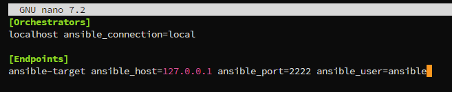

Łączność z hostem docelowym zweryfikowano za pomocą playbooka `ping.yml`:

```bash
ansible-playbook -i inventory.ini ping.yml
```

Moduł `ping` w Ansible nie wysyła pakietów ICMP. Sprawdza on, czy Ansible może połączyć się z hostem oraz uruchomić na nim moduły wymagane do dalszego zarządzania.

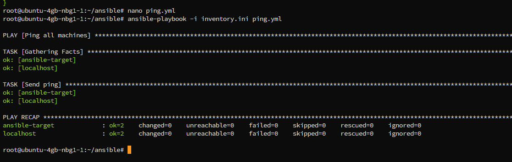

Następnie przygotowano kolejne playbooki: `copy_inventory.yml` do kopiowania pliku inventory na hosty, `update.yml` do aktualizacji pakietów, `restart.yml` do restartu usługi SSH oraz `sanity.yml` do weryfikacji gotowości hosta. Playbook typu sanity check pozwala wykryć brak wymaganych narzędzi lub błędną konfigurację przed właściwym wdrożeniem.

Na końcu utworzono rolę Ansible `docker_deploy` ze standardową strukturą katalogów i wykorzystano ją w playbooku wdrożeniowym. Role pozwalają porządkować powtarzalne zadania i wykorzystywać je w wielu playbookach bez duplikowania kodu.

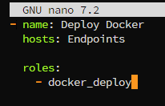

---

# Zajęcia 09 - Kickstart

Zajęcia dotyczyły instalacji nienadzorowanej systemu operacyjnego. Plik Kickstart zawiera odpowiedzi na pytania, które instalator Anaconda zwykle zadaje użytkownikowi podczas standardowej instalacji, m.in. dotyczące języka, strefy czasowej, sieci, partycjonowania, kont użytkowników i pakietów. Dzięki temu ten sam system można zainstalować w powtarzalny sposób na wielu maszynach.

Celem ćwiczenia było przygotowanie pliku `anaconda-ks.cfg` dla systemu Fedora Server, udostępnienie go przez HTTP oraz wykonanie automatycznej instalacji systemu wraz z instalacją Dockera w sekcji `%post`.

Plik `anaconda-ks.cfg` powstał na podstawie konfiguracji wygenerowanej przez instalator Anaconda. Wykorzystano dwie maszyny wirtualne w VirtualBox z siecią ustawioną w trybie Bridged Adapter. Jedna maszyna pełniła rolę serwera HTTP udostępniającego plik Kickstart, a druga była instalowana w trybie nienadzorowanym. W pliku zmodyfikowano m.in. ustawienia języka, strefy czasowej, partycjonowania oraz dodano sekcję `%post` instalującą Docker.

```bash
sudo cp /root/anaconda-ks.cfg ~/
```

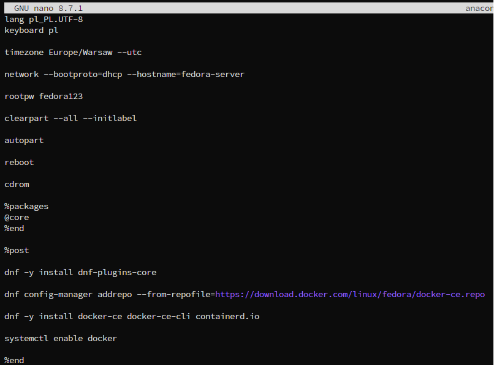

Plik Kickstart udostępniono przez prosty serwer HTTP uruchomiony poleceniem:

```bash
python3 -m http.server 8000
```

Podczas startu instalatora w parametrach jądra podano adres URL do pliku Kickstart oraz konfigurację sieci przez DHCP:

```text
inst.ks=http://192.168.2.9:8000/anaconda-ks.cfg ip=dhcp
```

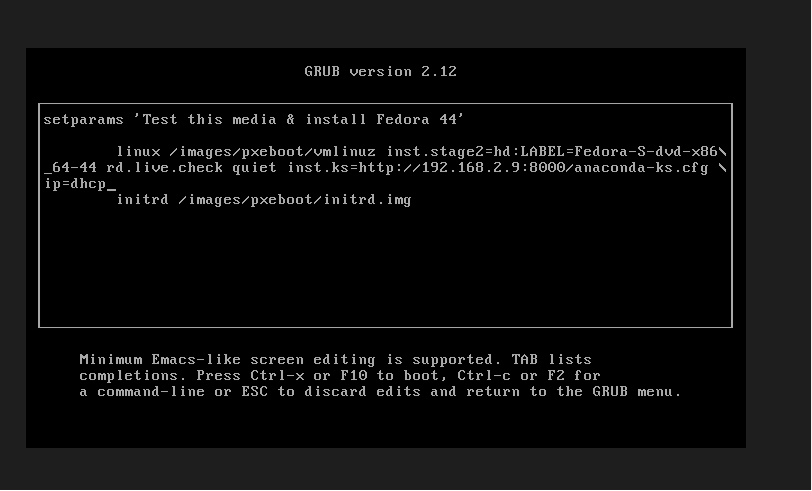

Po zakończeniu instalacji system uruchomił się automatycznie dzięki poleceniu `reboot` w pliku Kickstart. Poprawność konfiguracji zweryfikowano przez sprawdzenie nazwy hosta ustawionej na `fedora-server` oraz statusu usługi Docker zainstalowanej w sekcji `%post`.

```bash
hostname
systemctl status docker
```

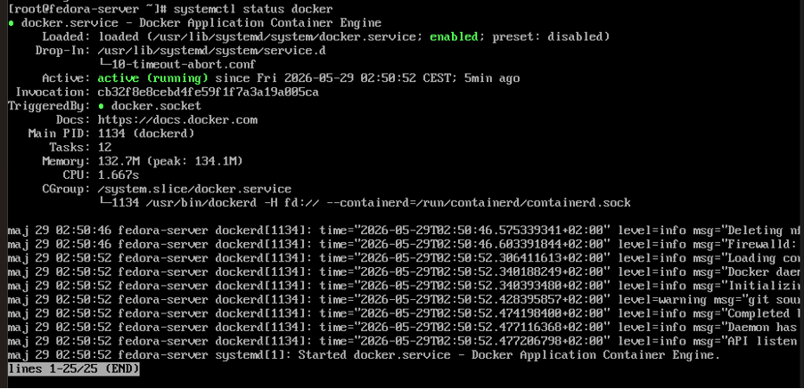

Sekcja `%post` wykonuje polecenia po instalacji pakietów bazowych. Pozwala to skonfigurować system jeszcze przed pierwszym ręcznym logowaniem użytkownika.

---

# Zajęcia 10 - Kubernetes (1)

Zajęcia wprowadzały podstawowe pojęcia związane z orkiestracją kontenerów. Kubernetes zarządza aplikacjami uruchamianymi w kontenerach: utrzymuje zadaną liczbę replik, restartuje uszkodzone instancje i udostępnia aplikacje przez serwisy. Do nauki wykorzystano Minikube, czyli lokalny klaster Kubernetes działający na jednej maszynie.

Celem ćwiczenia było uruchomienie klastra Kubernetes, wdrożenie aplikacji nginx jako pojedynczego poda i jako deploymentu, utworzenie serwisu oraz obserwacja zasobów w Kubernetes Dashboard.

Klaster uruchomiono ze sterownikiem Docker, dzięki czemu nie było konieczne tworzenie osobnej maszyny wirtualnej dla Minikube.

```bash
minikube start --driver=docker --memory=2048 --cpus=2
```

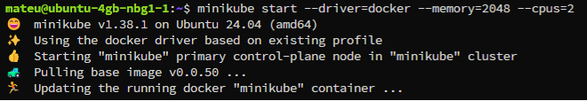

Najpierw uruchomiono pojedynczy pod nginx i przetestowano dostęp do aplikacji przez `kubectl port-forward`. Następnie przygotowano plik `deployment.yaml`, który definiował aplikację uruchamianą w czterech replikach. Deployment odpowiada za utrzymywanie zadanej liczby podów oraz automatyczne odtwarzanie instancji, które przestały działać poprawnie.

```bash
kubectl apply -f deployment.yaml
kubectl get deployments
```

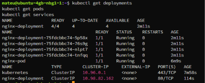

Utworzono również serwis typu ClusterIP, który umożliwia komunikację z aplikacją wewnątrz klastra. Do monitorowania zasobów włączono Kubernetes Dashboard oraz Metrics Server.

```bash
minikube addons enable dashboard
minikube dashboard --url
```

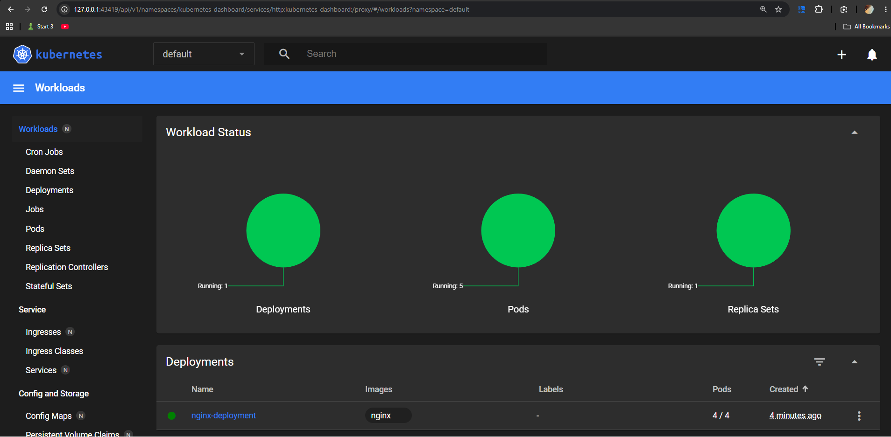

Kubernetes Dashboard umożliwia graficzną obserwację podów, deploymentów, serwisów oraz podstawowego wykorzystania zasobów klastra.

---

# Zajęcia 11 - Kubernetes (2)

Zajęcia kontynuowały pracę z Kubernetes i skupiały się na cyklu życia aplikacji: aktualizacjach, skalowaniu, wycofywaniu błędnych wersji oraz porównaniu strategii wdrożeniowych. W praktyce DevOps nowe wersje aplikacji są regularnie publikowane do klastra, dlatego ważne jest, aby proces wdrożenia ograniczał przerwy w działaniu usługi i pozwalał szybko wrócić do poprzedniej wersji w razie problemów.

Celem ćwiczenia było wdrożenie własnych obrazów z Docker Hub, przetestowanie skalowania, zasymulowanie błędnego wdrożenia i rollbacku oraz porównanie strategii RollingUpdate, Recreate i Canary Deployment.

Przygotowano trzy wersje własnego obrazu aplikacji w Docker Hub: `v1`, `v2` oraz `broken`. Wersje `v1` i `v2` działały poprawnie, natomiast obraz `broken` służył do zasymulowania błędnego wdrożenia.

Aktualizację obrazu wykonano poleceniem `kubectl set image`:

```bash
kubectl set image deployment/deploy-app deploy-app=bobpop231/deploy:v2
kubectl rollout status deployment/deploy-app
```

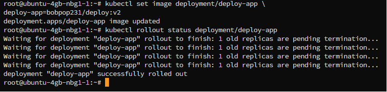

Przetestowano skalowanie deploymentu za pomocą `kubectl scale`. Sprawdzono zwiększanie i zmniejszanie liczby replik, skalowanie do zera oraz ponowne uruchomienie aplikacji. Historię wdrożeń przeanalizowano poleceniem `kubectl rollout history`.

Następnie wdrożono obraz `broken`, co spowodowało przejście podów w stan `CrashLoopBackOff`. Kubernetes wielokrotnie próbował uruchomić kontener, jednak aplikacja kończyła działanie błędem i nie osiągała stanu gotowości.

```bash
kubectl set image deployment/deploy-app deploy-app=bobpop231/deploy:broken
kubectl get pods
```

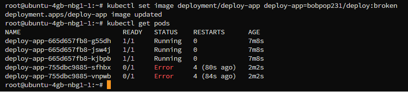

Po wykryciu problemu przywrócono poprzednią wersję aplikacji za pomocą rollbacku. Wszystkie repliki wróciły do stanu `Running`.

```bash
kubectl rollout undo deployment/deploy-app
```

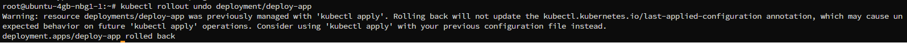

Porównano również strategie Recreate oraz Canary Deployment. Strategia Recreate usuwa wszystkie stare pody przed uruchomieniem nowych, co może powodować chwilową niedostępność aplikacji. W wariancie Canary utworzono dwa deploymenty: stable z czterema replikami oraz canary z jedną repliką. Oba deploymenty współdzieliły ten sam serwis i etykietę `app: deploy-app`, dzięki czemu część ruchu mogła trafiać do nowej wersji aplikacji.

```bash
kubectl get deployments
kubectl get pods --show-labels
```

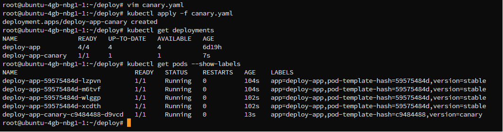

Na końcu przygotowano skrypt `check.sh`, który weryfikował poprawność wdrożenia w czasie do 60 sekund. Skrypt wykorzystywał `kubectl rollout status` i zwracał kod błędu w przypadku nieudanego wdrożenia. Takie rozwiązanie można wykorzystać jako prosty element automatycznej kontroli w pipeline CI/CD.

---

# Zajęcia 12 - Azure Container Instances

Zajęcia dotyczyły wdrażania kontenerów w publicznej chmurze. Azure Container Instances umożliwia uruchomienie pojedynczego kontenera bez konfigurowania maszyny wirtualnej ani klastra Kubernetes. Do uruchomienia aplikacji wystarczy gotowy obraz kontenera oraz polecenie `az container create`. Jest to prostsze rozwiązanie niż pełny klaster Kubernetes, gdy celem jest szybkie publiczne udostępnienie pojedynczej aplikacji.

Celem ćwiczenia było zbudowanie obrazu aplikacji, opublikowanie go w Docker Hub, zaimportowanie do Azure Container Registry oraz uruchomienie kontenera z publicznym dostępem HTTP w regionie `northeurope`.

Wykorzystano statyczną aplikację nginx z plikiem `index.html`, czyli ten sam typ aplikacji co w poprzednich zajęciach. Obraz zbudowano lokalnie i opublikowano w Docker Hub jako `bobpop231/deploy:v2`.

```bash
docker build -t keyboard123/deploy:v2 .
docker tag keyboard123/deploy:v2 bobpop231/deploy:v2
docker push bobpop231/deploy:v2
```


W Azure Cloud Shell utworzono grupę zasobów `rg-lab12-bobpop-ne` w regionie `northeurope`. Następnie zarejestrowano wymagane usługi Azure Container Instances i Azure Container Registry oraz utworzono rejestr ACR. Obraz z Docker Hub zaimportowano do ACR, aby Azure mógł pobierać obraz z rejestru chmurowego.

```bash
az group create --name "$RG" --location northeurope
az acr create --resource-group "$RG" --name "$ACR_NAME" --sku Basic --admin-enabled true
az acr import --name "$ACR_NAME" --source docker.io/bobpop231/deploy:v2 --image deploy:v2
```


Kontener uruchomiono w Azure Container Instances z publicznym adresem IP oraz nazwą DNS. Status `Running` potwierdził poprawne pobranie obrazu z ACR i uruchomienie aplikacji.

```bash
az container create \
  --resource-group "$RG" \
  --name "$CONTAINER_NAME" \
  --image "$ACR_SERVER/deploy:v2" \
  --os-type Linux \
  --ip-address Public \
  --ports 80 \
  --dns-name-label "$DNS_LABEL"

az container show --resource-group "$RG" --name "$CONTAINER_NAME" -o table
```

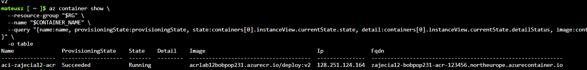

Dostęp do aplikacji sprawdzono przez HTTP. Aplikacja zwróciła stronę z napisem `Version 2`, co potwierdziło, że wdrożony kontener działa poprawnie.

```bash
curl http://$FQDN
```

Przykładowa nazwa DNS kontenera:

```text
zajecia12-bobpop231-acr-123456.northeurope.azurecontainer.io
```

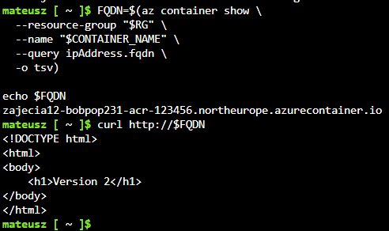

Po zakończeniu testów pobrano logi kontenera, zatrzymano i usunięto instancję, a następnie usunięto całą grupę zasobów razem z rejestrem ACR. Usunięcie grupy zasobów jest istotne, ponieważ zapobiega dalszemu naliczaniu kosztów w chmurze.

---

# Wyniki

W ramach zajęć 08-12 skonfigurowano automatyzację zadań administracyjnych za pomocą Ansible, wykonano instalację nienadzorowaną systemu Fedora z automatyczną instalacją Dockera, uruchomiono lokalny klaster Kubernetes w Minikube, wdrożono i zarządzano aplikacją kontenerową w Kubernetes oraz uruchomiono tę samą aplikację w chmurze Azure z wykorzystaniem Azure Container Instances i Azure Container Registry.

---

# Wnioski

Zrealizowane ćwiczenia tworzą spójną ścieżkę od automatyzacji pojedynczych hostów do wdrażania aplikacji kontenerowych w chmurze. Ansible pozwala powtarzalnie konfigurować działające systemy, Kickstart umożliwia automatyczną instalację systemu od zera, Kubernetes zapewnia skalowanie, aktualizacje i mechanizmy odzyskiwania po błędnych wdrożeniach, a Azure Container Instances pozwala szybko uruchomić kontener bez budowania pełnego klastra.

Najważniejszy wniosek jest taki, że te technologie uzupełniają się w typowym procesie DevOps. Najpierw przygotowuje się infrastrukturę i środowisko, następnie tworzy oraz publikuje obraz kontenera, później wdraża aplikację w sposób kontrolowany, a na końcu można przenieść ten sam obraz do środowiska chmurowego. Dzięki temu wdrożenia są bardziej powtarzalne, łatwiejsze do sprawdzenia i prostsze do odtworzenia w razie awarii.
