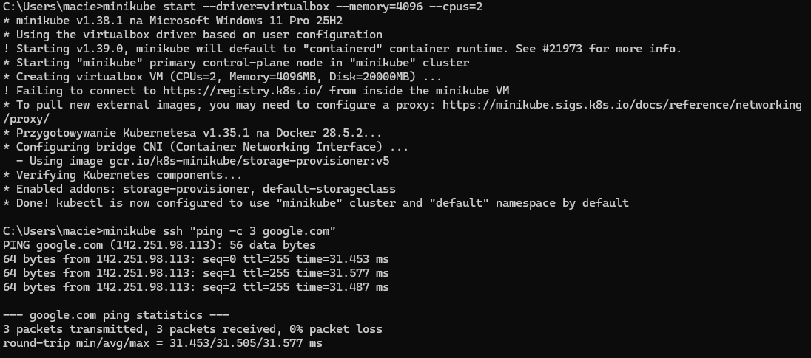
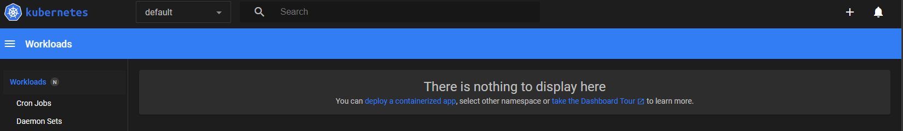
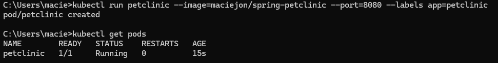
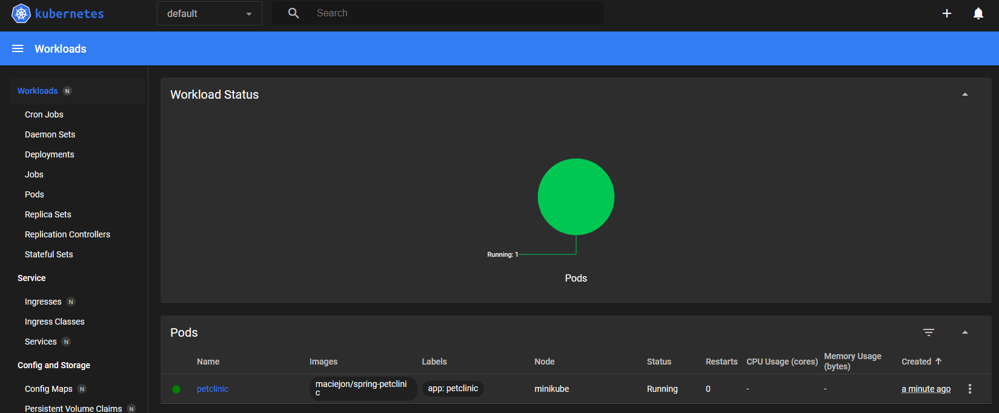
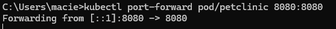
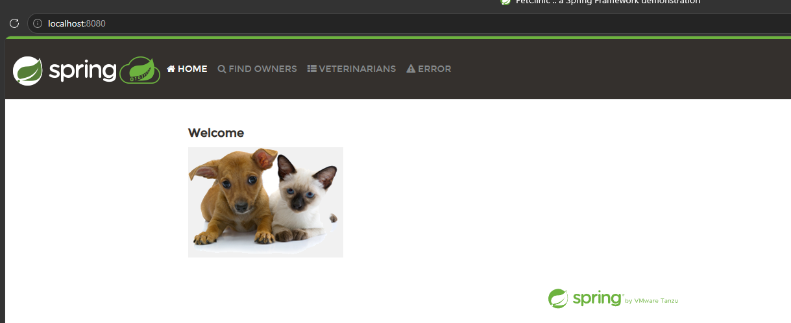
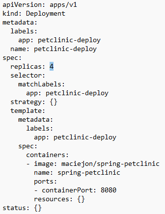
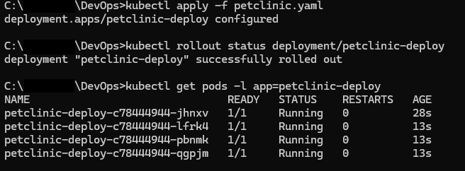
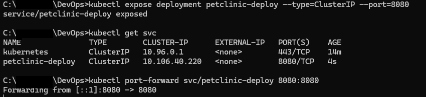
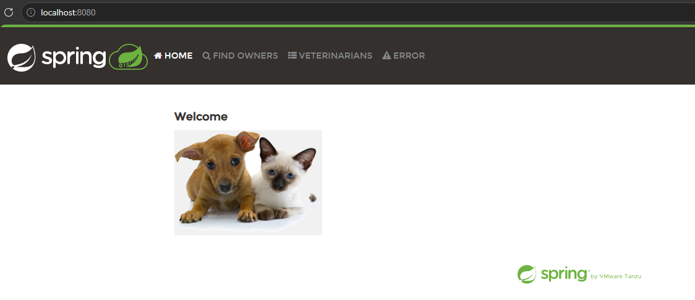

# Sprawozdanie 10

---

## 1. Cel laboratorium
Celem zadania było zapoznanie się z architekturą i koncepcjami systemu Kubernetes przy użyciu lokalnego środowiska deweloperskiego Minikube. Zakres prac obejmował instalację klastra, uruchomienie aplikacji w formie pojedynczego Poda, a następnie przekucie konfiguracji na deklaratywne wdrożenie z pliku YAML ze skalowaniem do 4 replik oraz ekspozycją usług za pomocą obiektu Service.

---

## 2. Instalacja, konfiguracja i mitygacja problemów sprzętowo-sieciowych
Klaster Kubernetes został zainicjalizowany lokalnie za pomocą narzędzia Minikube z wykorzystaniem sterownika maszyn wirtualnych VirtualBox. W celu zapewnienia stabilnej pracy, zasoby wirtualnej maszyny zostały zwiększone do 4096 MB pamięci RAM oraz 2 rdzeni CPU.

W trakcie uruchamiania system zgłosił ostrzeżenie o braku połączenia z domeną `registry.k8s.io`. Aby zweryfikować stan sieci wewnątrz maszyny wirtualnej, wykonano połączenie SSH do klastra i pomyślnie spingowano zewnętrzny serwer DNS google, co potwierdziło poprawność konfiguracji sieciowej i dostęp do internetu niezbędny do pobierania zewnętrznych obrazów.

---

## 3. Uruchomienie Kubernetes Dashboard
W celu graficznego monitorowania stanu klastra uruchomiono wbudowany panel administracyjny poleceniem `minikube dashboard`. W początkowej fazie panel potwierdził poprawność działania klastra oraz brak jakichkolwiek aktywnych wdrożeń.

---

## 4. Analiza kontenera i manualne uruchomienie aplikacji
Zrealizowano wdrożenie manualne pojedynczego Poda aplikacji `maciejon/spring-petclinic`:

Aplikacja została pobrana z Docker Hub, a jej status szybko zmienił się na `Running`.

Poprawność wdrożenia Poda zweryfikowano również w panelu graficznym Dashboard, który wskazał prawidłowe przypisanie obrazu oraz etykiety `app: petclinic`.

---

## 5. Komunikacja z Port-Forwardingiem
Ponieważ uruchomiony Pod działa wewnątrz izolowanej sieci klastra, bezpośredni dostęp do niego z systemu operacyjnego hosta wymagał przekierowania portów.

Po zestawieniu tunelu, zadziałał interfejs graficzny Spring PetClinic, co potwierdziło pełną sprawność funkcjonalną aplikacji wewnątrz kontenera.

Po udanych testach Pod został usunięty, aby zwolnić zasoby.

---

## 6. Przygotowanie pliku wdrożenia YAML
Konfigurację manualną przeniesiono do pliku manifestu YAML. Szablon Deployment wygenerowano automatycznie:

Parametr określający liczbę replik został zwiększony do 4:

---

## 7. Wdrożenie deklaratywne oraz skalowanie aplikacji
Nowa konfiguracja została wprowadzona do klastra za pomocą polecenia `kubectl apply`. Stan wdrożenia kontrolowano za pomocą `rollout status`.

Wszystkie 4 pody zostały pomyślnie uruchomione i rozproszone w klastrze.

---

## 8. Ekspozycja wdrożenia jako usługa (Service) i balansowanie ruchu
Ostatnim etapem było powiązanie 4 działających replik w jeden spójny punkt dostępowy za pomocą obiektu Service Cluster. Usługa ta odpowiada za automatyczne przekierowywanie i balansowanie ruchu użytkowników na działające Pody.

Usługę utworzono, a następnie uruchomiono tunel sieciowy bezpośrednio do stworzonego serwisu. Ruch skierowany na `http://localhost:8080` był od tej pory bezpiecznie i płynnie rozdzielany przez Kubernetes pomiędzy wszystkie 4 pody aplikacji PetClinic.

---

## 9. Podsumowanie i wnioski
Podczas ćwiczenia pomyślnie zrealizowano pełny cykl życia aplikacji w środowisku Kubernetes:
1. Skonfigurowano maszynę wirtualną o odpowiednich parametrach CPU/RAM do uruchomienia aplikacji ze Spring Boot.
2. Przeanalizowano i zweryfikowano działanie aplikacji w formie pojedynczego obiektu Pod.
3. Przetłumaczono konfigurację manualną na elastyczny i uniwersalny plik manifestu YAML.
4. Zrealizowano skalowanie aplikacji do 4 replik, co w warunkach produkcyjnych gwarantuje wysoką dostępność oraz odporność na awarie pojedynczych instancji.
5. Zastosowano obiekt Service do scentralizowania dostępu i automatycznego podziału obciążenia pomiędzy replikami.

Kubernetes udowodnił swoją wartość jako kompletne narzędzie orkiestracyjne, pozwalające na sprawne zarządzanie kontenerami z poziomu jasnych, deklaratywnych plików konfiguracyjnych.