# Sprawozdanie 11

---

## 1. Cel laboratorium
Celem drugiego laboratorium z systemu Kubernetes było zaawansowane zarządzanie cyklem życia aplikacji w klastrze. Zakres prac obejmował przygotowanie własnych obrazów kontenerowych w różnych wersjach, manualne i deklaratywne skalowanie replik w górę i w dół, przeprowadzanie aktualizacji (Rollout) oraz wycofywanie zmian po wystąpieniu błędów (Rollback). Dodatkowo zaimplementowano skrypt weryfikujący czas wdrożenia oraz przetestowano różne strategie aktualizacji (Recreate, Rolling Update, Canary).

## 2. Przygotowanie obrazów w repozytorium Docker Hub
Na potrzeby ćwiczenia zrezygnowano z gotowych obrazów. Zbudowano własny, zmodyfikowany obraz oparty na serwerze Apache (`httpd`). 

Przygotowano i wypchnięto na konto `maciejon` w Docker Hub trzy wersje obrazu:
* `v1` - bazowa, działająca wersja aplikacji.
* `v2` - zaktualizowana, działająca wersja aplikacji.
* `v3-error` - wersja celowo uszkodzona (np. poprzez błędną komendę startową), aby symulować awarię podczas wdrożenia.

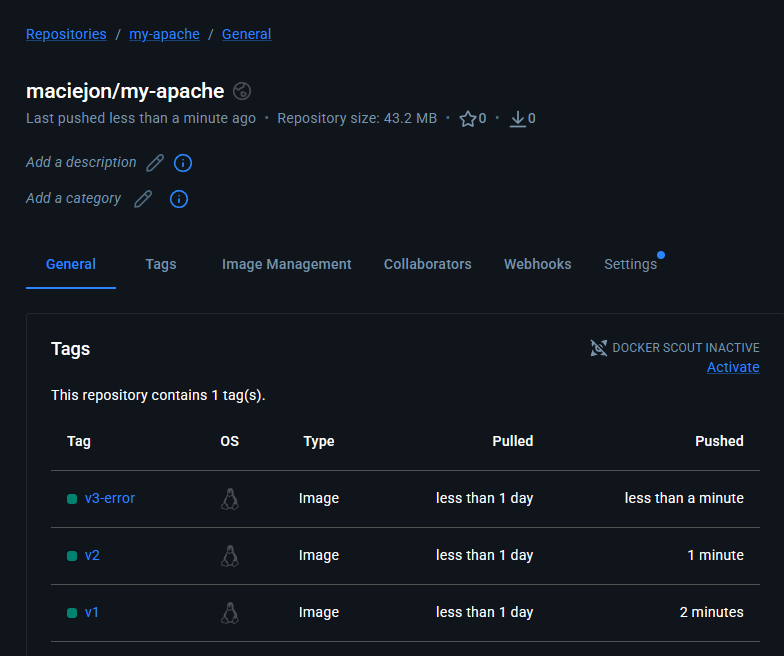

---

## 3. Inicjalne wdrożenie aplikacji
Przygotowano plik manifestu `deployment.yaml`. Zdefiniowano w nim wdrożenie o nazwie `my-app-deploy`, które docelowo uruchamia 4 repliki kontenera opartego na przygotowanym wcześniej obrazie w wersji `v1`.

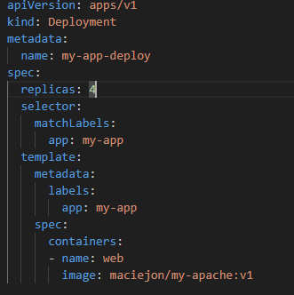

Manifest został zaaplikowany poleceniem `kubectl apply -f deployment.yaml`. Weryfikacja za pomocą `kubectl get pods` potwierdziła, że wszystkie 4 pody zostały pomyślnie uruchomione i działają stabilnie.

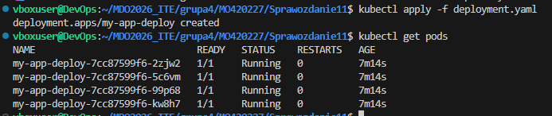

---

## 4. Skalowanie wdrożenia
W kolejnym etapie przetestowano elastyczność klastra w zakresie dynamicznego zarządzania liczbą replik, wykorzystując polecenie `kubectl scale`.

Zwiększono liczbę replik do 8. Kubernetes płynnie dołączył nowe pody do istniejącego wdrożenia.

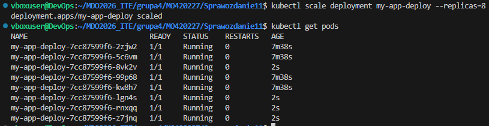

Następnie drastycznie zmniejszono liczbę replik do zaledwie 1, co skutkowało terminacją zbędnych podów.

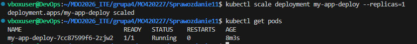

Przeskalowano wdrożenie do 0 replik. W efekcie wszystkie pody zostały usunięte.

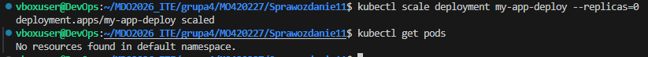

Na koniec przywrócono stan początkowy, zlecając klastrowi ponowne utworzenie 4 replik.

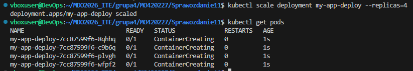

---

## 5. Aktualizacje obrazów i wycofywanie zmian (Rollout & Undo)
Przeprowadzono proces aktualizacji obrazu "w locie". Do podmiany obrazu na wersję `v2` użyto polecenia `kubectl set image`. Status wdrożenia zweryfikowano i zakończyło się ono sukcesem.

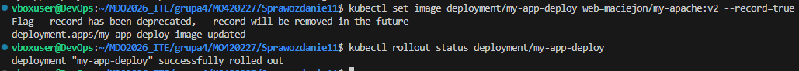

Następnie zainicjowano wdrożenie wersji wadliwej `v3-error`. Jak zaobserwowano na wyjściu polecenia statusu, proces zawiesił się. Nowe pody nie mogły poprawnie wystartować z powodu błędu wewnątrz kontenera, co wstrzymało cały proces rolloutu.

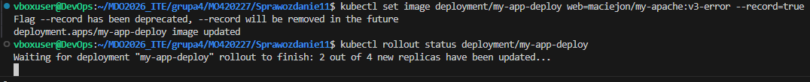

W ramach mitygacji awarii, użyto polecenia `kubectl rollout undo`. Klaster automatycznie usunął niedziałające pody z wersji `v3-error` i przywrócił stabilną, poprzednio działającą wersję (`v2`).

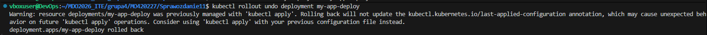

---

## 6. Automatyzacja kontroli wdrożenia
Aby upewnić się, że wdrożenia nie zawieszają się w nieskończoność na wadliwych obrazach, napisano skrypt powłoki. Skrypt wykorzystuje polecenie `timeout`, nadając wdrożeniu maksymalnie 60 sekund na zgłoszenie statusu sukces". W przeciwnym razie skrypt kończy się błędem.

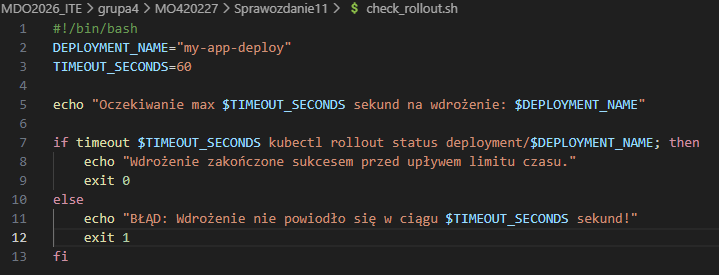

---

## 7. Ekspozycja wdrożenia i strategie aktualizacji
Aby zapewnić stały punkt dostępu do rotujących podów, wyeksponowano wdrożenie za pomocą usługi (Service) typu `ClusterIP` na porcie 80, pod nazwą `my-app-svc`.

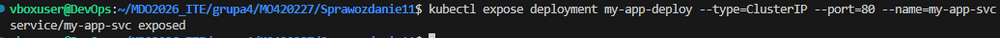

Zbadano również konfiguracje różnych strategii wdrożeń w pliku YAML:

**Strategia Recreate:**
Wymusza całkowite usunięcie starych podów przed utworzeniem nowych (powoduje chwilową niedostępność usługi).

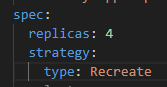

**Strategia Rolling Update**
Zapewnia ciągłość działania. Skonfigurowano parametry, które precyzyjnie określają, ile podów może być maksymalnie wyłączonych i nadmiarowo utworzonych w trakcie procesu aktualizacji.

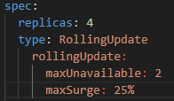

**Strategia Canary Deployment:**
Podejście "kanarkowe" zrealizowano poprzez podział ruchu za pomocą etykiet. Zdefiniowano wdrożenie bazowe posiadające 3 repliki w wersji `v1`.

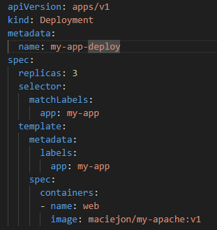

Zdefiniowano również plik dla mniejszej instancji z 1 repliką opartą na wersji nowszej `v2`. Dzięki objęciu obu wdrożeń jednym Service za pomocą wspólnego selektora etykiet, ruch sieciowy jest rozdzielany proporcjonalnie między starą a nową wersję aplikacji, co pozwala na bezpieczne testowanie nowości "na produkcji".

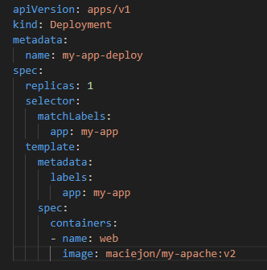

---

## 8. Podsumowanie
Podczas laboratorium potwierdzono użyteczność narzędzi wbudowanych w Kubernetes do zarządzania cyklem życia oprogramowania. Klaster znakomicie radzi sobie z naprawą oraz przywracaniem po wdrożeniu uszkodzonych obrazów. Zrozumienie i zaimplementowanie strategii `RollingUpdate` oraz `Canary` jest kluczowe do wdrażania systemów o zerowym czasie przestoju.