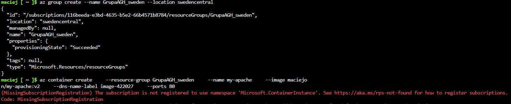
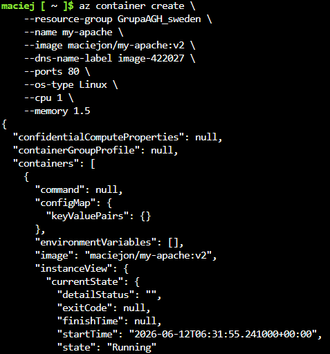
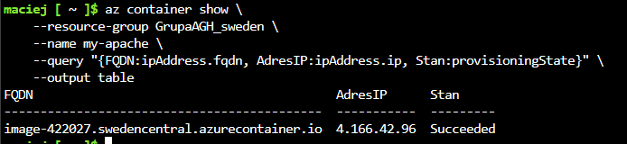
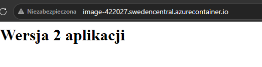
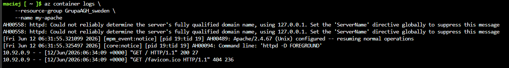
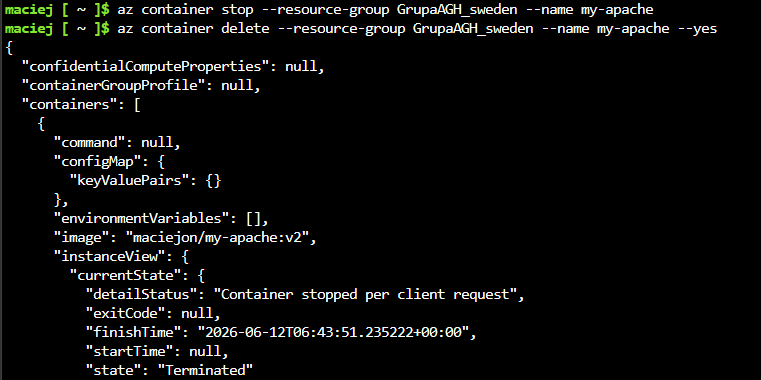
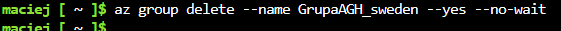

# Sprawozdanie 12

---

## 1. Cel zadania
Celem zadania było wdrożenie własnego kontenera serwera Apache z repozytorium Docker Hub do chmury Microsoft Azure przy użyciu usługi Azure Container Instances. Do wykonania wdrożenia oraz zarządzania zasobami wykorzystano powłokę Azure Cloud Shell Bash.

---

## 2. Przebieg realizacji zadania

### Krok 1: Utworzenie grupy zasobów i pierwsza próba wdrożenia
Wdrożenie rozpoczęto od utworzenia grupy zasobów o nazwie `GrupaAGH_sweden` w lokalizacji `swedencentral`. Kilka innych regionów nie pozwalało na uruchamianie tego typu kontenerów, lecz w Szwecji się udało. Podczas pierwszej próby uruchomienia kontenera wystąpił błąd związany z brakiem rejestracji dostawcy zasobów `Microsoft.ContainerInstance` w subskrypcji chmurowej.

Dodano rejestrację.

### Krok 2: Konfiguracja i pomyślne uruchomienie kontenera
W celu rozwiązania problemów z konfiguracją domyślną, do polecenia wdrożenia dodano jawne definicje systemu operacyjnego (`--os-type Linux`) oraz alokacji zasobów obliczeniowych (`--cpu 1 --memory 1.5`). 

Uruchomiono kontener na podstawie obrazu `maciejon/my-apache:v2` z przypisaną unikalną etykietą DNS `image-422027`. Kontener uzyskał stan `"state": "Running"`.

### Krok 3: Weryfikacja stanu wdrożenia i adresacji
Sprawdzono status wdrożenia, adres IP oraz pełną nazwę domenową za pomocą polecenia `az container show`. 

Kontenerowi przypisano publiczny adres IP **4.166.42.96** oraz adres FQDN **image-422027.swedencentral.azurecontainer.io**.

---

## 3. Wykazanie działania usługi

### Dostęp przez protokół HTTP
Weryfikacja działania serwera Apache została przeprowadzona poprzez otwarcie adresu URL w przeglądarce internetowej. Strona wyświetliła poprawnie nagłówek aplikacji.

### Pobranie logów serwera
Za pomocą polecenia `az container logs` pobrano dziennik zdarzeń kontenera. Logi potwierdzają uruchomienie procesu serwera Apache oraz zarejestrowanie żądań HTTP GET wysłanych przez przeglądarkę.

---

## 4. Zatrzymanie kontenera i usuwanie zasobów

Po zweryfikowaniu poprawności działania aplikacji, przystąpiono do procedury usunięcia zasobów w celu zatrzymania naliczania opłat.

1. Zatrzymano kontener.
2. Usunięto instancję kontenera.

3. Ostatecznie usunięto całą grupę zasobów `GrupaAGH_sweden` wraz ze wszystkimi powiązanymi elementami.

## 5. Podsumowanie

* **Efektywność technologii:** Usługa Azure demonstruje zalety podejścia bezserwerowego w kontekście konteneryzacji. Umożliwia ona natychmiastowe uruchomienie pojedynczych mikroaplikacji bez konieczności wdrażania, konfiguracji i opłacania pełnych maszyn wirtualnych czy klastrów (np. Kubernetes), co minimalizuje czas konfiguracji.

* **Zależność od dostawców zasobów:** Architektura chmury Microsoft Azure ma charakter modularny. Pojawienie się błędu rejestracji przestrzeni nazw (`Microsoft.ContainerInstance`) dowodzi, że subskrypcje chmurowe nie mają domyślnie aktywnych wszystkich interfejsów API. Dostęp do określonych usług wymaga uprzedniej rejestracji odpowiedniego dostawcy zasobów w danej subskrypcji.

* **Znaczenie deklaratywności i alokacji zasobów:** Środowiska chmurowe wymagają precyzyjnego definiowania wymagań sprzętowych aplikacji. Brak określenia parametrów takich jak system operacyjny (`--os-type`), limity pamięci RAM czy rdzeni procesora uniemożliwia systemowi zarządzania chmury optymalne zaplanowanie kontenera na fizycznej infrastrukturze dostawcy.

* **Zarządzanie cyklem życia i aspekt ekonomiczny chmury:** Praca w chmurze publicznej opiera się na modelu rozliczeń za rzeczywiste zużycie. Agregacja zasobów w logiczne struktury Resource Groups ułatwia nie tylko zarządzanie uprawnieniami, ale pozwala na szybkie i bezresztkowe usunięcie całej powiązanej infrastruktury, co jest kluczowe z punktu widzenia kontroli budżetu projektu.
