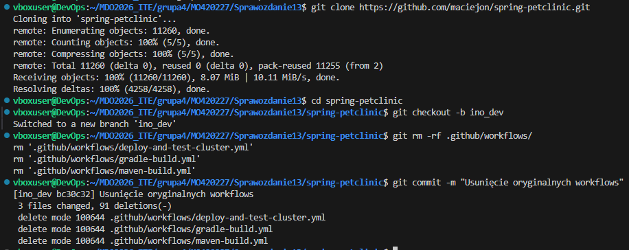
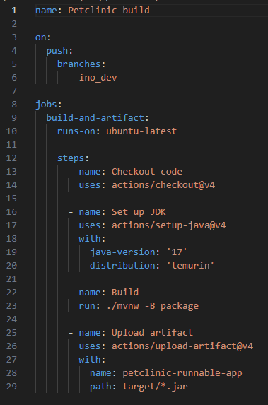
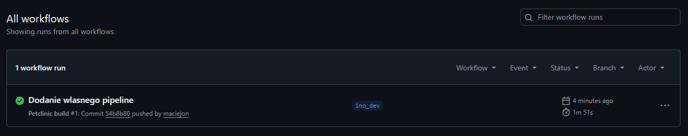

# Sprawozdanie 13

---

## 1. Cel ćwiczenia:
Celem zadania było praktyczne zapoznanie się z platformą GitHub Actions oraz stworzenie własnego potoku automatyzującego proces budowania aplikacji. Do realizacji zadania wybrano popularny projekt open source Spring Petclinic.

## 2. Przygotowanie środowiska i czyszczenie repozytorium

Pracę rozpoczęto od sklonowania wcześniej sforkowanego repozytorium na maszynę. Głównym wymogiem zadania było odizolowanie prac od głównej gałęzi projektu. W tym celu utworzono nową gałąź o nazwie `ino_dev` i od razu się na nią przełączono. 

Zgodnie z instrukcją należało pozbyć się istniejących w projekcie konfiguracji CI/CD. Wykorzystano polecenie usuwające całą zawartość katalogu `.github/workflows/`. Skutkowało to usunięciem oryginalnych plików konfiguracyjnych takich jak `maven-build.yml` czy `gradle-build.yml`. Operację tę zatwierdzono commitem.

## 3. Definicja własnego potoku budującego

Kolejnym krokiem było utworzenie nowej akcji dostosowanej do wymagań laboratoryjnych. Utworzono plik konfiguracyjny YAML o nazwie "Petclinic build". 

Skonfigurowano wyzwalacz akcji w taki sposób, aby reagował wyłącznie na zdarzenie typu push skierowane do gałęzi `ino_dev`. Zdefiniowano jedno zadanie o nazwie `build-and-artifact`, które uruchamiane jest na wirtualnym środowisku z systemem Ubuntu.

Zadanie podzielono na cztery główne kroki:
1. Pobranie kodu źródłowego repozytorium za pomocą gotowej akcji `checkout`.
2. Przygotowanie środowiska programistycznego poprzez instalację narzędzi Java JDK w wersji 17.
3. Właściwe budowanie aplikacji przy użyciu narzędzia Maven wywołanego poleceniem `./mvnw -B package`.
4. Wyłuskanie zbudowanego pliku wykonywalnego z rozszerzeniem jar i zapisanie go jako artefakt pod nazwą `petclinic-runnable-app`.

Gotowy plik konfiguracyjny został dodany do repozytorium, zatwierdzony commitem i wypchnięty na zdalny serwer.

## 4. Weryfikacja działania platformy GitHub Actions

Po wysłaniu zmian na serwer zweryfikowano poprawność działania utworzonego potoku w panelu przeglądarkowym serwisu GitHub. 

Platforma poprawnie wykryła zdarzenie push na gałęzi `ino_dev` i zainicjowała proces budowania. Wszystkie zdefiniowane kroki wykonały się bezbłędnie, co potwierdził zielony wskaźnik statusu operacji. Proces zakończył się sukcesem, a wygenerowany artefakt został pomyślnie załączony do podsumowania danego przebiegu.