# Sprawozdanie 3

## 1. Wybór oprogramowania
Do realizacji zadania wybrano projekt **Express.js**
* Posiada otwartą licencję (MIT).
* Posiada wbudowany system zarządzania zależnościami i skryptami (`npm`).
* Zawiera zdefiniowane testy jednostkowe, które jednoznacznie raportują swój wynik (target `npm test`).

## 2. Budowa i testy
Aby wyizolować środowisko, proces budowania i testowania przeprowadzono najpierw interaktywnie wewnątrz czystego kontenera.
1. Uruchomiono interaktywnie kontener bazowy ze środowiskiem Node.js:

   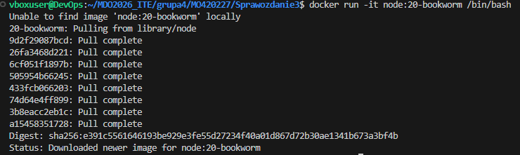

2. Wewnątrz kontenera sklonowano repozytorium (krok z repozytorium Express), zainstalowano zależności i uruchomiono testy:

   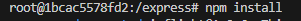

   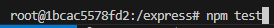

3. **Wynik:** Testy wykonały się poprawnie.

   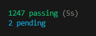

## 3. Automatyzacja za pomocą plików Dockerfile
Proces podzielono na dwa etapy za pomocą dwóch oddzielnych plików `Dockerfile`.

### Kontener 1: Budowanie (Builder)
Plik `Dockerfile.build` pobiera kod i instaluje zależności.

   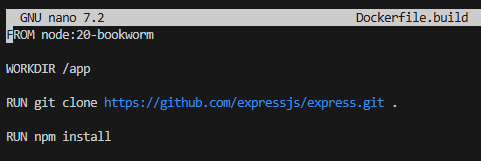

Zbudowano z niego obraz: 

   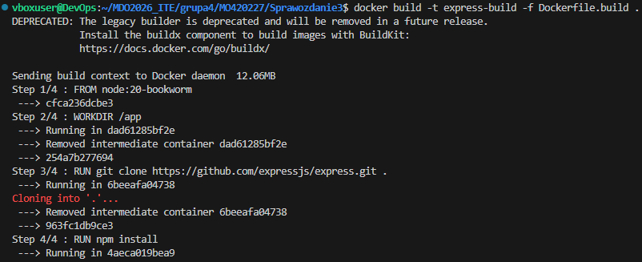

   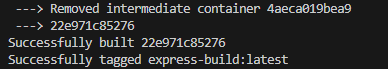

### Kontener 2: Testowanie (Tester)
Plik `Dockerfile.test` bazuje na wcześniej stworzonym obrazie i uruchamia wyłącznie testy.

   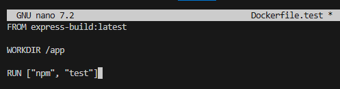

Zbudowano z niego obraz:

   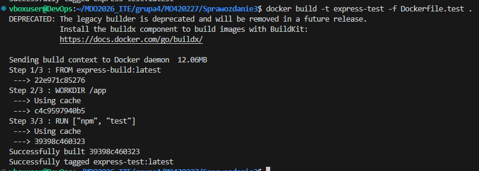

Podczas budowania tego obrazu testy wykonały się automatycznie, zwracając pozytywny wynik.

   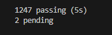

**Różnica między obrazem a kontenerem:** 
Obraz to statyczny szablon zawierający system plików i konfigurację. Kontener to uruchomiona, żywa instancja tego obrazu. W przypadku pliku `Dockerfile.test`, podczas budowania uruchamiany jest tymczasowy kontener, w którym wykonuje się polecenie `npm test`.

## 4. Orkiestracja za pomocą Docker Compose
Aby nie wdrażać kontenerów ręcznie, utworzono plik `docker-compose.yml`, który łączy oba procesy w zautomatyzowaną kompozycję:

   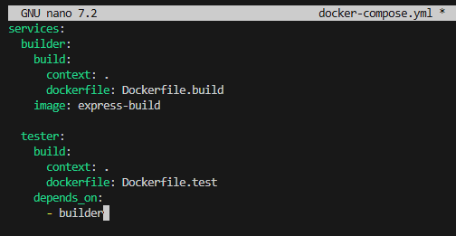

Uruchomiono kompozycję:

   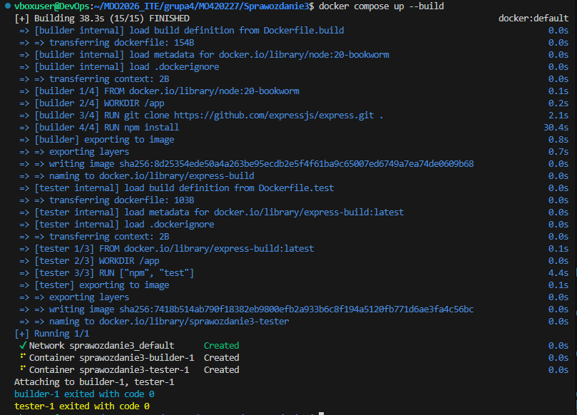

Oba kontenery (`builder-1` oraz `tester-1`) zakończyły pracę z kodem 0. Proces zakończył się sukcesem. 

---

## 5. Dyskusja:

* **Czy program nadaje się do wdrażania i publikowania jako kontener?**
  Express.js to biblioteka, więc nie wdraża się go jako gotowego programu dla użytkownika końcowego. Jednak gotowe aplikacje, stworzone przy użyciu Express.js, idealnie nadają się do działania w kontenerach.
* **Czy trzeba kontener oczyszczać z pozostałości po buildzie?**
  Tak, obraz, który idzie na produkcję, musi być jak najmniejszy.
* **A może dedykowany deploy-and-publish byłby oddzielną ścieżką (inne Dockerfiles)?**
  Najlepiej stworzyć osobną ścieżkę, plik który weźmie gotowy, sprawdzony przez testy kod z pierwszego kontenera i zainstaluje tylko to, co jest absolutnie niezbędne do samego uruchomienia.
* **W jaki sposób zapewnić taki format? Dodatkowy krok (trzeci kontener)?**
Aby to zautomatyzować, potrzebny byłby trzeci kontener. Zostałby on uruchomiony tylko wtedy, gdy testy zakończą się sukcesem. Zadaniem tego trzeciego kontenera byłoby opublikowanie programu.