# Sprawozdanie 4

**Cel zajęć:** Poznanie kolejnych mechanizmów Dockera oraz uruchomienie skonteneryzowanego środowiska CI/CD na bazie Jenkinsa i mechanizmu Docker-in-Docker.

---

## 1. Zachowywanie stanu między kontenerami

### Przygotowanie woluminów i klonowanie (kontener pomocniczy)
Pracę rozpoczęto od utworzenia niezależnych woluminów dla danych wejściowych i wyjściowych.

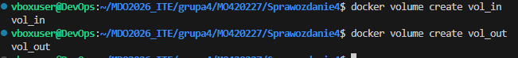

Do pobrania kodu użyto lekkiego kontenera pomocniczego z obrazem `alpine/git`.
**Dlaczego tak zrobiono?**
Użycie kontenera pomocniczego pozwala zachować czystość docelowego kontenera budującego. Jest to lepsze i bardziej przenośne rozwiązanie niż bind mount czy ręczne kopiowanie plików.

### Budowanie projektu i zapis na wolumin wyjściowy
Następnie uruchomiono kontener bazowy (`node:18`), podpinając wolumin wejściowy z kodem do `/src` oraz wyjściowy do `/dest`. Zbudowano projekt za pomocą `npm install`.

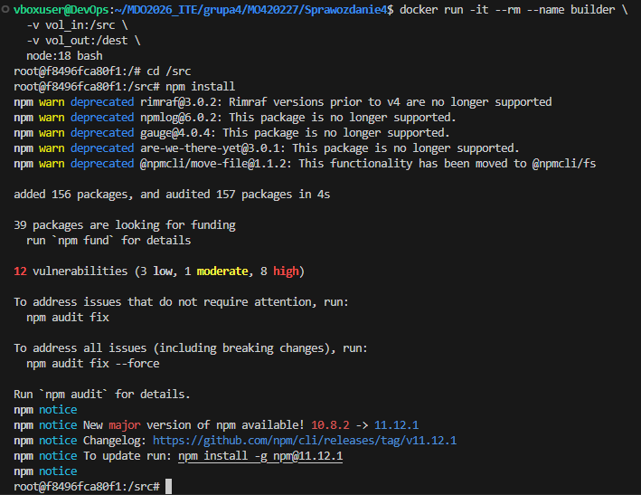

Po zbudowaniu, zawartość skopiowano na wolumin wyjściowy.

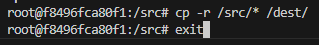

Aby udowodnić trwałość danych po usunięciu kontenera budującego, uruchomiono nowy, lekki kontener weryfikujący zawartość woluminu `vol_out`. Pliki (w tym pobrane pakiety `node_modules`) zostały poprawnie zachowane.

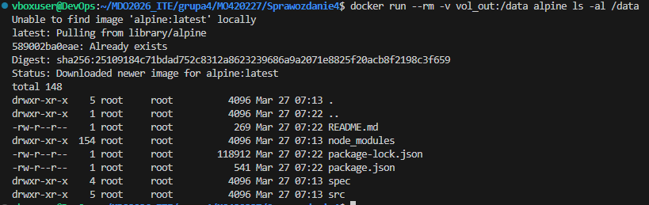

### Alternatywa: Klonowanie i budowanie wewnątrz jednego kontenera
Przeprowadzono operację, w której do nowego kontenera podpięto pusty wolumin, a instalację Gita i klonowanie wykonano wewnątrz.

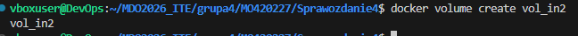

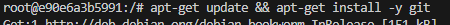
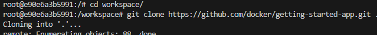
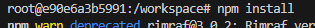

### Dyskusja: `docker build` i plik `Dockerfile`
Wykonane wyżej kroki można w pełni zautomatyzować pisząc `Dockerfile`. Zamiast tworzyć ręcznie kontenery pomocnicze, można użyć wieloetapowego budowania. Co więcej, wykorzystanie nowej składni BuildKit i instrukcji `RUN --mount=type=cache` pozwoliłoby na cachowanie pakietów NPM między budowaniami obrazu, a `RUN --mount=type=bind` na bezpośredni dostęp do plików z kontekstu budowania bez ich powolnego kopiowania (`COPY`).

---

## 2. Eksponowanie portu i łączność między kontenerami

### Domyślna sieć Dockera
Uruchomiono kontener serwera i zainstalowano narzędzie `iperf3`.

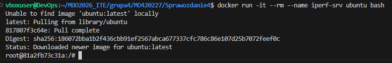

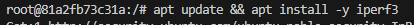

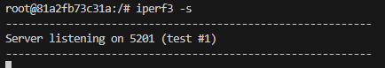

Korzystając z domyślnej sieci `bridge`, należy łączyć się po adresie IP. Sprawdzono IP kontenera serwera (172.17.0.2).

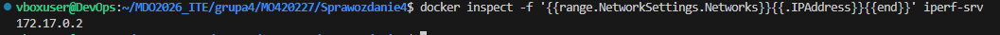

Uruchomiono kontener klienta, z którego nawiązano połączenie do adresu IP serwera. Wykazano przepustowość na poziomie ok. 50-54 Gbits/sec.

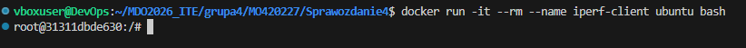

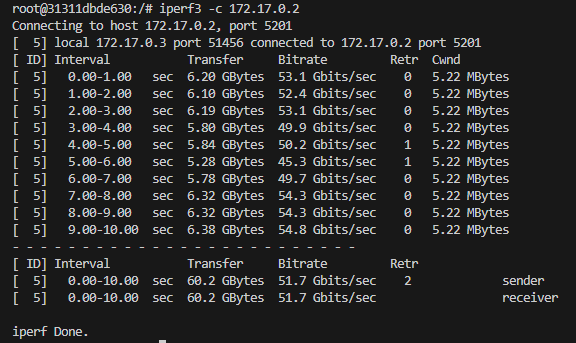

### Dedykowana sieć mostkowa (DNS)
Utworzono własną sieć, co pozwala na DNS i uniezależnia nas od dynamicznych adresów IP.

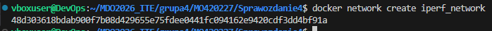

Uruchomiono serwer i klienta w nowej sieci.

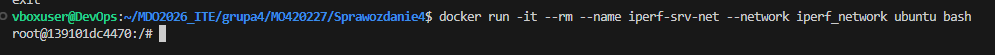

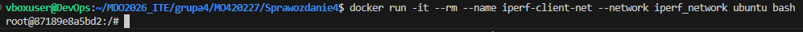

Połączenie wykonano, podając jako adres docelowy nazwę kontenera (`iperf-srv-net`). Transfer utrzymał się na podobnym, maksymalnym dla środowiska poziomie (ok. 49 Gbits/sec).

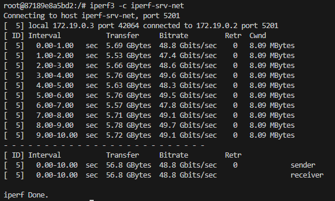

### Łączność z maszyną hosta
Uruchomiono kontener w tle (`-d`), mapując port 5201 kontenera na port 5201 hosta.

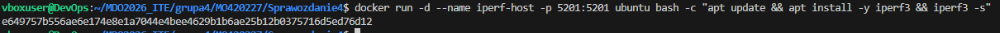

Z poziomu systemu operacyjnego maszyny hosta połączono się na `127.0.0.1`. Przepustowość wyniosła ok. 37-39 Gbits/sec. Widać niewielki narzut.

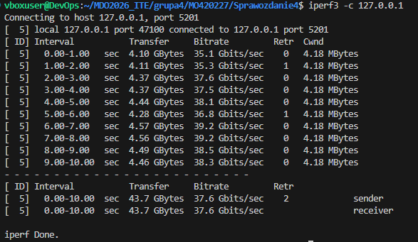

---

## 3. Usługi w rozumieniu systemu i kontenera (SSHD)

Uruchomiono kontener Ubuntu, mapując port 22 wewnątrz na port 2222 na hoście. Wewnątrz zainstalowano i skonfigurowano serwer OpenSSH.

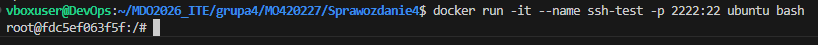
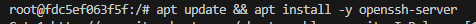
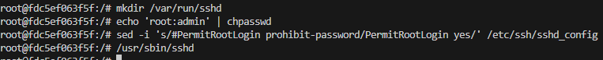

Z poziomu hosta nawiązano pomyślne połączenie SSH do działającego kontenera.

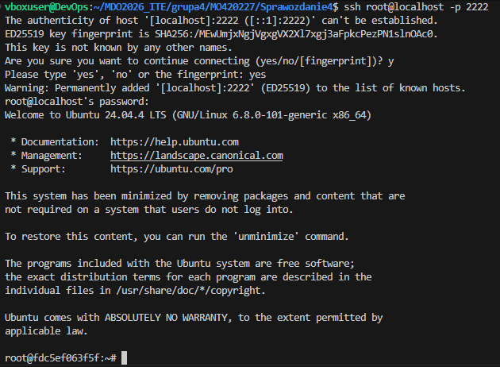

### Zastosowanie SSH w kontenerach 
*   Kontenery z definicji służą do uruchamiania pojedynczych procesów/aplikacji. Uruchamianie w tle usługi SSHD łamie tę zasadę. Jednakże na pewno istnieją przypadku użycia, w których ma to sens.

---

## 4. Przygotowanie serwera Jenkins

Zbudowano środowisko potrafiące uruchamiać instrukcje budowania i budować nowe obrazy wewnątrz samego kontenera CI.

1. Utworzono dedykowaną współdzieloną sieć dla komunikacji komponentów.
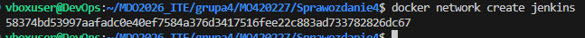

2. Uruchomiono uprzywilejowany kontener `docker:dind`, który dostarcza demona Dockera. Podpięto woluminy pod certyfikaty dla bezpiecznej komunikacji TLS.
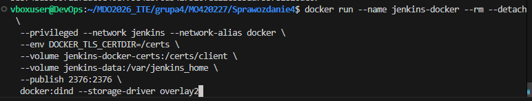

3. Utworzono niestandardowy obraz Jenkinsa dogrywając do niego interfejs wiersza poleceń `docker-ce-cli` oraz domyślne wtyczki.
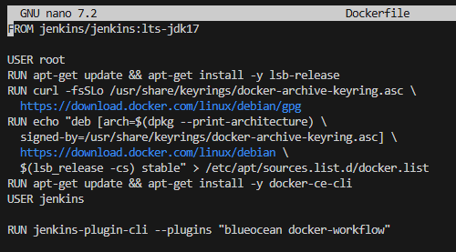
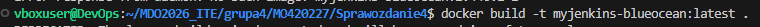

4. Uruchomiono główny kontener Jenkinsa w tej samej sieci, konfigurując mu zmienne środowiskowe, aby wiedział, że demon Dockera znajduje się pod adresem TCP demona DinD.
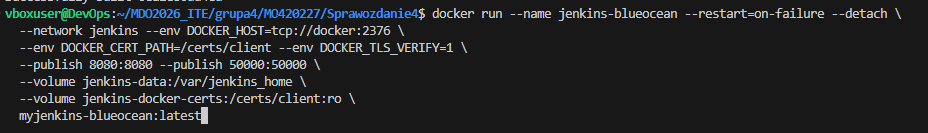

5. Weryfikacja działania środowiska:
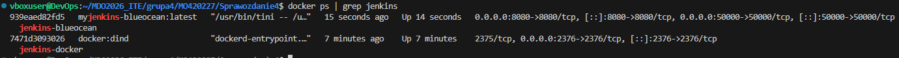

Aby dokończyć konfigurację, wyciągnięto z logów wewnątrz kontenera hasło administratora.
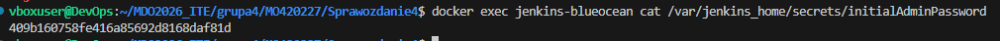

Aplikacja Jenkins została pomyślnie uruchomiona i wystawiona na porcie 8080.
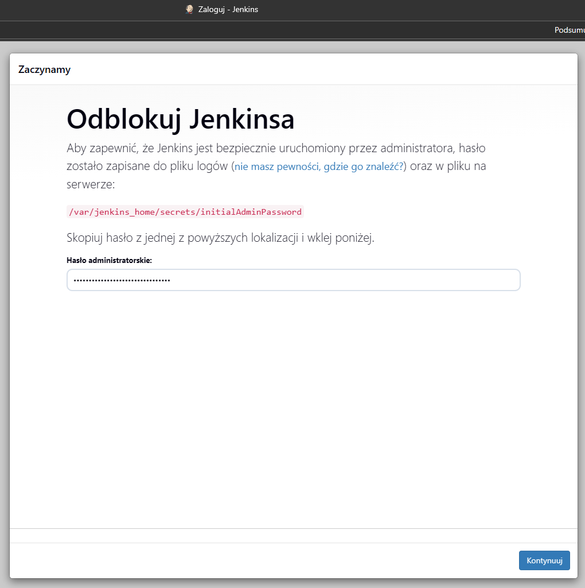