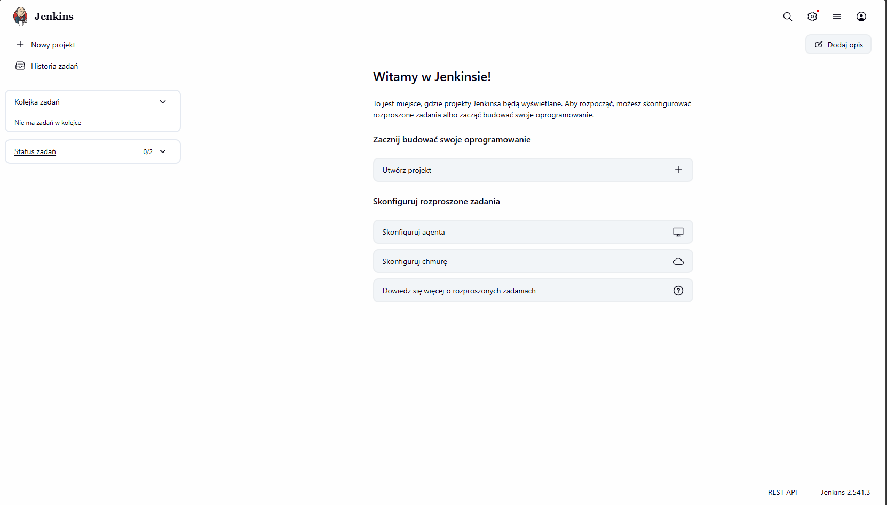
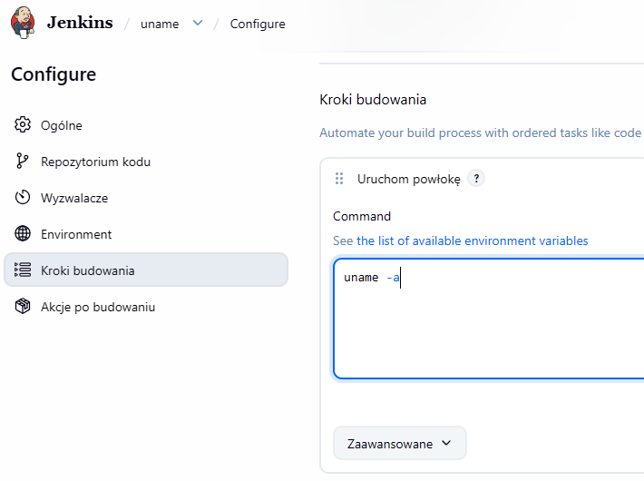
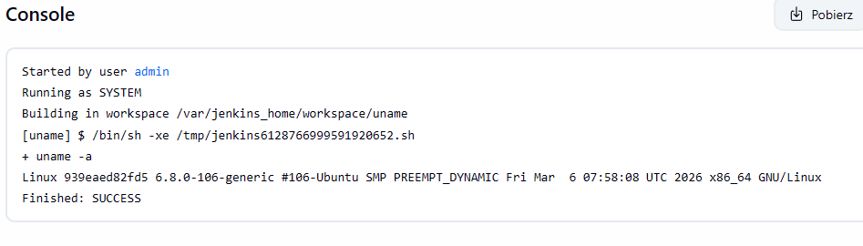
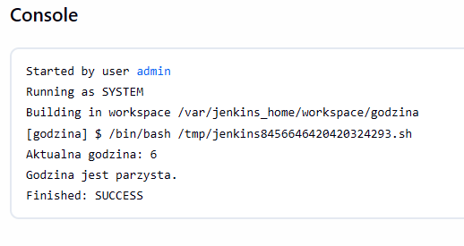
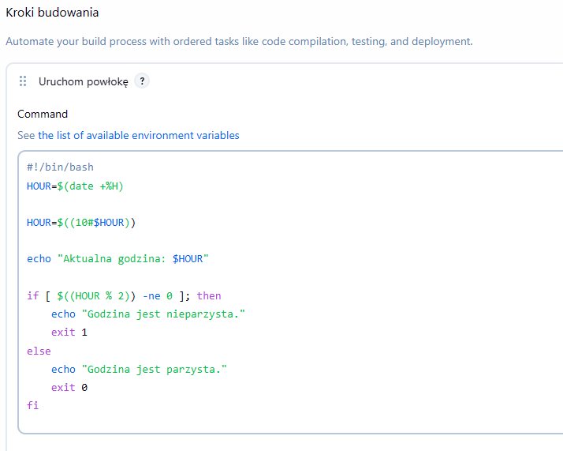
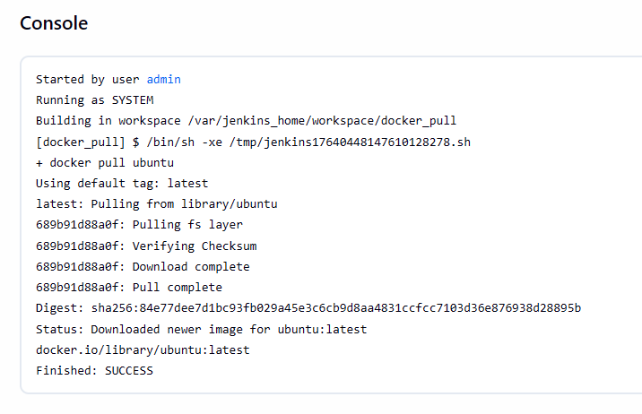
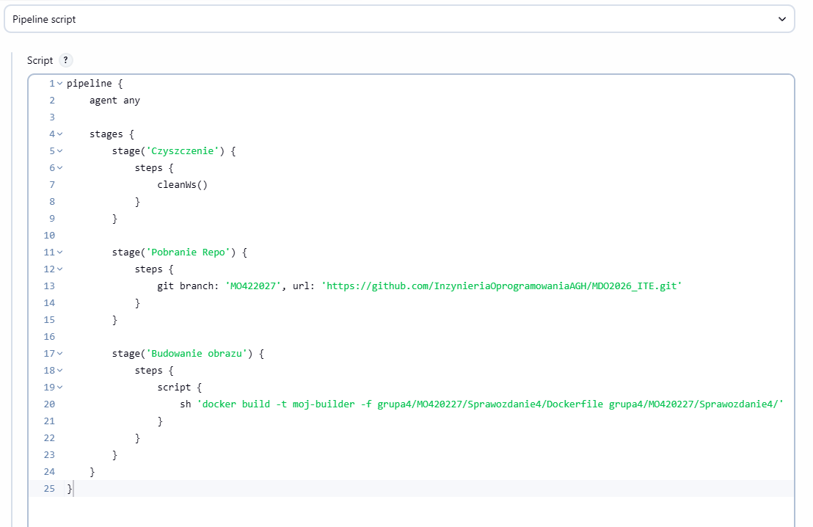
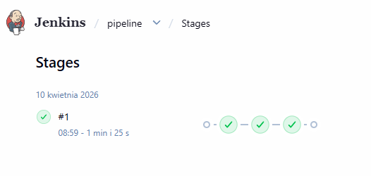
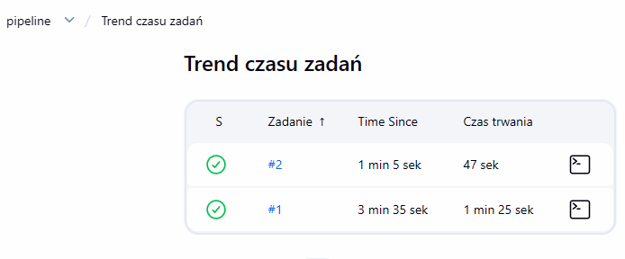

# Sprawozdanie 5

**Cel zajęć:** Zapoznanie się z narzędziem Jenkins, konfiguracja środowiska typu "Docker-in-Docker" oraz automatyzacja procesów budowania za pomocą obiektów typu Pipeline.

## 1. Przygotowanie środowiska
Środowisko zostało oparte na istniejącym kontenerze `myjenkins-blueocean`.

## 2. Zadania wstępne (Projekty Freestyle)
W ramach zapoznania się z interfejsem stworzono dwa podstawowe projekty typu Freestyle:
*   **Projekt Uname:** Wyświetlenie informacji o systemie operacyjnym kontenera.
*   **Projekt Godzina:** Skrypt sprawdzający parzystość godziny, który w przypadku wartości nieparzystych zwraca błąd (exit 1), demonstrując obsługę statusów końcowych zadań.

## 3. Integracja z Dockerem
Zweryfikowano możliwość wywoływania poleceń Dockera z poziomu Jenkinsa poprzez wykonanie operacji `docker pull ubuntu`.

## 4. Implementacja Pipeline'u
Zaimplementowano zaawansowany obiekt typu Pipeline, który automatyzuje proces od czyszczenia środowiska, przez pobranie kodu z repozytorium GitHub, aż po budowanie obrazu Docker na podstawie wskazanego `Dockerfile`.

*   **Struktura Pipeline:** Zdefiniowano trzy etapy: `Czyszczenie`, `Pobranie Repo` oraz `Budowanie obrazu`.
*   **Konfiguracja:** Zastosowano flagę `-f` dla polecenia `docker build`, aby wskazać ścieżkę do pliku w podkatalogu repozytorium.

## 5. Wnioski
Podczas testów zauważono, że kolejne uruchomienia tego samego Pipeline'u wykonują się znacznie szybciej. Wynika to z mechanizmu Docker Cache, który przy braku zmian w plikach wejściowych używa wcześniej zbudowanych warstw obrazu.

