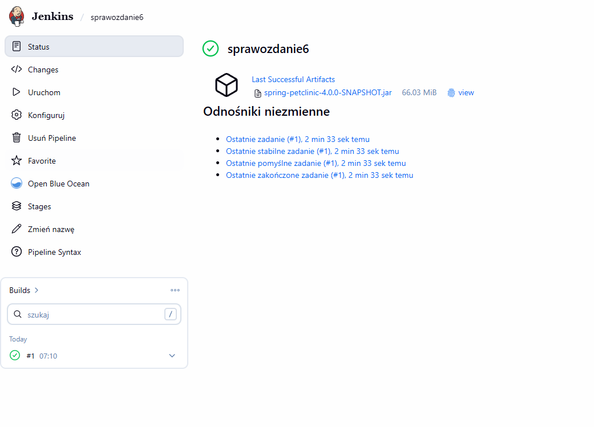
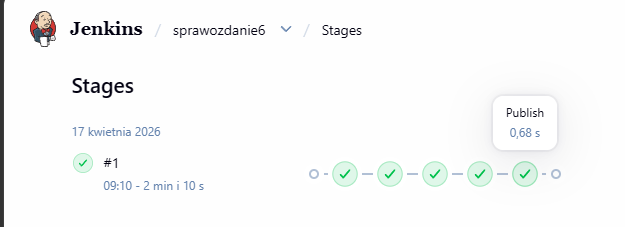
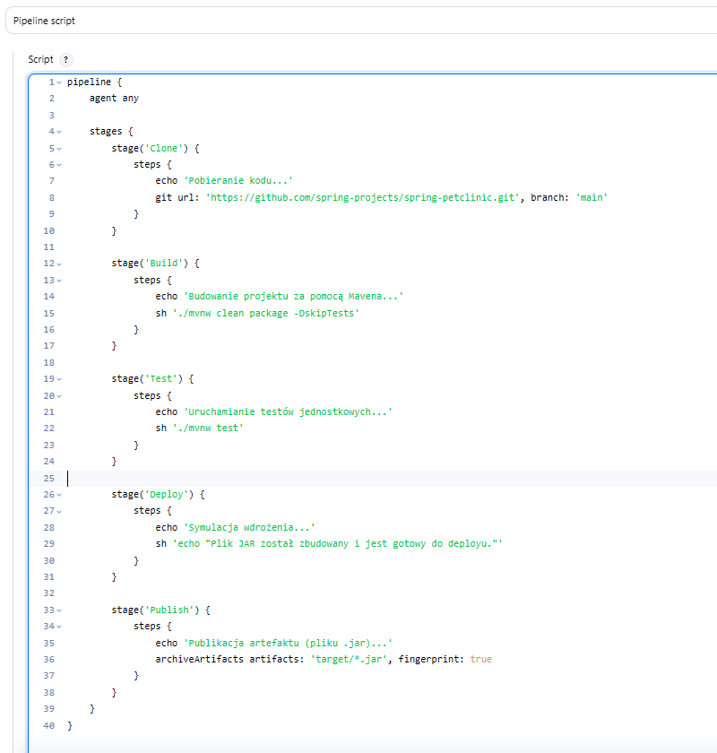

# Sprawozdanie 6

## Cel zadania
Zaimplementowanie kompletnego potoku CI/CD w środowisku Jenkins dla projektu w technologii Java/Maven, obejmującego ścieżkę krytyczną: clone, build, test, deploy, publish.

## Przebieg procesu
Proces został zrealizowany przy użyciu Declarative Pipeline w Jenkinsie. Wykorzystano projekt *Spring Petclinic* oraz mechanizm Maven Wrapper (`mvnw`), co zapewnia powtarzalność procesu budowania niezależnie od środowiska.

1. **Clone**: Pobranie kodu źródłowego z repozytorium GitHub.
2. **Build**: Kompilacja projektu i budowa paczki `.jar`.
3. **Test**: Uruchomienie testów jednostkowych weryfikujących poprawność kodu.
4. **Deploy**: Symulacja wdrożenia na środowisko docelowe.
5. **Publish**: Archiwizacja gotowego artefaktu (`.jar`) w zasobach Jenkinsa.

## Dokumentacja wizualna

**Rysunek 1: Konfiguracja Pipeline (kod źródłowy)**

*Zastosowany skrypt deklaratywny definiujący wszystkie etapy procesu CI/CD.*

**Rysunek 2: Wizualizacja ścieżki krytycznej (Stages)**

*Wykres przedstawiający poprawne wykonanie wszystkich etapów potoku (Clone, Build, Test, Deploy, Publish).*

**Rysunek 3: Status zadania oraz wygenerowany artefakt**

*Wynik pomyślnego uruchomienia budowania (#1).*

## Wnioski
Zaimplementowany pipeline w pełni realizuje założoną ścieżkę krytyczną. Automatyzacja procesu od pobrania kodu po archiwizację artefaktu przebiegła bez błędów. Każdy etap został poprawnie zweryfikowany przez system Jenkins, co potwierdzają zielone wskaźniki statusu oraz wygenerowany plik binarny.