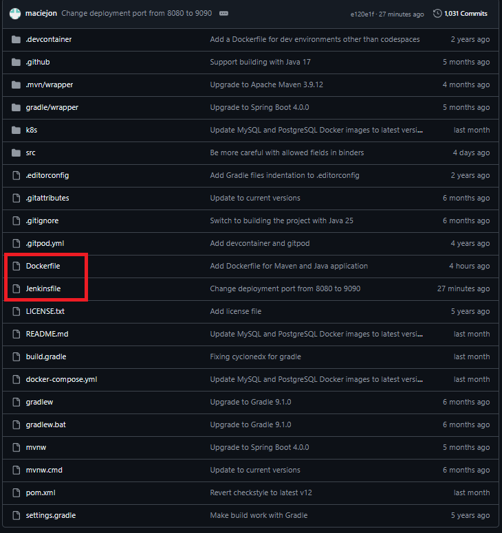
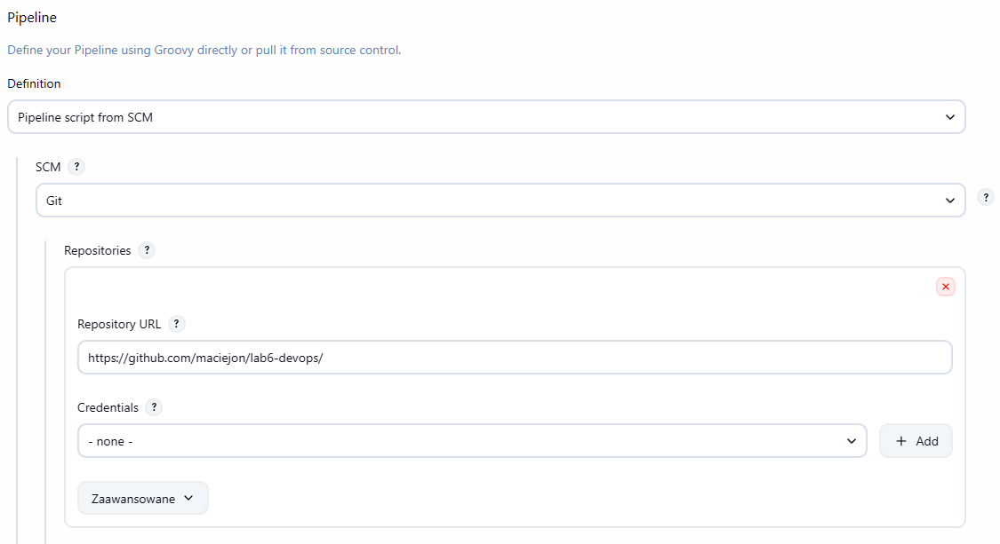
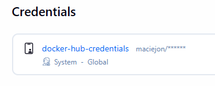

# Sprawozdanie 7

## 1. Cel ćwiczenia
Celem ćwiczenia było przejście od manualnie skonfigurowanego potoku w interfejsie Jenkins do podejścia **Infrastructure as Code**, gdzie definicja procesu przechowywana jest w repozytorium kodu źródłowego jako plik `Jenkinsfile`. Dodatkowo wdrożono wieloetapowy proces CI/CD dla aplikacji Spring PetClinic z użyciem konteneryzacji Docker i publikacją obrazów w rejestrze Docker Hub.

## 2. Porównanie podejść

### 2.1. Poprzednie ćwiczenie – konfiguracja manualna
| Aspekt | Opis |
| :--- | :--- |
| **Miejsce definicji** | Pipeline zdefiniowany bezpośrednio w interfejsie Jenkins |
| **Przechowywanie** | Konfiguracja w `$JENKINS_HOME/jobs/...` |
| **Wersjonowanie** | Brak – zmiany tylko przez GUI |
| **Odtwarzalność** | Ręczne odtwarzanie na innych instancjach |
| **Integracja z kodem** | Oddzielona od repozytorium aplikacji |

### 2.2. Obecne ćwiczenie – Infrastructure as Code
| Aspekt | Opis |
| :--- | :--- |
| **Miejsce definicji** | Plik `Jenkinsfile` w repozytorium Git |
| **Przechowywanie** | Współdzielone z kodem źródłowym aplikacji |
| **Wersjonowanie** | Pełen ślad zmian w systemie kontroli wersji |
| **Odtwarzalność** | Automatyczne odtworzenie po wskazaniu repozytorium |
| **Integracja z kodem** | Pipeline ewoluuje razem z aplikacją |

## 3. Struktura repozytorium
Plik `Jenkinsfile` został umieszczony w głównym katalogu repozytorium aplikacji Spring PetClinic, obok kodu źródłowego i plików konfiguracyjnych.

 

Widok repozytorium GitHub z zaznaczonym Jenkinsfile oraz Dockerfile.

## 4. Konfiguracja zadania w Jenkins
Zadanie Jenkins zostało skonfigurowane jako *Pipeline script from SCM*, co pozwoliło na automatyczne pobieranie definicji procesu z repozytorium Git.



Konfiguracja zadania – wskazanie repozytorium Git i ścieżki do `Jenkinsfile`.



Konfiguracja danych do logowania do rejestru Docker Hub.

## 5. Opis etapów pipeline'u
1.  **Pre-Clean**: Usunięcie poprzednio uruchomionego kontenera aplikacji w celu uniknięcia konfliktów nazw i portów.
2.  **Build & Test**: Budowa obrazu `bldr`, uruchomienie kompilacji `mvn clean package` wewnątrz kontenera i pobranie artefaktów przez `docker cp`.
3.  **Prepare Target Image**: Budowa finalnego obrazu produkcyjnego.
4.  **Deploy**: Uruchomienie aplikacji w kontenerze z przemapowaniem portu `8080` na `9090`.
5.  **Publish**: Archiwizacja artefaktów oraz bezpieczne wypchnięcie obrazów do Docker Hub.

## 6. Kompletny Jenkinsfile
```groovy
pipeline {
    agent any

    environment {
        DOCKER_REGISTRY = 'maciejon'
        IMAGE_NAME = 'spring-petclinic'
        CONTAINER_NAME = 'petclinic-sandbox'
        BLDR_IMAGE = "${IMAGE_NAME}-bldr:latest"
        TARGET_IMAGE = "${DOCKER_REGISTRY}/${IMAGE_NAME}:${BUILD_NUMBER}"
        APP_PORT = '9090'
    }

    stages {

        stage('Pre-Clean') {
            steps {
                sh "docker rm -f ${CONTAINER_NAME} || true"
            }
        }

        stage('Build & Test') {
            steps {
                sh "docker build --target bldr -t ${BLDR_IMAGE} ."
                sh "docker run --name build-${BUILD_NUMBER} ${BLDR_IMAGE} mvn clean package"
                sh "docker cp build-${BUILD_NUMBER}:/app/target ./target"
                sh "docker rm build-${BUILD_NUMBER}"
            }
        }

        stage('Prepare Target Image') {
            steps {
                sh "docker build -t ${TARGET_IMAGE} -t ${DOCKER_REGISTRY}/${IMAGE_NAME}:latest ."
            }
        }

        stage('Deploy') {
            steps {
                sh "docker run -d --name ${CONTAINER_NAME} -p ${9090}:8080 ${TARGET_IMAGE}"
            }
        }

        stage('Publish') {
            steps {
                archiveArtifacts artifacts: 'target/*.jar', fingerprint: true

                withCredentials([usernamePassword(credentialsId: 'docker-hub-credentials', passwordVariable: 'DOCKER_PASS', usernameVariable: 'DOCKER_USER')]) {
                    sh "echo \$DOCKER_PASS | docker login -u \$DOCKER_USER --password-stdin"
                    sh "docker push ${TARGET_IMAGE}"
                    sh "docker push ${DOCKER_REGISTRY}/${IMAGE_NAME}:latest"
                }
            }
        }
    }

    post {
        always {
            cleanWs()
        }
    }
}
```

## 7. Wnioski
Zastosowanie podejścia **Infrastructure as Code** przyniosło wymierne korzyści:
*   **Wersjonowanie**: Każda zmiana jest śledzona w Git.
*   **Code Review**: Zmiany w procesie CI/CD mogą być recenzowane przez zespół.
*   **Odtwarzalność**: Możliwość szybkiego wdrożenia procesu na innym serwerze.
*   **Spójność**: Jednolite środowisko pracy dla całego zespołu programistycznego.