# Sprawozdanie 8

## 1. Cel ćwiczenia
Celem laboratorium było praktyczne zapoznanie się z narzędziem **Ansible** do konfiguracji i zarządzania infrastrukturą metodą *Infrastructure as Code* (IaC). Ćwiczenie obejmowało przygotowanie środowiska wielomaszynowego, konfigurację uwierzytelniania SSH, inwentaryzację, pisanie i uruchamianie playbooków systemowych oraz ostatecznie – wdrożenie kontenera z aplikacją Spring PetClinic (stworzonego na poprzednich zajęciach za pomocą środowiska Jenkins) przy użyciu ról Ansible Galaxy.

## 2. Przebieg ćwiczenia

### 2.1. Przygotowanie środowiska i wymiana kluczy SSH
Zarządzanie poprzez Ansible opiera się na bezhasłowym połączeniu SSH. Pierwszym krokiem była weryfikacja zainstalowanej wersji zarządcy (Ansible Core 2.16.3). Następnie klucz publiczny na maszynie "dyrygenta" (`DevOps`) został skopiowany na nowo utworzoną maszynę docelową o adresie IP `192.168.0.103` przy użyciu polecenia `ssh-copy-id`.

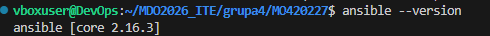
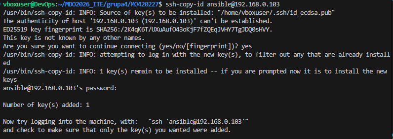

### 2.2. Konfiguracja rozwiązywania nazw (DNS)
Aby uniknąć posługiwania się adresami IP i umożliwić zarządzanie po nazwach hostów, zedytowano plik `/etc/hosts` na głównej maszynie, dopisując adres maszyny-dyrygenta (`DevOps`) oraz maszyny docelowej (`ansible-target`).

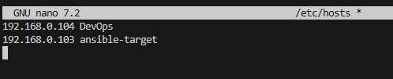

Poprawność wprowadzonych zmian zweryfikowano standardowym poleceniem `ping`, które poprawnie rozwiązało nazwę `ansible-target` na adres IP.

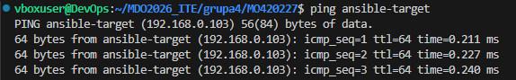

### 2.3. Inwentaryzacja i test łączności modułem ad-hoc
Utworzono plik inwentaryzacji `inventory.ini`. Podzielono w nim maszyny na dwie grupy:
* `[Orchestrators]` – z ustawieniem `ansible_connection=local` dla maszyny sterującej.
* `[Endpoints]` – zawierającą host `ansible-target`. Zdefiniowano dla niej zmienne środowiskowe wymuszające logowanie na użytkownika `ansible` oraz eskalację uprawnień (`ansible_become=yes`).

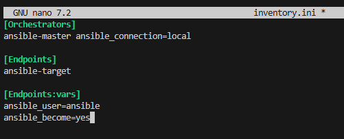

W celu weryfikacji poprawności inwentaryzacji i komunikacji SSH, wysłano żądanie testowe za pomocą wbudowanego w Ansible modułu pingującego (polecenie ad-hoc: `ansible all -i inventory.ini -m ping`). Obie maszyny poprawnie odpowiedziały statusem "pong".

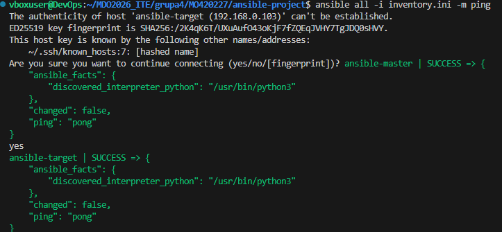

### 2.4. Playbook procedur systemowych i zasada idempotencji
Kolejnym etapem było utworzenie pliku `system_playbook.yml`. Skrypt ten miał za zadanie wykonać szereg podstawowych operacji na docelowej maszynie: skopiowanie pliku, aktualizację systemu (APT), upewnienie się, że pakiet `rng-tools` jest zainstalowany, oraz zrestartowanie wybranych usług (`sshd` oraz `rngd`).

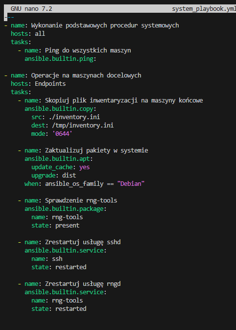

Pierwsze uruchomienie playbooka skutkowało dokonaniem realnych zmian w systemie docelowym. Statusy zadań takie jak kopiowanie, aktualizacja czy instalacja pakietu zmieniły się na kolor żółty z oznaczeniem `changed`.

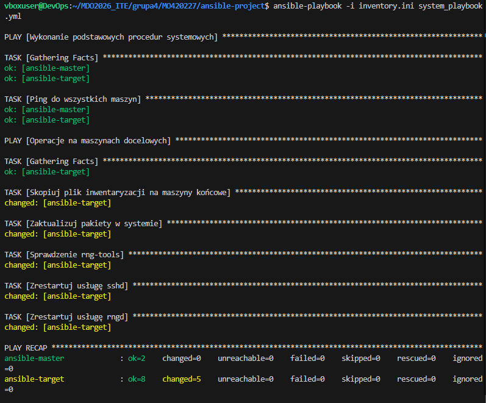

Zgodnie z poleceniem, operację ponowiono. Wynik drugiego wywołania doskonale obrazuje idempotentność narzędzia Ansible. System rozpoznał, że pliki zostały już skopiowane, a pakiety zaktualizowane – dlatego status tych zadań zmienił się na `ok` (na zielono). Tylko moduły zarządzające usługami (`state: restarted`) zostały wykonane ponownie, co wynika z bezpośredniej dyrektywy wymuszającej restart w kodzie YAML.

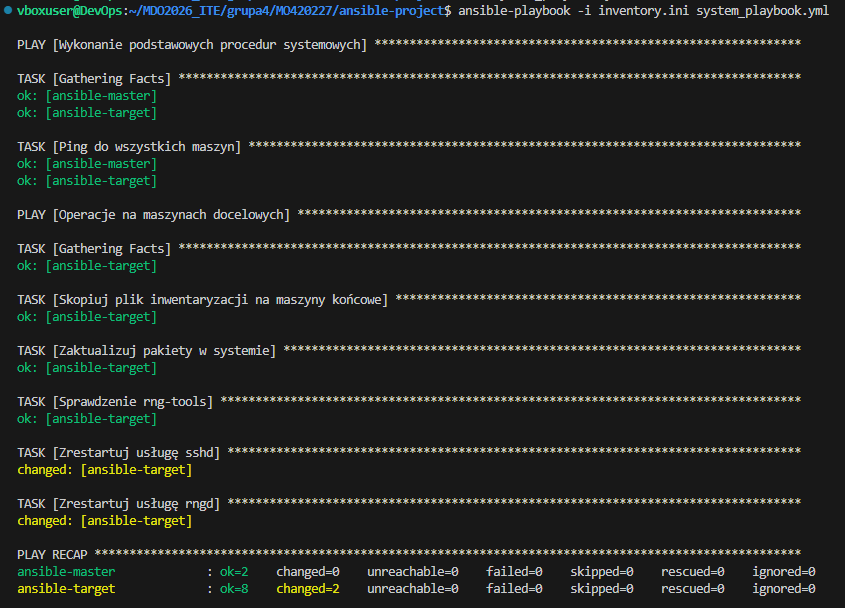

Przeprowadzono również próbę uruchomienia w warunkach przerwanej łączności.

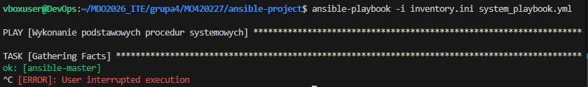

### 2.5. Zarządzanie artefaktem (Deploy) z wykorzystaniem ról
Logikę odpowiedzialną za instalację środowiska Docker oraz wdrożenie naszej aplikacji z poprzedniego laboratorium (Spring PetClinic) "ubrano" w rolę stworzoną za pomocą narzędzia `ansible-galaxy`. 

W pliku `roles/deploy_petclinic/tasks/main.yml` skonfigurowano m.in.:
1. Próbny sanity check (sprawdzenie dostępności dysku poleceniem `df -h /`).
2. Instalację Dockera za pomocą skryptu i konfigurację modułu python-docker.
3. Wdrożenie artefaktu: `maciejon/spring-petclinic:latest`.
4. Test łączności (moduł `uri` weryfikujący kod HTTP 200).
5. Oczyszczenie środowiska po udanym teście.

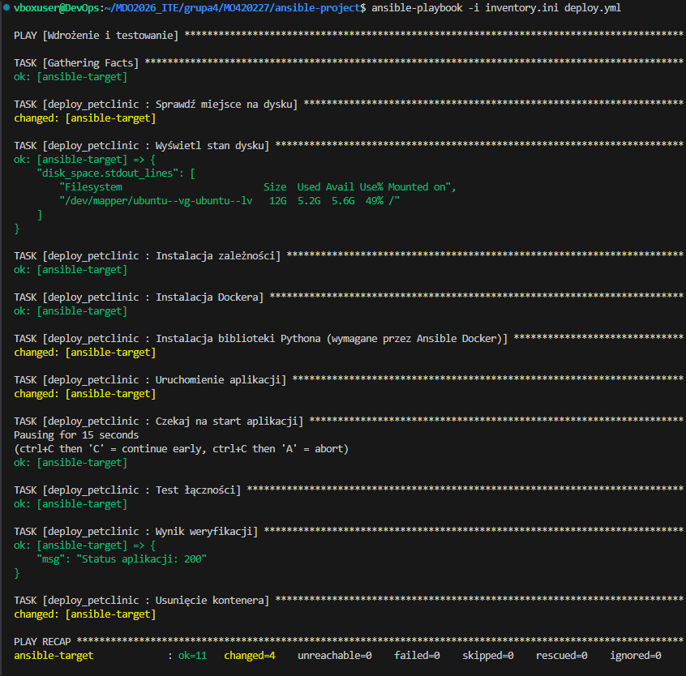

Wywołanie specjalnie przygotowanego pliku `deploy.yml`, wykorzystującego napisaną rolę, zakończyło się pełnym sukcesem. Ansible krok po kroku zrealizowało pipeline operacyjny na maszynie docelowej. Kontener Spring PetClinic uruchomił się poprawnie, o czym świadczy komunikat kontrolny: `Status aplikacji: 200`. Na sam koniec kontener został prawidłowo usunięty (`changed` przy usuwaniu kontenera).

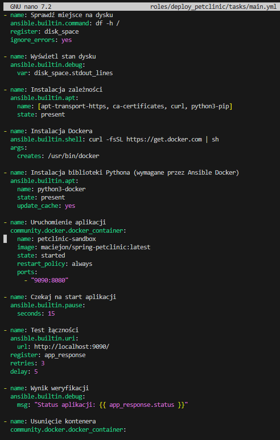

## 3. Podsumowanie i wnioski
Dzięki wykonanym ćwiczeniom udało się w płynny sposób połączyć wiedzę z poprzednich zajęć (CI/CD za pomocą Jenkinsa) z obecnymi operacjami CD/IaC z wykorzystaniem Ansible. Udowodniono, że:
*   Ansible pozwala w deklaratywny sposób zarządzać flotą serwerów bez konieczności instalowania na nich agentów.
*   Zasada idempotencji chroni serwery przed przypadkową zmianą stanu w przypadku wielokrotnego wykonywania skryptów.
*   Strukturyzacja kodu w postaci ról (`ansible-galaxy`) pozwala na zachowanie czytelności, porządku oraz wysokiej skalowalności, tworząc moduły gotowe do ponownego wykorzystania (np. rola automatyzująca instalację Dockera i wdrażanie kontenerów).