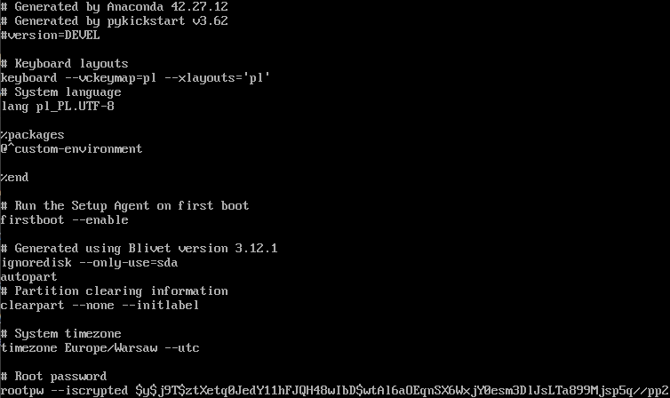
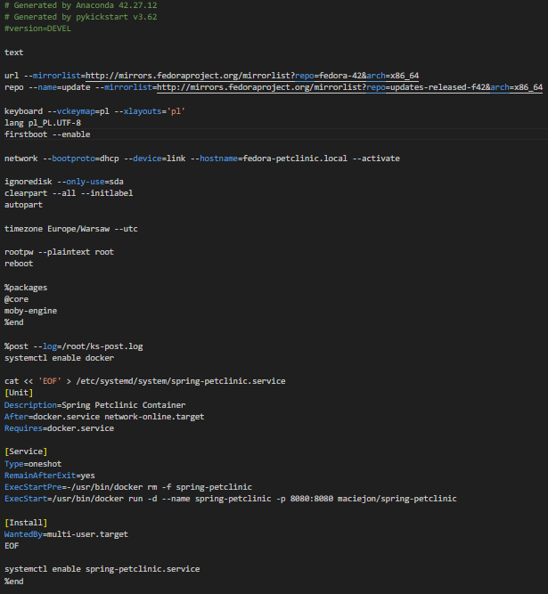
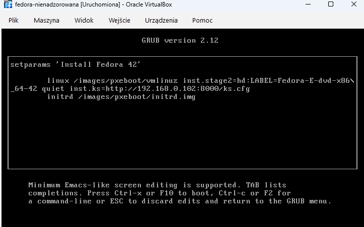
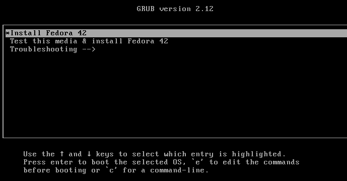

# Sprawozdanie 9

Celem zadania było przygotowanie automatycznego źródła instalacji nienadzorowanej dla systemu operacyjnego Fedora, który po zakończeniu instalacji automatycznie wdroży i uruchomi kontener z aplikacją.

---

### 1: Instalacja klasyczna i pozyskanie bazowego pliku odpowiedzi

W pierwszej kolejności przeprowadzono ręczną instalację systemu Fedora 42 Netinst na maszynie wirtualnej w celu wygenerowania wyjściowej struktury pliku odpowiedzi. Po zakończeniu konfiguracji z katalogu `/root/` pobrano plik `anaconda-ks.cfg`, który posłużył jako szablon do dalszych modyfikacji.

---

### 2: Przygotowanie ostatecznego pliku konfiguracyjnego `ks.cfg`

Pobrany plik poddano modyfikacjom niezbędnym do przeprowadzenia w pełni automatycznej instalacji sieciowej oraz wdrożenia wymaganych pakietów. 

Wprowadzone zmiany obejmowały:
* Dodanie aktywnych zwierciadeł repozytoriów dla wersji 42.
* Ustawienie nazwy hosta `fedora-petclinic.local`.
* Dodanie pakietu `moby-engine` (silnika Docker) w sekcji `%packages`.
* Utworzenie w sekcji `%post` dedykowanej usługi systemd (`spring-petclinic.service`), która przy pierwszym uruchomieniu systemu pobiera obraz `maciejon/spring-petclinic` z Docker Hub i uruchamia go na porcie `8080`.

---

### 3: Automatyczna instalacja nienadzorowana

Plik `ks.cfg` został udostępniony w sieci lokalnej przy użyciu tymczasowego serwera HTTP uruchomionego w środowisku hosta. 

Podczas uruchamiania nowej maszyny wirtualnej z włączoną kartą mostkowaną zedytowano opcje rozruchu w programie GRUB. W linii poleceń jądra dopisano dyrektywę wskazującą lokalizację sieciową przygotowanego pliku odpowiedzi.

Instalator pobrał konfigurację, przeprowadził proces instalacji, a po zakończeniu automatycznie zrestartował maszynę.

---

### 4: Weryfikacja działania wdrożonej usługi

Po odłączeniu obrazu ISO i uruchomieniu systemu bezpośrednio z dysku twardego, zalogowano się na konto użytkownika `root`. Poprawność wdrożenia aplikacji zweryfikowano za pomocą polecenia wyświetlającego listę aktywnych kontenerów.

Usługa systemd automatycznie zainicjowała środowisko Docker, pobrała obraz `maciejon/spring-petclinic` i uruchomiła go z prawidłowym przekierowaniem portów.