# Sprawozdanie z labolatoriów 1-4 - Szymon Makowski ITE

## Środowisko pracy
- Host: Windows 11
- Maszyna wirtualna: Ubuntu 24.04 LTS (VirtualBox)
- Połączenie: SSH z PowerShell/VS Code Remote SSH
- Użytkownik VM: SzymonMakowski (bez root)

# Laboratorium 1: Weryfikacja środowiska, Git, SSH i gałęzie

## 1. Weryfikacja środowiska

### 1.1 Logowanie przez SSH do maszyny wirtualnej

Polecenie ssh służy do nawiązywania szyfrowanego połączenia z maszyną zdalną; podając nazwę użytkownika i adres IP można przejąć pełną kontrolę nad terminalem VM bez dostępu fizycznego.

```bash
ssh SzymonMakowski@192.168.1.105
```

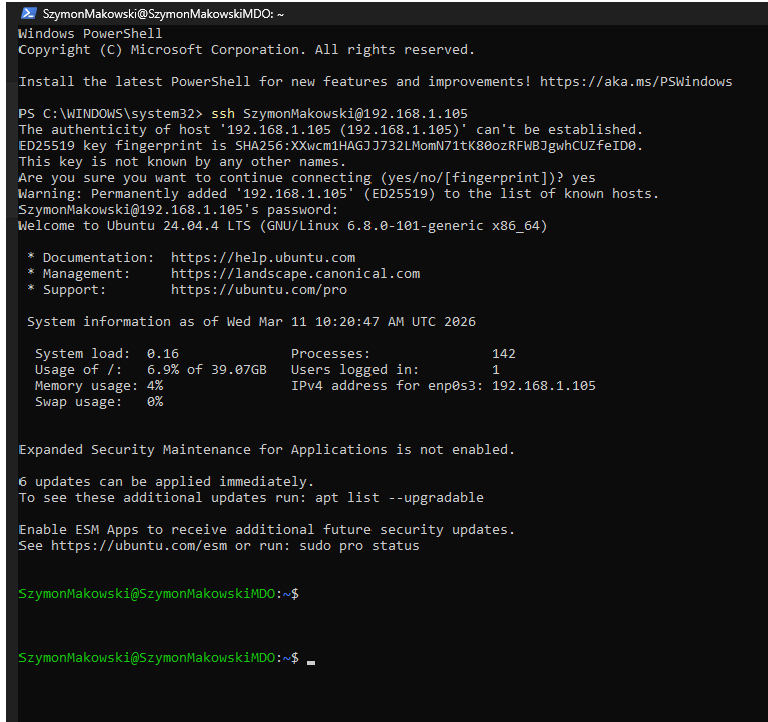

### 1.2 Wysyłanie i odbiór pliku przez SCP

Polecenie scp (Secure Copy) umożliwia bezpieczny transfer plików między hostem a maszyną zdalną po protokole SSH, zachowując szyfrowanie całego ruchu.

```bash
scp test.txt SzymonMakowski@192.168.1.105:/home/SzymonMakowski
scp SzymonMakowski@192.168.1.105:/home/SzymonMakowski/test1.txt .
```

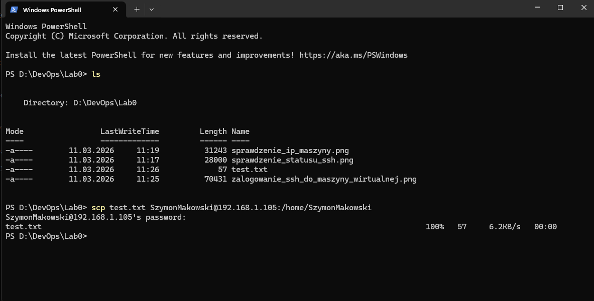

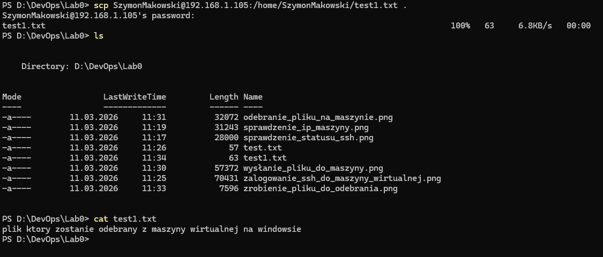

### 1.3 Klonowanie repozytorium GitHub z VM

Polecenie git clone pobiera kompletną kopię repozytorium wraz z całą historią commitów, użycie adresu SSH zakłada wcześniej skonfigurowany klucz SSH.

```bash
git clone git@github.com:octocat/Hello-World.git
```


### 1.4 Połączenie z FileZilla i Remote SSH w VS Code

FileZilla pozwala na graficzne przeglądanie i transfer plików przez SFTP, natomiast wtyczka Remote SSH w VS Code umożliwia edytowanie plików na VM bezpośrednio w lokalnym edytorze, jakby były na dysku hosta.


---

## 2. Git

### 2.1 Instalacja klienta Git i konfiguracja

Polecenia apt install instalują pakiety z repozytoriów Ubuntu, a git config --global ustawia globalną tożsamość użytkownika zapisywaną we wszystkich przyszłych commitach w systemie.

```bash
sudo apt update
sudo apt install git openssh-client -y
git --version
ssh -V
git config --global user.name "szymonmakow"
git config --global user.email "szymonmakow@poczta.fm"
git config --list
```


### 2.2 Klonowanie repozytorium przez HTTPS z tokenem PAT

Klonowanie przez HTTPS z Personal Access Token (PAT) pozwala na autoryzację bez konfiguracji kluczy SSH — token pełni rolę jednorazowego hasła o ograniczonym zakresie uprawnień.

```bash
git clone https://github.com/InzynieriaOprogramowaniaAGH/MDO2026_ITE.git
```

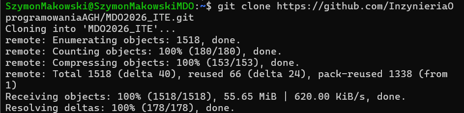

---

## 3. SSH

### 3.1 Generowanie kluczy SSH typu ed25519

Polecenie ssh-keygen tworzy parę kluczy kryptograficznych (prywatny i publiczny); algorytm ed25519 jest nowocześniejszy i bezpieczniejszy od RSA, a parametr -f pozwala wskazać niestandardową ścieżkę klucza.

```bash
ssh-keygen -t ed25519 -C "szymonmakow@poczta.fm" -f ~/.ssh/id_ed25519_github

ssh-keygen -t ed25519 -C "szymonmakow@poczta.fm" -f ~/.ssh/id_ed25519_github_secure
```

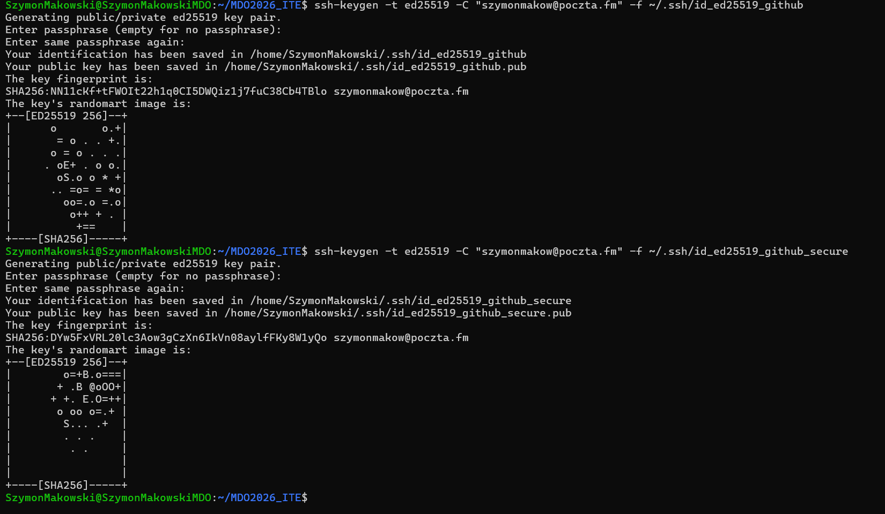

### 3.2 Dodanie klucza publicznego do GitHub i weryfikacja

Klucz publiczny wgrywa się do konta GitHub, a polecenie ssh -T weryfikuje, że handshake SSH przebiegł poprawnie i połączenie z GitHubem jest aktywne.

```bash
cat ~/.ssh/id_ed25519_github.pub
ssh -T git@github.com
git clone git@github.com:InzynieriaOprogramowaniaAGH/MDO2026_ITE.git
```

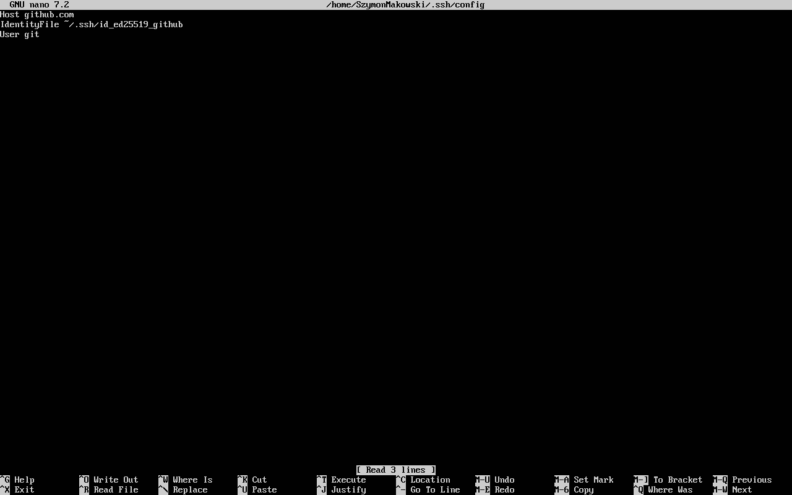

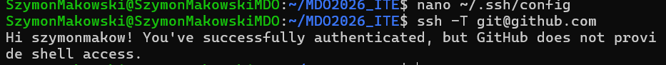
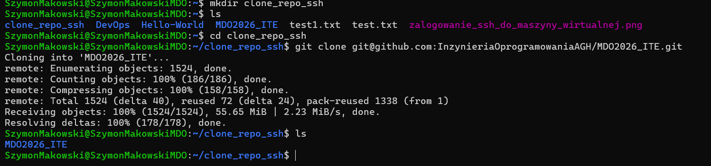

---

## 4. Gałęzie w Git

### 4.1 Tworzenie własnej gałęzi i struktury katalogów

Polecenie git checkout -b tworzy nową gałąź i od razu na nią przełącza.

```bash
git checkout main
git checkout grupa4
git checkout -b SM419482
mkdir -p grupa4/SM419482/Sprawozdanie1
```

### 4.2 Git hook weryfikujący prefiks wiadomości commita

Git hooks to skrypty wykonywane automatycznie przy określonych zdarzeniach Git, hook commit-msg uruchamia się przed zapisaniem commita i może go odrzucić, jeśli wiadomość nie spełnia wymagań.
```bash
#!/bin/bash
commit_msg=$(cat "$1")
prefix="SM419482"

if [[ ! "$commit_msg" == "$prefix"* ]]; then
  echo "ERROR: Commit message musi zaczynac sie od '$prefix'"
  exit 1
fi

exit 0
```

```bash
chmod +x .git/hooks/commit-msg
```

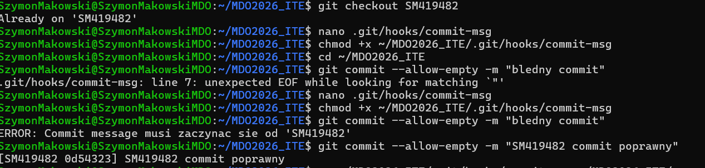


---

**Podsumowanie:** Na zajęciach nauczyliśmy się łączyć z maszyną wirtualną przez SSH i SCP, konfigurować tożsamość Git, generować i wdrażać klucze ed25519 do GitHub oraz organizować pracę zespołową za pomocą gałęzi i git hooków. Zdobyte umiejętności stanowią fundament każdego środowiska deweloperskiego opartego na systemie kontroli wersji.

---
---

# Laboratorium 2: Docker — podstawy

## 1. Instalacja Dockera

Polecenia apt install docker.io i systemctl enable/start instalują Dockera z oficjalnych repozytoriów Ubuntu i uruchamiają jego demona jako usługę systemową; usermod -aG docker dodaje użytkownika do grupy docker, eliminując potrzebę używania sudo przy każdym poleceniu.

```bash
sudo apt update
sudo apt install docker.io -y
docker --version
sudo systemctl enable docker
sudo systemctl start docker
sudo usermod -aG docker $USER
newgrp docker
```

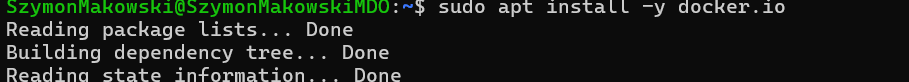
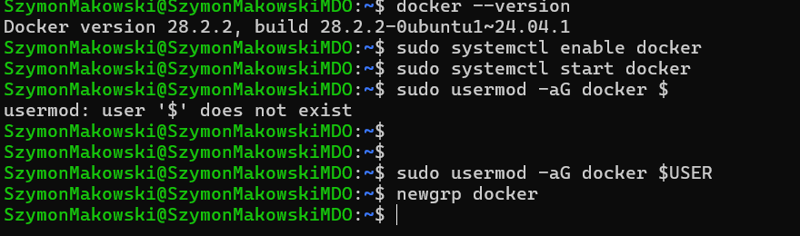

---

## 2. Rejestracja w Docker Hub

Zarejestrowano konto na [hub.docker.com](https://hub.docker.com) i zapoznano się z dostępnymi obrazami.

---

## 3. Uruchomienie podstawowych obrazów

Polecenie docker run pobiera obraz z Docker Hub (jeśli nie ma go lokalnie) i uruchamia nowy kontener, flagi -it dołączają interaktywny terminal, a echo $? sprawdza kod wyjścia poprzedniego polecenia.

```bash
docker run hello-world
echo $?

docker run busybox
docker run ubuntu

docker run -it busybox sh
busybox | head -1

docker run -it ubuntu bash
ps aux
apt update
```


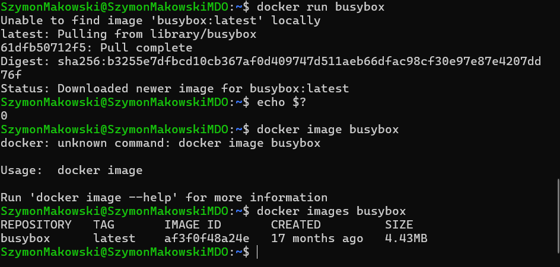

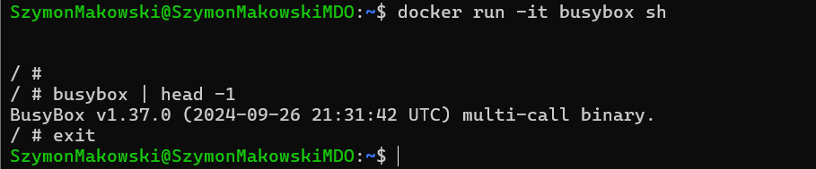


---

## 4. Własny Dockerfile

Plik Dockerfile definiuje przepis budowania obrazu, każda instrukcja (FROM, RUN, COPY) tworzy nową warstwę, docker build kompiluje obraz na podstawie tego pliku, a docker run tworzy z niego uruchomiony kontener.

```bash
docker build -t my-repo-image .
docker run -it my-repo-image bash
ls /repo
```


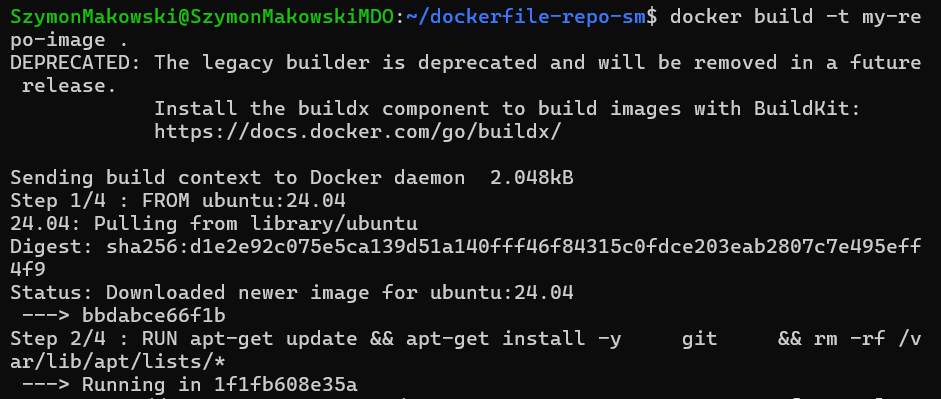
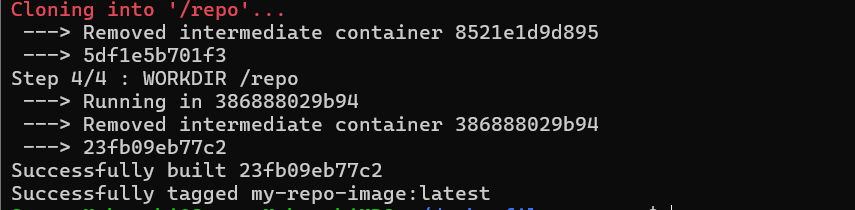
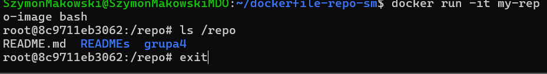

---

## 5. Zarządzanie kontenerami i obrazami

Polecenie docker ps -a wyświetla wszystkie kontenery (łącznie z zatrzymanymi), docker container prune usuwa zakończone kontenery, a docker image prune -a czyści nieużywane obrazy zwalniając miejsce na dysku.

```bash
docker ps -a
docker container prune
docker images
docker image prune -a
```


---

**Podsumowanie:** Na zajęciach nauczyliśmy się instalować i konfigurować Dockera, uruchamiać gotowe obrazy z Docker Hub, tworzyć własne obrazy za pomocą Dockerfile oraz zarządzać cyklem życia kontenerów i obrazów. Zrozumieliśmy różnicę między obrazem a kontenerem oraz jak izolacja procesów w kontenerach różni się od pełnej wirtualizacji.

---
---

# Laboratorium 3: Docker — budowanie i testowanie aplikacji

## 1. Wybrane oprogramowanie: expressjs/express

Framework Express.js jest popularnym frameworkiem webowym dla Node.js. Build realizowany jest poleceniem npm install, a testy uruchamiane przez npm test (framework Mocha). Repozytorium: https://github.com/expressjs/express

---

## 2. Klonowanie i lokalny build

Standardowy cykl budowania projektu Node.js: git clone pobiera kod źródłowy, a npm install rozwiązuje i instaluje wszystkie zależności zdefiniowane w pliku package.json.

```bash
git clone https://github.com/expressjs/express.git
cd express
npm install
npm test
```

Wynik: 1246 testów zaliczonych w 20 sekund.

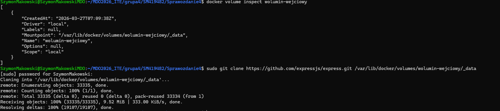

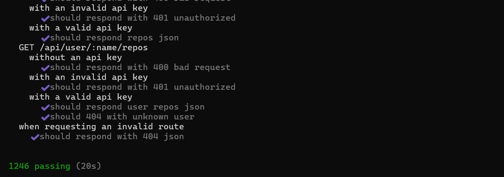


---

## 3. Build w kontenerze interaktywnie

Uruchomienie kontenera node:20 i wykonanie pełnego cyklu build i test wewnątrz izolowanego środowiska pozwala zweryfikować, że aplikacja buduje się poprawnie niezależnie od konfiguracji maszyny hosta.

```bash
docker run -it node:20 bash
git clone https://github.com/expressjs/express.git
cd express
npm install
npm test
```

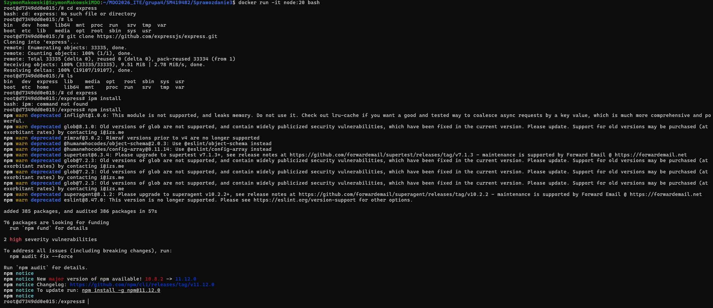


---

## 4. Dockerfile.build

Dockerfile.build definiuje kontener wykonujący pełny cykl budowania aplikacji wewnątrz izolowanego środowiska, dzięki temu build jest w pełni odtwarzalny niezależnie od konfiguracji maszyny dewelopera.

```bash
docker build -t express-build -f Dockerfile.build .
```

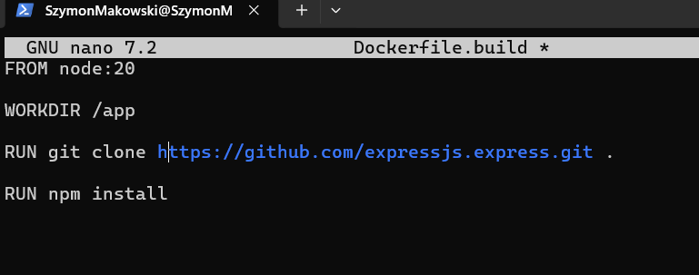
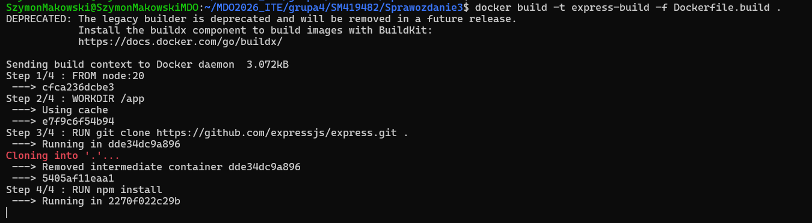
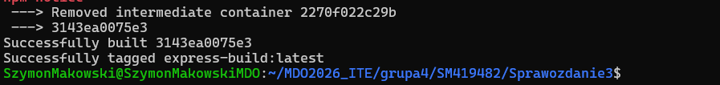

---

## 5. Dockerfile.test

Dockerfile.test bazuje na obrazie build i wykonuje wyłącznie testy, rozdzielenie fazy budowania od testowania zmniejsza rozmiar finalnego obrazu testowego i pozwala uruchamiać testy bez ponownego budowania całej aplikacji.

```bash
docker build -t express-test -f Dockerfile.test .
docker run express-test
```


---

## 6. Weryfikacja kontenerów

Polecenia docker ps -a i docker images pozwalają zweryfikować, że kontener express-test zakończył się z kodem 0oraz sprawdzić rozmiary obrazów, w tym przypadku każdy waży ok. 1,2 GB.

```bash
docker ps -a
docker images
```

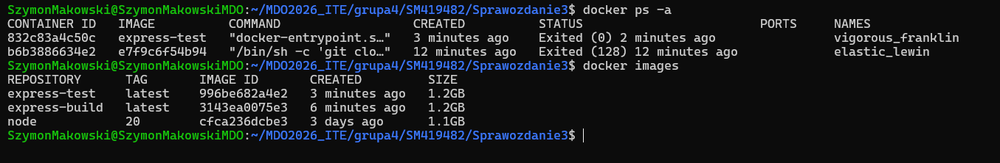

---

**Podsumowanie:** Na zajęciach nauczyliśmy się konteneryzować pełny cykl CI aplikacji: od pobrania kodu, przez build, aż po testy automatyczne — wszystko wewnątrz Dockera. Zrozumieliśmy, dlaczego warto rozdzielać etap budowania od etapu testowania oraz jak izolacja środowiska w kontenerze gwarantuje powtarzalność wyników niezależnie od systemu hosta.

---
---

# Laboratorium 4: Docker — woluminy, sieci, SSHD i Jenkins

## 1. Woluminy — zachowywanie stanu między kontenerami

### 1.1 Tworzenie i montowanie woluminów

Polecenie docker volume create tworzy trwały wolumin zarządzany przez Dockera, opcja --mount w docker run podłącza go do konkretnej ścieżki wewnątrz kontenera, dzięki czemu dane przeżywają usunięcie kontenera.

```bash
docker volume create wolumin-wejciowy
docker volume create wolumin-wyjsciowy
docker volume ls

docker run -it --mount source=wolumin-wejciowy,target=/input --mount source=wolumin-wyjsciowy,target=/output node:20 bash
```


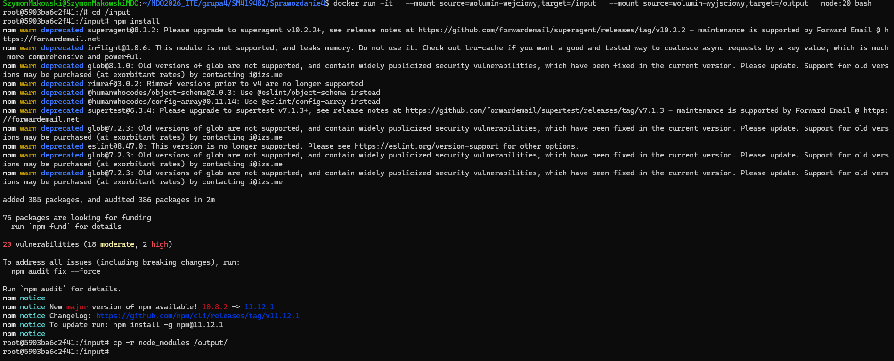

### 1.2 Klonowanie repozytorium na wolumin z poziomu hosta

Polecenie docker volume inspect zwraca metadane woluminu, co pozwala klonować repozytorium bezpośrednio do katalogu woluminu z hosta, omijając konieczność instalowania git wewnątrz kontenera.

```bash
docker volume inspect wolumin-wejciowy
sudo git clone https://github.com/expressjs/express.git /var/lib/docker/volumes/wolumin-wejciowy/_data
```


### 1.3 Build w kontenerze i zapis na wolumin wyjściowy

```bash
docker run -it --mount source=wolumin-wejciowy,target=/input --mount source=wolumin-wyjsciowy,target=/output node:20 bash

cd /input
npm install
cp -r node_modules /output/
```

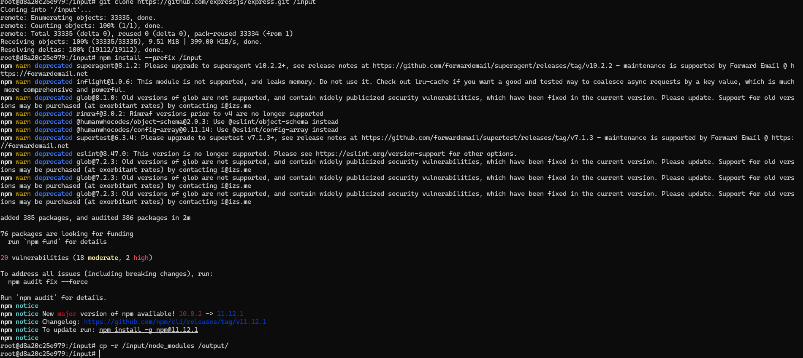

### 1.4 Możliwość wykonania kroków przez Dockerfile z RUN --mount

Instrukcja RUN --mount=type=cache w Dockerfile pozwala na montowanie woluminów podczas budowania obrazu bez zapisywania ich w finalnym obrazie:

```dockerfile
RUN --mount=type=bind,source=.,target=/input cd /input && npm install
```

---

## 2. Eksponowanie portów i sieć mostkowa

### 2.1 Dedykowana sieć Docker

Polecenie docker network create tworzy izolowaną sieć mostkową, kontenery podłączone do tej samej sieci mogą się ze sobą komunikować po nazwie kontenera zamiast adresu IP, co upraszcza konfigurację mikroserwisów.

```bash
docker network create moja-siec
docker run -dit --name iperf-server --network moja-siec networkstatic/iperf3 -s
docker run -dit --name iperf-client --network moja-siec networkstatic/iperf3 -s
docker exec -it iperf-client bash
iperf3 -c iperf-server
```

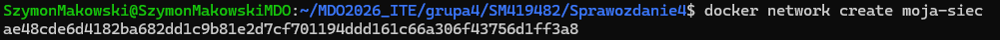


### 2.2 Mapowanie portów na hosta

Flaga -p HOST:KONTENER w docker run przekierowuje ruch z portu hosta do portu kontenera, umożliwia to dostęp do usług kontenerowych z zewnątrz, choć firewall maszyny wirtualnej może blokować część połączeń.

```bash
docker run -dit --name iperf-server -p 5201:5201 networkstatic/iperf3 -s
iperf3 -c localhost
```
Połączenie spoza hosta (iperf3 -c 192.168.1.100) zakończyło się błędem Connection timed out, firewall VirtualBox blokuje port 5201.


---

## 3. Serwer SSH w kontenerze

Uruchomienie serwera SSHD wewnątrz kontenera ubuntu i mapowanie portu 22 na 2222 hosta pozwala na logowanie SSH do kontenera, jednak takie podejście stoi w sprzeczności z filozofią Dockera, a dockerexec jest zalecaną alternatywą.

```bash
docker run -it -p 2222:22 --name sshd-container ubuntu bash
apt update && apt install openssh-server -y
mkdir /var/run/sshd
echo 'root:password123' | chpasswd
sed -i 's/#PermitRootLogin prohibit-password/PermitRootLogin yes/' /etc/ssh/sshd_config
service ssh start
```

Połączenie z kontenera z hosta:

```bash
ssh root@localhost -p 2222
```

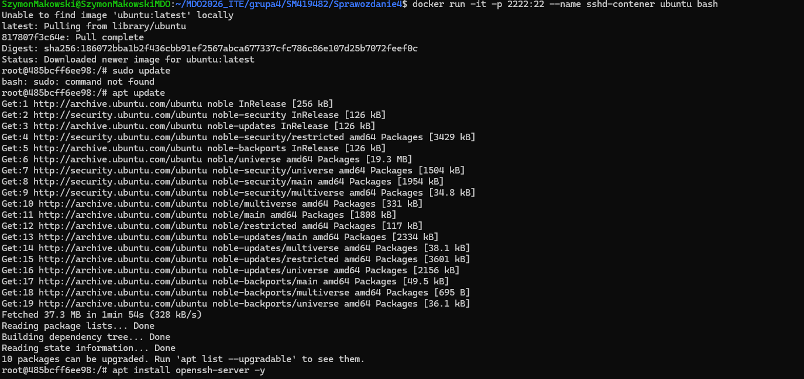
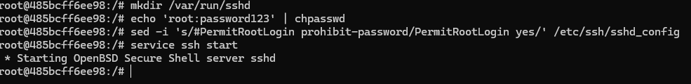


**Zalety SSH w kontenerze:** znany protokół, możliwość SCP/SFTP, szyfrowana komunikacja.  
**Wady:** niezgodne z filozofią kontenerów, wymaga zarządzania kluczami/hasłami, lepszym rozwiązaniem jest docker exec.

---

## 4. Jenkins z Docker-in-Docker (DIND)

Uruchomienie Jenkinsa z DIND pozwala na budowanie i uruchamianie kontenerów wewnątrz pipeline'ów CI/CD, wymagana jest osobna sieć Docker oraz wymiana certyfikatów TLS między kontenerem DIND a Jenkinsem.

```bash
docker network create jenkins

docker run --name jenkins-docker --rm --detach --privileged --network jenkins --network-alias docker --env DOCKER_TLS_CERTDIR=/certs --volume jenkins-docker-certs:/certs/client --volume jenkins-data:/var/jenkins_home --publish 2376:2376 docker:dind --storage-driver overlay2

docker build -t myjenkins-blueocean:2.492.1-1 .

docker run --name jenkins-blueocean --restart=on-failure --detach --network jenkins --env DOCKER_HOST=tcp://docker:2376 --env DOCKER_CERT_PATH=/certs/client --env DOCKER_TLS_VERIFY=1 --volume jenkins-data:/var/jenkins_home --volume jenkins-docker-certs:/certs/client:ro --publish 8081:8080 --publish 50000:50000 myjenkins-blueocean:2.492.1-1

docker logs jenkins-blueocean
docker ps
```


---

**Podsumowanie:** Na zajęciach nauczyliśmy się zarządzać trwałością danych w kontenerach za pomocą woluminów, konfigurować izolowane sieci Docker i mapować porty na host, uruchamiać dodatkowe procesy w kontenerach oraz stawiać środowisko CI/CD oparte na Jenkinsie z Docker-in-Docker. Zrozumieliśmy, kiedy stosowanie SSH w kontenerze jest uzasadnione, a kiedy należy preferować docker exec.