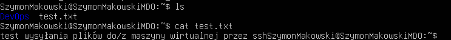
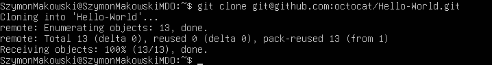
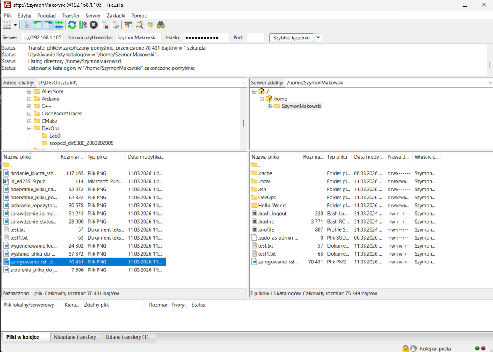
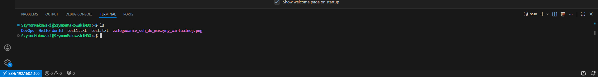
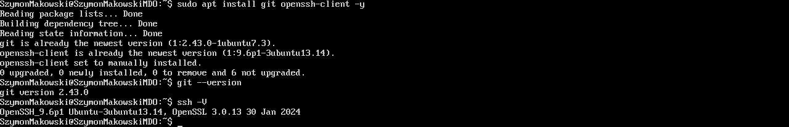
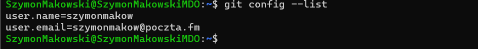
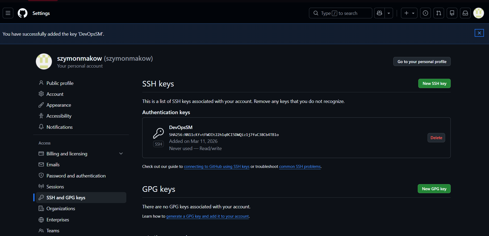
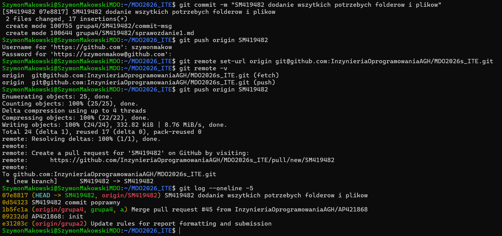

# Sprawozdanie 1 - Szymon Makowski ITE

## Środowisko pracy
- Host: Windows 11
- Maszyna wirtualna: Ubuntu 24.04 LTS (VirtualBox)
- Połączenie: SSH z PowerShell/VS Code Remote SSH
- Użytkownik VM: SzymonMakowski (bez root)

## 1. Weryfikacja środowiska
### Logowanie z Powershella przez SSH do maszyny wirtualnej

ssh SzymonMakowski@192.168.1.105


### Wysyłanie i odbiór pliku przez SSH
scp test.txt SzymonMakowski@192.168.1.105:/home/SzymonMakowski




scp SzymonMakowski@192.168.1.105:/home/SzymonMakowski/test1.txt .


### Klonownie repozytorium GitHub z VM
git clone git@github.com:octocat/Hello-World.git



### Połączenie z FileZilla
Skonfigurowano połączenie z maszyną wirtualną w FileZilla.


### Zrobienie Remote SSH w VS Code
Zainstalowano wtyczkę Remote SSH w VS Code i połączono się z maszyną wirtualną.


## 2. Git
### 2.1 Instalacja klienta Git i obsługi kluczy SSH
Polecenia wykonane w VM przez SSH:
sudo apt update
sudo apt install git openssh-client -y
git --version
ssh -V



### 2.2 Konfiguracja Git
git config --global user.name "szymonmakow"
git config --global user.email "szymonmakow@poczta.fm"
git config --list



### 2.3 Klonowanie repozytorium przez HTTPS z personal access token
git clone https://github.com/InzynieriaOprogramowaniaAGH/MDO2026_ITE.git


## 3. SSH

### 3.1 Utworzenie kluczy SSH
Utworzono dwa klucze typu ed25519 (inne niż RSA):

**Klucz 1 - bez hasła:**
ssh-keygen -t ed25519 -C "szymonmakow@poczta.fm" -f ~/.ssh/id_ed25519_github

**Klucz 2 - zabezpieczony hasłem:**
ssh-keygen -t ed25519 -C "szymonmakow@poczta.fm" -f ~/.ssh/id_ed25519_github_secure


### 3.2 Konfiguracja klucza SSH dla GitHuba
Klucz publiczny dodano do konta GitHub (Settings → SSH and GPG keys):

cat ~/.ssh/id_ed25519_github.pub

Plik `~/.ssh/config`:




### 3.3 Klonowanie repozytorium przez SSH

ssh -T git@github.com


git clone git@github.com:InzynieriaOprogramowaniaAGH/MDO2026_ITE.git


## 4. Gałąź

### 4.1 Przełączenie na gałąź main i grupową, utworzenie własnej gałęzi, utworzenie katalogów

git checkout main
git checkout grupa4

Gałąź wywodzi się z gałęzi grupowej `grupa4`:
git checkout -b SM419482

mkdir -p grupa4/SM419482/Sprawozdanie1

### 4.4 Git hook
Skrypt weryfikujący, że commit message zaczyna się od `SM419482`:
```bash
#!/bin/bash

commit_msg=$(cat "$1")
prefix="SM419482"

if [[ ! "$commit_msg" == "$prefix"* ]]; then
echo "ERROR: Commit message musi zaczynac sie od '$prefix' "
exit 1
fi

exit 0
```

Hook skopiowano do `.git/hooks/commit-msg` i nadano uprawnienia:

chmod +x .git/hooks/commit-msg

Oraz przeprowadzono test hooka:


### 4.5 Wysłanie zmian do zdalnego źródła

