# Sprawozdanie 10 — Szymon Makowski ITE

## Wdrażanie na zarządzalne kontenery: Kubernetes 1

---

## Środowisko pracy

- Host: Windows 11
- Maszyna wirtualna: Ubuntu 24.04 LTS (VirtualBox)
- Połączenie: SSH z PowerShell / VS Code Remote SSH
- Obraz aplikacji: szymonmakow/express-app:latest (Express.js, Node.js)
- Kubernetes: minikube v1.38.1, kubectl v1.35.5, driver: Docker

---

## Cel ćwiczenia

Celem laboratorium było zapoznanie się z lokalnym stosem Kubernetes przy użyciu minikube, uruchomienie aplikacji skonteneryzowanej jako pod, obsługa Kubernetes Dashboard oraz przygotowanie deklaratywnego pliku wdrożenia YAML z wieloma replikami.

---

## 1. Instalacja klastra Kubernetes

### Wymagania sprzętowe

Minikube wymaga minimalnie 2 CPU, 2 GB RAM oraz 20 GB miejsca na dysku. Zasoby maszyny zweryfikowano poleceniami:

```bash
free -h
nproc
docker --version
docker ps
```
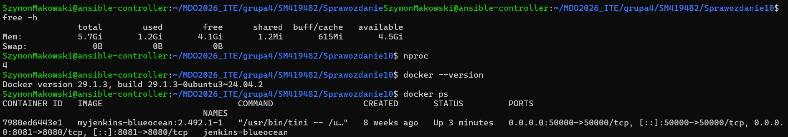

Wymagania sprzętowe zostały spełnione z zapasem — maszyna dysponuje 4 CPU i 5.7 GiB RAM. Minikube domyślnie alokuje 2 CPU i 3072 MB RAM na kontener Docker, co widać w logach uruchamiania:

### Instalacja minikube

Pobrano binarny plik minikube z oficjalnego repozytorium projektu i zainstalowano go jako polecenie systemowe:

```bash
curl -LO https://storage.googleapis.com/minikube/releases/latest/minikube-linux-amd64
sudo install minikube-linux-amd64 /usr/local/bin/minikube
minikube version
```

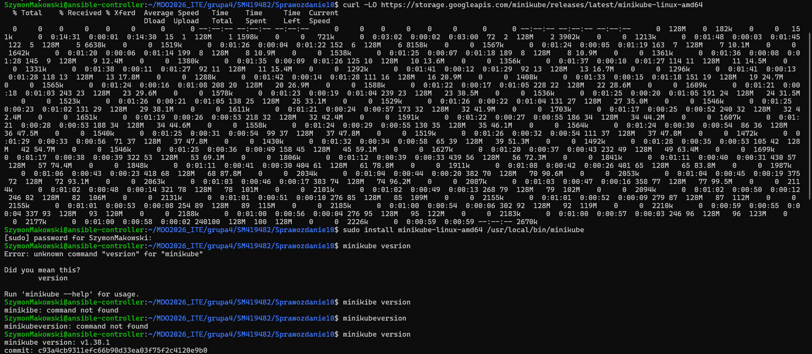

Poziom bezpieczeństwa instalacji: binarka pobrana bezpośrednio ze storage.googleapis.com — oficjalnego repozytorium projektu. 

### Polecenie kubectl i alias minikubctl

Na maszynie dostępny był już natywny kubectl w wersji v1.35.5. Zgodnie z wymaganiami instrukcji zdefiniowano alias minikubctl wskazujący na kubectl wbudowany w minikube:

```bash
kubectl version --client
# Client Version: v1.35.5

alias minikubctl="minikube kubectl --"
```

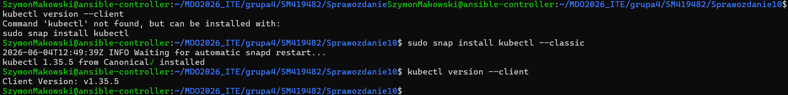

### Uruchomienie klastra

Klaster uruchomiono z driverem Docker. Minikube tworzy dedykowany kontener Docker działający jako węzeł Kubernetes:

```bash
minikube start --driver=docker
```

Pełny log uruchamiania:

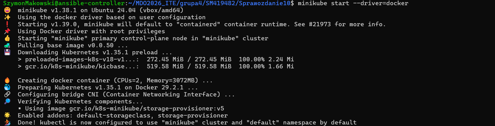

Węzeł minikube jest jednocześnie control-plane i worker node — typowe dla single-node klastra lokalnego. Status Ready potwierdza poprawne uruchomienie.

### 1.5. Działające pody systemowe

```bash
kubectl get pods -A
```

```
NAMESPACE     NAME                               READY   STATUS    RESTARTS        AGE
kube-system   coredns-7d764666f9-qt5ch           1/1     Running   0               4m17s
kube-system   etcd-minikube                      1/1     Running   0               5m51s
kube-system   kube-apiserver-minikube            1/1     Running   0               5m51s
kube-system   kube-controller-manager-minikube   1/1     Running   2 (5m18s ago)   5m51s
kube-system   kube-proxy-rwzxb                   1/1     Running   0               4m18s
kube-system   kube-scheduler-minikube            1/1     Running   0               5m51s
kube-system   storage-provisioner                1/1     Running   1 (2m39s ago)   3m51s
```

---

## 2. Uruchomienie Kubernetes Dashboard

### Uruchomienie proxy dashboardu

Dashboard uruchomiono w trybie --url — bez automatycznego otwierania przeglądarki, ponieważ VM nie posiada środowiska graficznego:

```bash
minikube dashboard --url
```

Minikube automatycznie zainstalował komponenty dashboardu i uruchomił proxy.

Wygenerowany URL:

```
http://127.0.0.1:40777/api/v1/namespaces/kubernetes-dashboard/services/http:kubernetes-dashboard:/proxy/
```

Weryfikacja podów dashboardu w osobnym terminalu:

```bash
kubectl get pods -n kubernetes-dashboard
```

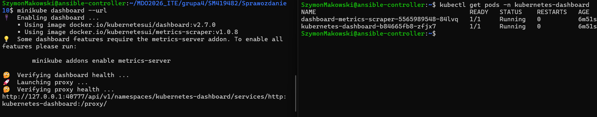


### Dostęp z hosta — tunel SSH

Aby uzyskać dostęp z przeglądarki na hoście Windows, wykonano tunel SSH z przekierowaniem portu:

```powershell
ssh -L 40777:127.0.0.1:40777 SzymonMakowski@192.168.1.104
```

Następnie w przeglądarce na hoście otwarto:

```
http://127.0.0.1:40777/api/v1/namespaces/kubernetes-dashboard/services/http:kubernetes-dashboard:/proxy/
```

Dashboard został pomyślnie otwarty — interfejs pokazuje namespace default. Połączenie przez tunel SSH zapewnia bezpieczny dostęp bez eksponowania dashboardu na zewnątrz VM.

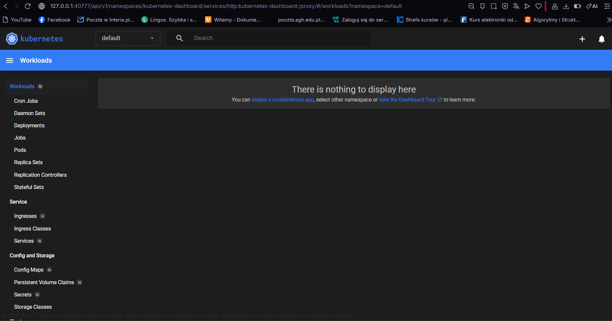

---

## 3. Analiza posiadanego kontenera

### Wybrany obraz Docker

Do wdrożenia wybrano obraz szymonmakow/express-app zbudowany i opublikowany w ramach jednych z poprzednich zajęć. Obraz zawiera aplikację Node.js/Express.js nasłuchującą na porcie 3000.

Weryfikacja działania kontenera (lokalnie, przed wdrożeniem na k8s):

```bash
docker run -d -p 3000:3000 szymonmakow/express-app
curl http://localhost:3000
# Hello World
```

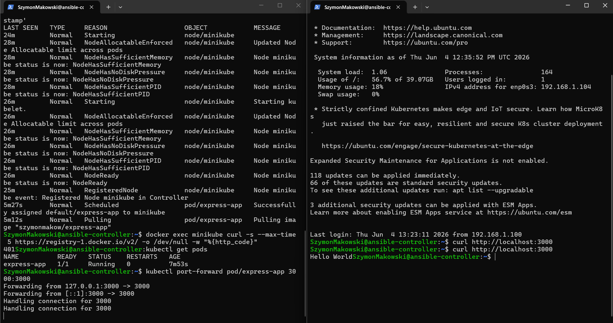

Aplikacja wyprowadza interfejs funkcjonalny przez sieć na porcie 3000, co czyni ją odpowiednim kandydatem do wdrożenia w klastrze Kubernetes.

---

## 4. Uruchamianie oprogramowania na k8s

### Uruchomienie poda

Uruchomiono pojedynczy pod z aplikacją `express-app`:

```bash
minikube kubectl -- run express-app --image=szymonmakow/express-app --port=3000 --labels app=express-app
```

```
pod/express-app created
```

Polecenie kubectl run tworzy pojedynczy pod bez nadrzędnego Deployment/ReplicaSet. Kontener zostaje automatycznie opakowany w pod przez warstwę abstrakcji Kubernetes.

### Weryfikacja poda via kubectl

Po pobraniu obrazu z Docker Hub (pobieranie zajęło kilka minut — minikube działa w izolowanym kontenerze bez cache'u):

```bash
kubectl get pods
```

```
NAME          READY   STATUS    RESTARTS   AGE
express-app   1/1     Running   0          7m53s
```

Status 1/1 Running oznacza że jeden z jednego zdefiniowanych kontenerów działa poprawnie. RESTARTS=0 wskazuje na brak awarii.

Szczegółowy opis poda:

```bash
kubectl describe pod express-app
```

```
Name:             express-app
Namespace:        default
Node:             minikube/192.168.49.2
Labels:           app=express-app
Status:           Running
Containers:
  express-app:
    Image:          szymonmakow/express-app
    Port:           3000/TCP
    State:          Running
```

### Weryfikacja poda via Dashboard

Dashboard potwierdził działanie poda:

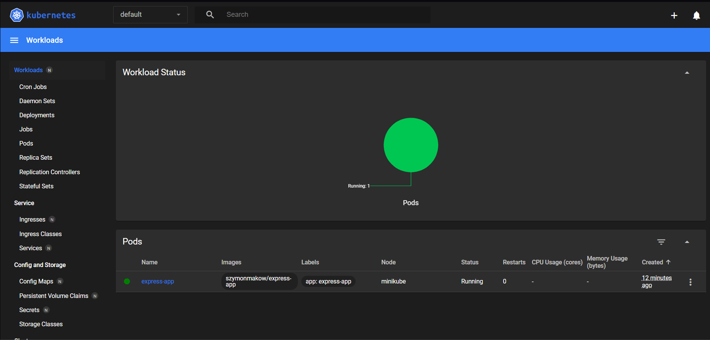

### Wyprowadzenie portu i weryfikacja komunikacji

Port poda wyprowadzono na localhost VM za pomocą kubectl port-forward:

```bash
kubectl port-forward pod/express-app 3000:3000
```

Polecenie mapuje port 3000 z localhost VM bezpośrednio na port 3000 kontenera wewnątrz poda (tunel bez pośrednictwa Service). W osobnym terminalu zweryfikowano komunikację:

```bash
curl http://localhost:3000
```

```
Hello World
```

Aplikacja odpowiedziała poprawnie. Port-forward jest narzędziem do debugowania — w produkcji ruch kieruje się przez Service.

---

## 5. Przekucie wdrożenia manualnego w plik YAML

### Plik wdrożenia nginx-deployment.yml

Przygotowano plik YAML definiujący Deployment nginx z 4 replikami:

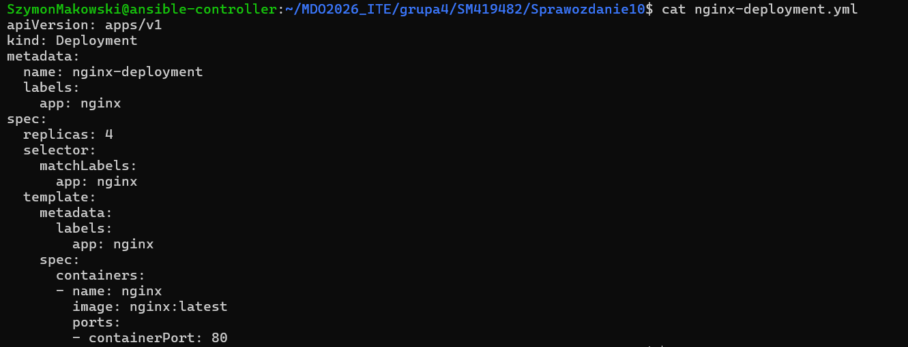

Kluczowe elementy pliku:
- replicas: 4 — Kubernetes utrzymuje dokładnie 4 działające pody
- selector.matchLabels — łączy Deployment z podami przez etykietę app: nginx
- template — szablon każdego poda: obraz nginx:latest, port 80

### Wdrożenie za pomocą kubectl apply

Plik wdrożono deklaratywnie:

```bash
kubectl apply -f nginx-deployment.yml
```

```
deployment.apps/nginx-deployment created
```

kubectl apply jest idempotentne — ponowne wywołanie na tym samym pliku zaktualizuje istniejący zasób zamiast zgłaszać błąd. Jest to preferowane podejście w GitOps (w odróżnieniu od kubectl create).


Stan wdrożenia obserwowano poleceniem kubectl rollout status, które blokowało terminal do momentu osiągnięcia żądanego stanu:

```bash
kubectl rollout status deployment/nginx-deployment
```


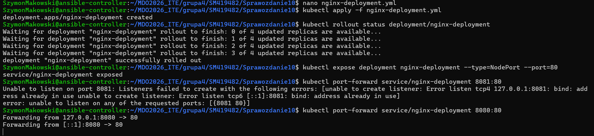

### Eksponowanie wdrożenia jako serwis

Deployment wyeksponowano jako serwis typu NodePort:

```bash
kubectl expose deployment nginx-deployment --type=NodePort --port=80
```

```
service/nginx-deployment exposed
```

Weryfikacja serwisu:

```bash
kubectl get services

```
Weryfikacja stanu podów po zakończeniu rollout:

```bash
kubectl get pods
```

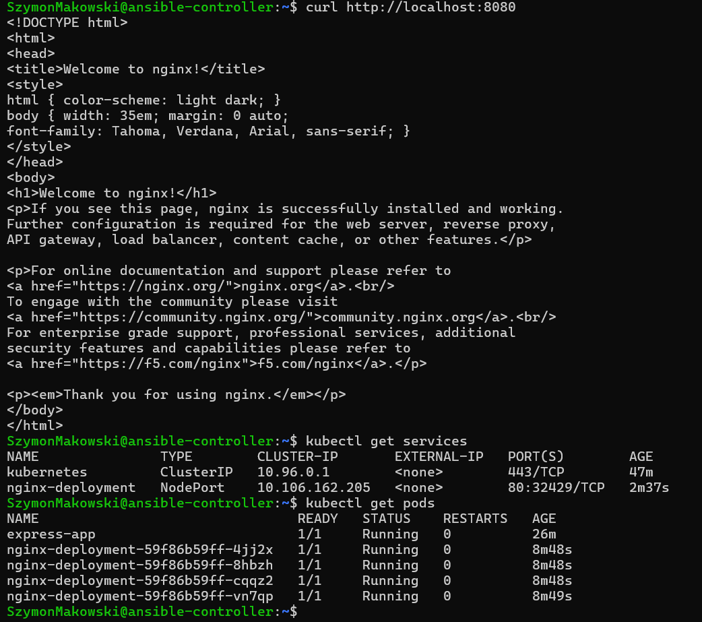

### Przekierowanie portu do serwisu i weryfikacja

Port-forward do serwisu (zamiast bezpośrednio do poda — ruch przechodzi przez warstwę Service):

```bash
kubectl port-forward service/nginx-deployment 8080:80
```

Weryfikacja odpowiedzi w osobnym terminalu:

```bash
curl http://localhost:8080
```

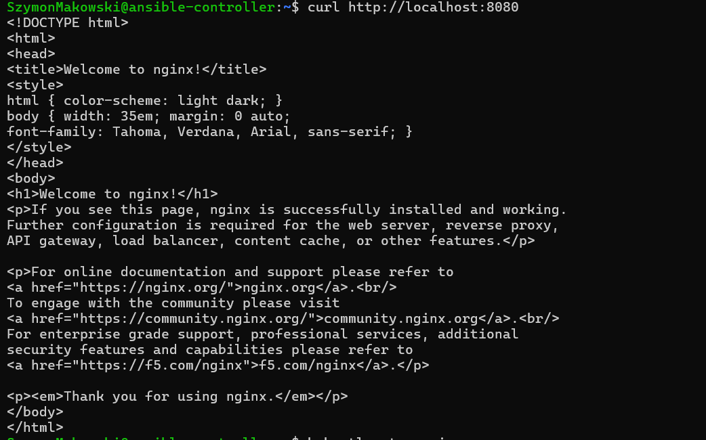

Nginx odpowiedział domyślną stroną powitalną, potwierdzając poprawną komunikację przez serwis z replikami Deployment.

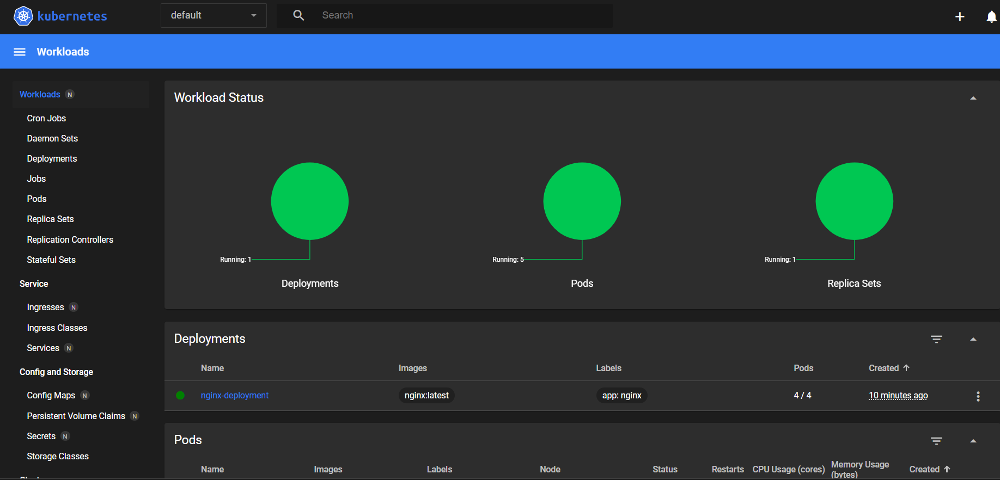
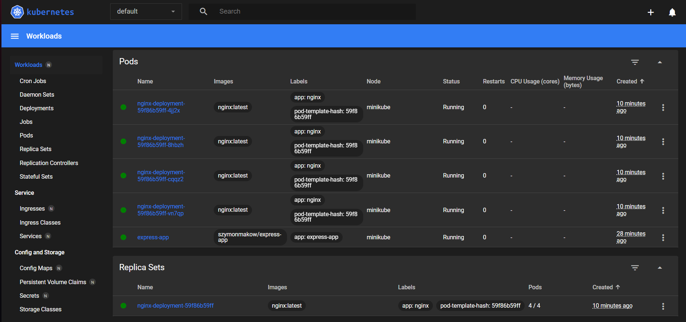

---

## Podsumowanie

1. Zainstalowano i uruchomiono minikube z driverem Docker na maszynie Ubuntu 24.04
2. Skonfigurowano dostęp do Kubernetes Dashboard przez tunel SSH
3. Uruchomiono aplikację szymonmakow/express-app jako pojedynczy pod i zweryfikowano komunikację przez kubectl port-forward
4. Przygotowano deklaratywny plik YAML z deploymentem nginx i 4 replikami, wdrożono go przez kubectl apply i monitorowano rollout
5. Wyeksponowano deployment jako serwis NodePort i zweryfikowano komunikację przez service
