# Sprawozdanie 10 — Szymon Makowski ITE

## Wdrażanie na zarządzalne kontenery: Kubernetes (2)

---

## Środowisko pracy

- Host: Windows 11
- Maszyna wirtualna: Ubuntu 24.04 LTS (VirtualBox)
- Połączenie: SSH z PowerShell / VS Code Remote SSH
- Obraz aplikacji: szymonmakow/express-app:latest (Express.js, Node.js)
- Kubernetes: minikube v1.38.1, kubectl v1.35.5, driver: Docker

---

## Cel ćwiczenia

Celem laboratorium było zapoznanie się z zaawansowanymi mechanizmami wdrożeń w Kubernetes: zarządzaniem wersjami obrazów, skalowaniem replik, historią wdrożeń, rollbackiem oraz różnymi strategiami wdrożeń (Recreate, RollingUpdate, Canary).

---

## 1. Przygotowanie środowiska

Klaster minikube był zatrzymany — uruchomiono go poleceniem:

```bash
minikube start
```

```bash
minikube status
```

```
minikube
type: Control Plane
host: Running
kubelet: Running
apiserver: Running
kubeconfig: Configured
```

---

## 2. Przygotowanie obrazów Docker

Przygotowano trzy wersje obrazu aplikacji szymonmakow/express-app na Docker Hub:

| Tag | Opis |
|-----|------|
| v1.0 | Pierwsza stabilna wersja (na bazie latest) |
| v2.0 | Druga wersja z dodanym plikiem /app/version.txt |
| v3.0-broken | Wersja z błędnym entrypointem — crashuje natychmiast |

### 2.1 Tworzenie v1.0

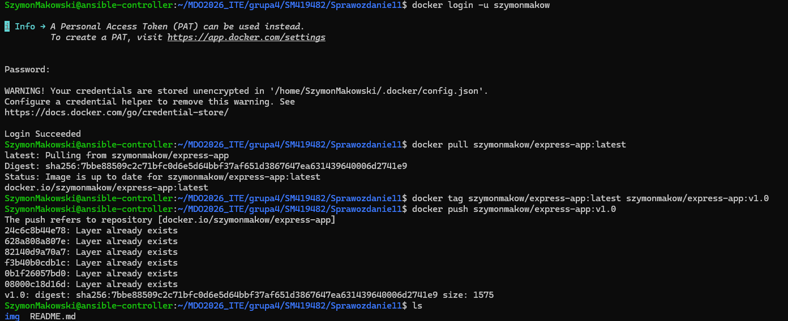

### 2.2 Tworzenie v2.0 przez docker commit

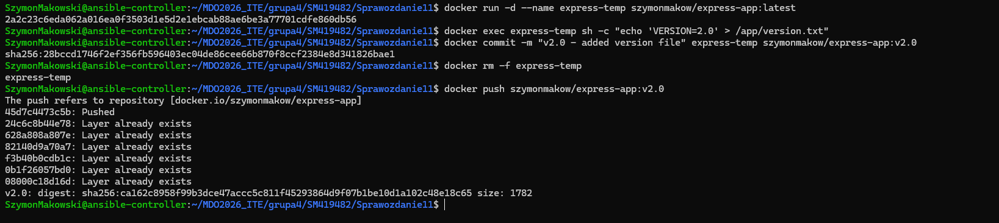

Technika docker commit pozwala zapisać zmiany wprowadzone do działającego kontenera jako nową warstwę obrazu — bez konieczności pisania Dockerfile.

### 2.3 Tworzenie v3.0-broken

Utworzono Dockerfile z błędnym entrypointem (exit 1):

```dockerfile
FROM szymonmakow/express-app:latest
ENTRYPOINT ["sh", "-c", "echo 'Starting...' && exit 1"]
```

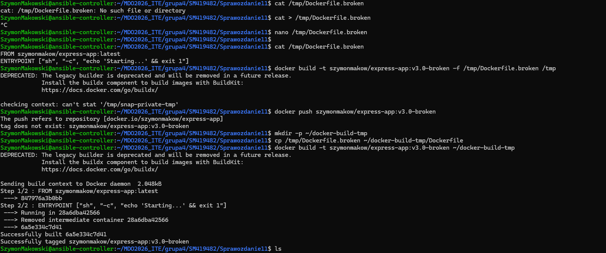
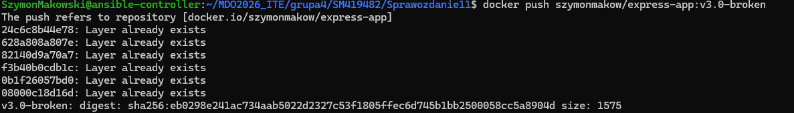

### 2.4 Załadowanie obrazów do minikube

Minikube korzysta z własnego daemona Docker, więc obrazy muszą być do niego załadowane:

```bash
minikube image load szymonmakow/express-app:v1.0
minikube image load szymonmakow/express-app:v2.0
minikube image load szymonmakow/express-app:v3.0-broken
minikube image ls | grep express
```

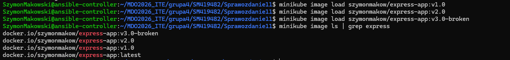

---

## 3. Podstawowy deployment

Utworzono plik deployment.yaml zawierający Deployment z 4 replikami oraz Service typu NodePort:

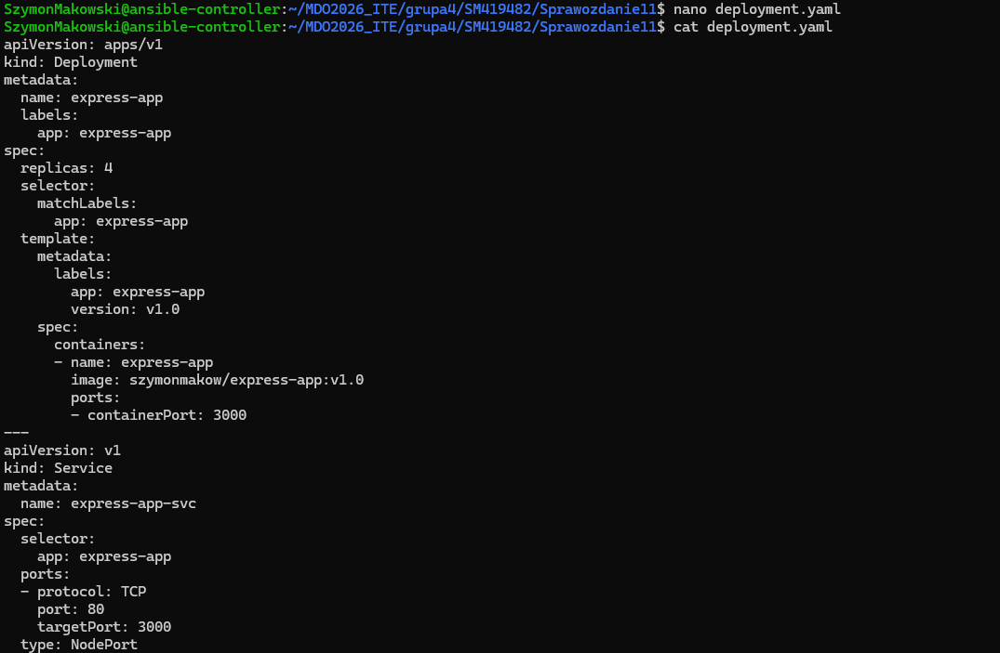

```bash
kubectl apply -f deployment.yaml
kubectl rollout status deployment/express-app
```

```
deployment "express-app" successfully rolled out
```

```bash
kubectl get pods 
```

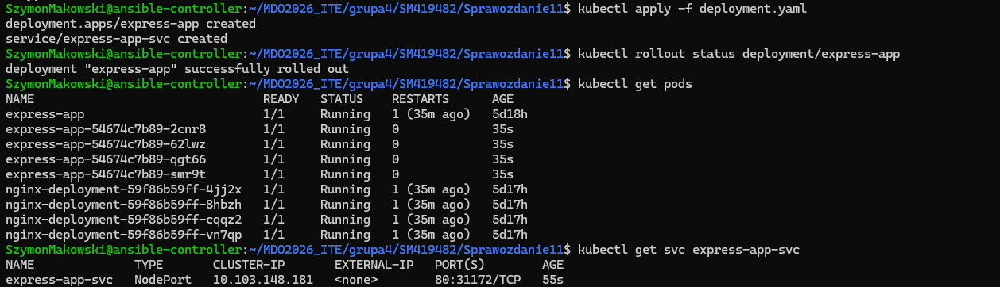

---

## 4. Zmiany liczby replik

### 4.1 Zwiększenie do 8 replik

```bash
sed -i 's/replicas: 4/replicas: 8/' deployment.yaml
kubectl apply -f deployment.yaml
kubectl rollout status deployment/express-app
```

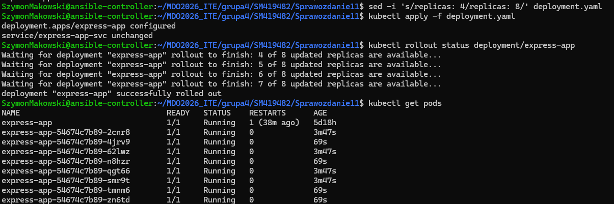

Kubernetes stopniowo uruchamiał nowe pody aż do osiągnięcia 8 replik.

### 4.2 Zmniejszenie do 1 repliki

```bash
sed -i 's/replicas: 8/replicas: 1/' deployment.yaml
kubectl apply -f deployment.yaml
```

W trakcie skalowania w dół widoczny był stan Terminating dla 7 podów

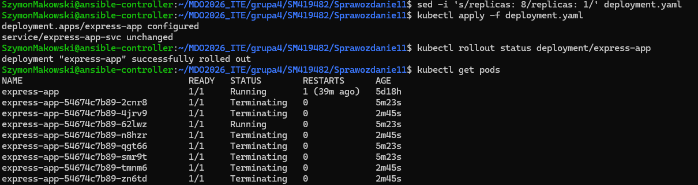


### 4.3 Zmniejszenie do 0 replik

```bash
sed -i 's/replicas: 1/replicas: 0/' deployment.yaml
kubectl apply -f deployment.yaml
kubectl get pods -l app=express-app
```

Ostatni pod przeszedł w stan Terminating, deployment był całkowicie pusty — żadne pody nie działały. Serwis nadal istniał, ale nie obsługiwał ruchu.

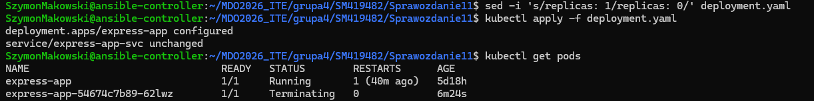

### 4.4 Przeskalowanie z powrotem do 4 replik

```bash
sed -i 's/replicas: 0/replicas: 4/' deployment.yaml
kubectl apply -f deployment.yaml
kubectl rollout status deployment/express-app
```

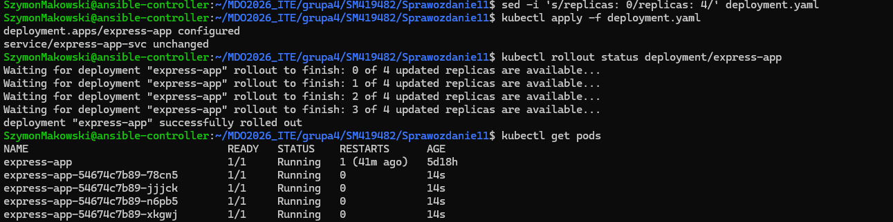

Nowe pody otrzymały inne sufiksy nazw niż poprzednie, ponieważ ReplicaSet tworzył je od zera.

---

## 5. Aktualizacja wersji obrazu i rollback

### 5.1 Aktualizacja do v2.0

```bash
sed -i 's/image: szymonmakow\/express-app:v1.0/image: szymonmakow\/express-app:v2.0/' deployment.yaml
kubectl apply -f deployment.yaml
kubectl rollout status deployment/express-app
```

W trakcie aktualizacji widoczna była stopniowa wymiana podów — stare przechodziły w Terminating, nowe startowały jako Running.

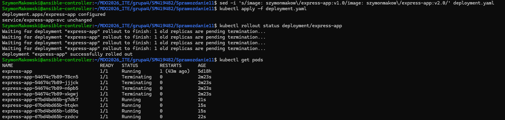

### 5.2 Powrót do v1.0

```bash
sed -i 's/image: szymonmakow\/express-app:v2.0/image: szymonmakow\/express-app:v1.0/' deployment.yaml
kubectl apply -f deployment.yaml
kubectl rollout status deployment/express-app
```

Kubernetes rozpoznał istniejący ReplicaSet dla v1.0 i przywrócił go zamiast tworzyć nowy.

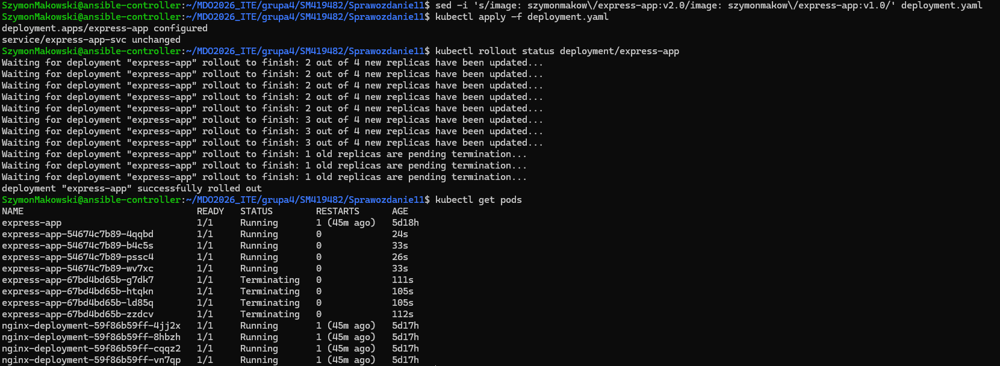

### 5.3 Zastosowanie wadliwego obrazu v3.0-broken

```bash
sed -i 's/image: szymonmakow\/express-app:v1.0/image: szymonmakow\/express-app:v3.0-broken/' deployment.yaml
kubectl apply -f deployment.yaml
kubectl rollout status deployment/express-app --timeout=60s
```

```bash
kubectl get pods -l app=express-app
```

Kubernetes zastosował strategię RollingUpdate — nie usunął wszystkich starych podów przed potwierdzeniem działania nowych. Dzięki temu 3 pody v1.0 nadal działały, a 2 nowe pody z v3.0-broken crashowały w pętli CrashLoopBackOff.

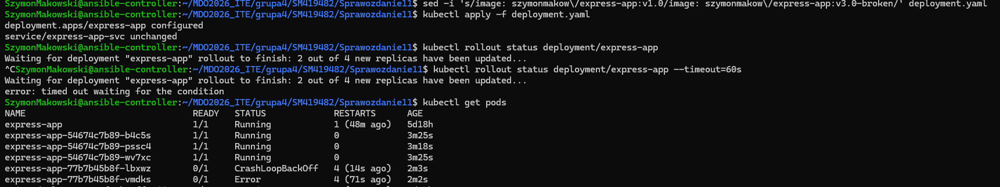

### 5.4 Historia wdrożeń i rollback

```bash
kubectl rollout history deployment/express-app
```

Rewizje nie zawierają opisu (brak flagi --record, która jest przestarzała w nowszych wersjach kubectl). Każda rewizja odpowiada zmianie obrazu.

```bash
kubectl rollout undo deployment/express-app
kubectl rollout status deployment/express-app
```

```
deployment "express-app" rolled back
deployment "express-app" successfully rolled out
```

Rollback natychmiast przywrócił poprzednią działającą wersję.

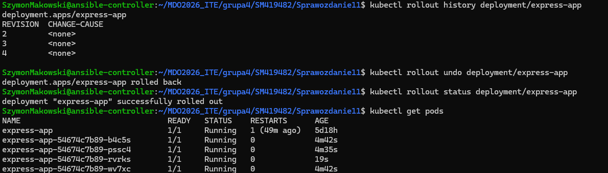

---

## 6. Skrypt weryfikujący wdrożenie

Napisano skrypt check-rollout.sh sprawdzający czy deployment zakończył się w ciągu 60 sekund:

```bash
#!/bin/bash
DEPLOYMENT=${1:-express-app}
TIMEOUT=60

echo "Sprawdzam wdrożenie: $DEPLOYMENT (timeout: ${TIMEOUT}s)"

if kubectl rollout status deployment/$DEPLOYMENT --timeout=${TIMEOUT}s; then
    echo "SUCCESS: Wdrożenie $DEPLOYMENT zakończyło się sukcesem w ciągu ${TIMEOUT}s"
    exit 0
else
    echo "FAILED: Wdrożenie $DEPLOYMENT nie zakończyło się w ciągu ${TIMEOUT}s"
    echo "--- Stan podów ---"
    kubectl get pods -l app=$DEPLOYMENT
    echo "--- Ostatnie eventy ---"
    kubectl describe deployment/$DEPLOYMENT | tail -20
    exit 1
fi
```

Test na działającym deploymencie:

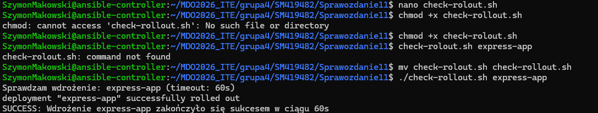

Test na wadliwym obrazie v3.0-broken:

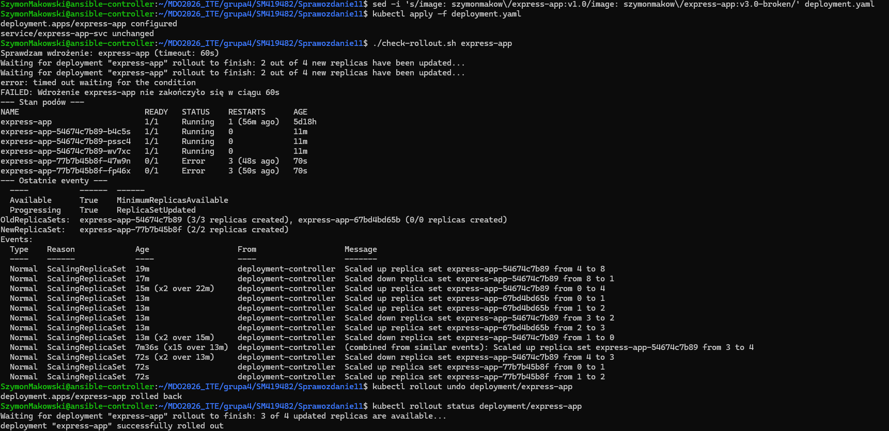


Skrypt zwraca kod wyjścia 0 przy sukcesie i 1 przy błędzie, co pozwala na jego użycie w pipeline CI/CD.

---

## 7. Strategie wdrożeń

### 7.1 Recreate

Plik deployment-recreate.yaml:

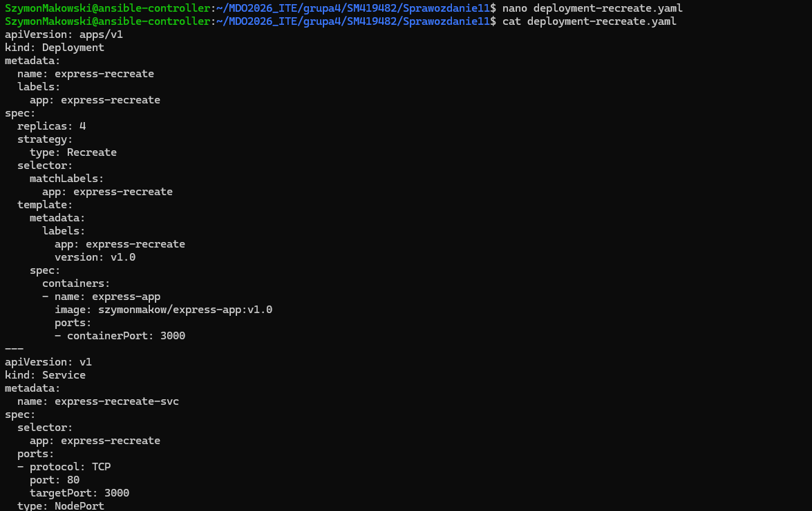

Obserwacja:

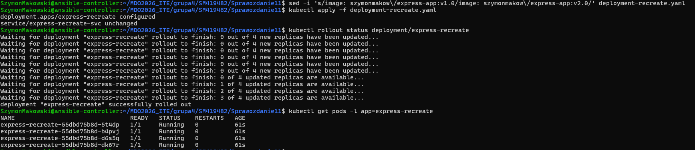

Widoczna jest charakterystyczna przerwa — faza 0 out of 4 new replicas have been updated oznacza że wszystkie stare pody zostały usunięte zanim wystartowały nowe. W tym czasie aplikacja była **niedostępna**.

### 7.2 Rolling Update z parametrami

Plik deployment-rolling.yaml:

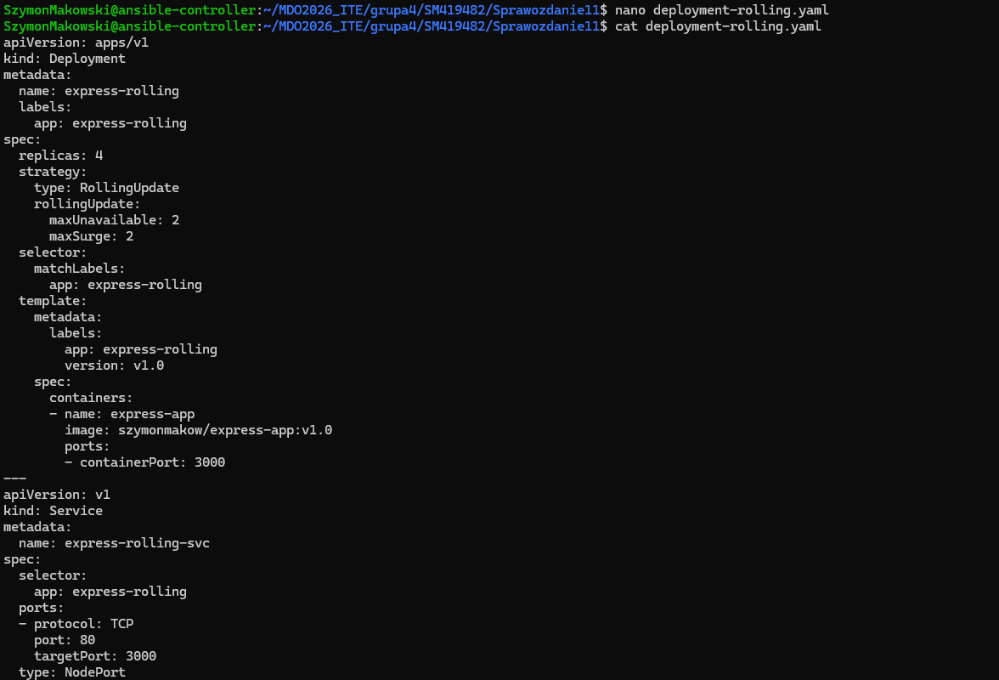

Parametry:
- maxUnavailable: 2 — maksymalnie 2 pody mogą być niedostępne jednocześnie
- maxSurge: 2 — maksymalnie 2 dodatkowe pody mogą być tworzone ponad docelową liczbę replik (>20% z 4 = >0.8, czyli co najmniej 1)

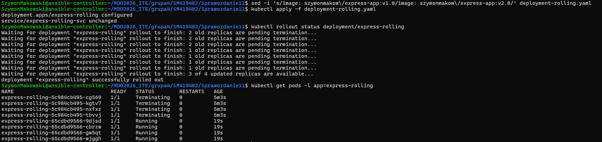

### 7.3 Canary Deployment

Plik deployment-canary.yaml zawiera dwa osobne Deploymenty współdzielące jeden Serwis poprzez wspólną etykietę app: express-canary:

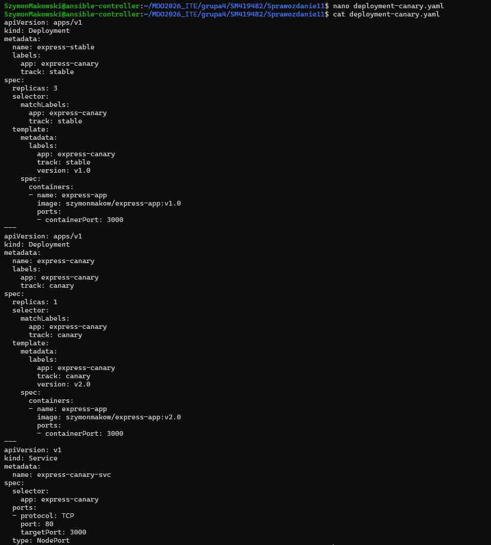

Stan podów:

```
NAME                              READY   STATUS    AGE
express-canary-799794f7f9-wqgm7   1/1     Running   63s   # v2.0
express-stable-69bf4ddcc4-g8m4h   1/1     Running   63s   # v1.0
express-stable-69bf4ddcc4-jbz2k   1/1     Running   63s   # v1.0
express-stable-69bf4ddcc4-k62d9   1/1     Running   63s   # v1.0
```

Serwis express-canary-svc rozdziela ruch między wszystkie 4 pody z etykietą app: express-canary — 75% ruchu trafia do stable (v1.0), 25% do canary (v2.0).

---

## 8. Porównanie strategii wdrożeń

| Cecha | Recreate | Rolling Update | Canary |
|-------|----------|----------------|--------|
| Dostępność podczas aktualizacji | **Brak** — chwilowy downtime | **Pełna** — zawsze min. (replicas - maxUnavailable) podów | **Pełna** — stable zawsze działa |
| Szybkość | Najszybsza | Zależna od parametrów | Najwolniejsza (ręczna) |
| Ryzyko | Wysokie (brak rollbacku w trakcie) | Średnie | Niskie (tylko % ruchu na nową wersję) |
| Użycie zasobów | Niskie | Chwilowo wyższe (maxSurge) | Wyższe (dwa deploymenty) |
| Zastosowanie | Środowiska dev/test | Produkcja — typowe wdrożenia | Produkcja — testowanie nowych funkcji |

---

## 9. Serwisy (Services)

Każdy deployment posiada dedykowany Service typu NodePort:

```
NAME                   TYPE        CLUSTER-IP       EXTERNAL-IP   PORT(S)        AGE
express-app-svc        NodePort    10.103.148.181   <none>        80:31172/TCP   34m
express-canary-svc     NodePort    10.99.183.197    <none>        80:32206/TCP   5m19s
express-recreate-svc   NodePort    10.98.49.94      <none>        80:31866/TCP   5m39s
express-rolling-svc    NodePort    10.102.237.159   <none>        80:32377/TCP   5m30s
```

NodePort eksponuje serwis na porcie hosta (zakres 30000–32767), umożliwiając dostęp z zewnątrz klastra przez minikube ip.

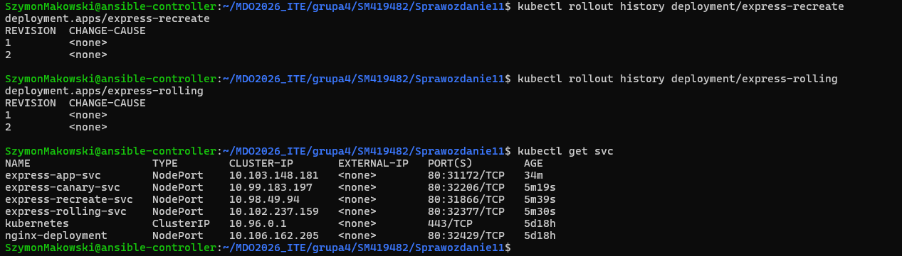

---
