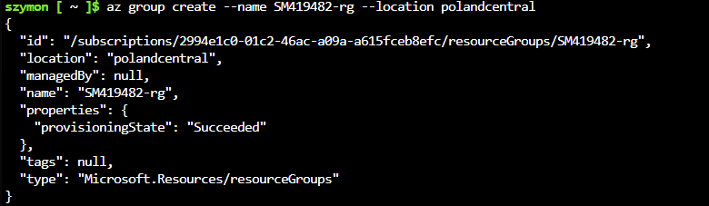
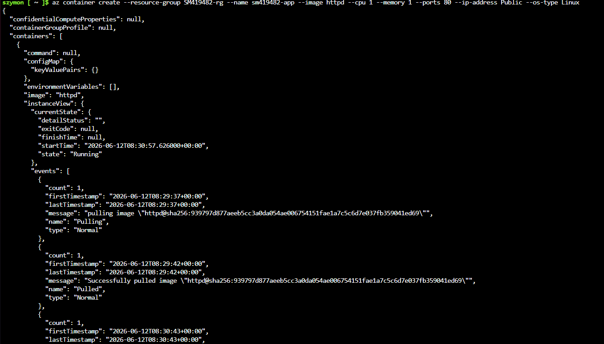
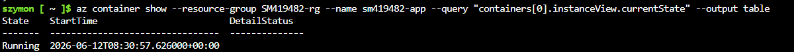
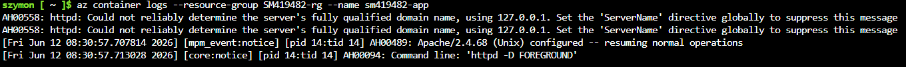
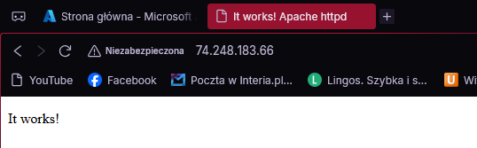
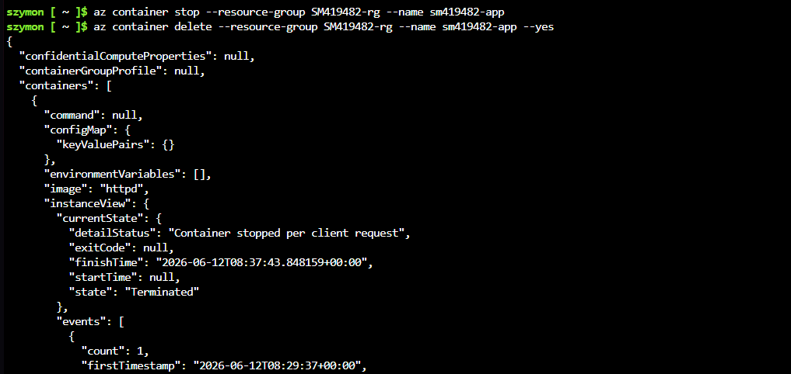
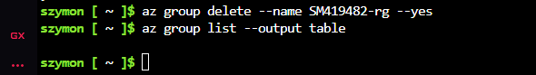

# Sprawozdanie 12 — Szymon Makowski ITE

## Wdrażanie na zarządzalne kontenery w chmurze (Azure)

---

## Środowisko pracy

- Host: Windows 11
- Maszyna wirtualna: Ubuntu 24.04 LTS (VirtualBox)
- Połączenie: SSH z PowerShell / VS Code Remote SSH
- Obraz aplikacji: oficjalny obraz httpd (Apache HTTP Server) z Docker Hub
- Platforma Microsoft Azure: Azure Container Instances, Azure Cloud Shell

## Cel ćwiczenia

Celem laboratorium było zapoznanie się z platformą Microsoft Azure i wdrożenie kontenera aplikacji webowej na usługę Azure Container Instances (ACI). Ćwiczenie obejmowało: aktywację subskrypcji studenckiej, utworzenie resource group, wdrożenie kontenera z obrazu dostępnego na Docker Hub, weryfikację działania usługi HTTP, pobranie logów oraz posprzątanie zasobów po zakończeniu pracy.

---

## Wybór obrazu kontenera

W niniejszym laboratorium zdecydowano się na użycie oficjalnego obrazu httpd (Apache HTTP Server) z Docker Hub. Decyzja ta wynikała z następujących przyczyn:

1. Ograniczenia polityki subskrypcji studenckiej Azure – subskrypcja Azure for Students podlega zasadom narzucanym przez platformę, które ograniczają dostępność usług ACI w poszczególnych regionach. Próba wdrożenia dowolnego kontenera w regionach westeurope oraz eastus kończyła się błędem RequestDisallowedByAzure. Działającym regionem okazał się polandcentral.

2. Prostota i oficjalny status obrazu – httpd to oficjalny, minimalny obraz Apache serwujący HTTP na porcie 80, bez dodatkowych zależności. Idealnie nadaje się do demonstracji wdrożenia kontenera w chmurze, gdyż celem laboratorium jest sam proces wdrożenia (tworzenie resource group, ACI, weryfikacja dostępu HTTP, cleanup).

---

## 1. Aktywacja subskrypcji Azure

Logowanie do Azure Cloud Shell i weryfikacja aktywnej subskrypcji:

```
az account show
{
  "environmentName": "AzureCloud",
  "homeTenantId": "80b1033f-21e0-4a82-bbc0-f05fdccd3bc8",
  "id": "2994e1c0-01c2-46ac-a09a-a615fceb8efc",
  "isDefault": true,
  "managedByTenants": [],
  "name": "Azure for Students",
  "state": "Enabled",
  "tenantId": "80b1033f-21e0-4a82-bbc0-f05fdccd3bc8",
  "user": {
    "cloudShellID": true,
    "name": "smakowski@student.agh.edu.pl",
    "type": "user"
  }
}
```

Subskrypcja w stanie "Enabled" — konto gotowe do pracy.

---

## 2. Rejestracja dostawcy zasobów

Przed pierwszym użyciem Azure Container Instances na subskrypcji studenckiej konieczna była rejestracja providera Microsoft.ContainerInstance:

```
az provider show --namespace Microsoft.ContainerInstance --query "registrationState"
"NotRegistered"

az provider register --namespace Microsoft.ContainerInstance
Registering is still on-going. You can monitor using 'az provider show -n Microsoft.ContainerInstance'

az provider show --namespace Microsoft.ContainerInstance --query "registrationState"
"Registered"
```

---

## 3. Utworzenie Resource Group

Resource group została utworzona w regionie polandcentral 

```
az group create --name SM419482-rg --location polandcentral
{
  "id": "/subscriptions/2994e1c0-01c2-46ac-a09a-a615fceb8efc/resourceGroups/SM419482-rg",
  "location": "polandcentral",
  "managedBy": null,
  "name": "SM419482-rg",
  "properties": {
    "provisioningState": "Succeeded"
  },
  "tags": null,
  "type": "Microsoft.Resources/resourceGroups"
}
```

"provisioningState": "Succeeded" potwierdza poprawne utworzenie grupy zasobów.



---

## 4. Wdrożenie kontenera z Docker Hub

Kontener wdrożono przy użyciu obrazu httpd (Apache HTTP Server) pobranego bezpośrednio z Docker Hub — bez konieczności tworzenia Azure Container Registry:

```
az container create --resource-group SM419482-rg --name sm419482-app --image httpd --cpu 1 --memory 1 --ports 80 --ip-address Public --os-type Linux
```

Fragment odpowiedzi JSON potwierdzający sukces:

```json
{
  "containers": [
    {
      "image": "httpd",
      "instanceView": {
        "currentState": {
          "state": "Running",
          "startTime": "2026-06-12T08:30:57.626000+00:00",
          "detailStatus": ""
        },
        "events": [
          {
            "message": "pulling image \"httpd@sha256:939797d877aeeb5cc3a0da054ae006754151fae1a7c5c6d7e037fb359041ed67\"",
            "name": "Pulling"
          },
          {
            "message": "Successfully pulled image \"httpd@sha256:939797d877aeeb5cc3a0da054ae006754151fae1a7c5c6d7e037fb359041ed67\"",
            "name": "Pulled"
          },
          {
            "message": "Started container",
            "name": "Started"
          }
        ]
      },
      "name": "sm419482-app",
      "ports": [{ "port": 80, "protocol": "TCP" }],
      "resources": {
        "requests": { "cpu": 1.0, "memoryInGb": 1.0 }
      }
    }
  ],
  "ipAddress": {
    "ip": "74.248.183.66",
    "ports": [{ "port": 80, "protocol": "TCP" }],
    "type": "Public"
  },
  "location": "polandcentral",
  "name": "sm419482-app",
  "provisioningState": "Succeeded",
  "instanceView": { "state": "Running" }
}
```

Kontener uruchomiony, publiczne IP: 74.248.183.66, port 80/TCP.



---

## 5. Weryfikacja działania kontenera

### Stan kontenera

```
az container show --resource-group SM419482-rg --name sm419482-app --query "containers[0].instanceView.currentState" --output table
```

Kontener w stanie Running.



### Logi kontenera

```
az container logs --resource-group SM419482-rg --name sm419482-app
```

Logi potwierdzają poprawne uruchomienie serwera Apache 2.4.68 w trybie FOREGROUND.



### Dostęp HTTP do serwowanej usługi

Metoda dostępu: publiczny adres IP przydzielony przez ACI (74.248.183.66), port 80.

Odpowiedź HTTP 200 z domyślną stroną Apache potwierdza, że usługa HTTP jest dostępna publicznie.



---

## 6. Zatrzymanie i usunięcie kontenera oraz resource group

### Zatrzymanie kontenera

```
az container stop --resource-group SM419482-rg --name sm419482-app
```

### Usunięcie kontenera

```
az container delete --resource-group SM419482-rg --name sm419482-app --yes
```



### Usunięcie resource group

```
szymon [ ~ ]$ az group delete --name SM419482-rg --yes
```

### Weryfikacja usunięcia

```
 group list --output table

```

Pusta odpowiedź potwierdza całkowite usunięcie resource group SM419482-rg wraz ze wszystkimi zasobami. Kredyty nie będą dalej naliczane.



---
